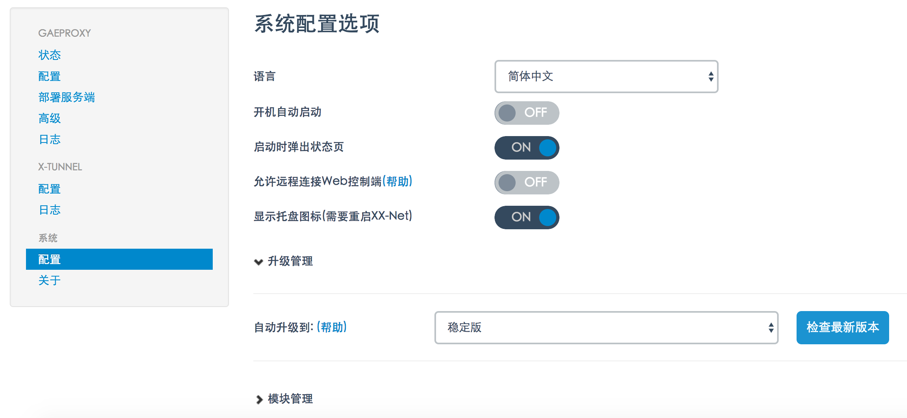

上次的[FQ：从入门到放弃（二）](/2016/12/07/FQ：从入门到放弃（二）/)介绍了XX-Net的部署过程中出现的一些问题和解决办法。本文介绍部分进阶技能，都是我实操之后的经验。欢迎感兴趣的朋友们来博客交流讨论。

<!--more-->

在正式开始之前，奉劝各位使用电脑出了问题不要直接放弃——**还没重启电脑说什么放弃呢**？

# 进阶

## IPv6

很多高校的校园网都支持IPv6，校园网计费只统计IPv4的流量，所以开启IPv6模式可以免部分流量(比如Google，YouTube等)，而且速度快得飞起。

点击“设置-高级选项-IPv6”，开启成功会有相应提示信息，开关项保持打开状态。


IPv6模式最近出现了一个问题——网络支持IPv6却无法开启IPv6模式。前面百度网盘里提供的XX-Net是我自己打包的，已经修复这个问题，但这里还是给出修复中遇到的问题，鼓励大家动手试试。

### 网络支持IPv6却无法开启

这个问题最近才出现，刚开始翻代码时无从下手（前端无力），后来google到了问题原因：**检查IPv6网络使用的网站失效**。原理如下：

>XX-Net在你手动开启IPv6模式之后，会先通过两个网站检查网络环境是否支持IPv6：如果这两个网站都无法连接，那么就认为当前网络环境不支持IPv6——巧的是，**这两个网站最近突然被墙了**。

maybe我XX-Net已经被盯上了，maybe真的只是巧合。总之修复思路也很简单，**换几个IPv6网络下才能连通的网站**就好了。

知道了原理，很快就定位到了相应代码。文件地址在根目录下的code/default/gae_proxy/local/check_local_network.py，check_ipv6()方法。我这里增加了两个网站：

```python
def check_ipv6():
    # these two domain has been walled.
    # hosts = ["www.6rank.edu.cn", "v6.testmyipv6.com", ]
    hosts = ["www.6rank.edu.cn", "v6.testmyipv6.com", 
        "ipv6-test.com", "ipv6.google.com",
    ]
    for host in hosts:
        if _check_ipv6_host(host):
            return True
    return False
```

当然，如果比较清楚什么时候支持IPv6，或者自己可以查看是否支持IPv6，可以**把这里改为直接返回True**：

```python
def check_ipv6():
    # i know whether my network support ipv6.
    # hosts = ["www.6rank.edu.cn", "v6.testmyipv6.com", ]
    # for host in hosts:
    #     if _check_ipv6_host(host):
    #         return True
    # return False
    return True
```

需要注意的是，如果在不支持IPv6的网络环境下开启IPv6模式，网站将一直尝试使用IPv6模式访问，IP扫描器也会一直扫描并更新IPv6的IP数据库——*从而无法访问任何墙外网站*。所以除非清楚你在做什么，否则不要轻易使用第二种方式（硬编码返回值）。

#### 修改py文件后无法启动

修复IPv6的问题时，我们修改了一个py文件。*如果你在修改时使用了中文等非ascii码支持的字符*，将无法启动XX-Net。

最简单的解决办法是，**不要使用中文或其他特殊符号**。当然更简单的是**直接copy我的代码**。

对于程序猿来说就不值一提了，最根本的解决办法是，在修改的文件首行**加文件头指定文件编码**(自行Google python文件头，推荐使用utf8)，可以随意使用中英文等。

>我就遇到了这个问题，各种google，重装，清缓存重启都不行。后来突然想到程序员最喜欢的方式-查log。瞬间就找到了问题所在。再次劝诫自己：***做程序猿有如修行，清心寡欲，戒骄戒躁。***  

## IPv4和IPv6的切换

不开启IPv6的话就是IPv4模式。IPv4和IPv6切换之后，建议点击“高级-检查所有IP-运行”，手动更新下IP库(虽然会自动更新，但有时候自动更新会出问题)：


XX-Net刚启动的时候，我的习惯是看一下目前的“有效IP数”，超过400一般就是比较流畅的，不够400就手动更新下，再不够也没什么影响。

## Google的人机验证

使用**地址栏**进行Google搜索的时候，有时会将XX-Net客户端判定为机器攻击，进行人机验证: 

<center>.</center>
<center>.</center>
<center>.</center>

因为我最近公司自带翻墙，所以很少碰到这种情况，就不截图了，大家自行脑补。注意要**等到圈圈转完再点提交**，看到你就懂了。

*再次强调，只有使用**地址栏**才会出现，正经的使用Google主页进行搜索不会出现这个问题。估计是拼接url时的问题。*

如果网络支持IPv6的话，那么切换到IPv6是最好的方案。但是Google似乎是按照域名检测的，所以需要另外创建一个搜索引擎选项，如果使用chrome(既然能自由自在的FQ了)，那么点击“设置-搜索-管理搜索引擎”，弹出一个对话框，设置如图（注意是英文百分号%）:


然后选择Google-IPv6作为默认搜索引擎；


也可以关闭IP扫描的最大线程数调低，这样XX-Net访问Google的频率会相应降低，但自然影响了FQ质量，不建议这样做。

## 更多设置选项

### GAEPROXY-高级


主要是两个功能：更新IP，导入/导出IP。

#### 更新IP

如上图，默认打开的是首位的“设置”选项卡。“自动调整扫描线程数”开关项是默认打开的，也是我建议的。如果你觉得IP更新较慢，可以将“最大扫描线程数”设置的大一些。但不建议过大，我最多设置到100，然而没那么突出的效果。

点击“检查所有IP”选项卡，这里就是之前说的可以手动触发IP更新的地方，点击“运行”按钮，触发一次更新，在这次更新期间重复点击“运行”无效：


#### 导入/导出IP

先讲导出IP。点击“导出IP”选项卡：


在“导入或导出格式”中只有两种格式，一般选择默认格式。但这种格式不是hosts文件的定义格式，对于大部分小白用户来说，操作性太小。感兴趣的自行深入研究。

同时，导入IP时也需要按照这两种格式，所以同样操作性不大。

那么为什么还要特意提到导入/导出IP的功能呢？当你自行修改XX-Net，并且改崩了，你可以直接把当前的IP导出（或者直接去备份IP文件），然后重新到我的网盘或github下载一份XX-Net，再将备份的IP导入即可。

### 系统-配置



常见的开机自启动、自动升级等可以在此处配置。模块管理的功能暂时不需要关注。

# XX-Net和其他FQ方案

## XX-Net的评测

总在讲XX-Net的优秀，空口无凭，碰巧搜到一个梯子测评网站，让数据说话：


这里要把稳定性放在前面，因为服务的稳定性要比速度重要。**1080p不行，360p也是一种幸福。**

可以看到，我XX-Net的稳定性几乎一直高于平均水平，速度更是在大部分时间保持领先地位，偶尔抽个风，速度也在340k以上。绝对良心。

## 其他方案

在[FQ：从入门到放弃（一）](https://monkeysayhi.github.io/2016/12/05/%E7%BF%BB%E5%A2%99%EF%BC%9A%E4%BB%8E%E5%85%A5%E9%97%A8%E5%88%B0%E6%94%BE%E5%BC%83%EF%BC%88%E4%B8%80%EF%BC%89/)中，首先介绍了养活一个产业的传奇之作Shadowsocks。虽然Shadowsocks已然从github上（被）下架，但俗话说得好：

>一个Shadowsocks倒下去，千万个Shadowsocks站起来。

在文章推送的两天内，陆续有朋友向我推荐了多种FQ方案。这里选择两种典型方案，作简单介绍，这两种方案都基于Shadowsocks。

### cccat

最早接触梯子是被豪哥带的。当时是用的某位站长共享的免费Shadowsocks站（通常称为“ss站”），账号密码每天在一个充满广告的页面更新（提供免费Shadowsocks服务，靠网站广告盈利）。

朋友G推荐了一个靠众筹维持的免费ss站[cccat](https://106.186.17.240/)，官网的域名解析经常出问题（所以直接给出IP地址），但是提供的代理节点很稳定。G的体验是“晚上看youtube不卡”，我们还深入讨论了下关于他晚上看什么的问题。

**免费ss站的缺点自然是麻烦了**——cccat的免费流量很足，但最好还是每天签到领流量，不然看到一半就没流量了，那真是比找不到卫生纸还尴尬的事情。不过好处是只需要一个密码或二维码，电脑和手机就都能用了。

### 穹顶穿越

[穹顶穿越](http://domecross.com/)作为一个不错的收费ss站，9元/月的价格确实比较亲民了。其宣称是一个`“专门为外贸人员、开发者提供的翻墙工具”`：需要配合chrome内核的浏览器使用，安装一个插件后，**交钱就可以用**；可进行全局代理、自动代理等模式；号称`不限流量、不限速度`，不限流量有可能，绝对的不限速度那是扯，但朋友X的实际体验还不错，据说youtube看1080p不卡。付费之前，可以免费试用15分钟，感兴趣的朋友可以试试。

# 结语

FQ系列文章至此结束。

公众号后台交流太不方便，如果朋友们还有其他问题欢迎通过博客中的邮箱交流讨论。最后，希望老司机们注意身体，且翻且开心。

---

>参考：
>
>* [FQ中心-XX-Net评测](https://cc.greatfire.org/zh/provider/XX-Net)
>
