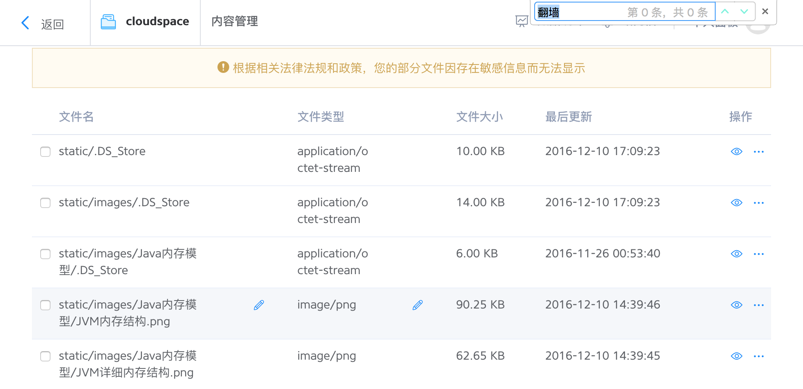
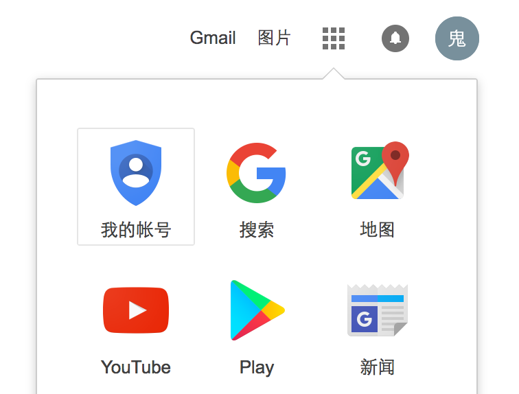
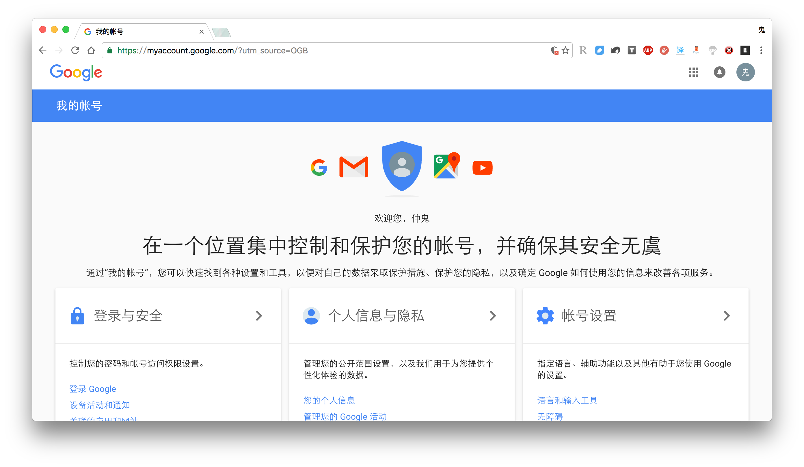
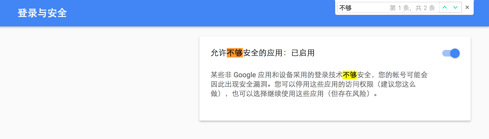

上次的[FQ：从入门到放弃（一）](https://monkeysayhi.github.io/2016/12/05/%E7%BF%BB%E5%A2%99%EF%BC%9A%E4%BB%8E%E5%85%A5%E9%97%A8%E5%88%B0%E6%94%BE%E5%BC%83%EF%BC%88%E4%B8%80%EF%BC%89/)介绍了XXNet的部署和基本使用。本文整理一些部署过程中出现的问题，都是这几天朋友们安装过程中出现的问题。如果覆盖不全，欢迎在博客下方评论，互相交流，互相学习。  

<!--more-->

---

不过首先声明，这就是**为什么我在本文要说FQ而不是f+an-qi+ang**的原因：  
  
图片名里连这两个字都不能出现。  

 

真是好极了！

   

---

# 安装中的各种问题
在（一）推送之后，一些朋友表示配置XXNet过程中出现了各种问题。这个锅我背，自己安装时没有遇到这些问题，现在亡羊也得补牢。  
## github页面的下载速度太慢
特意给你们上传到百度网盘，提取密码_k4ak_，点此下载：  

<a href="https://pan.baidu.com/s/1gfLXQ87">
 

此

 
</a>  

## 提示安装Python环境
有些人在双击运行“start.bat”时，提示需要安装Python环境（之前扫了眼源码，XXNet是用Python写的）。  
因为很多程序猿（包括我）的电脑里提前就装好了Python，所以我也没有意识到这个问题。**如果是自己的电脑，直接一路允许**就好，但**某些公司的电脑不允许私自安装应用**——这种情况下，我真的无能为力——要不跟IT部门的同事撒个娇？  
## Firefox浏览器提示“导入证书”
**Chrome浏览器会自动导入证书**，但Firefox需要手动导入。但手动导入时，我多次尝试均告失败，所以装作无辜的继续推Chrome浏览器吧。  
不能FQ的时候，用Firefox将就一下很满足，FQ后才知道还是Chrome大法好：**极致的速度、海量的插件、简介的设计、绚丽的皮肤，满足各种人的需要**。  
## 初始化扫描IP太慢
在第一次打开xxnet时，使用的是公共的中转服务器，速度较慢——其实放了150多个appid，也并不算慢。但是*初始化扫描IP的速度受github限制，没办法提速*。  
然而，我们**部署自己的中转服务器时，并不需要等待扫描完成**。所以，如果大家希望快点搞完步骤2，*可以暂时打开Lantern，正好完成步骤2之后体验下二者的差别*。  
## 部署中转服务器时不弹出授权页面
在部署中装服务器时，点击部署，正常下会弹出授权页面，点击“Allow”就好：  
  
问题就出在这里——**部分朋友不会弹出授权页面**。这里是我考虑不周，解决办法有两种：*启用弱安全应用*或*使用应用专用密码*。Gmail开启了两步验证的才需要使用应用专用密码，而且在每次部署应用时都需要输入密码，一个AppID一个密码太麻烦了；这里**推荐启用弱安全应用**。  
### 启用弱安全应用
进入[Google首页](https://www.google.com)，点击右上角的“应用启动器-我的账号”：  
  
点击“登录与安全”：  
  
在页面中搜索“不够”，或直接滑到页面最下方，将“允许不够安全的应用”开关项置为“已启用”：  
  
再回到XXNet的部署界面，点击“开始部署”，会正常弹出授权页面。  
# 结语
本篇篇幅较短，补充了一些XXNet部署过程中出现的问题。后面还有一篇（三），介绍部分进阶技能，欢迎关注我的博客和公众号。  
