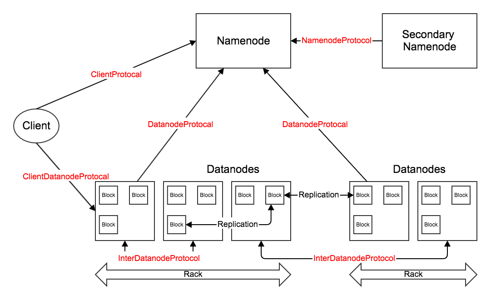
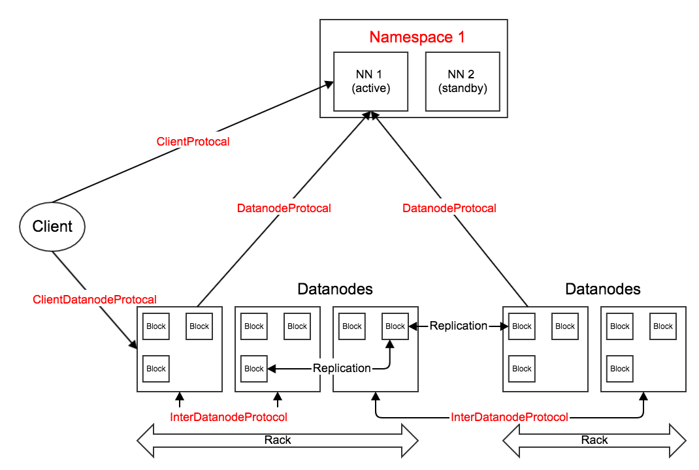

HDFS中的主要RPC接口。

架构图参考前文[HDFS1.x、2.x架构图](/2018/01/09/HDFS1.x、2.x架构图/)。

<!--more-->

# HDFS 1.x

* ClientProtocol：客户端与名字节点间的接口。客户端通过这个接口访问名字节点，**操作文件或目录的元数据信息**（如，获取数据块位置后，才能继续与数据节点通信读取数据）。另外，还能够**管理或查看名字节点的状态**（和由名字节点维护的集群统计信息）。
* ClientDatanodeProtocol：客户端与数据节点间的接口。用于客户端和数据节点进行交互。这个接口用得比较少，客户端和数据节点间的主要交互是通过流接口进行读/写文件数据的操 作；主要在**错误发生时，客户端需要数据节点配合进行恢复**。另外，或者当客户端进行本地文件读优化时，需要通过IPC接口获取一些信息。
* DatanodeProtocol：数据节点与名字节点间的接口。在HDFS的主从（Master/Slave）结构中，数据节点作为RPC Client不停的向名字节点**发送心跳**。心跳请求中携带了大量数据节点得到的正常、异常信息；心跳响应中携带了名字节点的指令，指示数据节点进行数据块的复制、删除、恢复等。除了心跳，**数据节点的注册**、**管道写过程中的等多项操作**也通过该节点完成。
* InterDatanodeProtocol：数据节点与数据节点间的接口。数据节点通过这个接口，和其他数据节点进行通信，主要用于**数据块的恢复等**。
* NamenodeProtocol：第二名字节点与名字节点间的接口。第二名字节点会不停地获取名字节点上某一个时间点的命名空间镜像（fsimage）和镜像的变化日志（editlog），然后**合并得到新的镜像**，并将该结果同步回名字节点。

# HDFS 2.x

如果不开启HA，那么HDFS 2.x用到的主要RPC接口与1.x基本相同。

如果开启了HA，那么检查点工作就再不需要第二名字节点的配合，也就不需要NamenodeProtocol了。

## 开启HA后的检查点工作原理

在1.x中已经介绍了未开启HA时的检查点工作原理：fsimage与editlog仅保存在唯一的名字节点上，第二名字节点定期合并得到新的镜像，并同步回名字节点。

在2.x的HA机制中，引入JournalNode（至少3个，最好是奇数）在active和standby节点间同步fsimage与editlog：active节点实时将editlog同步到JournalNode集群中（保证至少`n - (n-1)/2`个节点成功）；standby节点实时从JournalNode集群中同步回editlog。可以认为standby上的命名空间镜像与active上是完全一致的，因此，standby只需要定期检查editlog是否有变化，并相应在本地合并得到新的镜像，然后通过HTTP接口同步回active节点。
