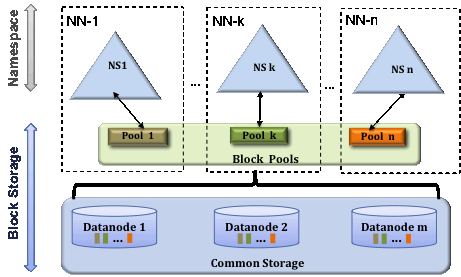

HDFS 2.x引入Federation的目的主要是两个：

* 水平拆分nn，使集群能容纳更多的元信息
* 负载均衡

<!--more-->

# 基本原理

整体思路是一个挂载表，指明哪些路径实际指向哪个nn（或ns）。

挂载表配置在客户端，如果客户端发现路径shcema是viewfs，就按照挂载表将请求定向到实际的nn。

架构如下：

dn通过BlockPoolManager将请求路由到各ns对应的BPOfferService上；再通过BPOfferService与具体的ns（如上图NN-1）通信（与具体的nn的则是BPServiceActor）。

# 优缺点（简要版）

HDFS 2.x Federation使用了客户端挂载的方案，核心的优缺点也在客户端挂载上。

优点：

* 负载在客户端，对nn完全没有影响
* 实现简单

坏处：

* 维护成本高，每次修改挂载表，都必须手动同步配置文件
* 人工维护负载均衡，不能随业务变化

# 缺点（详细版）

1. **挂载表的缺点**：挂载点的访问含义不明：
    * 由于HDFS客户端原有的机制，一个DFSClient只对应一个nameservice，所以一次路径处理不能转为多个nameservice的多次RPC。
    * 对于跨挂载点的读操作，只根据挂载配置返回假结果
    * 对于跨挂载点的写操作（rename等）操作，会抛出异常
2. **客户端挂载的缺点**：客户端挂载维护成本高，一旦修改了挂载表，必须及时更新所有客户端的配置文件，否则用老的挂载逻辑写nn，后果可能非常严重。
3. **基于配置的负载均衡的缺点**：如果负载发生变化，人工修改延迟较高。
4. **目前实现的缺点**：目前的挂载功能非常弱：
    * 如果一个路径声明了挂载，那么其同级目录都需要进行挂载
    * 如果一个路径声明了挂载，那么其子路径不能再声明挂载
5. HDFS Federation物理上没有合并集群的缺点：如果要跨ns修改挂载逻辑，则需使用DistCp将数据从一个ns拷贝到另一个ns。实际上两个ns通常共享所有dn，拷贝造成了极大的浪费。
6. 引入viewfs的缺点：HDFS路径的scheme需要变为viewfs，而viewfs和其他scheme互不兼容。例如，将fs.defaultFS的配置从`hdfs://ns1/`变为`viewfs://ns/`，则`hdfs:///test`会因未指定ns抛出异常。

# 解决方案

1. **挂载表的缺点**：将元信息整体或部分抽象到单独的角色中，以彻底抛弃挂载方案，用网络成本换scalability。如抽离FSDirectory或BlockManager。
2. **客户端挂载的缺点**：服务端挂载，参考Tair ConfigServer、HDFS 3.x的Router-Based Federation。
3. **基于配置的负载均衡的缺点**：自动负载均衡，但由于问题1、5，很难解决。
4. **目前实现的缺点**：仿照IP协议的路由表。
    * 如果一个路径声明了挂载，那么其同级目录都需要进行挂载：非挂载目录路由到default ns匹配。
    * 如果一个路径声明了挂载，那么其子路径不能再声明挂载：路由解析时进行最长匹配匹配。
5. HDFS Federation物理上没有合并集群的缺点：FastCopy可以部分解决，或者一些“破坏性”的方案（仅用于Federation，直接修改元信息和block）。
6. 引入viewfs的缺点：统一schema后不再变化，否则无解？？？

---

> 参考：
>
>* [HDFS Federation在美团点评的应用与改进](https://tech.meituan.com/hdfs_federation.html)
