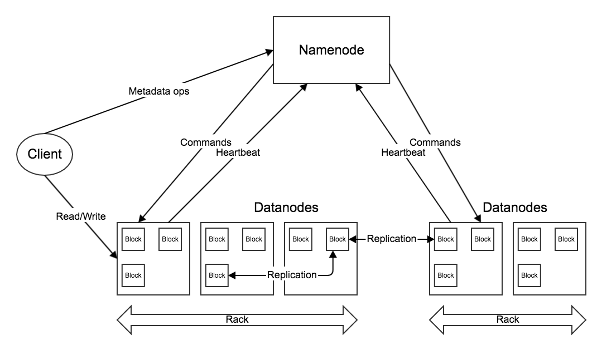
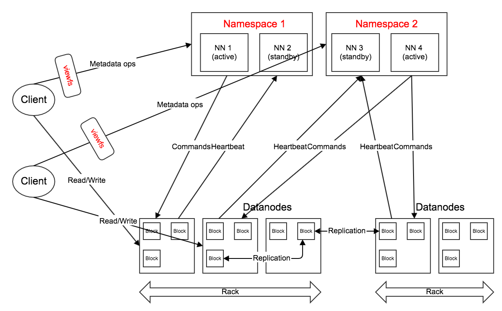

后面开始整理之前学习HDFS、Yarn时的笔记。

<!--more-->

# HDFS 1.x

主要角色：

* Namenode * 1
    * 存储、管理元数据，包括文件信息、文件与数据块的映射。
    * 处理与元数据相关的操作，如枚举路径、查看文件的逻辑大小等。
    * 集群的协调者，如Datanode上下线、数据块的生命周期管理。
* Datanode * n
    * 存储、管理数据块。
    * 处理文件内容的读、写请求。
* Client * n
    * 集群的使用者，通过具体的FileSystem访问集群（门面模式）。

# HDFS 2.x

与HDFS 1.x相比，2.x新增了两个重要feature：HA、Federation。

角色变化如下：

* Namenode * 2k
    * HA支持一个Active Namenode和一个Standby Namenode，以一个Namespace（或Nameservice）的形式对外服务。在active挂时，自动将将standby切换为新的active，旧的active恢复后成为standby。
    * Federation将多个Namespace合并为一个视图，用户可通过viewfs访问。
* Datanode * n
    * 所有节点共同对所有Namespace服务。在Datanode上，各Namespace拥有单独的目录（blockpool）。
* Client * n
    * 2.x的Federation通过`客户端挂载表`实现，要通过ViewFileSystem访问NameNode。（这一点也算不上变化，多了一种门面而已）

>HA大大加强了HDFS的可用性；Federation则将多个集群的视图合并在一起，方便用户使用。两个特性非常重要，HDFS 3.x在这两个feature上继续工作，如今HA以支持多standby，Federation支持服务器端路由。后面再整理实现方案。
