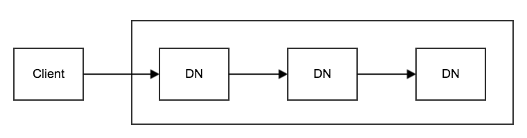
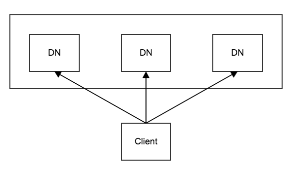
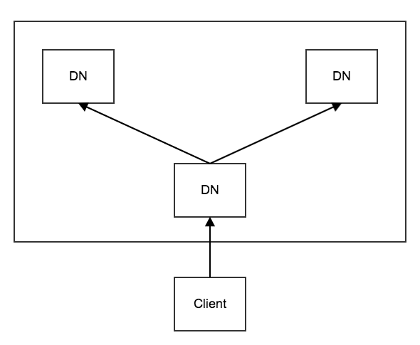

HDFS通过数据流的方式写数据块。

<!--more-->

>版本：截止至2.x。

# 管道中的IO流

* in：上游节点到当前节点的输入流，当前节点通过in接收上游节点的packet。
* replyOut：：当前节点到上游节点的输出流，当前节点通过replyOut向上游节点发送ack。
* mirrorOut：当前节点到下游节点的输出流，当前节点通过mirrorOut向下游节点镜像发送packet。
* mirrorIn：下游节点到当前节点的输入流，当前节点通过mirrorIn接收下游节点的镜像ack。

# 管道中的关键线程

除了客户端，管道中的每一个dn都有两个关键线程：

1. DataXceiver线程：dn上管道流的主线程，负责**接收上游的packet**，并**继续向下游节点管道写**。（`BlockReceiver#receivePacket()`）。
2. PacketResponder线程：负责**接收下游节点的ack**，并**继续向上游管道响应**。

作为管道的发起者，也是管道的起点，需要主动写入数据，有三个关键线程：

1. 用户写数据的线程：用户以chunk为粒度向缓冲区写数据，写满一个packet后放入dataQueue。
2. DataStreamer线程：客户端上管道流的主线程，负责**将packet从dataQueue移动到ackQueue**，并**向下游节点管道写packet**。
3. PacketResponder线程：负责**接收下游节点的ack**，并**移除ackQueue中的packet**。

结合上图，DataXceiver线程、DataStreamer线程维护`in->mirrorOut`方向的packet数据流，PacketResponder线程维护`mirrorIn->replyOut`方向的ack数据流。

# 管道的整体过程

管道的生命周期分为三个阶段：

1. 管道建立：以管道的方式向下游发送管道建立的请求，从下游接收管道建立的响应。
2. 管道写：当客户端收到管道建立成功的ack时，才利用刚刚建立的管道开始管道写数据块的内容。
3. 管道关闭：以管道的方式向下游发送管道关闭的请求，从下游接收管道关闭的响应。

三个过程都是管道式的。

# 优缺点

* 优点：如果考虑上客户端，那么管道写的优点是**网络负载比较均衡**。
* 缺点：`慢节点`会成为带宽瓶颈，且整体上**延迟更高**。

# 如何优化延迟

`管道写`的方式通常称为`pipeline`：

为了优化管道写的延迟问题，业界还提出了多种写方案：

## 超步写

如果还使用`管道写`，可以支持`超步写`。

传统的`管道写`方案相当于TCP中的`停-等协议`，可仿照TCP，维护滑动窗口支持超步写，快速重传等方案同样适用。

## 星型写

如果网络资源充足，可以改用`星型写`。

如果在星型写中发生了失败，既可以选择管道写最保守的方案，中断整个写重试，也可以使用更激进的方式，如其中2个DN写成功就继续向成功节点写，而失败的节点可以在后台重试（当然，如果不低于minRep可以暂时忽略）。

显然，上述方案对于慢节点的优化效果非常显著。

## Y型写

如果期望网络资源与延迟平衡，可改用`Y型写`。

