参考[Mac编译Hadoop源码](/2018/01/15/Mac编译Hadoop源码/)编译好Hadoop源码后，就可以单步debug追源码了。

>当然，本文不仅适用于debug Hadoop源码，可以无缝迁移到其他框架。

<!--more-->

# 版本声明

* 源码：`Apache Hadoop 2.6.0`
* 系统：`macOS 10.12.4`
* JDK：`oracle jdk 1.7.0_79`
* IDE：`IntelliJ IDEA 2017.2.3` 

# 单线程debug

以单步debug追datanode源码为例。

## 启动namenode

正常启动namenode：

```bash
./sbin/hadoop-daemon.sh start namenode
```

## 配置并启动datanode（被调试者）

修改`etc/hadoop/hadoop-env.sh`，设置`HADOOP_OPTS`：

```
# Extra Java runtime options.  Empty by default.
HADOOP_OPTS="-agentlib:jdwp=transport=dt_socket,server=y,suspend=y,address=8888"
export HADOOP_OPTS="$HADOOP_OPTS -Djava.net.preferIPv4Stack=true"
```

启动datanode：

```bash
./sbin/hadoop-daemon.sh start datanode
```

输出：

```
starting datanode, logging to /Users/msh/Applications/experiment/hadoop-2.6.0/logs/hadoop-msh-datanode-mshdeMacBook-Pro.local.out
Listening for transport dt_socket at address: 8888
```

查看log：

```bash
tail -f /Users/msh/Applications/experiment/hadoop-2.6.0/logs/hadoop-msh-datanode-mshdeMacBook-Pro.local.logs
```

会报文件不存在。因为此时JVM是hang住的（等待调试器连接，见下），还没有执行main方法，也就没有创建log文件。

转去配置IDEA。

## 配置IDEA（调试器）

IDEA中打开对应版本的hadoop源码（2.6.0）。

Run->Edit Configurations，左上角的+号选择Remote，主要配置主机localhost、端口8888：


>Eclipse同理。 

配置项做简单说明：

* `-agentlib:jdwp`：使用JDWP实现远程调试，包含若干子选项。
* `transport=dt_socket`：调试器和被调试者之间使用套接字传输。
* `server=y`：启动的JVM是接收调试请求的被调试者（IDEA上启动的是发出请求的调试器，会存在一个server=n的进程）。
* `suspend=y`：启动的JVM会暂停等待，直到调试器连接上才继续执行，因此启动datanode时才能“hang住”，等待我们启动调试器（这里与IDEA提供的配置是suspend=n，我习惯用suspend=y）。
* `address=8888`：被调试者在8888端口上监听调试请求。

## 设置断点

沿着在Datanode类的main方法设置几个断点：

* 演示基本的调试交互

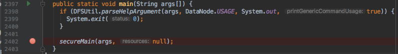

* 利用打印的log验证

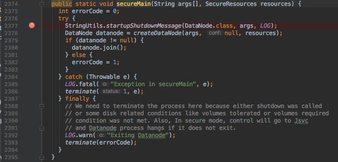

## 开始debug

### 调试器

IDEA中，Run->Debug，选择刚刚配置的TestDatanode参数

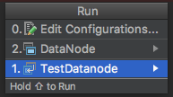

停在第一个断点：

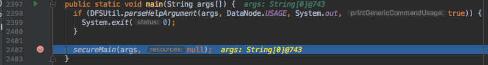

### 被调试者

回到启动datanode的终端，再次查看log。

发现文件已创建但是空文件。

### 调试器

回到IDEA，F8跳过第一个断点，停在第二个断点：

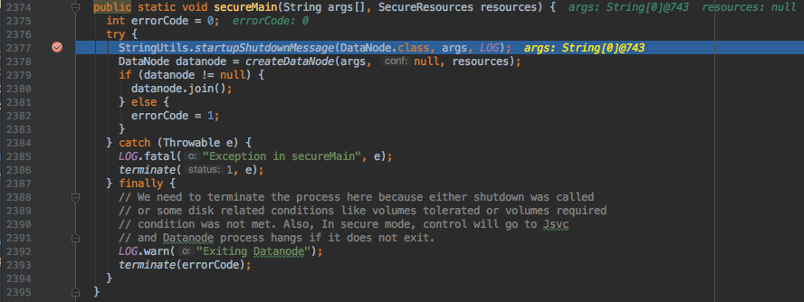

这句代码会打印启动信息（此处不讨论）。如果执行该行后，日志被打印，说明我们的单独debug成功了。

F8后停在下一行，回去查看日志信息。

### 被调试者

查看log：

```
2018-01-15 11:37:52,314 INFO org.apache.hadoop.hdfs.server.datanode.DataNode: STARTUP_MSG:
/************************************************************
STARTUP_MSG: Starting DataNode
...（内容太长，略）
```

确实打印了启动信息。

搞定。

>如果同时调试多个节点，注意设置不同的端口

# 多线程debug

>Hadoop中有大量优秀的并发设计，多线程debug必不可少。

IDEA设置的断点默认只能监控前台线程（一般是主线程），后台线程遇到断点都会忽略，无法调试多线程代码。实际上，IDEA、Eclipse等本身支持多线程debug，开启Thread模式即可。

下面仍以单步debug追datanode源码为例，看如何进行多线程debug。

## 开启Thread模式

默认的断点挂起模式为“All”：

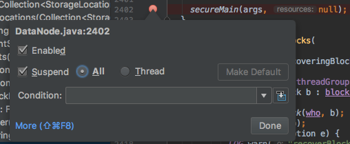

改为Thread，并点击“Make Default”：

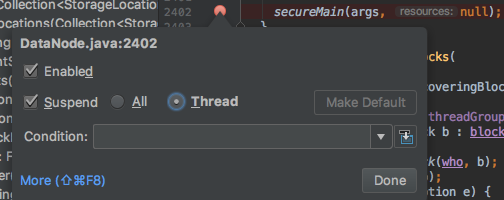

这样以后设置的断点就都是Thread模式，支持多线程debug了。

## 设置断点

>重新启动namenode与datanode，连接上datanode。

沿着DataNode.secureMain()找到createDataNode->runDatanodeDaemon：

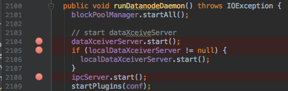

DataXceiver负责datanode的管道流相关操作，以守护线程的形式存在。以dataXceiverServer例，对应的Runable类为DataXceiverServer：

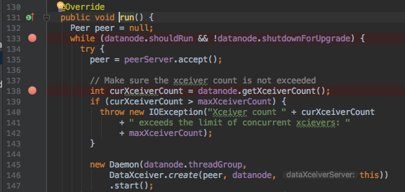

## 开始debug

### main线程

执行到DataNode类中的2104行`dataXceiverServer.start();`：

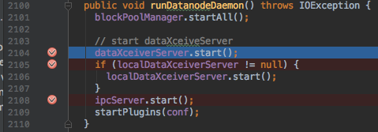

如果F8跳过断点，dataXceiverServer就会在后台启动，继而停在类中的133行`while (datanode.shouldRun && !datanode.shutdownForUpgrade) {`。F8后，观察目前有哪些线程：

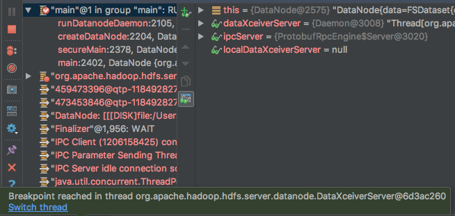

注意到，底部收到一个通知：dataXceiverServer线程遇到了断点。

### dataXceiverServer线程

main线程放着，切换到dataXceiverServer线程：

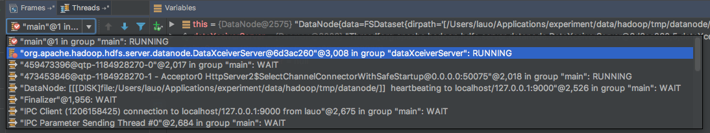

>图标为“红点+对勾”的是正常debug的线程，其他图标只有“红点”的是后台停在断点上的线程。

切换后，IDEA会自动到切换对应线程的虚拟机栈：

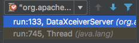

相应自动跳到对应代码位置：

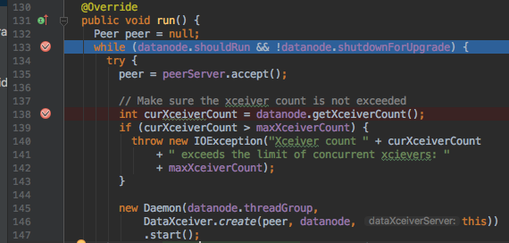

此时，debug操作都会作用到当前的虚拟机栈上，即只影响dataXceiverServer线程，而main线程保持等待（因为刚才让main线程也停在了一个断点上）。

F8，执行到accept一行，由于没有连接发过来，dataXceiverServer线程会hang在这里：

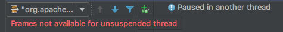

### main线程

再切换回main线程。

虚拟机栈恢复：

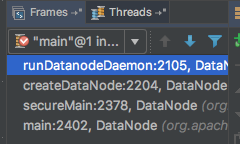

代码也还停在切换前的位置：

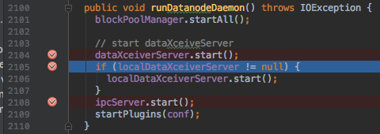

F8跳过2105行断点：

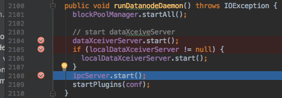

main线程仍能够正常debug。

>有连接发送过来的时候，dataXceiverServer线程会恢复RUNNING状态，并在后台默默执行到下一断点，然后等待用户切换线程进行debug。

搞定。

---

>参考：
>
>* [Hadoop源码编译与调试](https://www.iteblog.com/archives/897.html)
>* [Idea Intellij多线程调试](http://blog.csdn.net/fuzzytalker/article/details/50925218)
>
