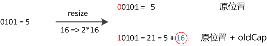

HashMap是常考点，而一般不问List的几个实现类(偏简单)。以下基于JDK1.8.0_102分析。

<!--more-->

>JDK版本：oracle java 1.8.0_102

# 内部存储

HashMap的内部存储是一个数组（bucket），数组的元素Node实现了是Map.Entry接口(hash, key, value, next)，next非空时指向定位相同的另一个Entry，如图：

    

# 容量(capacity)和负载因子(loadFactor)

简单的说，capacity就是bucket的大小，loadFactor就是bucket填满程度的最大比例。当bucket中的**entries的数目**(而不是已占用的位置数)大于capacity*loadFactor时就需要扩容，调整bucket的大小为当前的2倍。同时，初始化容量的大小也是2的次幂（大于等于设定容量的最小次幂），则bucket的大小在扩容前后都将是2的次幂（非常重要，resize时能带来极大便利）。

>Tips:  
>默认的capacity为16，loadFactor为0.75，但如果需要优化的话，要考量具体的使用场景。
>
>* 如果对迭代性能要求高，不要把capacity设置过大，也不要把loadFactor设置过小，否则会导致bucket中的空位置过多，浪费性能
>* 如果对随机访问的性能要求很高的话，不要把loadFactor设置的过大，否则会导致访问时频繁碰撞，时间复杂度向O(n)退化
>* 如果数据增长很快的话，或数据规模可预知，可以在创建HashMap时主动设置capacity
>

# hash与定位

作为API的设计者，不能假定用户实现了良好的hashCode方法，所以通常会对hashCode再计算一次hash：

```java
static final int hash(Object key) {
    int h;
    return (key == null) ? 0 : (h = key.hashCode()) ^ (h >>> 16);
}
```

## hashCode方法

注意`key.hashCode()`的多态用法。重点是hash方法。

## hash方法的实现和定位

前面已经说过，在get和put计算下标时，先对hashCode进行hash操作，然后再通过hash值进一步计算下标，如下图所示：  

  

回顾hash方法的源码可知，hash方法大概的作用就是：高16bit不变，低16bit和高16bit做了一个异或。

javadoc这样说：

>Computes key.hashCode() and spreads (XORs) higher bits of hash to lower. Because the table uses power-of-two masking, sets of hashes that vary only in bits above the current mask will always collide. (Among known examples are sets of Float keys holding consecutive whole numbers in small tables.) So we apply a transform that spreads the impact of higher bits downward. There is a tradeoff between **speed, utility, and quality** of bit-spreading. Because many common sets of hashes are already **reasonably distributed** (so don’t benefit from spreading), and because **we use trees to handle large sets of collisions in bins**, we just XOR some shifted bits in the cheapest possible way to reduce systematic lossage, as well as to incorporate impact of the highest bits that would otherwise never be used in index calculations because of table bounds.

在设计hash函数时，因为目前的table长度n为2的次幂，所以计算下标的时候，可使用按位与`&`代替取模`%`：

```java
(n - 1) & hash
```

设计者认为这方法很容易发生碰撞。为什么这么说呢？不妨思考一下，在n - 1为15(0x1111)时，散列真正生效的只是低4bit的有效位，当然容易碰撞了。

因此，设计者想了一个顾全大局的方法(综合考虑了速度、作用、质量)，就是把高16bit和低16bit异或了一下。设计者还解释到因为现在大多数的hashCode的分布已经很不错了，就算是发生了碰撞也用O(logn)的tree去做了。仅仅异或一下，既减少了系统的开销，也不会造成因为高位没有参与下标的计算(table长度比较小)时，引起的碰撞。

>但我没有理解为什么“很”容易发生碰撞。如此设计的话，hash的分布是均匀的，且极其简单；将高16bit与低16bit异或之后，hash的分布变的复杂一些，更“接近”随机，但仍然是均匀的。估计作者是从实际使用的角度出发，因为一般情况下，key的分布也符合“局部性原理”，低比特位相同的概率大于异或后仍然相同的概率，从而降低了碰撞的概率。

## 碰撞

调用put方法时，尽管我们设法避免碰撞以提高HashMap的性能，还是可能发生碰撞。据说碰撞率还挺高，平均加载率到10%时就会开始碰撞。我们使用`开放散列法`来处理碰撞节点。

~~将旧entry的引用赋值给新entry的next属性，改将新entry放在该位置——即在该位置上存储一个链表，冲突节点从链表头部插入，这样插入新entry时不需要遍历链表，时间复杂度为O(1)。但如果链表过长，查询性能仍将退化到O(n)。Java8中对链表长度增加了一个阈值，超过阈值链表将转化为红黑树，查询时间复杂度降为O(logn)，提高了链表过长时的性能。~~

>勘误：网上有朋友联系我指出了此处的错误，Java8中，发生碰撞时会遍历到链表的最后。
>
>这篇文章写的时候读源码能力比较渣，就基于自己早期对Java7源码的分析改编，本以为除了红黑树部分，大体相同，就直接copy了过来，导致了这个错误——当然，现在想来，关于Java7中HashMap的分析也是错的，最后插入方式没错，但是插入前还是要O(n)的时间遍历一遍。不过其他涉及源码的文章就都是老老实实追源码写出来的，可以放心阅读。**告诫自己，要坚持踏实，坚持怀疑**。以下是改正的分析。

从该位置上的entry开始，遍历到找到相同的key（就替换），或到结尾还是没有相同的key（就衔接在尾节点的next上）。查询时过程相同。不考虑任何优化，插入、查询的性能都是O(n)。Java8中对链表长度增加了一个阈值，超过阈值链表将转化为红黑树，插入、查询的时间复杂度降为O(logn)，提高了链表过长时的性能。

调用get方法时，定位到该位置，再遍历红黑树，比较key值找到所需元素：

```java
    final Node<K,V> getNode(int hash, Object key) {
        Node<K,V>[] tab; Node<K,V> first, e; int n; K k;
        if ((tab = table) != null && (n = tab.length) > 0 &&
            (first = tab[(n - 1) & hash]) != null) {
            if (first.hash == hash && // always check first node
                ((k = first.key) == key || (key != null && key.equals(k))))
                return first;
            if ((e = first.next) != null) {
                if (first instanceof TreeNode)
                    return ((TreeNode<K,V>)first).getTreeNode(hash, key);
                do {
                    if (e.hash == hash &&
                        ((k = e.key) == key || (key != null && key.equals(k))))
                        return e;
                } while ((e = e.next) != null);
            }
        }
        return null;
    }
```

判断元素相等的设计比较经典，利用了bool表达式的短路特性：先比较hash值；如果hash值相等，就通过`==`比较；如果`==`不等，再通过equals方法比较。hash是提前计算好的；`==`直接比较引用值；equals方法最有可能耗费性能，如String的equals方法需要O(n)的时间，n是字符串长度。一定要记住这里的判断顺序，很能考察对碰撞处理源码的理解。

>针对HashMap的使用，此处要注意覆写hashCode和equals方法时的两个重点：
>
>* 覆写后，一定要**保证equals判断相等的时候，hashCode的返回值也相等**。
>* 对于选作key的类，要**保证调用put与get时hashCode的返回值相等，equals的性质相同**。
>

# resize

**resize是HashMap中最难理解的部分**。

调用put方法时，如果发现目前的bucket占用程度已经超过了loadFactor，就会发生resize。简单的说就是把bucket扩充为2倍，之后重新计算index，把节点再放到新的bucket中。

javadoc中这样说：

>Initializes or doubles table size. If null, allocates in accord with initial capacity target held in field threshold. Otherwise, because we are using power-of-two expansion, the elements from each bin must either **stay at same index**, or **move with a power of two offset** in the new table.

即，当超过限制的时候会resize，又因为我们使用的是2次幂的扩展，所以，元素的位置要么是在原位置，要么是在原位置再移动2次幂的位置。

怎么理解呢？例如我们从16扩展为32时，具体的变化如下：

  

假设bucket大小`n=2^k`，元素在重新计算hash之后，因为n变为2倍,那么新的位置就是`(2^(k+1)-1)&hash`。而`2^(k+1)-1=2^k+2^k-1`，相当于2^k-1的mask范围在高位多1bit(红色)(再次提醒，原来的长度n也是2的次幂)，**这1bit非1即0**。如图：



所以，我们在resize的时候，不需要重新定位，只需要看看原来的hash值新增的那个bit是1还是0就好了，是0的话位置没变，是1的话位置变成“原位置+oldCap”。代码比较长就不贴了，下面为16扩充为32的resize示意图：


这个设计非常的巧妙，新增的1bit是0还是1可以认为是随机的，因此resize的过程均匀的把之前的冲突的节点分散到新的bucket中了。

---

>参考：
>
>* [Java HashMap工作原理及实现 | Yikun](http://yikun.github.io/2015/04/01/Java-HashMap%E5%B7%A5%E4%BD%9C%E5%8E%9F%E7%90%86%E5%8F%8A%E5%AE%9E%E7%8E%B0/)
>
