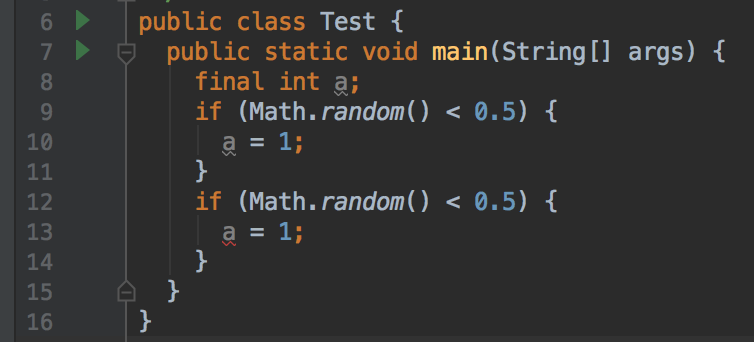

final关键字可以修饰类、方法、变量。本质作用可以理解为“**声明被修饰对象只读**”，不同用法对应不同的具体解释。

<!--more-->

# final类

**final类表示该类是完整（可理解为最终版本）的，禁止扩展**。final标记会写入class文件的类定义中，在编译期检查，如果发现上游extends了一个final类后，则编译失败，从语法上保证不能extends一个final类。

final类经常用于不可变类的构造中：如果不使用final修饰，且有对子类可见的可变成员变量，则extends该“不可变类”后，子类就变成了可变类。考虑到多态的存在，这种“歧义”非常危险。详见：[实现不可变类时如何禁止子类化？](/2017/09/20/实现不可变类时如何禁止子类化？/)。

例：String类、Interger类等：

```java
public final class String
```

# final方法

与final类的语义相似，**final方法表示该方法是完整的，禁止重写**。final标记会写入class文件的成员方法定义中，在编译期检查，如果发现继承链上游有函数签名相同的final方法（重写），则编译失败，从语法上保证不能重写一个final方法；同时，在编译期完成对final方法的解析（`静态绑定`）。

例：com.sun.org.apache.bcel.internal.classfile.Signature中的dump方法：

```java
  public final void dump(DataOutputStream file) throws IOException
  {
    super.dump(file);
    file.writeShort(signature_index);
  }
```

# final变量

## final成员变量

final成员变量体现了最直观的final语义：**final成员变量表示该成员变量只读**（在第一次赋值后就不能再修改）。final标记会写入class文件的成员变量定义中，在编译器和运行期都会进行检查，如果发现第二次修改就编译失败或抛出异常。

如果想实现不可变类，通常建议尽量使用final修饰每一个成员变量（延迟初始化等会违背这一建议）。

如果final成员变量的初始化被收集到该类的构造方法中，则final成员变量初始化之前的变量通常具有内存可见性，但这一性质并不容易应用，不建议利用。详见：[一文解决内存屏障](/2017/12/28/一文解决内存屏障/#final关键字)。

例：Integer#value：

```java
    private final int value;

    public Integer(int value) {
        this.value = value;
    }
```

>显式的用构造方法初始化final成员变量。

### 常量

如果在成员变量声明时完成初始化（第一次赋值），则该成员变量被JVM视作常量。

对于编译期能确定初始值的常量（如`final int a = 1;`），通常能通过`常量折叠`、`常量传播`等技术，在编译期完成常量的优化和解析。

例：`Integer.SIZE`和`Integer.BYTES`：

```java
    @Native public static final int SIZE = 32;

    public static final int BYTES = SIZE / Byte.SIZE;
```

## final局部变量

**final局部变量也表示该局部变量只读**，但与final成员变量不同，final局部变量只是java中的语法糖，_局部变量上的final修饰并不会写入class文件，更无法出现在运行期_。如果局部变量被final修饰，则_编译器在编译时会检查该变量是否有可能发生第二次修改_，有可能就编译失败；否则，消除final修饰。

例：


