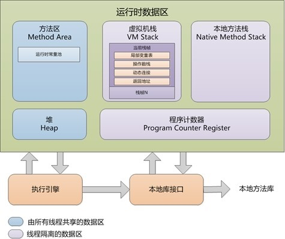
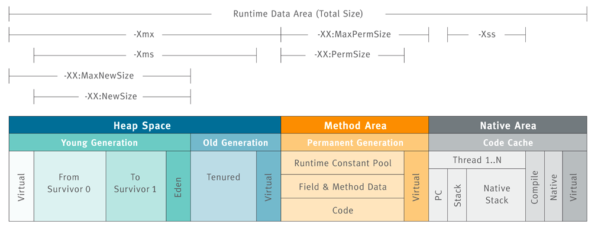
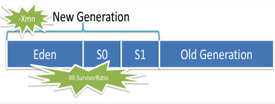
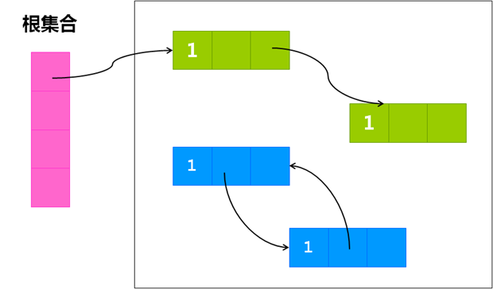
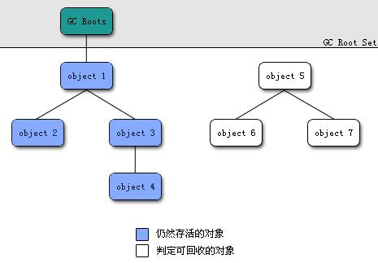
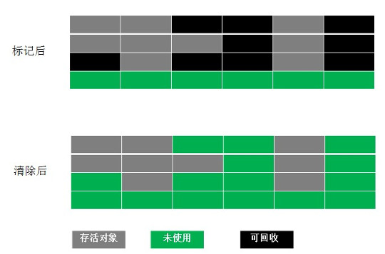
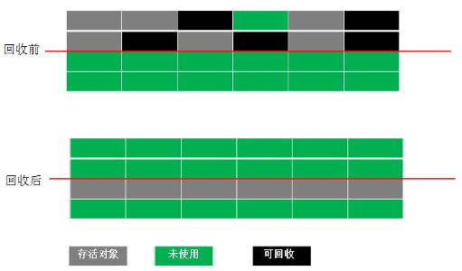
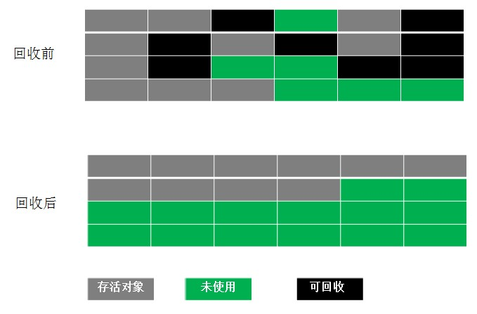

面试中问道到“内存模型”，通常是考察**Java内存结构和GC**，*而不是Happens-Before或因果关系内存模型*。内存模型是考察coder对一门语言的理解能力，从而进一步延伸到对JVM优化，和平时学习的深度上，是Java面试中最重要的一部分。这里整理了内存结构和GC，Happens-Before模型预计在以后学习过JVM过再来整理。  

<!--more-->

*如果把内存模型看做一个数据结构，那么面试中考察的重点分为内存结构和GC，不过有时候会单独问到GC，另外大问题分解为小问题也方便理解。*  
# 内存结构
## 内存结构简介
JVM的内存结构大概分为：  

1. 堆（heap）：线程共享，所有的对象实例以及数组都要在堆上分配。回收器主要管理的对象。
2. 方法区（MEATHOD AREA）：线程共享，存储类信息、常量、静态变量、即时编译器编译后的代码。
3. 方法栈（JVM Stack）：线程私有、存储局部变量表、操作栈、动态链接、方法出口，对象指针。
4. 本地方法栈（NATIVE METHOD STACK）：线程私有。为虚拟机使用到的Native 方法服务。如Java使用c或者c++编写的接口服务时，代码在此区运行。
5. PC寄存器（PC Register）：线程私有。指向下一条要执行的指令。

  
## 各区域详细说明
在Java的内存结构中，我们重点关注的是堆和方法区。  
  
## 堆
堆的作用是存放对象实例和数组。堆从结构上来分，可以分为新生代和老生代。而新生代又可以分为Eden 空间、From Survivor 空间（s0）、To Survivor 空间（s1）。 所有新生成的对象首先都是放在年轻代的。需要注意，Survivor的两个区是对称的，没先后关系，所以同一个区中可能同时存在从Eden复制过来 对象，和从前一个Survivor复制过来的对象，而复制到年老区的只有从第一个Survivor去过来的对象。而且，Survivor区总有一个是空的。  
### 控制参数
-Xms设置堆的最小空间大小。-Xmx设置堆的最大空间大小。-XX:NewSize设置新生代最小空间大小。-XX:MaxNewSize设置新生代最小空间大小。  
### 垃圾回收
此区域是垃圾回收的主要操作区域。  
### 异常情况
如果在堆中没有内存完成实例分配，并且堆也无法再扩展时，将会抛出OutOfMemoryError 异常。  
## 方法区
方法区（Method Area）与Java 堆一样，是各个线程共享的内存区域，它用于存储已被虚拟机加载的类信息、常量、静态变量、即时编译器编译后的代码等数据。虽然Java 虚拟机规范把方法区描述为堆的一个逻辑部分，但是它却有一个别名叫做Non-Heap（非堆），目的应该是与Java 堆区分开来。  
很多人愿意把方法区称为“永久代”（Permanent Generation），本质上两者并不等价，仅仅是因为HotSpot虚拟机的设计团队选择把GC 分代收集扩展至方法区，或者说使用永久代来实现方法区而已。对于其他虚拟机（如BEA JRockit、IBM J9 等）来说是不存在永久代的概念的。在Java8中永生代彻底消失了。  
### 控制参数
-XX:PermSize 设置最小空间 -XX:MaxPermSize 设置最大空间。  
### 垃圾回收
对此区域会涉及但是很少进行垃圾回收。这个区域的内存回收目标主要是针对常量池的回收和对类型的卸载，一般来说这个区域的回收“成绩”比较难以令人满意。  
### 异常情况
根据Java 虚拟机规范的规定， 当方法区无法满足内存分配需求时，将抛出OutOfMemoryError。
## 方法栈
每个线程会有一个私有的栈。每个线程中方法的调用又会在本栈中创建一个栈帧。在方法栈中会存放编译期可知的各种基本数据类型（boolean、byte、char、short、int、float、long、double）、对象引用（reference 类型，它不等同于对象本身。局部变量表所需的内存空间在编译期间完成分配，当进入一个方法时，这个方法需要在帧中分配多大的局部变量空间是完全确定的，在方法运行期间不会改变局部变量表的大小。  
### 控制参数
-Xss控制每个线程栈的大小。  
### 异常情况
在Java 虚拟机规范中，对这个区域规定了两种异常状况：  

1. StackOverflowError： 异常线程请求的栈深度大于虚拟机所允许的深度时抛出；
2. OutOfMemoryError 异常： 虚拟机栈可以动态扩展，当扩展时无法申请到足够的内存时会抛出。

## 本地方法栈
本地方法栈（Native Method Stacks）与虚拟机栈所发挥的作用是非常相似的，其
区别不过是虚拟机栈为虚拟机执行Java 方法（也就是字节码）服务，而本地方法栈则
是为虚拟机使用到的Native 方法服务。  
### 控制参数
在Sun JDK中本地方法栈和方法栈是同一个，因此也可以用-Xss控制每个线程的大小。  
### 异常情况
与虚拟机栈一样，本地方法栈区域也会抛出StackOverflowError 和OutOfMemoryError
异常。  
## PC计数器
它的作用可以看做是当前线程所执行的字节码的行号指示器。
### 异常情况
此内存区域是唯一一个在Java 虚拟机规范中没有规定任何OutOfMemoryError 情况的区域。  

>参考：  
[Java虚拟机详解02----JVM内存结构](http://www.cnblogs.com/smyhvae/p/4748392.html)  
[JVM内存结构](http://www.bo56.com/jvm%E5%86%85%E5%AD%98%E7%BB%93%E6%9E%84/)  

# GC
简言之，Java程序内存主要（这里强调主要二字）分两部分，堆和非堆。大家一般new的对象和数组都是在堆中的，而GC主要回收的内存也是这块堆内存。  
## 复习堆内存模型
既然重点是堆内存，我们就再看看堆的内存模型。  

>堆内存由垃圾回收器的自动内存管理系统回收。  
堆内存分为两大部分：新生代和老年代。比例为1：2。  
老年代主要存放应用程序中生命周期长的存活对象。  
新生代又分为三个部分：一个Eden区和两个Survivor区，比例为8：1：1。  
Eden区存放新生的对象。  
Survivor存放每次垃圾回收后存活的对象。  

  
关注这几个问题：  

1. 为什么要分新生代和老年代？
2. 新生代为什么分一个Eden区和两个Survivor区?
3. 一个Eden区和两个Survivor区的比例为什么是8:1:1？

这几个问题都是垃圾回收机制所采用的算法决定的。所以问题转化为，是何种算法？为什么要采用此种算法？  
## 判定可回收对象
在进行垃圾回收之前，我们需要清除一个问题——什么样的对象是垃圾（无用对象），需要被回收？  
目前最常见的有两种算法用来判定一个对象是否为垃圾。  
### 引用计数算法
给对象中添加一个引用计数器，每当有一个地方引用它时，计数器值就加1；当引用失效时，计数器值就减1；任何时刻计数器为0的对象就是不可能再被使用的。  
  
优点是简单，高效，现在的objective-c用的就是这种算法。  
缺点是很难处理循环引用，比如图中相互引用的两个对象则无法释放。  
*这个缺点很致命，有人可能会问，那objective-c不是用的好好的吗？我个人并没有觉得objective-c好好的处理了这个循环引用问题，它其实是把这个问题抛给了开发者。*  
### 可达性分析算法（根搜索算法）
为了解决上面的循环引用问题，Java采用了一种新的算法：可达性分析算法。  
从GC Roots（每种具体实现对GC Roots有不同的定义）作为起点，向下搜索它们引用的对象，可以生成一棵引用树，树的节点视为可达对象，反之视为不可达。  
  
OK，即使循环引用了，只要没有被GC Roots引用了依然会被回收，完美！  
但是，这个GC Roots的定义就要考究了，Java语言定义了如下GC Roots对象：  

1. 虚拟机栈（帧栈中的本地变量表）中引用的对象。
2. 方法区中静态属性引用的对象。
3. 方法区中常量引用的对象。
4. 本地方法栈中JNI引用的对象。

## Stop The World 
有了上面的垃圾对象的判定，我们还要考虑一个问题，请大家做好心里准备，那就是Stop The World。  
因为垃圾回收的时候，需要整个的引用状态保持不变，否则判定是判定垃圾，等我稍后回收的时候它又被引用了，这就全乱套了。所以，GC的时候，其他所有的程序执行处于暂停状态，卡住了。
幸运的是，这个卡顿是非常短（尤其是新生代），对程序的影响微乎其微 （关于其他GC比如并发GC之类的，在此不讨论）。  
所以GC的卡顿问题由此而来，也是情有可原，暂时无可避免。  
## 垃圾回收
已经知道哪些是垃圾对象了，怎么回收呢？  
目前主流有以下几种算法，目前JVM采用的是分代回收算法，而分代回收算法正是从这几种算法发展而来。  
### 标记清除算法 (Mark-Sweep)
标记-清除算法分为两个阶段：标记阶段和清除阶段。标记阶段的任务是标记出所有需要被回收的对象，清除阶段就是回收被标记的对象所占用的空间。  
  
优点：简单实现。  
缺点：容易产生内存碎片（碎片太多可能会导致后续过程中需要为大对象分配空间时无法找到足够的空间而提前触发新的一次垃圾收集动作）。  
### 复制算法 (Copying)
复制算法将可用内存按容量划分为大小相等的两块，每次只使用其中的一块。当这一块的内存用完了，就将还存活着的对象复制到另外一块上面，然后再把已使用的内存空间一次清理掉，这样一来就不容易出现内存碎片的问题。  
  
优点：实现简单，运行高效且不容易产生内存碎片。  
缺点：对内存空间的使用做出了高昂的代价，因为能够使用的内存缩减到原来的一半。  
从算法原理我们可以看出，**复制算法算法的效率跟存活对象的数目多少有很大的关系，如果存活对象很多，那么复制算法算法的效率将会大大降低。**  
### 标记整理算法 (Mark-Compact)
该算法标记阶段和Mark-Sweep一样，但是在完成标记之后，它不是直接清理可回收对象，而是将存活对象都向一端移动，然后清理掉端边界以外的内存。  
  
优点：实现简单，不容易产生内存碎片，内存使用高效。  
缺点：效率非常低。  
所以，**特别适用于存活对象多，回收对象少的情况下。**  
### 分代回收算法
以上几种算法都有各自的优点和缺点，适用于不同的内存情景。而分代回收算法根据Java的语言特性，将复制算法和标记整理算法的的特点相结合，针对不同的内存情景使用不同的回收算法。  
这里重复一下两种老算法的适用场景：  

>复制算法：适用于存活对象很少。回收对象多  
标记整理算法: 适用用于存活对象多，回收对象少

两种算法刚好互补，不同类型的对象生命周期决定了更适合采用哪种算法。  
于是，我们根据对象存活的生命周期将内存划分为若干个不同的区域。一般情况下**将堆区划分为老年代（Old Generation）和新生代（Young Generation），老年代的特点是每次垃圾收集时只有少量对象需要被回收，使用标记整理算法，而新生代的特点是每次垃圾回收时都有大量的对象需要被回收，复制算法**，那么就可以根据不同代的特点采取最适合的收集算法。  
现在回头去看堆内存为什么要划分新生代和老年代，是不是觉得如此的清晰和自然了？  
具体来看：  

1. 对于新生代，虽然采取的是复制算法，但是，实际中并不是按照上面算法中说的1：1的比例来划分新生代的空间，而是将新生代划分为一块较大的Eden空间和两块较小的Survivor空间，比例为8：1：1。为什么？下一节深入分析。
2. 老年代的特点是每次回收都只回收少量对象，这符合一个稳定系统的主要特征——超过一半的对象会长期驻留在内存中。所以老年代的比例要大于新生代，默认的新生代：老年代的比例为1：2。

这就是分代回收算法。  
## 深入理解分代回收算法
对于这个算法，我相信很多人还是有疑问的，我们来各个击破，说清楚了就很简单。
### 为什么不是一块Survivor空间而是两块？  
这里涉及到一个新生代和老年代的存活周期的问题，比如一个对象在新生代经历15次（仅供参考）GC，就可以移到老年代了。问题来了，当我们第一次GC的时候，我们可以把Eden区的存活对象放到Survivor A空间，但是第二次GC的时候，Survivor A空间的存活对象也需要再次用Copying算法，放到Survivor B空间上，而把刚刚的Survivor A空间和Eden空间清除。第三次GC时，又把Survivor B空间的存活对象复制到Survivor A空间，如此反复。  
所以，这里就需要两块Survivor空间来回倒腾。  
### 为什么Eden空间这么大而Survivor空间要分的少一点？  
新创建的对象都是放在Eden空间，这是很频繁的，尤其是大量的局部变量产生的临时对象，这些对象绝大部分都应该马上被回收，能存活下来被转移到survivor空间的往往不多。所以，设置较大的Eden空间和较小的Survivor空间是合理的，大大提高了内存的使用率，缓解了Copying算法的缺点。  
我看8：1：1就挺好的，当然这个比例是可以调整的，包括上面的新生代和老年代的1：2的比例也是可以调整的。  
新的问题又来了，从Eden空间往Survivor空间转移的时候Survivor空间不够了怎么办？直接放到老年代去。  
### Eden空间和两块Survivor空间的工作流程  
这里本来简单的Copying算法被划分为三部分后很多朋友一时理解不了，也确实不好描述，下面我来演示一下Eden空间和两块Survivor空间的工作流程。  
现在假定有新生代Eden，Survivor A， Survivor B三块空间和老生代Old一块空间。  

```
// 分配了一个又一个对象
放到Eden区
// 不好，Eden区满了，只能GC(新生代GC：Minor GC)了
把Eden区的存活对象copy到Survivor A区，然后清空Eden区（本来Survivor B区也需要清空的，不过本来就是空的）
// 又分配了一个又一个对象
放到Eden区
// 不好，Eden区又满了，只能GC(新生代GC：Minor GC)了
把Eden区和Survivor A区的存活对象copy到Survivor B区，然后清空Eden区和Survivor A区
// 又分配了一个又一个对象
放到Eden区
// 不好，Eden区又满了，只能GC(新生代GC：Minor GC)了
把Eden区和Survivor B区的存活对象copy到Survivor A区，然后清空Eden区和Survivor B区
// ...
// 有的对象来回在Survivor A区或者B区呆了比如15次，就被分配到老年代Old区
// 有的对象太大，超过了Eden区，直接被分配在Old区
// 有的存活对象，放不下Survivor区，也被分配到Old区
// ...
// 在某次Minor GC的过程中突然发现：
// 不好，老年代Old区也满了，这是一次大GC(老年代GC：Major GC)
Old区慢慢的整理一番，空间又够了
// 继续Minor GC
// ...
// ...
```

## 触发GC的类型
了解这些是为了解决实际问题，Java虚拟机会把每次触发GC的信息打印出来来帮助我们分析问题，所以掌握触发GC的类型是分析日志的基础。  

* `GC_FOR_MALLOC`: 表示是在堆上分配对象时内存不足触发的GC。
* `GC_CONCURRENT`: 当我们应用程序的堆内存达到一定量，或者可以理解为快要满的时候，系统会自动触发GC操作来释放内存。
* `GC_EXPLICIT`: 表示是应用程序调用System.gc、VMRuntime.gc接口或者收到SIGUSR1信号时触发的GC。
* `GC_BEFORE_OOM`: 表示是在准备抛OOM异常之前进行的最后努力而触发的GC。

>参考：  
[理解Java垃圾回收机制](http://jayfeng.com/2016/03/11/%E7%90%86%E8%A7%A3Java%E5%9E%83%E5%9C%BE%E5%9B%9E%E6%94%B6%E6%9C%BA%E5%88%B6/)  
