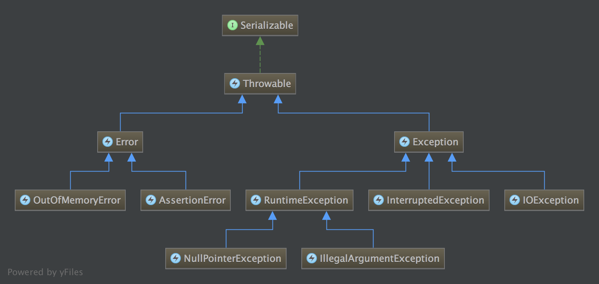

填坑，整理下Java的常用异常。正确使用异常在实际编码中非常重要，但面试中的意义相对较小，因为对异常的理解和应用很难通过几句话或几行代码考查出来，不过我们至少应答出三点：异常类的继承关系、常用异常类、常用异常类的使用场景，下文将围绕这三点介绍。

<!--more-->

# 异常类的继承关系

Java中，所有异常都继承自Throwable类（一个完整可用的类）。整体上分为Error、Exception两个大类，Exception大类又分为UncheckedException（继承于RuntimeException）和CheckedException（继承于Exception，但不继承于RuntimeException）。

为了帮助理解，我在每个类别下都给出了两个常用子类，如Error包括OutOfMemoryError、AssertionError等；UncheckedException包括NullPointerException、IllegalArgumentException；CheckedException包括IOException、InterruptedException。面试画异常类的继承关系时，要求能清楚的说明几个类别并分类别举几个常用的异常类。

# 常用异常类

下面分类别扩充一下常用的异常类，字典序排序：

| 类别 | 常用异常类 | 
|:--- |:--- |
| Error | AssertionError、**OutOfMemoryError**、StackOverflowError
| UncheckedException | AlreadyBoundException、ClassCastException、ConcurrentModificationException、**IllegalArgumentException**、IllegalStateException、IndexOutOfBoundsException、JSONException、**NullPointerException**、SecurityException、UnsupportedOperationException
| CheckedException | ClassNotFoundException、CloneNotSupportedException、FileAlreadyExistsException、FileNotFoundException、**InterruptedException**、**IOException**、SQLException、TimeoutException、UnknownHostException

需要着重理解的是UncheckedException。

上述异常类都是很常见的，但其中几个异常类设计的不好，需要注意：

* ConcurrentModificationException：实现“快速失败”的机制，但实际上，“快速失败”机制本身仍然无法保证并发环境下安全性，参考[源码|从源码分析非线程安全集合类的不安全迭代器](/2016/11/30/源码%7C从源码分析非线程安全集合类的不安全迭代器/)。因此，虽然该异常很常见，不要去依赖它。
* JSONException：常见于json字符串解析失败的情况，但遮蔽了大量的失败细节，往往很难根据该异常作出处理。如果项目中大量使用json，建议使用第三方的json解析库，如gson等。
* UnsupportedOperationException：这是一种编码上的恶性妥协，经常在抽象类的成员方法中被用户主动抛出，表示该方法还未实现等，但由于是UncheckedException，运行期才能够发现，完全无益于编码期间的安全性。自己编码时尽量不要使用。
* SQLException：与JSONException原因相似，但其遮蔽的失败细节范围更广。同时，SQLException还是一个CheckedException，在不能解决问题的情况下，又使代码变的臃肿不堪。建议同。如果做Java Web开发，热门的ORM库都能解决上述问题。

# 常用异常类的使用场景

常用异常还是有点多，下面分别讲解上述三个类别的使用场景，并在每个类别中选一个例子进行讲解。

## Error

**Error通常描述了系统级的错误，并且程序猿无法主动处理**——当然，系统级错误也有可能由代码间接导致，这不在我们的讨论范围内。发生系统级错误的时候，系统环境已经不健康了，因此，Error不强制捕获或声明，也就是**不强制处理，一般情况下只需要把异常信息记录下来**（如果能记下当时的系统快照更好）。

### OutOfMemoryError

当可用内存不足时，会由JVM抛出OutOfMemoryError。一般由三种原因导致：

* **堆设置过小**，不满足正常的内存需求
* 代码中存在**内存泄露**，占用了大量内存而不能被回收
* 选择的GC算法与某些极端的应用场景不匹配，**内存碎片过多**，没有足够大的连续空间分配给对象

JVM抛出OutOfMemoryError前，会尝试进行一次Full GC，如果GC后可用内存还是不足，才会抛出OutOfMemoryError。因此，这时程序猿必然无法主动处理这一问题，只能等程序崩溃后再去查证原因。

>查证OutOfMemoryError的技巧足以单开一篇文章了，本文不作深入。

## UncheckedException

严格来说，Error也可以被划归UncheckedException，但我们更习惯用**UncheckedException描述运行期发生，通常由于代码问题直接引起的程序相关的错误，并且程序猿无法主动处理**。注意区分，*系统级错误都应该用Error描述*。UncheckedException发生的大部分情况是代码写挫了，因此，UncheckedException也不强制捕获或声明，也就是**不强制处理，一般情况下记下日志即可**。

不同的是，如果可能，**要保证UncheckedException是可控的（在异常被动抛出前检查并主动抛出）**。

>JSONException就是不可控的。

### NullPointerException

NullPointerException是最常见的UncheckedException。如果在一个空指针上引用方法或变量等，则运行期会抛出NullPointerException。空指针让程序变的不可控：如果任由空指针在程序运行期随意传递、使用，我们将无法确定程序的行为，也无法确定捕获NullPointerException时程序所处的状态。

解决这一问题的方法很简单：

* 尽早检查并主动抛出异常
* 单独、提前处理边界条件
* 尽量不使用null表示状态，特别是在集合中

前两条原则通用于大部分UncheckedException，可参考String#toLowerCase()的例子。第三条原则需要在代码的健壮与简洁之间做出权衡，有限保证简洁清晰，需要健壮再去健壮。

## CheckedException

>猴子对CheckedException的理解不到位，如果各位有更好的理解希望能交流一下。以下讲猴子“不到位”的理解。

**CheckedException描述了外部环境导致的不太严重的错误，程序猿应该主动处理**。注意与系统级错误区分，系统级错误通常是不可恢复的。因此，CheckedException强制捕获或声明，程序猿必须处理。**记录日志，包装后再次抛出，在方法签名中声明**，是三种最常见的做法。

同UncheckedException一样，**CheckedException也要保证是可控的**。对CheckedException的可控性要求更高，不仅要主动检查，还要在捕获到异常时，作出合适的处理。

>不过，猴子认为大量CheckedException的存在就是个错误。比如FileAlreadyExistsException，更应该由用户主动检查发现，而不应该依赖于异常。对于可以处理的异常，本质上相当于控制流问题，用异常去表达反而让控制流变模糊。不过有时候猴子写小项目，也会为了简化代码，直接将相关异常声明在方法签名中，并一路声明干到main方法。恩，everything is a trade-off。

### IOException

产生IOException的原因非常多，但很多时候我们并不关心细节原因，因为文件系统是一个不太可控的因素，这时我们可以以IOException为粒度处理；某些需要关心细节的异常情况，则应使用IOException的子类，以分情况处理。

前面总结的FileAlreadyExistsException、FileNotFoundException、UnknownHostException等，都是IOException的子类。这三种异常恰好都是可以处理的。

>挖坑，InterruptedException也相当重要，后面要专门写一篇来整理。

# 总结

实际的编码工作中，我们应正确的使用异常表达代码设计，并尽可能使用JDK提供的异常类。JDK内置了非常多的异常类，我们只需要掌握一些常用的异常类，然后举一反三。
