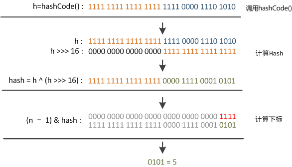
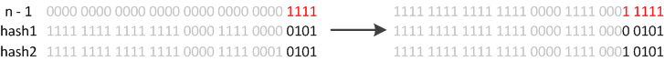
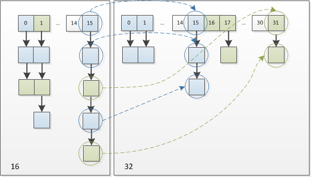

Java集合类是我们JDK学习中的一个典型的入手点，也是让初学者最初感受到Java魅力的地方之一，你一定不会忘记不需要关心大小的`ArrayList`，不用自己实现的`Queue`，和随处可见的`HashMap`。面试中，对Java基础的考察中，集合类和String相关是两个重点，这里集中整理了关于集合类的一些知识点。  

<!--more-->

# 集合类的结构
要求手绘结构图，同时抛出一些简单的线索勾引面试官提问（比如讲HashMap的HashTable的区别）。  
  
# HashMap实现原理
HashMap是常考点，而一般不问List的几个实现类(偏简单)。  
  
## 内部存储
HashMap的内部存储是一个数组（bucket），数组的元素是Entry(hash, key, value, next)，next非空时指向定位相同的另一个Entry，如上图。  
## 容量(capacity)和负载因子(loadFactor)
简单的说，capacity就是bucket的大小，loadFactor就是bucket填满程度的最大比例。当bucket中的**entries的数目**(而不是位置)大于capacity*loadFactor时就需要调整bucket的大小为当前的2倍。  
如果对迭代性能要求很高的话不要把capacity设置过大，也不要把loadFactor设置过小。  
## hash与定位
如果仅仅通过hashCode方法来散列key值，那么一般无法直接散列到bucket的范围中。所以通常做法是对hashCode方法的返回值再进行一次hash并对capacity取模，完成定位。hash方法源码如下：

```java
static final int hash(Object key) {
    int h;
    return (key == null) ? 0 : (h = key.hashCode()) ^ (h >>> 16);
}
```

## hashCode方法
可以看到`key.hashCode()`一句，说明对key仅仅是调用了Object类的hashCode()方法。重点是hash方法。
## hash方法的实现和定位
前面已经说过，在get和put的过程中，计算下标时，先对hashCode进行hash操作，然后再通过hash值进一步计算下标，如下图所示：  
  
回顾hash方法的源码可知，hash方法大概的作用就是：高16bit不变，低16bit和高16bit做了一个异或。
javadoc这样说：

>Computes key.hashCode() and spreads (XORs) higher bits of hash to lower. Because the table uses power-of-two masking, sets of hashes that vary only in bits above the current mask will always collide. (Among known examples are sets of Float keys holding consecutive whole numbers in small tables.) So we apply a transform that spreads the impact of higher bits downward. There is a tradeoff between **speed, utility, and quality** of bit-spreading. Because many common sets of hashes are already **reasonably distributed** (so don’t benefit from spreading), and because **we use trees to handle large sets of collisions in bins**, we just XOR some shifted bits in the cheapest possible way to reduce systematic lossage, as well as to incorporate impact of the highest bits that would otherwise never be used in index calculations because of table bounds.

在设计hash函数时，因为目前的table长度n为2的幂，而计算下标的时候，是这样实现的(使用`&`位操作，而非`%`求余)：

```java
(n - 1) & hash
```

设计者认为这方法很容易发生碰撞。为什么这么说呢？不妨思考一下，在n - 1为15(0x1111)时，其实散列真正生效的只是低4bit的有效位，当然容易碰撞了。  
因此，设计者想了一个顾全大局的方法(综合考虑了速度、作用、质量)，就是把高16bit和低16bit异或了一下。设计者还解释到因为现在大多数的hashCode的分布已经很不错了，就算是发生了碰撞也用O(logn)的tree去做了。仅仅异或一下，既减少了系统的开销，也不会造成的因为高位没有参与下标的计算(table长度比较小时)，从而引起的碰撞。  
## 定位冲突时
尽管我们设法避免冲突，一次提高HashMap的性能，还是可能发生定位冲突。这时，我们使用一个链表存储冲突的entry。  
将旧entry的引用赋值给新entry的next属性，改将新entry放在该位置——即在该位置上存储一个链表，冲突节点从链表头部插入，这样插入新entry时不需要遍历链表。但如果链表过长，性能将退化到线性查找，Java8中对链表长度增加了一个阈值，超过阈值链表将转化为红黑树，提高了链表过长时的性能。  
get时，定位到该位置，再遍历链表/红黑树，比较key值找到所需元素。  
## resize
resize是HashMap中最难理解的部分，需要部分数学基础。
当put时，如果发现目前的bucket占用程度已经超过了Load Factor所希望的比例，那么就会发生resize。在resize的过程，简单的说就是把bucket扩充为2倍，之后重新计算index，把节点再放到新的bucket中。  
javadoc中这样说：  

>Initializes or doubles table size. If null, allocates in accord with initial capacity target held in field threshold. Otherwise, because we are using power-of-two expansion, the elements from each bin must either **stay at same index**, or **move with a power of two offset** in the new table.

大致意思就是说，当超过限制的时候会resize，然而又因为我们使用的是2次幂的扩展，所以，元素的位置要么是在原位置，要么是在原位置再移动2次幂的位置。2次幂的扩展将为resize操作带来极大的便利，下面详细说明。  
怎么理解呢？例如我们从16扩展为32时，具体的变化如下所示：  
  
因此元素在重新计算hash之后，因为n变为2倍，那么新的位置就是就是(2n-1)&hash，2n-1也就相当于n-1的mask范围在高位多1bit(红色)(再次提醒，原来的长度n也是2的次幂)。因此新的index就会发生这样的变化：  
  
所以，我们在扩充HashMap的时候，不需要重新定位，只需要看看原来的hash值新增的那个bit是1还是0就好了，是0的话索引没变，是1的话索引变成“原索引+oldCap”。可以看看下图为16扩充为32的resize示意图：  
  
这个设计确实非常的巧妙，既省去了重新计算hash值的时间，而且同时，由于新增的1bit是0还是1可以认为是随机的，因此resize的过程，均匀的把之前的冲突的节点分散到新的bucket了。

>参考：
[Java HashMap工作原理及实现 | Yikun](http://yikun.github.io/2015/04/01/Java-HashMap%E5%B7%A5%E4%BD%9C%E5%8E%9F%E7%90%86%E5%8F%8A%E5%AE%9E%E7%8E%B0/)  

# XX和XX的区别
## ArralList & Vector & LinkedList

* 实现方式：
	* ArrayList，Vector 是基于数组的实现。
	* LinkedList 是基于链表的实现。
* 同步问题：
	* ArrayList,LinkedList 不是线程安全的。
	* Vector 是线程安全的，实现方式是在方法中加 synchronized 关键字进行修饰。
* 适用场景和性能消耗
	* ArrayList 和 Vector 由于是基于数组的实现，所以在固定位置插入，固定位置删除这方面会直接是 O(n) 的时间复杂度，另外可能会出现扩容的问题，这是非常消耗性能的。
	* LinkedList 不会出现扩容的问题，所以比较适合增删的操作。但是由于不是数组的实现，所以在定位方面必须使用遍历的方式，这也会有 O(n) 的时间复杂度
* 扩容：
	* ArrayList默认扩容为原来的1.5倍
	* Vactor默认扩容为原来的2倍

## HashMap & HashTable

1. HashMap是非线程安全的，HashTable是线程安全的。
2. **扩容机制相同**

## HashMap & TreeMap

1. HashMap实现了Map接口，不保障元素顺序。实现原理balabala
2. TreeMap实现了SortedMap接口，是一个有序的Map。内部采用红黑树实现，红黑树是一种维护有序数据的高效数据结构，但**具体算法没有掌握**。

## HashMap & LinkedHashMap

1. HashMap是无序的，希望容器按照自定义顺序遍历可使用TreeMap，如果仅仅希望按照插入顺序遍历，可使用LinkedHashMap
2. LinkedHashMap是HashMap的一个子类，与HashMap相比，在Entry中增加了before、after两个引用，利用双向链表维护插入顺序。

```java
static class Entry<K,V> extends HashMap.Node<K,V> {
    Entry<K,V> before, after;
    Entry(int hash, K key, V value, Node<K,V> next) {
        super(hash, key, value, next);
    }
}
```

>参考：  
[LinkedHashMap 的实现原理](http://wiki.jikexueyuan.com/project/java-collection/linkedhashmap.html)  

## HashSet & HashMap

1. HashMap实现了Map接口，原理balabala
2. HashSet实现了Set接口，实质上封装了一个HashMap。在HashSet封装的HashMap中，entry.key为HashSet的元素（从而保证元素的唯一），entry.value统一指向一个static final的Object对象。

>参考：  
[Java集合类: Set、List、Map、Queue使用场景梳理](http://www.cnblogs.com/LittleHann/p/3690187.html)  
[Java HashMap工作原理及实现 | Yikun](http://yikun.github.io/2015/04/01/Java-HashMap%E5%B7%A5%E4%BD%9C%E5%8E%9F%E7%90%86%E5%8F%8A%E5%AE%9E%E7%8E%B0/)  
