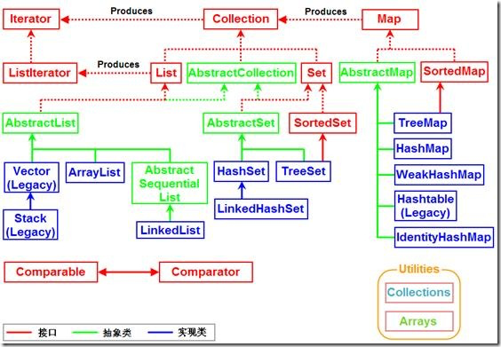

Java集合类是我们JDK学习中的一个典型的入手点，也是让初学者最初感受到Java魅力的地方之一，你一定不会忘记不需要关心大小的`ArrayList`，不用自己实现的`Queue`，和随处可见的`HashMap`。面试中，对Java基础的考察中，集合类和String相关是两个重点，这里集中整理了关于集合类的一些知识点。  

<!--more-->

# 集合类的结构

要求手绘结构图，同时抛出一些简单的线索勾引面试官提问（比如讲HashMap的HashTable的区别）。  

  

# XX和XX的区别

## ArrayList & Vector & LinkedList

* 实现方式：
	* ArrayList、Vector 基于数组实现
	* LinkedList 基于链表实现
* 同步问题：
	* ArrayList、LinkedList 不是线程安全的
	* Vector 是线程安全的，实现方式是在方法上加 synchronized 关键字进行修饰
* 适用场景和性能消耗：
	* ArrayList 和 Vector 基于数组实现，所以随机位置增、删是 O(n) 的时间复杂度，另外可能会出现扩容的问题，也是 O(n) 的时间复杂度
	* LinkedList 不会出现扩容的问题，所以比较适合随机位置增、删。但是其基于链表实现，所以在定位时需要线性扫描，会消耗 O(n) 的时间复杂度
* 扩容：
	* ArrayList默认初始容量为10，**每次扩容为原来的1.5倍**
	* Vactor默认初始容量为10，**默认每次扩容为原来的2倍**（可通过capacityIncrement设置）

## HashMap & HashTable

1. HashMap是非线程安全的，HashTable是线程安全的
2. **扩容机制相同**

## HashMap & TreeMap

1. HashMap实现了Map接口，不保障元素顺序。实现原理balabala
2. TreeMap实现了SortedMap接口，是一个有序的Map。内部采用红黑树实现，红黑树是一种维护有序数据的高效数据结构，但**具体算法没有掌握**

## HashMap & LinkedHashMap

1. HashMap是无序的；如果希望容器按照自定义顺序遍历可使用TreeMap；如果希望按照插入顺序遍历，可使用LinkedHashMap
2. LinkedHashMap是HashMap的一个子类，与HashMap相比，在Entry中增加了before、after两个引用，利用双向链表维护插入顺序

```java
static class Entry<K,V> extends HashMap.Node<K,V> {
    Entry<K,V> before, after;
    Entry(int hash, K key, V value, Node<K,V> next) {
        super(hash, key, value, next);
    }
}
```

## HashSet & HashMap

1. HashMap实现了Map接口，原理balabala
2. HashSet实现了Set接口，实质上封装了一个HashMap。在HashSet封装的HashMap中，entry.key为HashSet的元素（从而保证元素的唯一），entry.value统一指向一个static final的Object对象

---

>参考：  
>[Java集合类: Set、List、Map、Queue使用场景梳理](http://www.cnblogs.com/LittleHann/p/3690187.html)  
>[LinkedHashMap 的实现原理](http://wiki.jikexueyuan.com/project/java-collection/linkedhashmap.html)  
