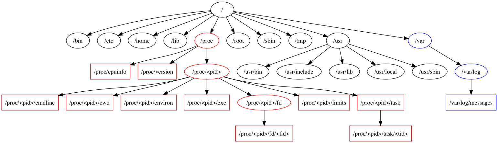

本文以CentOS系统为例，但同样适用于Linux的其他发行版。不需要纠结于具体的版本，**了解设计意图**即可。

<!--more-->

>本文随时更新。除勘误外，不另做批注。

# 概览



>* 圆型节点代指目录，方型节点代指文件。
>* 图中省去了很多不常用的目录与文件。
>* 稍后单独讲`/proc`目录与`/var`目录。

Linux将整个文件系统看做一棵树，这棵树的树根叫做根文件系统，用"/"表示。

| 目录 | 内容 | 举例 |
| :--- | :--- | :--- |
| /bin | 供所有用户使用的完成基本维护任务的命令 | ls, cp |
| /etc | 系统和应用软件的配置文件 | bashrc, passwd |
| /home | 普通用户的家目录 | /home/msh |
| /lib | 系统最基本的共享链接库和内核模块 | libc-2.17.so |
| /root | root用户的家目录 | .bashrc, .ssh |
| /sbin | 超级用户使用的可执行文件，里面多是系统管理命令 | ifconfig, iptables |
| /tmp | 存储临时文件 | |

`/usr`目录的目录结构与根目录相似，但根目录中的文件多是系统级的文件，而`/usr`目录中是用户级的文件，一般与具体的系统无关。

| 目录 | 内容 | 举例 |
| :--- | :--- | :--- |
| /usr/bin | 多数日常应用程序存放的位置 | yum, git |
| /usr/include | C/C++头文件 | ctype.h |
| /usr/lib | 普通用户使用的库文件 | mysql的库文件 |
| /usr/local | 个人安装的软件，通常需要手动指定；与"/usr"目录的目录结构相似 | |
| /usr/sbin | 超级用户不需要的系统管理程序 | useradd |

# 重中之重

## /proc目录

`/proc`目录挂载了一个`虚拟文件系统`，以`虚拟文件`的形式映射系统与进程在内存中的运行时信息。

### 系统信息

`/proc`下的直接子目录通常存储系统信息。猴子常用的只有两个：

| 目录 | 内容 | 举例 |
| :--- | :--- | :--- |
| /proc/cpuinfo | 处理器的相关信息 | physical id、cpu cores、siblings、processor |
| /proc/version | 系统的内核版本号 | Linux version 3.10.0 |

>`/proc/version`确定内核版本号和CPU架构（如i686）；`/etc/centos-release`确定发行版本号（其他发行版类似）。
>
>`uname -a`与`cat /proc/version`的作用类似。

### 进程信息

重点是`/proc/<pid>`目录映射的进程信息。以rsyslogd进程为例：

| 目录 | 内容 | 举例 |
| :--- | :--- | :--- |
| `/proc/<pid>/cmdline` | 启动当前进程的完整命令 | /usr/sbin/rsyslogd-n |
| `/proc/<pid>/cwd` | 当前进程工作目录的软链 | cwd -> / |
| `/proc/<pid>/environ` | 当前进程的环境变量列表 | LANG=zh_CN.UTF-8 |
| `/proc/<pid>/exe` | 启动当前进程的可执行文件的软链 | exe -> /usr/sbin/rsyslogd |
| `/proc/<pid>/fd` | 目录，保存当前进程持有的文件描述符（以软链形式存在，指向实际文件） | 2 -> /dev/null <br/> 6 -> /var/log/messages |
| `/proc/<pid>/limits` | 当前进程使用资源的软限制、硬限制（和单位） | open files（默认软限制1024） |
| `/proc/<pid>/task` | 目录，保存当前进程所运行的每一个线程的相关信息；以`<tid>`作为各线程的目录名，目录结构与`/proc/<pid>`相似 | 1037、1050、1051 |

补充几点：

* `cat /proc/version`查看内核版本号；`cat /etc/centos-release`查看发行版本号（其他发行版类似）。
* 通过ulimit来查看或修改当前进程的资源限制。
* Linux上进程与线程的关系参考[浅谈linux线程模型和线程切换](/2017/11/29/浅谈linux线程模型和线程切换/)。

## /var目录

`/var`目录存放数据文件，如程序数据、日志等；但线上通常只将日志放在`/var`目录。

### 系统日志/var/log/messages

通过rsyslog记录系统级日志，配置文件为`/etc/rsyslog.conf`。重点看`/var/log/messages`的配置：

```conf
# Log anything (except mail) of level info or higher.
# Don't log private authentication messages!
*.info;mail.none;authpriv.none;cron.none                /var/log/messages
```

>`*.info`表示所有服务大于等于info优先级的信息都会记录到`/var/log/messages`中；
`mail.none`表示不记录任何mail的信息到`/var/log/messages`中。

以上配置表示：**除安全认证、邮件、定时任务外，输出到stdout、stderr的info及更高级别的日志记录在`/var/log/messages`中**。

#### OOM kill

猴子利用`/var/log/messages`定位过一次OOM kill问题。

一个用户经常抱怨自己的app提到Yarn后，container各种exit 137然后重试。假设框架不会自己exit 137玩，那么通常137代表container是因为kill -9退出，于是mentor提示猴子可能因为OOM kill。要验证这个想法，至少需要两个证据：

1. 找到container被OOM kill的痕迹。
2. `ExitCodeStatus == 137`对应OOM kill的情况。

>Linux会监控内存使用情况，当内存不足的时候，OOM killer计算进程的优先级，杀死优先级最高的进程释放内存。而Yarn集群普遍会配置资源超发（Linux系统本身也存在内存超发），当集群资源紧张的时候，大container很容易被OOM kill。

证据1很容易，“发现内存不足”、“计算优先级”、“选择进程kill”的过程都会记录在`/var/log/messages`中，猴子确实在用户给定的时间点附近找到了对应container的OOM kill日志，内存也与container申请的资源相近。

证据2结合源码+实验确定`ExitCodeStatus == 137`对应“container被外部kill -9”的情况。通常集群不会被人直接kill -9，可以认为绝大部分外部kill -9都是因为OOM kill。

得证。

>判断过程中存在一些小问题：
>
>* 猴子根据container被OOM kill的时间点和内存判断是否是目标进程，未严格确定。
>* 源码+实验仅能确定`ExitCodeStatus == 137`包括OOM kill的情况，未验证是否存在其他外部kill。
>

# 个人使用时的建议

对于本文的理解，读者不必关心不同发行版本、内核版本之间的区别。

>对，是存在区别的。如：CentOS 6.5可验证得本文即将讲解的目录结构；但CentOS 7.2中，`/bin`等所谓“系统级目录”都被软链到了`/usr/bin`等所谓“用户级目录”。其他发行版如Debian可能差别更大。

如果非要追究的话，一般建议将_所有用户共享的软件安装到`/usr/local`目录_（结构与`/usr`目录相似）下，_将用户私有的软件安装到用户自己的家目录_。

---

>参考：
>
>* [Linux根目录下各子目录的作用](https://github.com/Entiy/bravo/wiki/Linux%E6%A0%B9%E7%9B%AE%E5%BD%95%E4%B8%8B%E5%90%84%E5%AD%90%E7%9B%AE%E5%BD%95%E7%9A%84%E4%BD%9C%E7%94%A8)
>* [深入理解linux系统下proc文件系统内容](http://www.cnblogs.com/cute/archive/2011/04/20/2022280.html)
>
