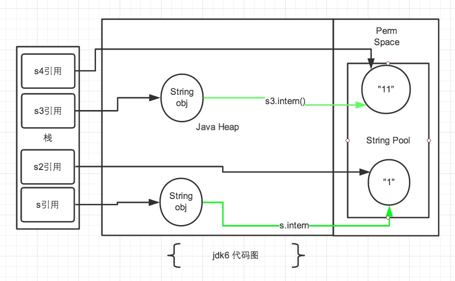
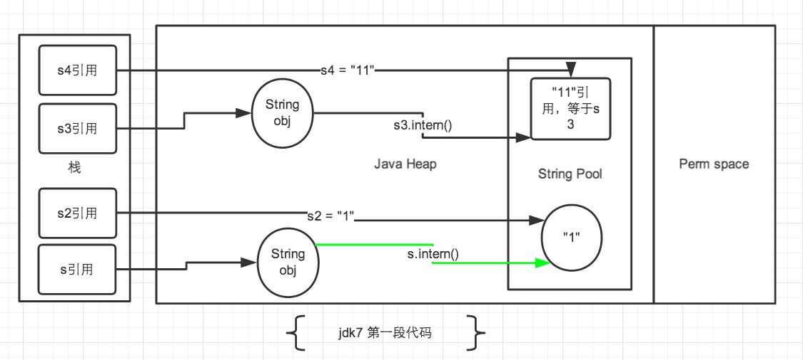
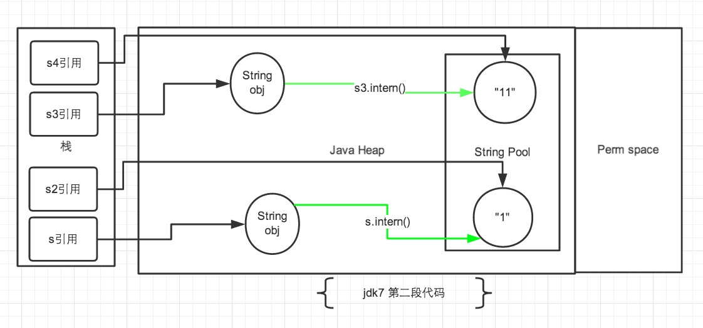

String是Java基础的重要考点。可问的点多，而且很多点可以横向切到其他考点，或纵向深入JVM。

>本文略过了String的基本内容，重点在于String#intern()。

<!--more-->

# String常量池

String常量可能会在两种时机进入常量池：

1. **编译期：通过双引号声明**的常量（包括*显示声明*、*静态编译优化*后的常量，如”1”+”2”优化为常量”12”），在前端编译期将被静态的写入class文件中的“常量池”。该“常量池”会在类加载后被载入“内存中的常量池”，也就是我们平时所说的常量池。同时，*JIT优化*也可能产生类似的常量。
* **运行期：调用String#intern()方法**，可能将该String对象动态的写入上述“内存中常量池”。

时机1的行为是明确的。原理可阅读class文件结构、类加载、编译期即运行期优化等内容。

时机2在jdk6和jdk7中的行为不同，下面讨论。

# String#intern()

>读者可直接阅读参考资料。下述总结仅为了猴子自己复习方便。

## 声明

```java
/** 
 * Returns a canonical representation for the string object. 
 * <p> 
 * A pool of strings, initially empty, is maintained privately by the 
 * class <code>String</code>. 
 * <p> 
 * When the intern method is invoked, if the pool already contains a 
 * string equal to this <code>String</code> object as determined by 
 * the {@link #equals(Object)} method, then the string from the pool is 
 * returned. Otherwise, this <code>String</code> object is added to the 
 * pool and a reference to this <code>String</code> object is returned. 
 * <p> 
 * It follows that for any two strings <code>s</code> and <code>t</code>, 
 * <code>s.intern()&nbsp;==&nbsp;t.intern()</code> is <code>true</code> 
 * if and only if <code>s.equals(t)</code> is <code>true</code>. 
 * <p> 
 * All literal strings and string-valued constant expressions are 
 * interned. String literals are defined in section 3.10.5 of the 
 * <cite>The Java&trade; Language Specification</cite>. 
 * 
 * @return  a string that has the same contents as this string, but is 
 *          guaranteed to be from a pool of unique strings. 
 */  
public native String intern();
```

String#intern()是一个native方法。根据Javadoc，如果常量池中存在当前字符串, 就会直接返回当前字符串. 如果常量池中没有此字符串, 会将此字符串放入常量池中后, 再返回。

## 实现原理

JNI最后调用了c++实现的StringTable::intern()方法：

```cpp
oop StringTable::intern(Handle string_or_null, jchar* name,  
                        int len, TRAPS) {  
  unsigned int hashValue = java_lang_String::hash_string(name, len);  
  int index = the_table()->hash_to_index(hashValue);  
  oop string = the_table()->lookup(index, name, len, hashValue);  
  // Found  
  if (string != NULL) return string;  
  // Otherwise, add to symbol to table  
  return the_table()->basic_add(index, string_or_null, name, len,  
                                hashValue, CHECK_NULL);  
}
oop StringTable::lookup(int index, jchar* name,  
                        int len, unsigned int hash) {  
  for (HashtableEntry<oop>* l = bucket(index); l != NULL; l = l->next()) {  
    if (l->hash() == hash) {  
      if (java_lang_String::equals(l->literal(), name, len)) {  
        return l->literal();  
      }  
    }  
  }  
  return NULL;  
}
```

在the_table()返回的hash表中查找字符串，如果存在就返回，否则加入表。

StringTable是一个**固定大小**的**Hashtable**，默认大小是1009。基本逻辑与Java中HashMap相同，也使用拉链法解决碰撞问题。

既然是拉链法，那么如果放进的String非常多，就会加剧碰撞，导致链表非常长。最坏情况下，String#intern()的性能由O(1)退化到O(n)。

>* jdk6中StringTable的长度固定为1009。
>* jdk7中，StringTable的长度可以通过一个参数`-XX:StringTableSize`指定，默认1009。

## jdk6和jdk7下String#intern()的区别

### 引言

相信很多Java程序员都做类似`String s = new String("abc");`这个语句创建了几个对象的题目。这种题目主要是为了考察程序员对字符串对象常量池的掌握。上述的语句中创建了2个对象：

* 第一个对象，内容"abc"，存储在常量池中。
* 第二个对象，内容"abc"，存储在堆中。

### 问题

来看一段代码：

```java
public static void main(String[] args) {
    String s = new String("1");
    s.intern();
    String s2 = "1";
    System.out.println(s == s2);

    String s3 = new String("1") + new String("1");
    s3.intern();
    String s4 = "11";
    System.out.println(s3 == s4);
}
```

打印结果：

```bash
# jdk6下
false false
# jdk7下
false true
```

具体为什么稍后再解释，然后将`s3.intern();`语句下调一行，放到`String s4 = "11";`后面。将`s.intern();`放到`String s2 = "1";`后面：

```java
public static void main(String[] args) {
    String s = new String("1");
    String s2 = "1";
    s.intern();
    System.out.println(s == s2);

    String s3 = new String("1") + new String("1");
    String s4 = "11";
    s3.intern();
    System.out.println(s3 == s4);
}
```

打印结果：

```bash
# jdk6下
false false
# jdk7下
false false
```

### jdk6的解释



>注：图中绿色线条代表String对象的内容指向；黑色线条代表地址指向。

jdk6中，上述的所有打印都是false。

因为jdk6的常量池放在Perm区中，和正常的Heap（指Eden、Surviver、Old区）完全分开。具体来说：使用引号声明的字符串都是通过编译和类加载直接载入常量池，位于Perm区；new出来的String对象位于Heap（E、S、O）中。拿一个Perm区的对象地址和Heap中的对象地址进行比较，肯定是不相同的。

>Perm区主要存储一些加载类的信息、静态变量、方法片段、常量池等。

### jdk7的解释

在jdk6及之前的版本中，字符串常量池都是放在Perm区的。Perm区的默认大小只有4M，如果多放一些大字符串，很容易抛出`OutOfMemoryError: PermGen space`。

因此，jdk7已经将字符串常量池从Perm区移到正常的Heap（E、S、O）中了。

>Perm区即永久代。本身用永久代实现方法区就容易遇到内存溢出；而且方法区存放的内容也很难估计大小，没必要放在堆中管理。jdk8已经取消了永久代，在堆外新建了一个Metaspace实现方法区。

正是因为字符串常量池移到了Heap中，才产生了上述变化。

#### 第一段代码



先看s3和s4：

* 首先，`String s3 = new String("1") + new String("1");`，生成了多个对象，**s3最终指向堆中的"11"**。注意，此时常量池中是没有字符串"11"的。
* 然后，`s3.intern();`，将s3中的字符串"11"放入了常量池中，因为此时常量池中不存在字符串"11"，因此常规做法与跟jdk6相同，在常量池中生成一个String对象"11"——然而，jdk7中常量池不在Perm区中了，相应做了调整：常量池中不需要再存储一份对象了，而是直接存储堆中的引用，也就是s3的引用地址。
* 接下来，`String s4 = "11";`，"11"通过双引号显示声明，因此会直接去常量池中查找，如果没有再创建。发现已经有这个字符串了，也就是刚才通过`s3.intern();`存储在常量池中的s3的引用地址。于是，直接返回s3的引用地址，**s4赋值为s3的引用，s4指向堆中的"11"**。
* 最后，s3、s4指向的堆中的"11"，常量池中存储s3的引用，满足`s3 == s4`。

再看s和s2：

* 首先，`String s = new String("1");`，生成了2个对象，常量池中的"1"和堆中的"1"，**s指向堆中的"1"**。
* 然后，`s.intern();`，上一句已经在常量池中创建了"1"，所以此处什么都不做。
* 接下来，，`String s2 = "1";`，常量池中有"1"，因此，**s2直接指向常量池中的"1"**。
* 最后，s指向的堆中的"1"，s2指向常量池中的"1"，常量池中存储字符串"1"，不满足`s == s2`。

#### 第二段代码



先看s3和s4，将`s3.intern();`放在了`String s4 = "11";`后：

* 先执行`String s4 = "11";`，此时，常量池中不存在"11"，因此，将"11"放入常量池，然后**s4指向常量池中的"11"**。
* 再执行`s3.intern();`，上一句已经在常量池中创建了"11"，所以此处什么都不做。
* 最后，s3仍指向的堆中的"11"，s4指向常量池中的"11"，常量池中存储字符串"11"，不再满足`s3 == s4`。

再看s和s2，将`s.intern();`放到`String s2 = "1";`后：

* 先执行`String s2 = "1";`，之前已通过`String s = new String("1");`在常量池中创建了"1"，因此，**s2直接指向常量池中的"1"**。
* 再执行`s.intern();`，常量池中有"1"，所以此处什么都不做。
* 最后，s指向的堆中的"1"，s2指向常量池中的"1"，常量池中存储字符串"1"，仍不满足`s == s2`。

### 区别小结

jdk7与jdk6相比，对String常量池的位置、String#intern()的语义都做了修改：

* 将String常量池从Perm区移到了Heap区。
* 调用String#intern()方法时，堆中有该字符串而常量池中没有，则直接在常量池中保存堆中对象的引用，而不会在常量池中重新创建对象。

## 使用姿势

>建议直接阅读参考资料。

# 额外的问题

String#intern()的基本用法如下：

```java
String s1 = xxx1.toString().intern();
String s2 = xxx2.toString().intern();
assert s1 == s2;
```

然而，`xxx1.toString()`、`xxx2.toString()`已经创建了两个匿名String对象，这之后再调用String#intern()。那么，**这两个匿名对象去哪了**？

>估计猴子对创建对象的过程理解有问题，或许`xxx1.toString()`返回时还没有将对象保存到堆上？或许String#intern()上做了什么语法糖？
>
>后面有时间再解决吧。。。

---

>参考：
>
>* [深入解析String#intern](http://tech.meituan.com/in_depth_understanding_string_intern.html)
