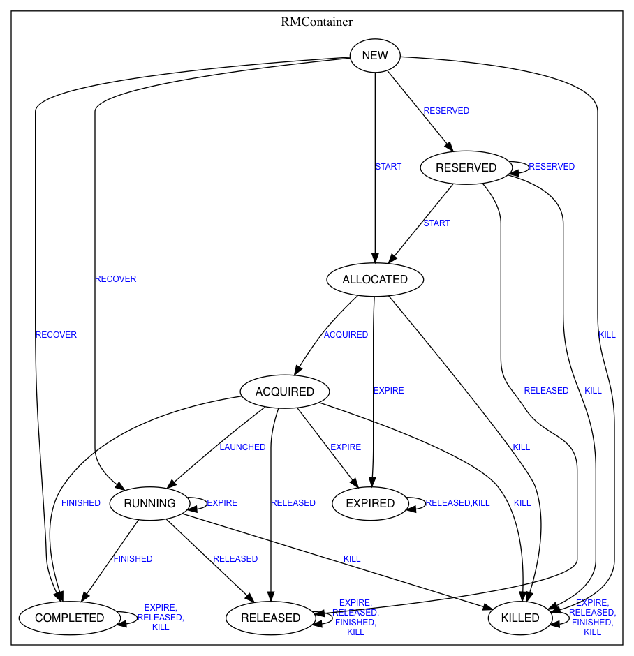
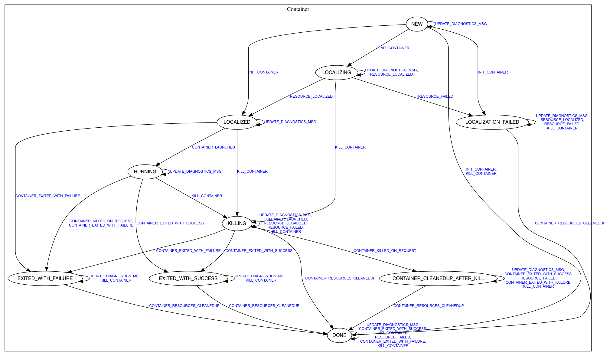

上次介绍了[源码|Yarn的事件驱动模型与状态机](/2018/11/20/源码|Yarn的事件驱动模型与状态机/)，今天看个小例子——Container启动流程，巩固对Yarn分布式模型和事件驱动并发模型的理解。

<!--more-->

值得庆幸的是，尽管状态机模型设计复杂，但一旦设计（最好能证明）完成，就自然的解决了很多分布式和并发上的一致性问题，因此，对Yarn源码的学习不会像HDFS一样冗长枯燥，往往顺着状态机看几个关键流程即可。

>源码版本：Apache Hadoop 2.6.0

# 一、RM上的过程：准备Container

1. 收到AM的心跳请求，立即响应。
2. 根据资源和负载选择NM（两种资源策略？？？）。
3. 创建RMContainer状态机，`NEW`状态。
4. 发送`START`事件，转到`ALLOCATED`状态（表示该container已被分配，但未通知AM）。
5. 在**下一次AM心跳响应中返回已分配的container**（即，异步分配）。
6. 发送`ACQUIRED`事件，转到`ACQUIRED`状态（表示该container已通知AM）。

# 二、AM上的过程：拿到Container，通知NM启动

1. 收到心跳响应中的已分配container。
2. 通知NM启动该container。

# 三、NM上的过程：实际启动Container

>NM上的Container、资源等也有类似状态转换过程，以下描述忽略。

1. NM收到AM的启动指令。
2. 创建Container状态机、初始化资源等（资源也通过状态机管理）。
3. ContainerLaucher服务收到`LAUNCH_CONTAINER`事件。
4. 将待运行container所需的环境变量、运行命令等写入`launch_container.sh`脚本。
5. 启动ContainerMonitor，监控container的内存资源（超过配额就kill。CPU配合通过cgroup控制。）。
6. 将启动`launch_container.sh`脚本的命令写入`container_executor.sh`脚本（**防止变量展开、特殊符号转义等**）。
7. 启动`container_executor.sh`脚本。
8. 在`NM->RM`的心跳请求中异步汇报已启动的container。

# 四、回到RM：首尾

1. 收到NM心跳中的汇报。
2. 向RMContainer状态机发送`LAUNCHED`事件，转到`RUNNING`状态。
