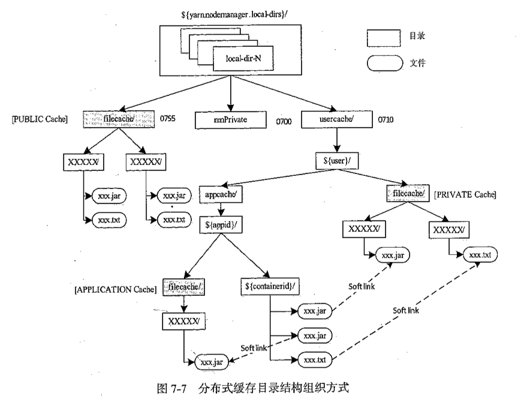

再来个小例子——Container资源下载流程，帮助理解[源码|Yarn的事件驱动模型与状态机](/2018/11/20/源码|Yarn的事件驱动模型与状态机/)。

<!--more-->

>源码版本：Apache Hadoop 2.6.0

# 三个资源等级

在Yarn中，资源也被称为分布式缓存，根据可见性分为三个等级：

* `PUBLIC`：节点上所有用户共享。
* `PRIVATE`：节点上同一用户的所有app共享。
* `APPLICATION`：节点上同一app的所有container共享。

各资源的存储结构如下：

可以看到，目录结构对应了资源的可见性。

所有资源最终为contaienr所用，container在自己的`${containerId}/`目录下通过软链访问各等级的资源。

# 过程

**PUBLIC资源由`ResourceLocalizationService`下的`PublicLocalizer`下载**；**PRIVATE、APPLICATION资源也经过ResourceLocalizationService服务，但最终由各container独立的`ContainerLocalizer`下载**。

假设PUBLIC、PRIVATE资源已下载，现在用户启动一个新app，下载APPLICATION资源的过程如下：

1. ResourceLocalizationService服务收到`INIT_APPLICATION_RESUOURCE`事件。
2. 为每个资源创建`LocalResourceTracker`。
3. LocalResourceTracker创建`LocalizedResource`状态机，以跟踪资源的生命周期。
4. 如果需要下载，则LocalizedResource状态机向ResourceLocalizationService发送事件通知下载，转到`DOWNLOADING`状态。
5. ResourceLocalizationService发现不是PUBLIC资源，为每个container创建`LocalizerRunner`线程。
6. LocalizerRunner线程创建ContainerLocalizer客户端下载资源。
