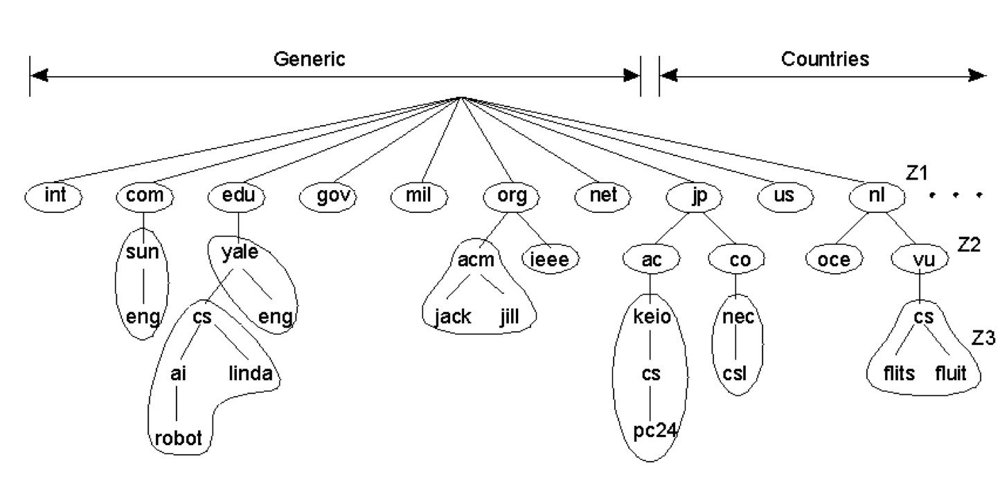

一般，分布式系统需要支持以下特性：

* 资源共享
* 开放性
* 并发性
* 可伸缩性
* **容错性**
* **透明性**

<!--more-->

下面分别讨论。

# 容易理解的

## 资源共享

一旦授权，可以访问环境中的任何资源。

>资源：包括硬件(e.g. printer, scanner, camera)、软件（服务）、数据(file, database, web page)	。

如资源管理器控制资源的访问：

* 提供命名机制
* 控制并发访问

## 开放性

新共享资源添加并被各种客户程序使用的（难易）程度。

如支持异构资源的添加和使用：

* 提供统一的通信机制
* 发布访问共享资源的接口

## 并发性

分布系统中的各个组成部分可以在并发的过程中被执行。

如：

* 多个用户同时访问（和更新）资源
* 多个服务进程同时运行，相互协作

>资源定义同上。

## 可伸缩性

>主要强调“伸”；偶尔也强调“缩”。

在资源和用户数较大增长的情况下，系统性能仍能维持甚至提高。

通常表现为：

* 利用网络环境可以为更多的用户服务、而且响应更快
* 通常通过增加更多/更快的处理器，能实现更可靠、更完善的服务

如：

* DNS的解析：一方面，不仅可以为每个根域名设置单独的服务器，还可以为访问量大的二级、更多级域名也单独设置服务器；另一方面，当访问量变小时，还可以将多个访问量小的根域名的解析合并到一台服务器上。

# 不容易理解的

## 容错性

错误发生时，系统能够继续工作的能力。

>基于这样一个假设：硬件、软件、网络的错误不可避免。

要容错，就要先知道有哪些错误（故障），再针对故障类型一一解决。

### 故障类型

分布式系统中的典型故障如下：

| 故障类型 | 说明 |
|:-- |:-- |
| 崩溃性故障 | 服务器停机，但是在停机之前工作正常 |
| 遗漏性故障 | 服务期不能响应到来的消息。包括不能接受、不能发送 |
| 定时故障 | 服务器的响应在指定时间间隔之外 |
| 响应故障 | 服务期的响应不正确。包括响应的值错误、偏离了正确的控制流 |
| 随意性故障 | 服务器可能在随意的时间产生随意的响应 |

其中，随意性故障是最严重的故障，也被称为`拜占庭故障`。当发生故障时，服务器可能产生它从来没有产生过的输出，但是又不能检测出错误。更坏的情况是，发生故障的服务器恶意的与其他服务器共同工作来产生恶意的错误结果。

### 容错方案

如果系统是容错的，那么它能做的最好的事情就是对其他进程隐藏故障的发生。由于故障无法避免，我们只能依靠冗余来掩盖故障，包括：

* 信息冗余：添加额外的位可以监测出错误位甚至纠正。如在数据中增加checksum等。
* 时间冗余：执行一个动作，如果需要就再次执行。如事务、超时重传等。
* 物理冗余：添加额外的设备或进程使系统作为一个整体来容忍部分组件的故障。如HDFS的多备份、HA等等。

>部分书籍将物理冗余与软件冗余分开，本质上无法完全分开，因为软件冗余可能在部署在单机或多机上。这里将二者统一为物理冗余。

则针对各故障，可取的主要解决方案为：

* 崩溃性故障——时间冗余、物理冗余
* 遗漏性故障——物理冗余
* 定时故障——时间冗余、物理冗余
* 响应故障——信息冗余、时间冗余、物理冗余
* 随意性故障——信息冗余、时间冗余、物理冗余

## 透明性

网络环境对于用户和应用程序而言，应该是一个整体，而不是一个互相协作的简单的构件集合。包括多项性质：

* 位置透明性：用户不必关心对象位于何处。
    * 如DNS、Consul等分布式命名系统。
* 重定位透明性：对象的位置可以变化而不影响对它的调用。
    * 仍然如DNS、Consul等。
* 迁移透明性：系统内部可以迁移对象的位置。
    * 仍然如DNS、Consul等。
* 访问透明性：可用一致的方式访问不同类型的机器上的对象。
    * 如Yarn、Mesos等分布式资源调度系统。
* 持久透明性：对象所处的状态既可以是活动的，也可以是静止的。
    * 如HBase的WAL，计算机中的cache、段表、页表等。
* 失败透明性：屏蔽被访问对象的失败及恢复过程 （容错）。
    * 如MapReduce、Spark等分布式计算框架。
* 事务处理透明性：与事务处理相关的调度、监控和恢复。
    * 如2PC等分布式事务协议。
* 复制透明性：用户不知道有多少个对象副本存在。
    * 如HDFS、Tair等分布式存储系统。

>位置透明性、迁移透明性、重定位透明性是对命名系统的基本要求。
