Chrome是我最喜欢的浏览器。上次写FQ教程的时候，有读者注意到了我的Chrome皮肤：  
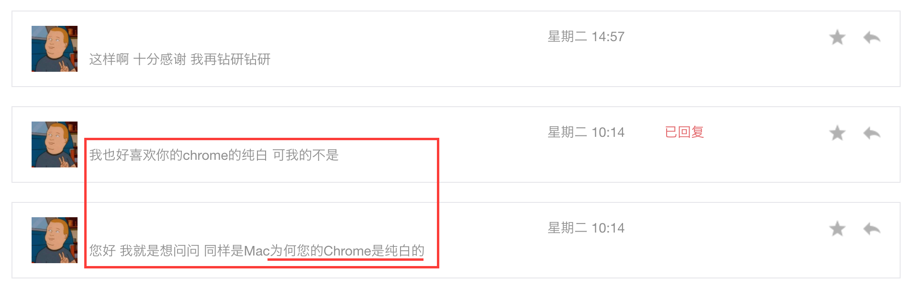  
因为我使用了一款简洁而优雅的Chrome皮肤：  
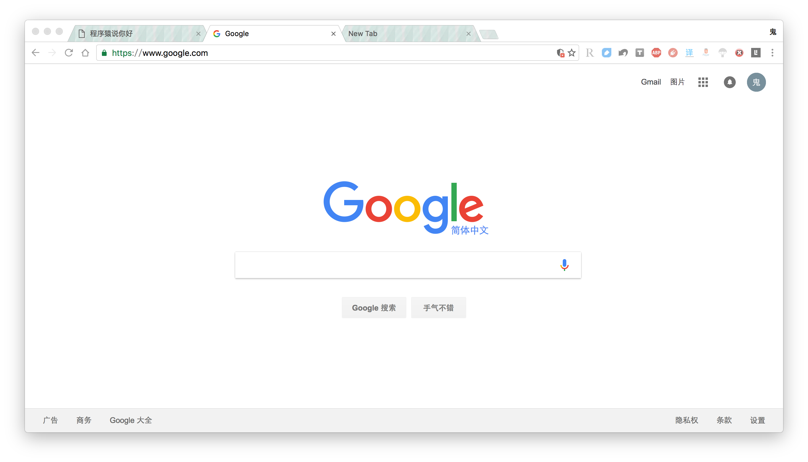  

<!--more-->

这款皮肤十分简单：主体色调和焦点标签是干净的纯白色，非焦点标签是一种大理石纹理的淡蓝色。稍后会给出下载链接。  
本文就跟大家分享我心中最精致的浏览器：  

 

Chrome

   

**简洁的设计、极致的速度、海量的插件、绚丽的皮肤，堪称居家旅行、装逼耍酷的不二选择**。  

# 设计
设计方面见仁见智。我一直崇尚极简主义，比如Google首页，比如Gmail，比如Chrome，还有我手中的Mac。**简洁就是简单，简洁就是一切**。  
# 速度
相信对于大部分用户而言，速度是选择一款浏览器的首要标准。面对浏览器速度之王Chrome，市场的反应与我们的直觉是对应的：  
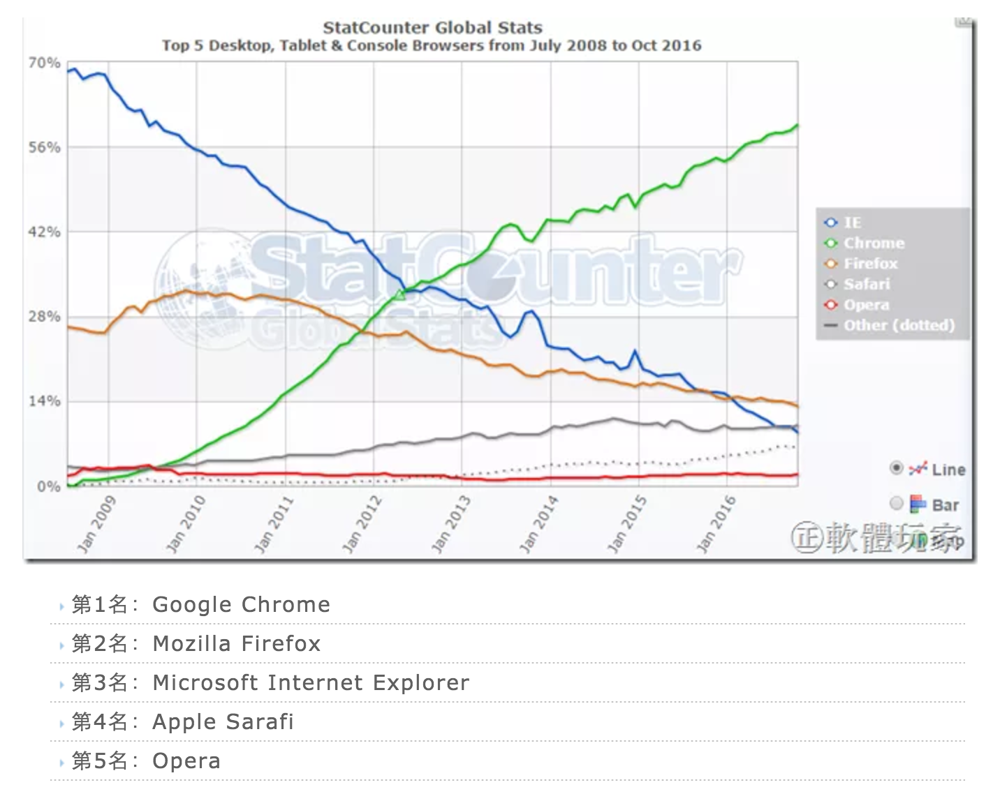  
不过我要说的是——**只要速度差别不明显，没必要死盯着那么一点差距，我们还有诗和远方**。  
撇开IE（包括Edge）不谈，排名前三的浏览器分别是Chrome、Firefox和Safari。这三款浏览器的速度差别很小，Firefox只是启动速度慢（的不能忍）——而国内大部分浏览器都使用了Chrome的内核，甚至直接封装了Chromium（Chrome的开源版本），再加上各种内置的流氓插件，还有恶心的全家桶系列，速度一定比Chrome慢——不信？**安装几款国内的浏览器，打开淘宝首页，或者12306抢个票，实际感受一下吧**。如果打了我的脸，，，麻烦轻一点。  
回到这三款浏览器的选择上，操作系统已经帮我们过滤了一次：  

* Windows系统的Chrome、Firefox支持力度大
* Linux系统是Firefox的天下
* macOS系统则只能从Chrome、Safari中选择

Chrome和Firefox的插件支持极其丰富，Safari...建议放弃插件，Mac用户太少插件开发不给力。剩下还需要犹豫吗？**看我的文章当然要选Chrome**！  

>小科普：  
影响浏览器速度的主要是浏览器内核，多指渲染引擎。目前最主流的是Google的Blink内核（也称为Chromium内核），但Blink实际上fork自Apple开源的Webkit内核，当然目前两款内核差别已经非常大。Chrome使用了Blink内核，Safari使用了Webkit内核，iOS和Android内置浏览器则均使用了Webkit内核。所以不要总说我水果闭源不良心，毕竟每次开源一个产品，整个开源世界都颤抖了。  
与这两款内核齐名的便是Mozilla联盟的Gecko内核，主要由Firefox使用，也是开源的。  

# 插件
Chrome的优秀之处不仅体现在其简洁的设计和极致的速度，海量的插件（也就是扩展extension）是最吸引我的一点。下面从我长期使用的插件中选择一部分简单介绍，权做抛砖引玉，希望朋友们将你们喜欢的优秀插件推荐给我。  
在介绍时，安装或下载链接统一附在该类插件介绍的末尾，下载链接的安装方法计划在下一篇教程整理，莫急，莫急。  

 

多图，高能预警！

   

## 基本之上的基本需求
### 广告屏蔽
插件入门必选的是什么？广告屏蔽类。  
`Adblock Plus`是广告屏蔽插件中的No.1，横跨Chrome、Firefox、Safari三大浏览器，`超过5000万人使用，免费的广告拦截器，可阻止所有烦人的广告及恶意软件和跟踪`。完全阻止所有的广告是不可能的，毕竟屏蔽规则更新的速度绝对比广告慢，比如百度搜索页面广告的屏蔽效果一直不好。  
所以就需要另一款专治百度的插件，`屏蔽百度推广`，可彻底`屏蔽百度搜索页面上含有的商业推广等广告`，于是被**强制下架了**。不过github还在，安装方法见后。  
[Adblock Plus](https://chrome.google.com/webstore/detail/adblock-plus/cfhdojbkjhnklbpkdaibdccddilifddb)  
[屏蔽百度推广](https://github.com/zhangyazhong/baidu-adblock)  

>注：  
>
>* Adblock Plus只能“屏蔽”广告，也就是说，**视频广告不播放，但时间还是要等**，*想跳过广告的继续看*。
>* **是“Adblock Plus”，不是“Adblock”**。后者已经被收购并被我猿发现窃取用户隐私，被猿族彻底封杀，才重新推出来“Adblock Plus”。
>

### 禁止Flash

>如果你同我一样，使用的是**55.0以上版本的Chrome**，那么这类插件就不再需要，可以直接跳过。  

由于Flash技术在性能、安全上的落后，Chrome和Flash的老爸Adobe都宣布要放弃它了。乔帮主更是从始至终瞧不上Flash，Mac系列产品不对Flash做任何优化，一旦打开Flash，Mac将瞬间变成冬天的小暖宝。安全问题更加严重，Adobe Flash的安全事故从来没有间断过。国际上大部分主流网站都已经用HTML5取代了Flash，但国内网站的尿性啊，受不了啊，进度慢成一坨屎啊。目前仍在大量使用Flash的主要是视频广告和不思进取的音视频网站。目前Chrome已经默认禁止Flash了，想必各大网站很快就不得不改进了。  
总之，对于老版的Chrome浏览器和已经用了2年3年的笔记本，默认禁止Flash是更好的选择。`Flashcontrol`可以实现这个功能，禁止后，浏览器性能大幅提升，电脑耗电情况改善，Flash一起的安全问题也彻底消除；同时，点击禁止区域仍然可以在该处暂时启用Flash，从而兼容不思进取的网站。  
对于某些支持HTML5却不默认启用的视频网站，`妈妈再也不用担心我的macbook发烫了计划2.0Beta`（别误会，名字就是这么长）可以强制启用，Windows、Linux也可以使用（JS实现），**直接跳过广告哦**~  
[Flashcontrol](https://chrome.google.com/webstore/detail/flashcontrol/mfidmkgnfgnkihnjeklbekckimkipmoe?hl=zh-CN)  
[妈妈再也不用担心我的macbook发烫了计划2.0Beta](http://zythum.sinaapp.com/youkuhtml5playerbookmark/)  
## 效率
### 自动翻页
Google搜索后不想一次次的点击“下一页”翻页？浏览贴吧时希望在一页里展示所有内容？`AutoPagerize`的自动翻页功能满足你：支持大部分翻页模式，当焦点滚动到页面底部时，它会自动加载下一页，并衔接在当前页内容之下。  
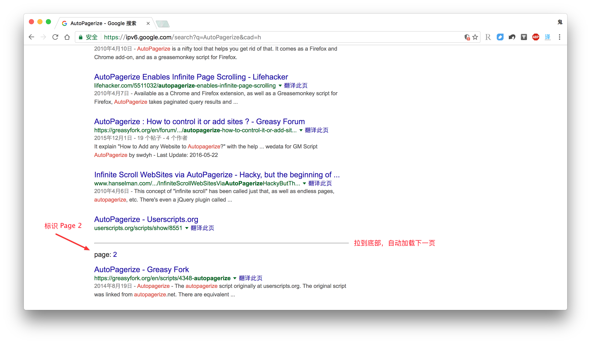  
[AutoPagerize](https://chrome.google.com/webstore/detail/autopagerize/igiofjhpmpihnifddepnpngfjhkfenbp?hl=zh-CN)  
### 撤销关闭的标签
浏览网页时最怕的是什么？*手抖关错了标签页*。`SimpleUndoClose`插件可以撤销关闭的标签，**拥抱手抖，拥抱后悔**。撤销数量几乎无上限，点击图标可选择要撤销的已关闭标签:  
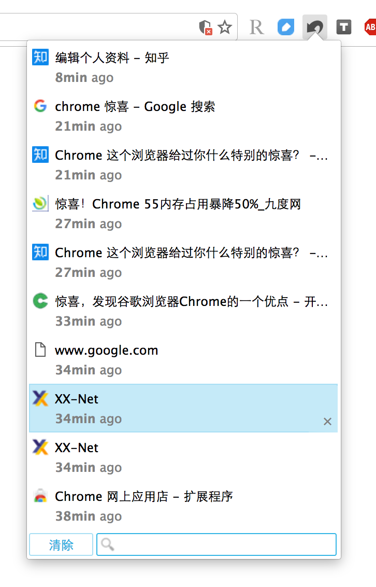  
还可以设置快捷键:  
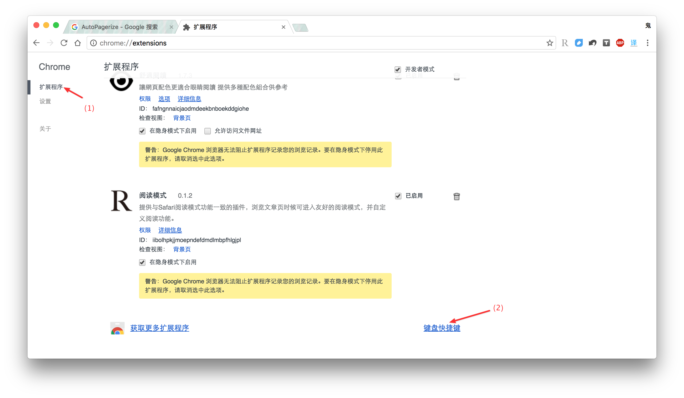  
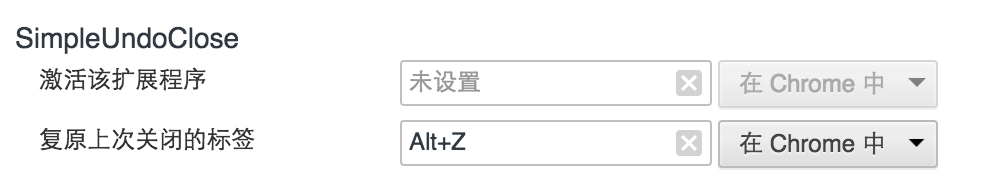  
设置个Alt+Z什么的，自动撤销关闭的上一个标签，就像Ctrl+Z撤销误删一样。  
[SimpleUndoClose](https://chrome.google.com/webstore/detail/simpleundoclose/emhohdghchmjepmigjojkehidlielknj?hl=zh-CN)  
### 表单历史记录
自动保存在表单（比如输入框）的输入历史，下次输入可以直接点击输入框，在历史中选择，省去重复输入的麻烦：  
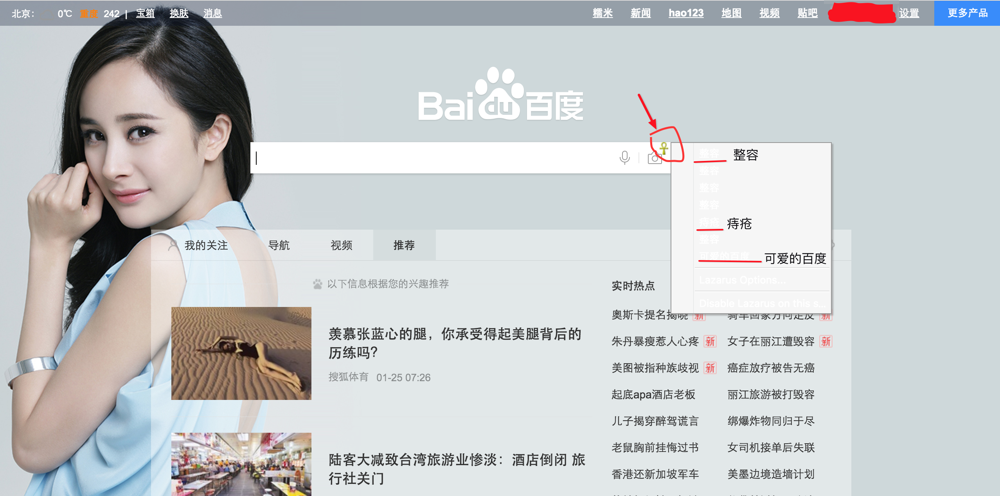  
（来看看我家大幂幂）  
[Lazarus: Form Recovery](https://chrome.google.com/webstore/detail/lazarus-form-recovery/loljledaigphbcpfhfmgopdkppkifgno?hl=zh-CN)  
### 预览网页
刚开始用Mac的时候，一直没有从Safari迁移回Chrome的原因之一就是Safari的预览。现在用iPhone with 3D-touch的朋友应该知道这个功能，在Safari的链接上重按，会在小窗口打开链接内容，这就是链接的预览（还有照片的预览，视频的预览，文档的预览等）。直到我在Chrome中发现这款插件，`Preview It`，当鼠标停留在链接上时，按“w”建，和Safari预览相似，会在侧面的小窗口打开链接。不同的是，Preview It可以让你同时在多个窗口预览多个链接，cool：  
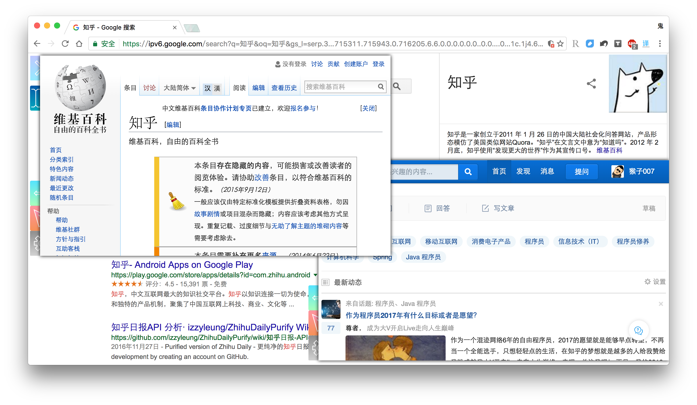  
[Preview It](https://chrome.google.com/webstore/detail/preview-it/hlnfkjhomcppkfeioacmjjenhlgcbflj)  
### 查找特定标签
这个几乎是妹子最爱啊——每次买衣服是不是要打开超多的标签页，淘宝、唯品会、蘑菇街、美丽说balabala的，然后就忘记哪件衣服好看了吧哈哈哈！`Tabio`可以在当前打开的所有标签中按照标签名搜索：  
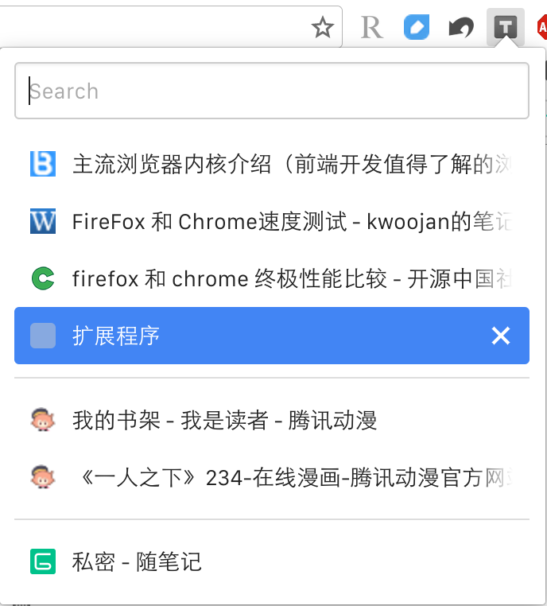  
这样就能打开一次性看更多衣服了有木有！我竟然如此暖心，就问你满不满足！当然，这更是程序猿查找资料的一大利器，墙裂推荐！  
[Tabio](https://chrome.google.com/webstore/detail/tabio/bgbhfmeabcmpjblimfddkeikogidjhao)  
### 页内正则搜索
这个有点专业了哈，支持正则表达式，可代替内置查找功能。建议设置快捷键。  
[Regex Search](https://chrome.google.com/webstore/detail/regex-search/bcdabfmndggphffkchfdcekcokmbnkjl)  
### 翻译
不同于常规的全文翻译或划词翻译，`有道智能翻译 by PUBU.IM`支持专家、进阶、入门、全文四个难度的选择。部分页面可直接触发，没有触发又需要翻译的可点击图标触发。  
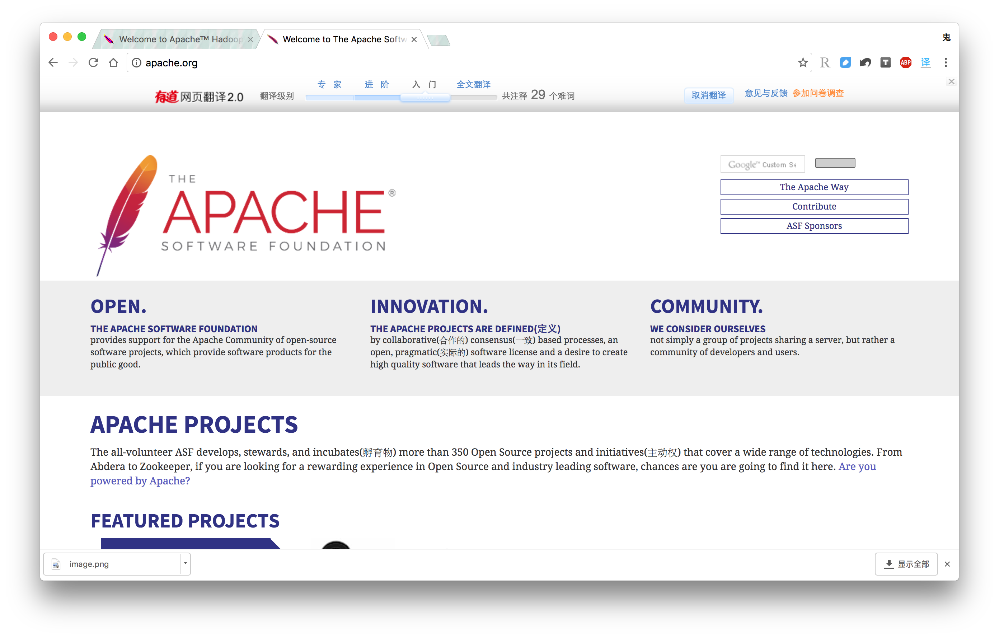  
[有道智能翻译 by PUBU.IM](https://chrome.google.com/webstore/detail/%E6%9C%89%E9%81%93%E6%99%BA%E8%83%BD%E7%BF%BB%E8%AF%91-by-pubuim/chpeaiibggkmaongjphijmielpkokcdg)  
### 右键搜图
大部分浏览器都支持选中文本后，右键中提供选项直接搜索。对于各位老司机，查图是必备的功能，Google的图片搜索也比百度强大的没边了，以后只需要在图片上右键，就会弹出选项可直接查图。  
[Search by Image (by Google)](https://chrome.google.com/webstore/detail/search-by-image-by-google/dajedkncpodkggklbegccjpmnglmnflm)  
### 图片批量下载
可下载页面中的全部图片，根据大小筛选：  
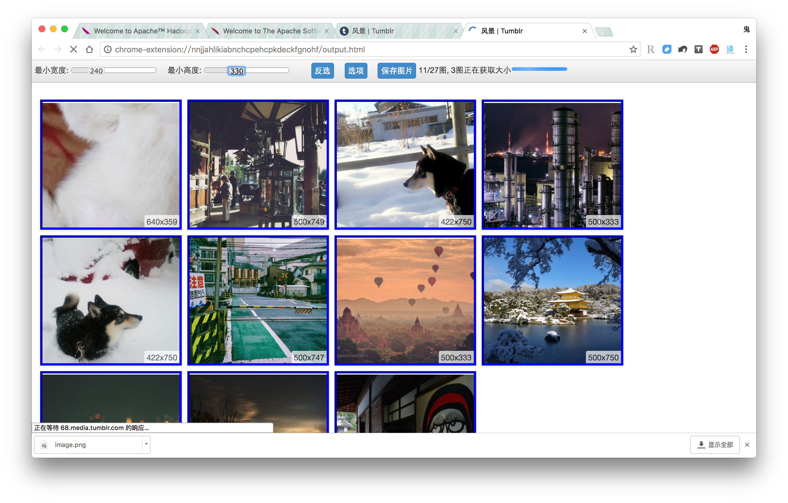  
图片来自Tumblr。  
[Fatkun图片批量下载](https://chrome.google.com/webstore/detail/fatkun-batch-download-ima/nnjjahlikiabnchcpehcpkdeckfgnohf?hl=zh-CN)  
### 网页截图
网页截图的需求就不需要解释了，`Full Page Screen Capture`的特点是萌，因为它截图时是这样的：  
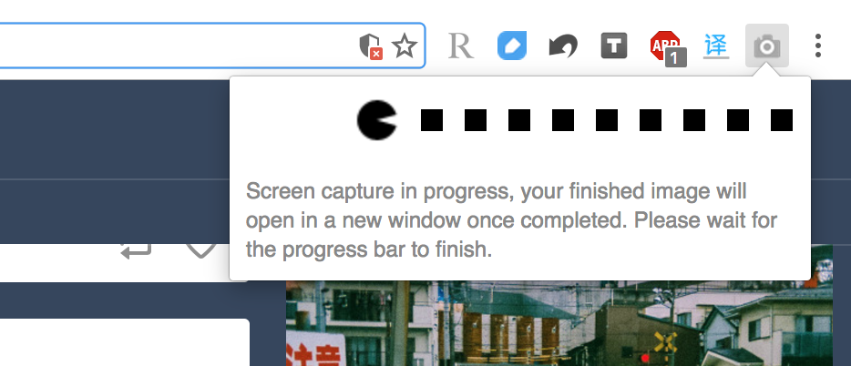  
[Full Page Screen Capture](https://chrome.google.com/webstore/detail/full-page-screen-capture/fdpohaocaechififmbbbbbknoalclacl?hl=zh-CN)  
### 网购
网购我不是很在行，每次都是明确决定要买什么才开始逛。而朋友S是网购小王子，智商爆表，快速学习能力出众。后来被他推荐了一些网购插件，我最终选择了两个插件配合使用，可以在每个商品详情页同时显示当前网站的历史价格和其他电商网站的实时价格：  
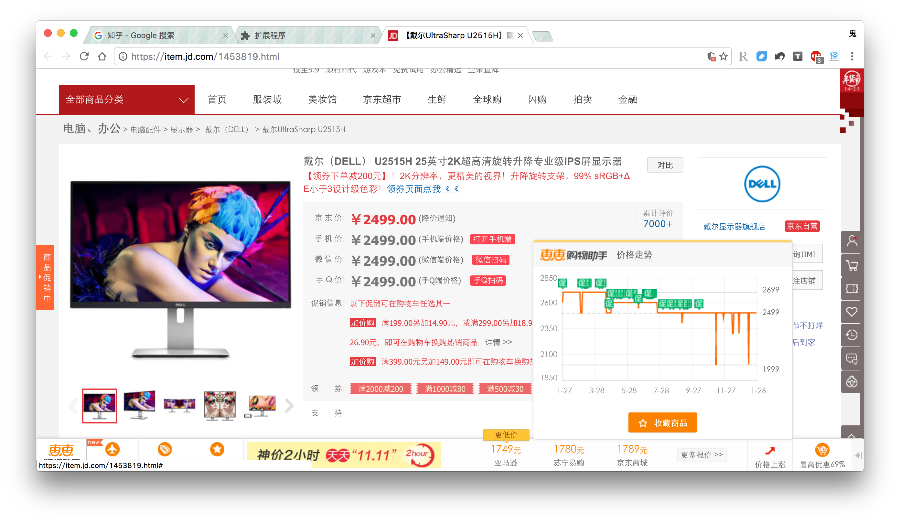  
[一起惠一键购物助手](https://chrome.google.com/webstore/detail/%E4%B8%80%E8%B5%B7%E6%83%A0%E4%B8%80%E9%94%AE%E8%B4%AD%E7%89%A9%E5%8A%A9%E6%89%8B/jjcbbdnfiapchhkemifphepfgilhdokf?hl=zh-CN)  
[惠惠购物助手](https://chrome.google.com/webstore/detail/%E6%83%A0%E6%83%A0%E8%B4%AD%E7%89%A9%E5%8A%A9%E6%89%8B/ohjkicjidmohhfcjjlahfppkdblibkkb?hl=zh-CN)  
## 其他工具
### 阅读模式
这两款插件用于改善阅读体验。  
`阅读模式`打开之前，只这样的：  
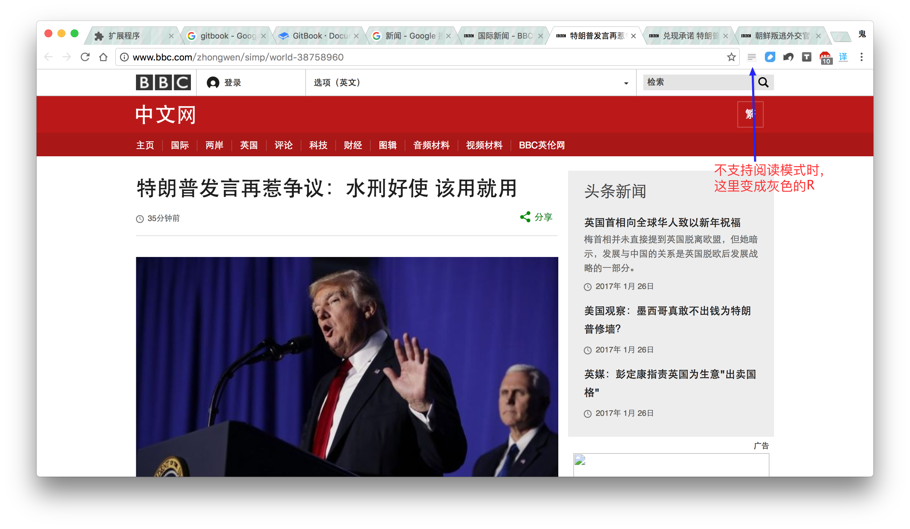  
无比纷杂。打开之后，所有文章以外的无关内容都将被自动消除，并优化排版：  
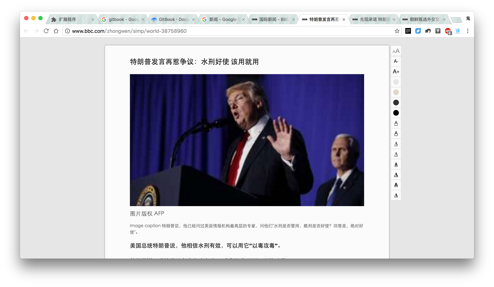  
还可以在右侧对文字、颜色等进行简单的设置。  
`舒适阅读`则是从色彩搭配方面做出改变，可以在几种配色中自由选择文字和背景的颜色：  
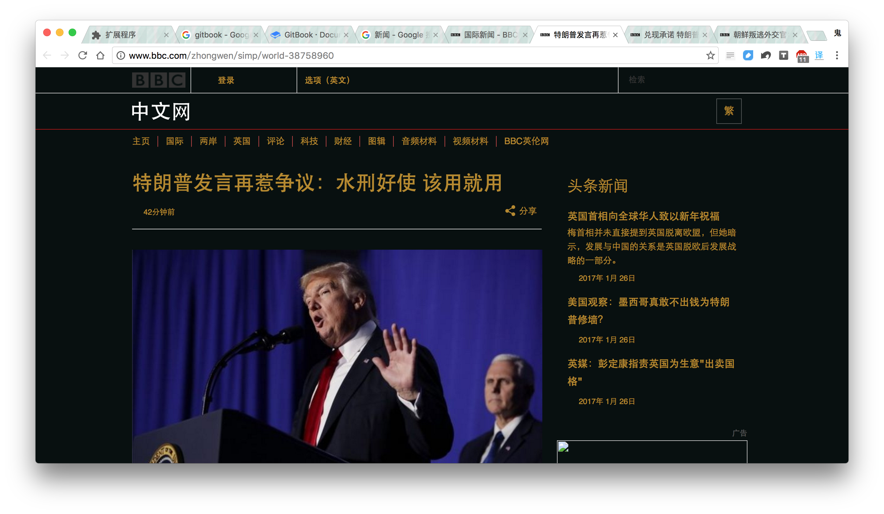  
不过这个插件我个人使用不多，阅读时不喜欢太嘈杂的配色，*简简单单的白底黑字就非常完美*。  
[阅读模式](https://chrome.google.com/webstore/detail/reader-view/iibolhpkjjmoepndefdmdlmbpfhlgjpl)  
[舒適閱讀](https://chrome.google.com/webstore/detail/%E8%88%92%E9%81%A9%E9%96%B1%E8%AE%80/fafngnnaicjaodmdeekbnboekddgiohe)  
### 有道笔记剪藏
Evernote笔记讲道理还是太贵了，，，虽然真的好用啊好用啊~所以我主要还是在阉割版Evernote——有道云笔记上整理笔记。效果一般，但大体上也能满足需要。如果预算允许，花点钱用Evernote吧。  
[有道云笔记网页剪报](https://chrome.google.com/webstore/detail/%E6%9C%89%E9%81%93%E4%BA%91%E7%AC%94%E8%AE%B0%E7%BD%91%E9%A1%B5%E5%89%AA%E6%8A%A5/joinpgckiioeklibflapokicmndlcnef?hl=zh-CN)  
### aria2
是不是感觉电脑（包括Windows、macOS）上百度云客户端下载东西越来越慢了？国内网盘面临政策和盈利问题，乌压压倒了一片，活下来的也是风声鹤唳，而百度通过限速、提价等手段，再加上常年维持的良好政府关系，总算活了下来。百度云2T的空间，配合aria2系列的插件，便可以既享受百度云的大容量，又不受百度云的速度限制。  
但是实际操作有点复杂，下次再写篇专门的教程。  
[Aria2c Integration](https://chrome.google.com/webstore/detail/aria2c-integration/cnkefpcjiolhnmhfpjbjpidgncnajlmf)  
[网盘助手](https://github.com/acgotaku/BaiduExporter)  
### 强制打开复制
来，你打开[360文档](http://www.360doc.com/content/15/0829/20/22778304_495661449.shtml)复制一下，就知道什么用了。  
[Enable Copy](https://chrome.google.com/webstore/detail/enable-copy/lmnganadkecefnhncokdlaohlkneihio)  
### 重定向百度搜索
自动重定向百度搜索到你设置的其他搜索，从此彻底告别百度。  
[bdblock](https://chrome.google.com/webstore/detail/bdblock/diijljokmmpbelimjepfnjnhomjfkmie?hl=zh-CN)  
### 改变浏览器UA
简单理解，UserAgent（简称UA）标识了浏览器的设备、版本等信息，比如修改UA为Android KitKat，就可以在电脑版Chrome上自动访问Android移动版的网站。虽然PC端显示移动端网页的效果是很傻的，但某些特殊场景——比如京东移动端的优惠，就可以无缝切换，十分方便。  
[User-Agent Switcher for Chrome](https://chrome.google.com/webstore/detail/user-agent-switcher-for-c/djflhoibgkdhkhhcedjiklpkjnoahfmg)  
### 支持IE
顾名思义，一键将当前标签页转换为IE模式，帮助你彻底告别IE（和Edge）。  
[IE-On-Chrome](https://chrome.google.com/webstore/detail/ie-on-chrome/kmomimblkpkjeilfbkinoonalgiejlcl)  
### Markdown写作
博客上的文章直接支持Markdown格式，但微信公众号不支持。我通过`Markdown Here`实现了曲线救国：在任意输入框中直接编辑Markdown文本，最后触发Markdown Here插件，自动完成Markdown文本的渲染。同理，Markdown Here在支持富文本的电子邮件、部分论坛中同样可以施展拳脚。  
[Markdown Here](https://chrome.google.com/webstore/detail/markdown-here/elifhakcjgalahccnjkneoccemfahfoa?hl=zh-CN)  

>使用Markdown Here在微信公众号后台渲染文本时，代码的换行都不见了。经查证得知，Markdown Here渲染时是不处理代码块内部的空白符的，但S*B微信自以为是的把code标签内的换行符去掉了。  
>那么现在有两个思路：
>
>1 . 每次渲染之后，手动调整代码换行  
>2 . 写个脚本，自动将代码行末的换行符替换为br标签
>
>于是，我自然采取了第3个思路：
>
>3 . **直接复制本地渲染好的文本**
>

### YouTube打分预览
直接引用插件的描述：`会在影片缩图上显示使用者的喜欢度，让您事先决定是否值得您花费时间观看`：  
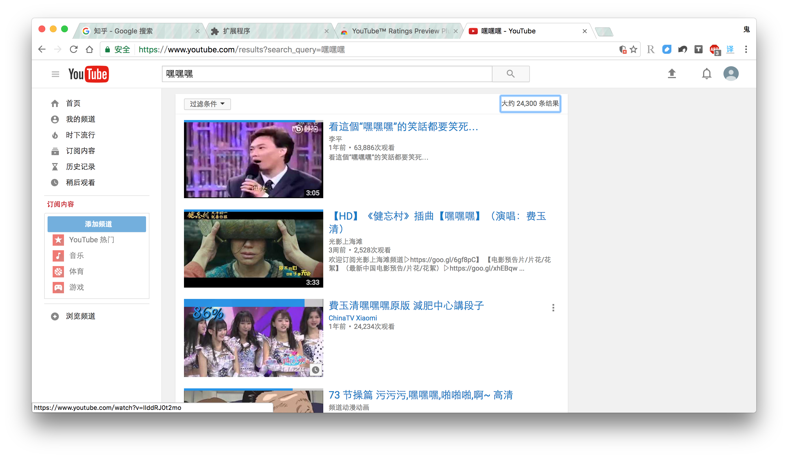  
最新的版本中，用视频顶部的蓝色条长度代表喜欢程度的百分比，更加直观；鼠标移动到视频上会显示具体的百分比数字，让我们假想鼠标还留在第三个视频上。相信痴迷YouTube的你们会喜欢的，不知道什么时候Tumblr也能出个**兄妹**插件。  
[YouTube™ Ratings Preview Plus（无广告）](https://chrome.google.com/webstore/detail/youtube-ratings-preview-p/dghilolpfomhldepeofgodcfhobddikc)  
### 音乐聚合
`Listen 1`是一款音乐聚合类插件（这种聚合应用的专业猿语叫`元搜索引擎`），搜索一次，同时展现网易云音乐、QQ音乐、虾米音乐、豆瓣音乐的音乐资源，随时在线听歌，还能制作自己的歌单。作者也开发了Windows和Mac的客户端，不过反正不能下载音乐，我觉得在线听可能更方便。  
小插件是用Python+Tornado写的（所以和XX-Net一样，需要安装Python），**数据仅存储在本地**。  
[Listen 1](https://github.com/listen1/listen1/)  
# 皮肤
有些朋友甚至不知道Chrome有这么多皮肤可以选择。我习惯叫“皮肤”，实际上人家叫“主题背景”，同样位于Chrome网上应用商店，左侧“扩展程序”的下方：  
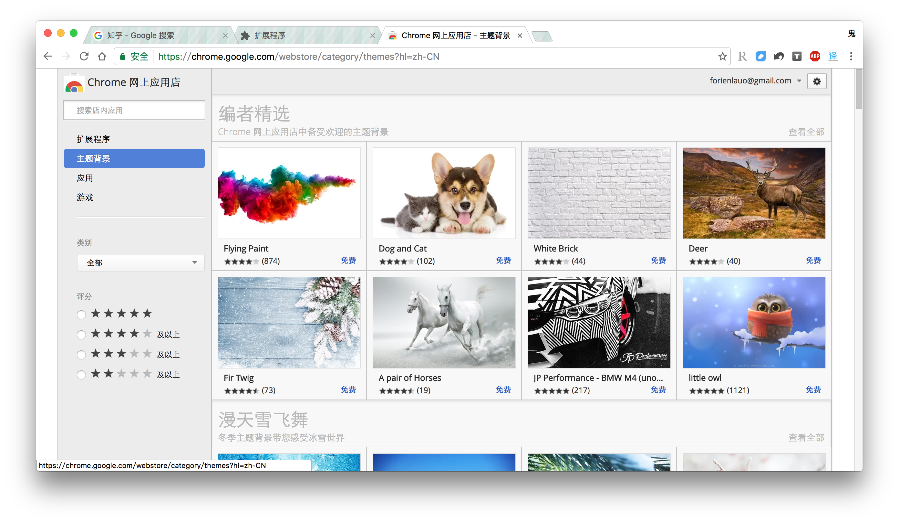  
我安装的主题是[Watercolour](https://chrome.google.com/webstore/detail/watercolour/fcijfjhkdgjhlgblcdfblhjjcpochljc?hl=zh-CN)，前面已经介绍了。寻找一款适合你的主题，让你的生活更有趣。  

>有一点Chrome做的不好：如果安装主题之后又忘记了，就没有途径知道自己安装的是哪个主题了，压根木有这个功能。  

# 更多惊喜
还有超多惊喜跟大家分享：

1. 刚才说到的地址栏直接搜索
2. 隐身模式，隐身的窗口完全隔离，不留痕迹，嘿嘿嘿~
3. 超多快捷键支持（Windows加上鼠标手势插件，macOS加上Jitouch，简直完美）
4. 关闭很多标签的时候，可以连续点关闭而标签大小不变，直到鼠标移开才重新调整标签的大小
5. 如果你说Chrome的设置项好少，那么please打开[about:about](chrome://about/)
6. ...

Chrome带来的惊喜实在太多太多，这么一篇下来3000多字，看这么多不如去亲身体验一下这款最精致的浏览器：

 

Chrome

   

>参考:  
[Top 5瀏覽器(Chrome/IE/Firefox/Safari/Opera)下載懶人包，持續更新中(含Firefox 50.0正式版)](https://pcrookie.com/?p=1201)  
[主流浏览器内核介绍（前端开发值得了解的浏览器内核历史）](http://web.jobbole.com/84826/)  

 

我是猴子007， 
一只非常特殊的动物， 
可以从事程序的开发、维护， 
经常因寻找香蕉或母猿而无心工作。

   
