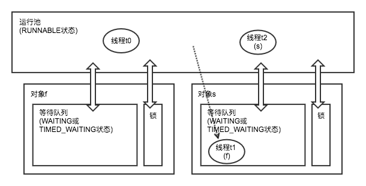
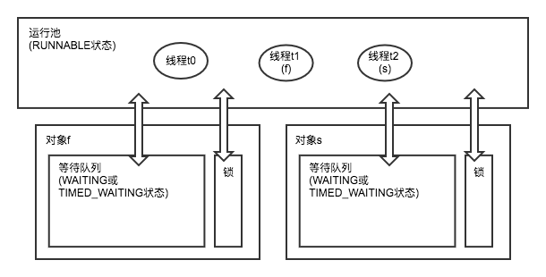

条件队列是我们常用的轻量级同步机制，也被称为“wait+notify”机制。但很多刚刚接触并发的朋友可能会对wait和notify的语义和配合过程感到迷惑。

今天从join()方法的实现切入，重点讲解wait()方法的语义，简略提及notify()与notifyAll()的语义，最后总结二者的配合过程。

<!--more-->

>本篇的知识点很浅，但牢固掌握很重要。后面会再写一篇文章，介绍wait+nofity的用法，和使用时的一些问题。

# 基本概念

## 线程、Thread与Object

在理解“wait+notify”机制时，注意区分线程、Thread与Object的概念，明确三者在wait、 notify、锁竞争等事件中充当的角色：

* 线程指操作系统中的线程
* Thread指Java中的线程类
* Object指Java中的对象

Thread继承自Object，也是一个对象（多态），并从Object类中继承得到了wait()、notify()（还有notifyAll()）方法；同时，Thread也被JVM用于映射操作系统中的线程。

# wait()

## 迷惑的join()方法

通过join()方法确认你是否理解了wait+notify机制：

```java
Thread f = new Thread(new Runnable() {
  @Overide
  public run() {
    Thread s = new Thread(new Runnable() {
      @Overide
      public run() {
        for (int i : 1000000) {
          sout(i);
        }
      }
    });
    s.start();
    sout("************* son thread started *************");
    s.join();
    sout("************* son thread died *************");
  }
});
f.start();
```

join()方法的语义很简单，可以不严谨的表述为“让父线程等待子线程退出”。现在我们来观察Thread#join()的实现，让你对这个语义产生迷惑：

```java
public final synchronized void join(long millis)
throws InterruptedException {
    long base = System.currentTimeMillis();
    long now = 0;

    if (millis < 0) {
        throw new IllegalArgumentException("timeout value is negative");
    }

    if (millis == 0) {
        while (isAlive()) {
            wait(0);
        }
    } else {
        while (isAlive()) {
            long delay = millis - now;
            if (delay <= 0) {
                break;
            }
            wait(delay);
            now = System.currentTimeMillis() - base;
        }
    }
}
```

重点看15-22行。逻辑很简单，一个限时阻塞的经典写法。不过，你可能会产生和我一样的迷惑：

**为什么调用子线程的wait()方法，进入等待状态的却是父线程呢？**

## 分析

让我们用前面提到的线程、Thread和Object三个概念来解释这段代码。事件序列如下：

1. 主线程t0执行1-17行，在Java中创建了Thread实例f，处于NEW状态；同时，f也是一个Object实例
* 主线程t0执行18行后，操作系统中创建了线程t1，Thread实例f转入RUNNABLE状态（Java中，Thread没有RUN状态，因为线程是否正在执行由JVM之外的调度策略决定）
* 假设线程t1正在执行，则线程t1执行4-11行，在Java中创建了Thread实例s，处于NEW状态；同时，s也是一个Object实例
* 线程t1执行12行后，操作系统中创建了线程t2，Thread实例s转入RUNNABLE状态
* 假设线程t1、t2均正在执行，则线程t1执行12行之后、14行之前，可能线程t1与线程t2同时在向标准输出打印内容（t1执行13行，t2执行7-9行）
* 线程t1执行14行的过程中，**操作系统中的线程t1转入阻塞或等待状态**（取决于操作系统的实现），**Thread实例f转入TIMED_WAITING状态**，**Thread实例s不受影响，仍处于RUNNABLE状态**
* 线程t2死亡后，被操作系统标记为死亡，Thread实例s转入为TERMINATED状态
* 线程t1中，Thread实例f发现Thread实例s不再存活，随即转入RUNNABLE状态，操作系统中的线程t1转入运行状态
* 线程t1从14行`s.join()`返回，执行15行，打印
* 最后，线程t1死亡，Thread实例也转入了TERMINATED状态

>当然，在事件6（线程t1执行14行的过程中），Thread实例f在TIMED_WAITING状态与RUNNABLE状态之间来回转换，也因此，才能发现Thread实例s不再存活。但可忽略RUNNABLE状态，不影响理解。

上一节提出的问题忽略了线程、Thread与Object的区别。现在，耐心分析过事件序列之后，让我们使用这三个概念，重新表述该问题：

**为什么在父线程t1中调用s.join()，进而调用s.wait()，进入等待状态的却是Thread实例f对应的父线程t1，而不是子线程t2呢？**

该表述同时也是回答。因为wait()影响的是调用wait()的线程，而不是wait()所属的Object实例。具体说，wait()的语义是“**将调用s.wait()的线程t1放入Object实例s的等待集合**”。这与s是否同时是Thread实例并无关系——如果s恰好是一个Thread实例，那么其所对应的线程t2可以照常运行，毫无影响。

虽然线程的状态与Thread实例的状态不能一一对应，但用Thread实例的状态代替线程的状态，可以简化条件队列的模型，又不影响核心的正确性。在事件6（线程t1执行14行的过程中）中，各角色的关系如图：



## 更容易理解的用法

>我们之所以会在join()方法的实现上产生困惑，是因为它以一种难以理解的姿势使用wait+notify机制。

wait+notify机制本质上是一种基于`条件队列`的同步。JVM为每个对象都内置了监视器，与java.util.concurrent包中的条件队列Condition对应。

条件队列本身很容易理解，但join()方法使用wait()的姿势让人迷惑。**它将Thread实例s作为条件队列，共享于父线程t1、子线程t2中**——Thread实例s既能够被创建它的Thread实例f访问，也能够被它自己(this)访问。可读性很差，不建议学习。

那么，如何使用wait()才更容易理解呢？可参考[Java实现生产者-消费者模型](/2017/10/08/Java实现生产者-消费者模型/)中的“实现二：wait && notify”，使用明确可读的条件队列。简化如下：

```java
public class WaitNotifyModel implements Model {
  private final Object BUFFER_LOCK = new Object();
...
  private class ConsumerImpl extends AbstractConsumer implements Consumer, Runnable {
    @Override
    public void consume() throws InterruptedException {
      synchronized (BUFFER_LOCK) {
        while (buffer.size() == 0) {
          BUFFER_LOCK.wait();
        }
        Task task = buffer.poll();
        assert task != null;
        System.out.println("consume: " + task.no);
        BUFFER_LOCK.notifyAll();
      }
    }
  }

  private class ProducerImpl extends AbstractProducer implements Producer, Runnable {
    @Override
    public void produce() throws InterruptedException {
      synchronized (BUFFER_LOCK) {
        while (buffer.size() == cap) {
          BUFFER_LOCK.wait();
        }
        Task task = new Task(increTaskNo.getAndIncrement());
        buffer.offer(task);
        System.out.println("produce: " + task.no);
        BUFFER_LOCK.notifyAll();
      }
    }
  }
...
}
```

`BUFFER_LOCK`即是内置的条件队列。所有生产者线程和消费者线程都共享`BUFFER_LOCK`，通过`BUFFER_LOCK`的wait+notify机制实现同步。

>* notify()和notifyAll()接下来讲。
>* 之所以命名为`BUFFER_LOCK`，是因为同时还要在将`BUFFER_LOCK`作为内置锁来使用。命名为`BUFFER_LOCK`或`BUFFER_COND`都是可接受的。

# notify()与notifyAll()

可以认为notify与wait是对偶的。**s.wait()将当前线程c放入Object实例s的等待集合中，s.notify()随机将一个线程t从s的等待集合中取出来**（也可能不是随机的，这取决于操作系统的实现。但很明显JVM的使用者不应该依赖其是否随机）。如果s的等待集合中有多个线程，那么t可能是刚才放入的线程c，也可能是其他线程。

虽然我们通常说“wait+notify”机制，但是使用更多的是notifyAll()而不是notify()。因为notify()只能唤醒一个线程，并且通常是随机的——而**被唤醒线程所等待的条件不一定已经被满足（因为多个条件可以使用同一个条件队列），从而会再次进入等待状态；真正满足了条件的线程却因为没被选中而继续等待**。这类似于“信号丢失”，可以称为`信号劫持`。

notifyAll()则一次唤醒全部等待在该条件队列上的线程。虽然notifyAll()解决了“信号劫持”的问题，但一次性唤醒全部线程去竞争锁，也大大加剧了`无效竞争`。

## 关于notify()与notifyAll()的自问自答

### 如何同时解决信号劫持与无效竞争？

不过，只要保证notify()每次都能叫醒正确的人，就能在解决信号劫持的前提下，避免无效竞争。方法很简单，**禁止不同类型的线程共用条件队列**：

 * 一个条件队列只用来维护一个条件
 * 每个线程被唤醒后执行的操作相同

### 使用join()方法的过程中，没有任何线程调用notify()或notifyAll()，如何唤醒线程t1？

为了方便理解，前面事件8（线程t1中，Thread实例f发现Thread实例s不再存活）采用了不正确的描述。在**事件8之前，线程t1已经处于阻塞状态，从而Thread实例f无法发现s是否不再存活**。那么，使用join()方法的过程中，没有任何线程调用notify()或notifyAll()，如何唤醒线程t1？

**在线程t1死亡的时候，JVM会帮忙调用s.notifyAll()**（或非正常死亡时抛出InterruptedException），以唤醒线程t1；t1中做判断，发现s不再存活，便能够正常只是后面的逻辑。

**这是必要的**。假设JVM不会帮忙（调用s.notifyAll()或抛出InterruptedException），在最坏的情况下，如果线程t1被用户从操作系统中强制杀死，那么在条件队列s上等待的主线程t0将永远阻塞，而不知道此时发生的异常情况。

同时，**这种帮助在JVM规范下没有副作用**。因为JVM要求用户从wait()方法返回后检查条件是否得到满足。如果用户编写了错误的同步逻辑，使得线程t2正常执行结束后，条件仍不能得到满足，那么虽然JVM的“帮助”使得线程t1提前唤醒，但wait()返回后的检查使线程t1再次进入阻塞状态，符合用户编写的同步逻辑（尽管是错误的）。另一方面，如果没有线程等待条件队列，那么notify也不会做任何事。

# wait+notify的配合过程

仍然用Thread实例的状态代替线程的状态。

## 1. 调用wait()前

调用wait()前，线程t1对应的Thread实例f、t2对应的s都处于RUNNABLE状态：



## 2. 调用wait()后，调用notify()前

在线程t1中调用s.wait()后，其他线程调用s.notify()前，t1对应的f转入WAITING状态，进入对象s的等待队列（即，条件队列）；s不受影响，仍处于RUNNABLE状态：


## 3. 调用notify()后

假设在主线程t0中主动调用s.notify()，那么在此之后，线程t1对应的Thread实例f转入RUNNABLE状态；s仍然不受影响：


