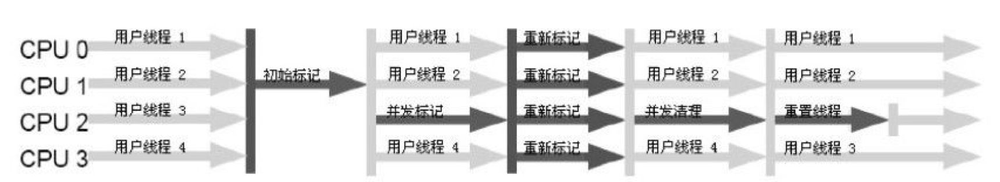

`CMS`（Concurrent Mark Sweep）收集器以获取最短回收停顿时间为目标，是HotSpot虚拟机中第一款真正意义上的并发收集器，第一次实现了让垃圾收集线程与用户线程（基本上）同时工作。

>秋招也快结束了。从今天开始，慢慢整理面试时准备的资料和之前看书做的笔记。部分内容单纯面向面试整理，牺牲深度换取广度，不过已经能够了解很多基本问题了。

<!--more-->

# 过程

1. `初始标记`（CMS initial mark）：标记一下GC Roots能直接关联到的对象。需要STW，速度很快。
2. `并发标记`（CMS concurrent mark）：进行GC Roots Tracing。不需要STW。会产生浮动垃圾。
3. `重新标记`（CMS remark）：找到并发标记期间产生的浮动垃圾。需要STW，停顿时间一般会比初始标记稍长，但远比并发标记短。
4. `并发清除`（CMS concurrent sweep）：清除已标记的垃圾。不需要STW。会产生浮动垃圾，只能等下一次GC清理。

## 重新标记的过程？为什么比并发标记的时间短？

不考虑标记对象年龄等操作，最容易想到的原因是：

* 对象数的区别：“并发标记”过程需要扫描所有对象，标记出不可达的对象（该清除）和可达的对象（不该清除）；“重新标记”只需要扫描在“并发标记”过程中被标记为可达或新创建的对象，检查其是否在“并发标记”过程中被标记为可达之后，由于用户使用变的不可达了
* 并发环境的区别：“并发标记”是与用户线程一起工作的，并发瓶颈较窄（工作线程少+安全检查）；“重新标记”需要stop the world，之后仅有“重新标记”的线程在工作，并发瓶颈宽的多

>PS：关于对象数的区别要想清楚，在对象分配后，如果对象有一瞬间不可达，则该对象以后都将不可达，可对其清理。因此，重新标记时不需要检查这部分对象。

## 并发清除的过程？如何才能让用户边使用，边清除？

还是那句话：

>在对象分配后，如果对象有一瞬间不可达，则该对象以后都将不可达，可对其清理。

所以，已经在“并发标记”和“重新标记”过程被标记为不可达的对象，以后都不会再被用户使用，清除这些对象对用户完全无影响。

唯一可能有影响的是整理内存的过程，不过也只需要同步使用对象和整理对象两个动作。

# CMS的优点、缺点？

优点：

1. 大部分时间可与用户线程并发工作
2. 低停顿

缺点：

1. 对CPU资源非常敏感。并发标记和并发清理与用户线程一起工作，如果用户线程也是CPU敏感的，那么必然影响用户线程。
2. 无法处理`浮动垃圾`（Floating Garbage）。并发标记与并发清除过程会产生浮动垃圾，如果CMS之前预留的内存无法满足程序需要，就会出现一次“Concurrent Mode Failure”失败，这时虚拟机将退化使用Serial Old收集器，重新进行老年代的垃圾收集，这样停顿时间就很长了。可使用XX:CMSInitiatingOccupancyFraction参数设置触发CMS时的老年代空间比例（剩余空间就是预留空间），在JDK1.6中默认为92%。
3. 基于“标记-清除算法”，收集结束时会有大量空间`碎片`产生，导致明明剩余空间充足，却无法为大对象分配足够的连续内存。可打开-XX：+UseCMSCompactAtFullCollection开关参数（默认打开）在进行Full GC之前整理内存碎片（称为“压缩”）；使用-XX:CMSFullGCsBeforeCompaction参数（默认0）设置多少次不带压缩的Full CG之后才进行一次带压缩的Full GC。内存整理无法并行，还需要STW，需要适当调整内存整理的频率，在GC性能与空间利用率之间平衡。

>PS：  
>
>* 浮动垃圾：由于CMS并发清理阶段用户线程还在运行着，伴随程序运行自然就还会有新的垃圾不断产生，这一部分垃圾出现在标记过程之后，CMS无法在当次收集中处 理掉它们，只好留待下一次GC时再清理掉。这一部分垃圾就称为“浮动垃圾”。在这期间用户可能创建新的对象。为了处理这部分浮动垃圾和对象，CMS在并发清理之前，需要预留出足够空间给并发清理期间的用户线程使用。一般会显示使用-XX:CMSInitiatingOccupancyFraction参数设置触发CMS时的老年代空间比例，如果老年代增长不是太快，可以适当提高比例，以减少Full GC的次数。
>
>关于浮动垃圾和内存碎片的问题。HDFS namenode在堆内存达到100G规模时，通常设置75%触发Full GC，不开启压缩，优先考虑STW造成的延迟。
