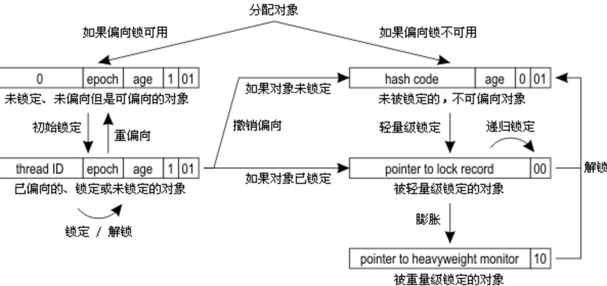

为了换取性能，JVM在内置锁上做了非常多的优化，膨胀式的锁分配策略就是其一。理解偏向锁、轻量级锁、重量级锁的要解决的基本问题，几种锁的分配和膨胀过程，有助于编写并优化基于锁的并发程序。

<!--more-->

>内置锁的分配和膨胀过程较为复杂，限于时间和精力，文中该部分内容是根据网上的多方资料整合而来；仅为方便查阅，后面继续分析JVM源码的时候也有个参考。如果对各级锁已经有了基本了解，读者大可跳过此文。

# 隐藏在内置锁下的基本问题

内置锁是JVM提供的最便捷的线程同步工具，在代码块或方法声明上添加synchronized关键字即可使用内置锁。使用内置锁能够简化并发模型；随着JVM的升级，几乎不需要修改代码，就可以直接享受JVM在内置锁上的优化成果。从简单的重量级锁，到逐渐膨胀的锁分配策略，使用了多种优化手段解决隐藏在内置锁下的基本问题。

## 重量级锁

内置锁在Java中被抽象为监视器锁（monitor）。在JDK 1.6之前，监视器锁可以认为直接对应底层操作系统中的互斥量（mutex）。这种同步方式的成本非常高，包括系统调用引起的内核态与用户态切换、线程阻塞造成的线程切换等。因此，后来称这种锁为“重量级锁”。

### 自旋锁

首先，内核态与用户态的切换上不容易优化。但**通过自旋锁，可以减少线程阻塞造成的线程切换**（包括挂起线程和恢复线程）。

如果锁的粒度小，那么**锁的持有时间比较短**（尽管具体的持有时间无法得知，但可以认为，通常有一部分锁能满足上述性质）。那么，对于竞争这些锁的而言，因为锁阻塞造成线程切换的时间与锁持有的时间相当，减少线程阻塞造成的线程切换，能得到较大的性能提升。具体如下：

* 当前线程竞争锁失败时，打算阻塞自己
* 不直接阻塞自己，而是自旋（空等待，比如一个空的有限for循环）一会
* 在自旋的同时重新竞争锁
* 如果自旋结束前获得了锁，那么锁获取成功；否则，自旋结束后阻塞自己

_如果在自旋的时间内，锁就被旧owner释放了，那么当前线程就不需要阻塞自己_（也不需要在未来锁释放时恢复），减少了一次线程切换。

“锁的持有时间比较短”这一条件可以放宽。实际上，只要锁竞争的时间比较短（比如线程1快释放锁的时候，线程2才会来竞争锁），就能够提高自旋获得锁的概率。这通常发生在**锁持有时间长，但竞争不激烈**的场景中。

#### 缺点

* 单核处理器上，不存在实际的并行，当前线程不阻塞自己的话，旧owner就不能执行，锁永远不会释放，此时不管自旋多久都是浪费；进而，如果线程多而处理器少，自旋也会造成不少无谓的浪费。
* 自旋锁要占用CPU，如果是计算密集型任务，这一优化通常得不偿失，减少锁的使用是更好的选择。
* 如果锁竞争的时间比较长，那么自旋通常不能获得锁，白白浪费了自旋占用的CPU时间。这通常发生在*锁持有时间长，且竞争激烈*的场景中，此时应主动禁用自旋锁。

>使用-XX:-UseSpinning参数关闭自旋锁优化；-XX:PreBlockSpin参数修改默认的自旋次数。

### 自适应自旋锁

自适应意味着自旋的时间不再固定了，而是由前一次在同一个锁上的自旋时间及锁的拥有者的状态来决定：

* 如果在同一个锁对象上，自旋等待刚刚成功获得过锁，并且持有锁的线程正在运行中，那么虚拟机就会认为这次自旋也很有可能再次成功，进而它将允许自旋等待持续相对更长的时间，比如100个循环。
* 相反的，如果对于某个锁，自旋很少成功获得过，那在以后要获取这个锁时将可能减少自旋时间甚至省略自旋过程，以避免浪费处理器资源。

**自适应自旋解决的是“锁竞争时间不确定”的问题**。JVM很难感知到确切的锁竞争时间，而交给用户分析就违反了JVM的设计初衷。_自适应自旋假定不同线程持有同一个锁对象的时间基本相当，竞争程度趋于稳定，因此，可以根据上一次自旋的时间与结果调整下一次自旋的时间_。

#### 缺点

然而，自适应自旋也没能彻底解决该问题，*如果默认的自旋次数设置不合理（过高或过低），那么自适应的过程将很难收敛到合适的值*。

## 轻量级锁

自旋锁的目标是降低线程切换的成本。如果锁竞争激烈，我们不得不依赖于重量级锁，让竞争失败的线程阻塞；如果完全没有实际的锁竞争，那么申请重量级锁都是浪费的。**轻量级锁的目标是，减少无实际竞争情况下，使用重量级锁产生的性能消耗**，包括系统调用引起的内核态与用户态切换、线程阻塞造成的线程切换等。

顾名思义，轻量级锁是相对于重量级锁而言的。使用轻量级锁时，不需要申请互斥量，仅仅_将Mark Word中的部分字节CAS更新指向线程栈中的Lock Record，如果更新成功，则轻量级锁获取成功_，记录锁状态为轻量级锁；_否则，说明已经有线程获得了轻量级锁，目前发生了锁竞争（不适合继续使用轻量级锁），接下来膨胀为重量级锁_。

>Mark Word是对象头的一部分；每个线程都拥有自己的线程栈（虚拟机栈），记录线程和函数调用的基本信息。二者属于JVM的基础内容，此处不做介绍。

当然，由于轻量级锁天然瞄准不存在锁竞争的场景，如果存在锁竞争但不激烈，仍然可以用自旋锁优化，_自旋失败后再膨胀为重量级锁_。

### 缺点

同自旋锁相似：

* 如果*锁竞争激烈*，那么轻量级将很快膨胀为重量级锁，那么维持轻量级锁的过程就成了浪费。

## 偏向锁

在没有实际竞争的情况下，还能够针对部分场景继续优化。如果不仅仅没有实际竞争，自始至终，使用锁的线程都只有一个，那么，维护轻量级锁都是浪费的。**偏向锁的目标是，减少无竞争且只有一个线程使用锁的情况下，使用轻量级锁产生的性能消耗**。轻量级锁每次申请、释放锁都至少需要一次CAS，但偏向锁只有初始化时需要一次CAS。

“偏向”的意思是，_偏向锁假定将来只有第一个申请锁的线程会使用锁_（不会有任何线程再来申请锁），因此，_只需要在Mark Word中CAS记录owner（本质上也是更新，但初始值为空），如果记录成功，则偏向锁获取成功_，记录锁状态为偏向锁，_以后当前线程等于owner就可以零成本的直接获得锁；否则，说明有其他线程竞争，膨胀为轻量级锁_。

偏向锁无法使用自旋锁优化，因为一旦有其他线程申请锁，就破坏了偏向锁的假定。

### 缺点

同样的，如果明显存在其他线程申请锁，那么偏向锁将很快膨胀为轻量级锁。

>不过这个副作用已经小的多。
>
>如果需要，使用参数-XX:-UseBiasedLocking禁止偏向锁优化（默认打开）。

## 小结

>偏向锁、轻量级锁、重量级锁分配和膨胀的详细过程见后。会涉及一些Mark Word与CAS的知识。

偏向锁、轻量级锁、重量级锁适用于不同的并发场景：

* 偏向锁：无实际竞争，且将来只有第一个申请锁的线程会使用锁。
* 轻量级锁：无实际竞争，多个线程交替使用锁；允许短时间的锁竞争。
* 重量级锁：有实际竞争，且锁竞争时间长。

另外，如果锁竞争时间短，可以使用自旋锁进一步优化轻量级锁、重量级锁的性能，减少线程切换。

如果锁竞争程度逐渐提高（缓慢），那么从偏向锁逐步膨胀到重量锁，能够提高系统的整体性能。

# 锁分配和膨胀过程

>重申，这部分主要是根据网上的多方资料整理。核心是这位[巨巨](https://blog.dreamtobe.cn/)整理的流程图，相当详细，基本符合逻辑。

前面讲述了内置锁在使用过程中的一些基本问题和解决方案，实现原理一笔带过。详细的锁分配和膨胀过程如下：

>图中有一处疑问：
>
>按照图中流程，_如果发现锁已经膨胀为重量级锁，就直接使用互斥量mutex阻塞当前线程_。
>
>然而，自旋锁的一大好处就是减少线程切换的开销。在这里没有必要直接阻塞当前线程，大可以像轻量级锁一样，自旋一会，失败了再阻塞。

特别说明两点：

* CAS记录owner时，_`expected == null`_，`newValue == ownerThreadId`，因此，**只有第一个申请偏向锁的线程能够返回成功，后续线程都必然失败**（部分线程检测到可偏向，同时尝试CAS记录owner）。
* **内置锁只能沿着偏向锁、轻量级锁、重量级锁的顺序逐渐膨胀**，不能“收缩”。这基于JVM的另一个假定，“_一旦破坏了上一级锁的假定，就认为该假定以后也必不成立_”。

另外，当重量级锁被解除后，需要唤醒一个被阻塞的线程，这部分逻辑与ReentrantLock基本相同，详见[源码|并发一枝花之ReentrantLock与AQS（1）：lock、unlock](https://monkeysayhi.github.io/2017/12/05/源码|并发一枝花之ReentrantLock与AQS（1）：lock、unlock/)。

## 简化版

上图记载的很详细，也有Mark Word的图解。看懂上图后，再来看《深入理解Java虚拟机：JVM高级特性与最佳实践（第2版）》中的简化版流程图就能看懂了：

>挖坑：
>
>简化版中指出了`重偏向`过程。这一过程对于性能优化和膨胀过程都非常重要；但如果考虑重偏向的话，可能上述特别说明的内容就不成立了。要整理的笔记太多啦时间不够啊，猴子选择暂时放弃这个问题，，，恩，挖个坑，以后再追源码填坑。
>
>重偏向和epoch的作用参考：
>
>* [BiasedLocking模式下markOop中位域epoch的根本作用是什么？](https://www.zhihu.com/question/56582060/answer/155398235)
>

---

>参考:
>
>* [Java Synchronised机制](https://blog.dreamtobe.cn/2015/11/13/java_synchronized/)
>* [Java偏向锁是如何撤销的？](https://www.zhihu.com/question/57774162/answer/154298044)
>
