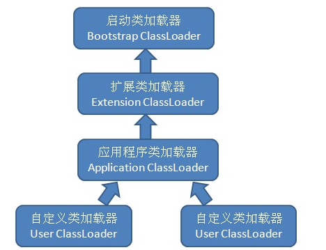

本文浅析了双亲委派的基本概念、实现原理、和自定义类加载器的正确姿势。

对于更细致的加载loading过程、初始化initialization顺序等问题，文中暂不涉及，后面整理笔记时有相应的文章。

<!--more-->

>JDK版本：oracle java 1.8.0_102

# 基本概念

## 定义

双亲委派模型要求**除了顶层的启动类加载器外，其余的类加载器都应当有自己的父类加载器**。

双亲委派模型的工作过程是：

* 如果一个类加载器收到了类加载的请求，它首先不会自己去尝试加载这个类，而是把这个请求委派给父类加载器去完成。
* 每一个层次的类加载器都是如此。因此，所有的加载请求最终都应该传送到顶层的启动类加载器中。
* 只有当父加载器反馈自己无法完成这个加载请求时（搜索范围中没有找到所需的类），子加载器才会尝试自己去加载。

>很多人对“双亲”一词很困惑。这是翻译的锅，，，“双亲”只是“parents”的直译，实际上并不表示汉语中的父母双亲，而是一代一代很多parent，即parents。

## 作用

**对于任意一个类，都需要由加载它的类加载器和这个类本身一同确立其在虚拟机中的唯一性**，每一个类加载器，都拥有一个独立的类名称空间。因此，使用双亲委派模型来组织类加载器之间的关系，有一个显而易见的好处：**类随着它的类加载器一起具备了一种带有优先级的层次关系**。

例如类`java.lang.Object`，它由启动类加载器加载。双亲委派模型保证任何类加载器收到的对`java.lang.Object`的加载请求，最终都是委派给处于模型最顶端的启动类加载器进行加载，因此**Object类在程序的各种类加载器环境中都是同一个类**。

相反，如果没有使用双亲委派模型，由各个类加载器自行去加载的话，如果用户自己编写了一个称为java.lang.Object的类，并用自定义的类加载器加载，那系统中将会出现多个不同的Object类，Java类型体系中最基础的行为也就无法保证，应用程序也将会变得一片混乱。

## 结构

### 系统提供的类加载器

在双亲委派模型的定义中提到了“启动类加载器”。包括启动类加载器，绝大部分Java程序都会使用到以下3种系统提供的类加载器：

* 启动类加载器（Bootstrap ClassLoader）

负责将存放在`＜JAVA_HOME＞/lib`目录中的，或者被`-Xbootclasspath`参数所指定的路径中的，并且是虚拟机按照文件名识别的（如rt.jar，名字不符合的类库即使放在lib目录中也不会被加载）类库加载到虚拟机内存中。

启动类加载器无法被Java程序直接引用，用户在编写自定义类加载器时，如果需要把加载请求委派给引导类加载器，那直接使用null代替即可。

>JDK中的常用类大都由启动类加载器加载，如java.lang.String、java.util.List等。需要特别说明的是，启动类Main class也由启动类加载器加载。

* 扩展类加载器（Extension ClassLoader）

由`sun.misc.Launcher$ExtClassLoader`实现。

负责加载`＜JAVA_HOME＞/lib/ext`目录中的，或者被`java.ext.dirs`系统变量所指定的路径中的所有类库。

开发者可以直接使用扩展类加载器。

>猴子对自己电脑`＜JAVA_HOME＞/lib/ext`目录下的jar包都非常陌生。看了几个jar包，也没找到常用的类；唯一有点印象的是jfxrt.jar，被用于JavaFX的开发之中。

* 应用程序类加载器（Application ClassLoader）

由`sun.misc.Launcher$AppClassLoader`实现。由于这个类加载器是`ClassLoader.getSystemClassLoader()`方法的返回值，所以一般也称它为系统类加载器。

它负责加载用户类路径`ClassPath`上所指定的类库，开发者可以直接使用这个类加载器。**如果应用程序中没有自定义过自己的类加载器，一般情况下这个就是程序中默认的类加载器**。

>启动类Main class、其他如工程中编写的类、maven引用的类，都会被放置在类路径下。Main class由启动类加载器加载，其他类由应用程序类加载器加载。

### 自定义的类加载器

JVM建议用户将应用程序类加载器作为自定义类加载器的父类加载器。则类加载的双亲委派模型如图：



# 实现原理

实现双亲委派的代码都集中在ClassLoader#loadClass()方法之中。将统计部分的代码去掉之后，简写如下：

```java
public abstract class ClassLoader {
    ...
    public Class<?> loadClass(String name) throws ClassNotFoundException {
        return loadClass(name, false);
    }
    protected Class<?> loadClass(String name, boolean resolve)
        throws ClassNotFoundException {
        synchronized (getClassLoadingLock(name)) {
            Class<?> c = findLoadedClass(name);
            if (c == null) {
                ...
                try {
                    if (parent != null) {
                        c = parent.loadClass(name, false);
                    } else {
                        c = findBootstrapClassOrNull(name);
                    }
                } catch (ClassNotFoundException e) {
                }

                if (c == null) {
                    ...
                    c = findClass(name);
                    // do some stats
                    ...
                }
            }
            if (resolve) {
                resolveClass(c);
            }
            return c;
        }
    }
    protected Class<?> findClass(String name) throws ClassNotFoundException {
        throw new ClassNotFoundException(name);
    }
    ...
}
```

* 首先，检查目标类是否已在当前类加载器的命名空间中加载（即，使用二元组`<类加载器实例，全限定名>`区分不同类）。
* 如果没有找到，则尝试将请求委托给父类加载器（如果指定父类加载器为null，则将启动类加载器作为父类加载器；如果没有指定父类加载器，则将应用程序类加载器作为父类加载器），最终所有类都会委托到启动类加载器。
* 如果父类加载器加载失败，则自己加载。
* 默认resolve取false，不需要解析，直接返回。

# 自定义类加载器的正确姿势

系统提供的3种类加载器分别负责各路径下的Java类的加载。如果用户希望自定义一个类加载器（如从网络中读取class字节流，以加载新的类），该如何做呢？

## 错误姿势

先来看几个类加载的错误姿势。

>再次提醒，以下这些错误姿势一定不影响编译，因为加载行为发生在运行期。

### 不定义类加载器

现在用户自定义了一个`sun.applet.Main`类，但不定义类加载器：

```java
package sun.applet;

/**
 * Created by monkeysayhi on 2017/12/20.
 */
public class Main {
  public Main() {
    System.out.println("constructed");
  }

  public static void main(String[] args) {
    System.out.println("recognized as sun.applet.Main in jdk," +
        " and there isn't any main method");
  }
}
```

>为保持与后续实验的连贯性，这里没有选择常用的java.lang包下的类。原因见后。

将该类作为Main class启动，会输出什么呢？或许你以为会输出12-13行声明的字符串，现实却总会啪啪啪抚摸我们的脸庞：

```
用法: appletviewer <options> url

其中, <options> 包括:
  -debug                  在 Java 调试器中启动小应用程序查看器
  -encoding <encoding>    指定 HTML 文件使用的字符编码
  -J<runtime flag>        将参数传递到 java 解释器

-J 选项是非标准选项, 如有更改, 恕不另行通知。
```

不管这些东西从哪来的，总之不是我们定义的。

实际被选中的Main class是jdk中的`sun.applet.Main`类。**如果没有定义类加载器，则会使用默认的类加载器（应用程序类加载器）和默认的类加载行为（ClassLoader#loadClass()）**。由双亲委派模型可知，_最终将由启动类加载器加载`＜JAVA_HOME＞/lib/rt.jar`中的`sun.applet.Main`，并执行其main方法_。

### 定义类加载器，但不委派

如何不委派呢？覆写ClassLoader#loadClass()：

>当然，还要覆写ClassLoader#findClass()以支持自定义的类加载方式。

```java
public class UnDelegationClassLoader extends ClassLoader {
  private String classpath;

  public UnDelegationClassLoader(String classpath) {
    super(null);
    this.classpath = classpath;
  }

  @Override
  public Class<?> loadClass(String name) throws ClassNotFoundException {
    Class<?> clz = findLoadedClass(name);
    if (clz != null) {
      return clz;
    }

    // jdk 目前对"java."开头的包增加了权限保护，这些包我们仍然交给 jdk 加载
    if (name.startsWith("java.")) {
      return ClassLoader.getSystemClassLoader().loadClass(name);
    }
    return findClass(name);
  }

  @Override
  protected Class<?> findClass(String name) throws ClassNotFoundException {
    InputStream is = null;
    try {
      String classFilePath = this.classpath + name.replace(".", "/") + ".class";
      is = new FileInputStream(classFilePath);
      byte[] buf = new byte[is.available()];
      is.read(buf);
      return defineClass(name, buf, 0, buf.length);
    } catch (IOException e) {
      throw new ClassNotFoundException(name);
    } finally {
      if (is != null) {
        try {
          is.close();
        } catch (IOException e) {
          throw new IOError(e);
        }
      }
    }
  }

  public static void main(String[] args)
      throws ClassNotFoundException, IllegalAccessException, InstantiationException,
      MalformedURLException {
    sun.applet.Main main1 = new sun.applet.Main();

    UnDelegationClassLoader cl = new UnDelegationClassLoader("java-study/target/classes/");
    String name = "sun.applet.Main";
    Class<?> clz = cl.loadClass(name);
    Object main2 = clz.newInstance();

    System.out.println("main1 class: " + main1.getClass());
    System.out.println("main2 class: " + main2.getClass());
    System.out.println("main1 classloader: " + main1.getClass().getClassLoader());
    System.out.println("main2 classloader: " + main2.getClass().getClassLoader());
  }
}
```

>注意16-19行。由于jdk对"java."开头的包增加了权限保护，用户无法使用示例中的ClassLoader#defineClass()方法；而所有类都是`java.lang.Object`类的子类，sout输出时也要使用`java.lang.System`类等，所以我们又必须加载java.lang包下的类。因此，我们仍然将这些包委托给jdk加载。
>
>同时，这也解释了，为什么不能将常用的java.lang包下的类作为同名类测试对象。

示例先加载jdk中的`sun.applet.Main`类，实例化main1，再使用不进行委派的自定义类加载器加载自定义的`sun.applet.Main`类，实例化main2。如果实例main2创建成功，则输出“constructed”。之后，输出main1、main2的类名和类加载器。

输出：

```
constructed
main1 class: class sun.applet.Main
main2 class: class sun.applet.Main
main1 classloader: null
main2 classloader: com.msh.demo.classloading.loading.UnDelegationClassLoader@1d44bcfa
```

首先，1行说明实例main2创建成功了。2-3行**表示main1、main2的全限定名确实相同**。4-5行表示**二者的类加载器不同**，_main1的类使用启动类加载器，main2的类使用自定义的类加载器_。

## 正确姿势

一个符合规范的类加载器，应当**仅覆写ClassLoader#findClass()**，以支持自定义的类加载方式。*不建议覆写ClassLoader#loadClass()*（以使用默认的类加载逻辑，即双亲委派模型）；*如果需要覆写，则不应该破坏双亲委派模型*：

```java
public class DelegationClassLoader extends ClassLoader {
  private String classpath;

  public DelegationClassLoader(String classpath, ClassLoader parent) {
    super(parent);
    this.classpath = classpath;
  }

  @Override
  protected Class<?> findClass(String name) throws ClassNotFoundException {
    InputStream is = null;
    try {
      String classFilePath = this.classpath + name.replace(".", "/") + ".class";
      is = new FileInputStream(classFilePath);
      byte[] buf = new byte[is.available()];
      is.read(buf);
      return defineClass(name, buf, 0, buf.length);
    } catch (IOException e) {
      throw new ClassNotFoundException(name);
    } finally {
      if (is != null) {
        try {
          is.close();
        } catch (IOException e) {
          throw new IOError(e);
        }
      }
    }
  }

  public static void main(String[] args)
      throws ClassNotFoundException, IllegalAccessException, InstantiationException,
      MalformedURLException {
    sun.applet.Main main1 = new sun.applet.Main();

    DelegationClassLoader cl = new DelegationClassLoader("java-study/target/classes/",
        getSystemClassLoader());
    String name = "sun.applet.Main";
    Class<?> clz = cl.loadClass(name);
    Object main2 = clz.newInstance();

    System.out.println("main1 class: " + main1.getClass());
    System.out.println("main2 class: " + main2.getClass());
    System.out.println("main1 classloader: " + main1.getClass().getClassLoader());
    System.out.println("main2 classloader: " + main2.getClass().getClassLoader());
    ClassLoader itrCl = cl;
    while (itrCl != null) {
      System.out.println(itrCl);
      itrCl = itrCl.getParent();
    }
  }
}
```

因为在自定义类加载器上正确使用了双亲委派模型，上述代码运行后，不会出现相同全限定名的类被不同类加载器加载的问题，也就不会引起混乱了.

输出：

```
main1 class: class sun.applet.Main
main2 class: class sun.applet.Main
main1 classloader: null
main2 classloader: null
com.msh.demo.classloading.loading.DelegationClassLoader@1d44bcfa
sun.misc.Launcher$AppClassLoader@18b4aac2
sun.misc.Launcher$ExtClassLoader@266474c2
```

在双亲委派模型下，运行时中只存在启动类加载器加载的`sun.applet.Main`类。

5-6行输出了类加载器在双亲委派模型中的位置：最下层是自定义类加载器，然后逐层向上是应用程序类加载器、扩展类加载器，最上层是启动类加载器（在扩展类加载器中记为null）。可与前面的结构图对照。

>不过，实际情况中，覆写ClassLoader#loadClass()是非常常见的。JNDI、OSGi等为了实现各自的需求，也在一定程度上破坏了双亲委派模型。
