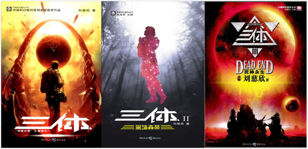

有这样一个笑话：  

>程序猿追求一美女。  
美女：你能让这个论坛的人都吵起来，我今晚就跟你走。  
于是，程序猿在论坛上说道：PHP是最好的语言！   
论坛炸锅了，各种吵架。。。  
美女：服了你了，我们走吧。今天你想干啥都行。  
程序猿：今天不行，我一定要说服他们！

PHP是不是世界上最好的语言，这个问题或许没有答案——当然，程序猿能不能追到女孩可能也没有答案。但是，**如果说程序猿公认最棒的中文科幻小说，那就非《三体》莫属了**。  

<!--more-->

# 介绍
《三体》，又称《地球往事三部曲》，“三体”是其第一部的名字。作者刘慈欣，山西娘子关电厂的计算机工程师——高级程序猿，擅写科幻小说，**中国科幻小说最高奖星云奖**的得主，**国际科幻小说最高奖雨果奖**的得主。其代表作还有《球状闪电》、《流浪地球》、《乡村教师》等。  
  
# 剧情介绍
如果用一句话概括三体，可以说是“一场文革引发的世界毁灭”——当然与实际剧情有出入。整体上从地球内部的矛盾、扩展到地球人与三体人之间的矛盾，最后扩展到整个宇宙中存在的矛盾。世界观宏大，剧情和设定都十分精彩。  
三言两语讲不完一部90万字的神作，可以先看个12分钟的视频了解下剧情。  
[12分钟看完90万字科幻神作《三体》](https://v.qq.com/x/page/m0164hagtx4.html)  
还有一个更细致更长的版本，1个多小时。  
[【文曰小强】一小时读完《三体1-2-3》 九合一视频！！！](http://v.youku.com/v_show/id_XMTcxNTI5ODU0MA==.html)  
如果看完视频觉得有意思，可以到各大应用商店搜索“三体”下载，或购买电子书、纸质书等。注意总共有三部：第二部是最精彩的；第一部可能略有枯燥，但是不长，而且奠定了整个三部曲的基调，主要人物性格和基本矛盾也在这一部确立，值得仔细一读；如果你看完了第一部和第二部，你会忍不住继续看第三部的。  
# 金句赏析
剧情之外，三体中流行的金句也是数不胜数。这里摘抄一二。  
>毁灭你，与你何干。  

毁灭你，因为黑暗森林法则，不管你是谁，不管你是善是恶，是强是弱。  
宇宙中没有爱。  

>一切的一切都导向这样一个结果：物理学从来就没有存在过，将来也不会存在。我知道自己这样做是不负责任的，但别无选择。  

这句话的意思就是，优化策略是没有意义的，策略从来都没有存在过，点击率、访购率提升从来不是你看到的必然，而是超越你的偶然。（之前在美团搜索组实习时整理）  

>你的无畏来源于无知。  

但是这句话又告诉大大的安慰了我们。就算是无知给予的无畏，它起码能让我内心安宁。   

>一个大人和一个小孩儿站在死于武斗的红卫兵墓前，那孩子问大人:他们是烈士吗？大人说不是；孩子又问:他们是敌人吗？大人说也不是；孩子再问：那他们是什么？大人说：‘是历史。’  

小孩子才讲对错，三体讲的就是冰冷的宇宙规律。毁灭你的文明，你毁灭的文明，都没有善恶美丑，他们只是默默遵循着宇宙学公理。文明注定要互相吞并，从高维落向低维，直到宇宙重启。所以，或者程心并没有毁灭地球，因为地球注定毁灭。  

>如果我能够拯救一个自己爱上的遥远的美丽世界，那这一辈子至少没有白活。  

当程心的“爱”再一次将人类推向毁灭之后，程心选择拯救那颗云天明送给她的星星。在冷冰冰的宇宙学公理之下，个体仍然有着自己的任性。程心没有错，维德没有错，罗辑更没有错，谁都没有错。  

>黑，真他妈的黑啊。  

“终极规律”号的舰长自杀前最后一句话，也许他当时已经看透了宇宙的黑暗森林图景；当罗辑带大史推导这一图景时，大史在领悟的那一刻也说出了同样的话。这让黑暗森林中的人突然开始庆幸自己还没有暴露，也突然开始畏惧黑暗的未来。  

>前进！前进！！不择手段地前进！！！  

因为这句话，程心和维德塑造了阶梯计划，程心亲手将送她星星、深爱她一辈子的云天明推向了遥远的三体世界。这是我最喜欢的一句话，最后送给大家共勉。  
