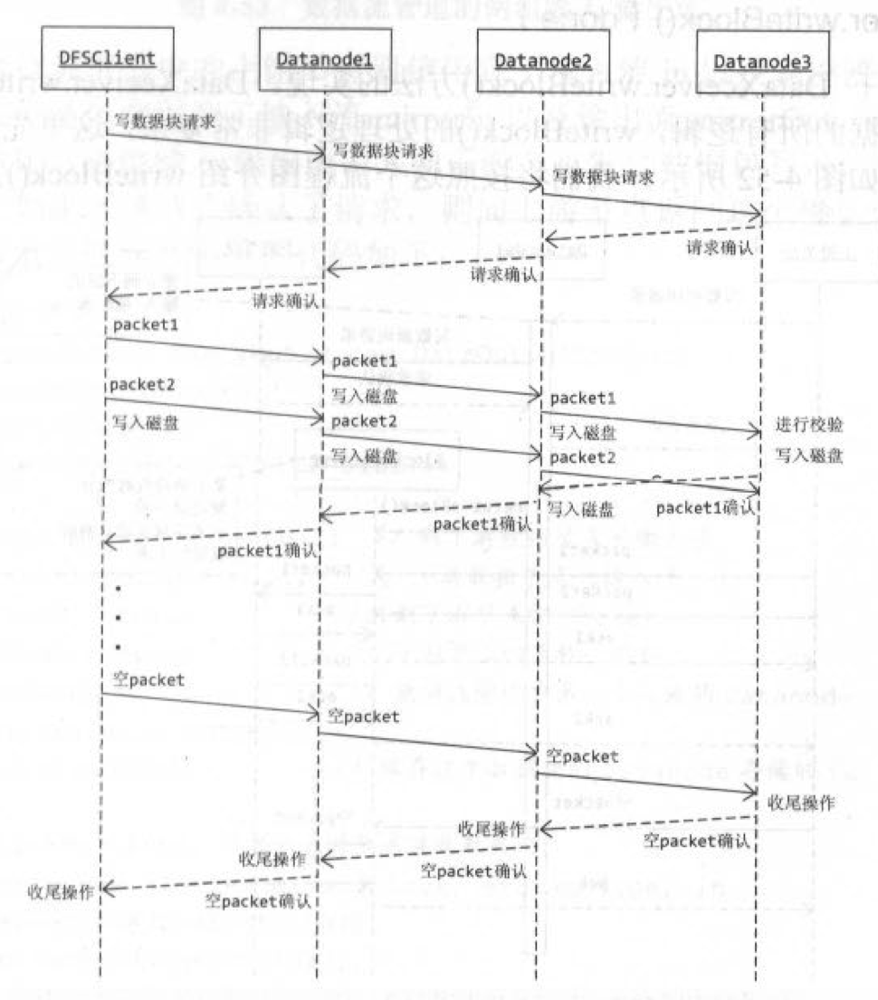

上一篇[源码|HDFS之DataNode：写数据块（1）](/2018/01/19/源码|HDFS之DataNode：写数据块（1）/)分析了无管道无异常情况下，datanode上的写数据块过程。本文分析管道写无异常的情况，假设**副本系数3**（即写数据块涉及1个客户端+3个datanode），**未发生任何异常**。

<!--more-->

<!--[TOC]-->

>源码版本：Apache Hadoop 2.6.0
>
>本文内容虽短，却是建立在前文的基础之上。对于前文已经说明的内容，本文不再赘述，建议读者按顺序阅读。

# 在开始之前

## 总览

根据[源码|HDFS之DataNode：写数据块（1）](/2018/01/19/源码|HDFS之DataNode：写数据块（1）/)，对于多副本的管道写流程，主要影响DataXceiver#writeBlock()、BlockReceiver#receivePacket()、PacketResponder线程三部分。本文按照这三个分支展开。

## 文章的组织结构

1. 如果只涉及单个分支的分析，则放在同一节。
2. 如果涉及多个分支的分析，则在下一级分多个节，每节讨论一个分支。
3. 多线程的分析同多分支。
4. 每一个分支和线程的组织结构遵循规则1-3。

# 建立管道：DataXceiver#writeBlock()

准备接收数据块：`BlockReceiver.<init>()`

```java
  public void writeBlock(final ExtendedBlock block,
      final StorageType storageType, 
      final Token<BlockTokenIdentifier> blockToken,
      final String clientname,
      final DatanodeInfo[] targets,
      final StorageType[] targetStorageTypes, 
      final DatanodeInfo srcDataNode,
      final BlockConstructionStage stage,
      final int pipelineSize,
      final long minBytesRcvd,
      final long maxBytesRcvd,
      final long latestGenerationStamp,
      DataChecksum requestedChecksum,
      CachingStrategy cachingStrategy,
      final boolean allowLazyPersist) throws IOException {
    ...// 检查，设置参数等

    ...// 构建向上游节点或客户端回复的输出流（此处即为客户端）

    ...// 略
    
    try {
      if (isDatanode || 
          stage != BlockConstructionStage.PIPELINE_CLOSE_RECOVERY) {
        // 创建BlockReceiver，准备接收数据块
        blockReceiver = new BlockReceiver(block, storageType, in,
            peer.getRemoteAddressString(),
            peer.getLocalAddressString(),
            stage, latestGenerationStamp, minBytesRcvd, maxBytesRcvd,
            clientname, srcDataNode, datanode, requestedChecksum,
            cachingStrategy, allowLazyPersist);

        storageUuid = blockReceiver.getStorageUuid();
      } else {
        ...// 管道错误恢复相关
      }

      // 下游节点的处理：以当前节点为“客户端”，继续触发下游管道的建立
      if (targets.length > 0) {
        // 连接下游节点
        InetSocketAddress mirrorTarget = null;
        mirrorNode = targets[0].getXferAddr(connectToDnViaHostname);
        if (LOG.isDebugEnabled()) {
          LOG.debug("Connecting to datanode " + mirrorNode);
        }
        mirrorTarget = NetUtils.createSocketAddr(mirrorNode);
        mirrorSock = datanode.newSocket();
        // 尝试建立管道（下面展开）
        try {
          // 设置建立socket的超时时间、写packet的超时时间、写buf大小等
          int timeoutValue = dnConf.socketTimeout
              + (HdfsServerConstants.READ_TIMEOUT_EXTENSION * targets.length);
          int writeTimeout = dnConf.socketWriteTimeout + 
                      (HdfsServerConstants.WRITE_TIMEOUT_EXTENSION * targets.length);
          NetUtils.connect(mirrorSock, mirrorTarget, timeoutValue);
          mirrorSock.setSoTimeout(timeoutValue);
          mirrorSock.setSendBufferSize(HdfsConstants.DEFAULT_DATA_SOCKET_SIZE);
          
          // 设置当前节点到下游的输出流mirrorOut、下游到当前节点的输入流mirrorIn等
          OutputStream unbufMirrorOut = NetUtils.getOutputStream(mirrorSock,
              writeTimeout);
          InputStream unbufMirrorIn = NetUtils.getInputStream(mirrorSock);
          DataEncryptionKeyFactory keyFactory =
            datanode.getDataEncryptionKeyFactoryForBlock(block);
          IOStreamPair saslStreams = datanode.saslClient.socketSend(mirrorSock,
            unbufMirrorOut, unbufMirrorIn, keyFactory, blockToken, targets[0]);
          unbufMirrorOut = saslStreams.out;
          unbufMirrorIn = saslStreams.in;
          mirrorOut = new DataOutputStream(new BufferedOutputStream(unbufMirrorOut,
              HdfsConstants.SMALL_BUFFER_SIZE));
          mirrorIn = new DataInputStream(unbufMirrorIn);

          // 向下游节点发送建立管道的请求，未来将继续使用mirrorOut作为写packet的输出流
          new Sender(mirrorOut).writeBlock(originalBlock, targetStorageTypes[0],
              blockToken, clientname, targets, targetStorageTypes, srcDataNode,
              stage, pipelineSize, minBytesRcvd, maxBytesRcvd,
              latestGenerationStamp, requestedChecksum, cachingStrategy, false);
          mirrorOut.flush();

          // 如果是客户端发起的写数据块请求（满足），则存在管道，需要从下游节点读取建立管道的ack
          if (isClient) {
            BlockOpResponseProto connectAck =
              BlockOpResponseProto.parseFrom(PBHelper.vintPrefixed(mirrorIn));
            // 将下游节点的管道建立结果作为整个管道的建立结果（要么从尾节点到头结点都是成功的，要么都是失败的）
            mirrorInStatus = connectAck.getStatus();
            firstBadLink = connectAck.getFirstBadLink();
            if (LOG.isDebugEnabled() || mirrorInStatus != SUCCESS) {
              LOG.info("Datanode " + targets.length +
                       " got response for connect ack " +
                       " from downstream datanode with firstbadlink as " +
                       firstBadLink);
            }
          }

        } catch (IOException e) {
          ...// 异常处理：清理资源，响应ack等
        }
      }
      
      // 发送的第一个packet是空的，只用于建立管道。这里立即返回ack表示管道是否建立成功
      // 由于该datanode没有下游节点，则执行到此处，表示管道已经建立成功
      if (isClient && !isTransfer) {
        if (LOG.isDebugEnabled() || mirrorInStatus != SUCCESS) {
          LOG.info("Datanode " + targets.length +
                   " forwarding connect ack to upstream firstbadlink is " +
                   firstBadLink);
        }
        BlockOpResponseProto.newBuilder()
          .setStatus(mirrorInStatus)
          .setFirstBadLink(firstBadLink)
          .build()
          .writeDelimitedTo(replyOut);
        replyOut.flush();
      }

      // 接收数据块（也负责发送到下游，不过此处没有下游节点）
      if (blockReceiver != null) {
        String mirrorAddr = (mirrorSock == null) ? null : mirrorNode;
        blockReceiver.receiveBlock(mirrorOut, mirrorIn, replyOut,
            mirrorAddr, null, targets, false);

        ...// 数据块复制相关
      }

      ...// 数据块恢复相关
      
      ...// 数据块复制相关
      
    } catch (IOException ioe) {
      LOG.info("opWriteBlock " + block + " received exception " + ioe);
      throw ioe;
    } finally {
      ...// 清理资源
    }

    ...// 更新metrics
  }
```

与副本系数1的情况下相比，仅仅增加了“下游节点的处理”的部分：_以当前节点为“客户端”，继续触发下游管道的建立；对于下游节点，仍然要走一遍当前节点的流程_。**当客户端收到第一个datanode管道建立成功的ack时，下游所有的节点的管道一定已经建立成功**，加上客户端，组成了完整的管道。

另外，根据前文的分析，直到执行BlockReceiver.receiveBlock()才开始管道写数据块内容，结合管道的关闭过程，可知管道的生命周期分为三个阶段：

1. 管道建立：以管道的方式向下游发送管道建立的请求，从下游接收管道建立的响应。
2. 管道写：当客户端收到管道建立成功的ack时，才利用刚刚建立的管道开始管道写数据块的内容。
3. 管道关闭：以管道的方式向下游发送管道关闭的请求，从下游接收管道关闭的响应。

如图说明几个参数：


* in：上游节点到当前节点的输入流，当前节点通过in接收上游节点的packet。
* replyOut：：当前节点到上游节点的输出流，当前节点通过replyOut向上游节点发送ack。
* mirrorOut：当前节点到下游节点的输出流，当前节点通过mirrorOut向下游节点镜像发送packet。
* mirrorIn：下游节点到当前节点的输入流，当前节点通过mirrorIn接收下游节点的镜像ack。

## 请求建立管道：Sender#writeBlock()

Sender#writeBlock()：

```java
  public void writeBlock(final ExtendedBlock blk,
      final StorageType storageType, 
      final Token<BlockTokenIdentifier> blockToken,
      final String clientName,
      final DatanodeInfo[] targets,
      final StorageType[] targetStorageTypes, 
      final DatanodeInfo source,
      final BlockConstructionStage stage,
      final int pipelineSize,
      final long minBytesRcvd,
      final long maxBytesRcvd,
      final long latestGenerationStamp,
      DataChecksum requestedChecksum,
      final CachingStrategy cachingStrategy,
      final boolean allowLazyPersist) throws IOException {
    ClientOperationHeaderProto header = DataTransferProtoUtil.buildClientHeader(
        blk, clientName, blockToken);
    
    ChecksumProto checksumProto =
      DataTransferProtoUtil.toProto(requestedChecksum);

    OpWriteBlockProto.Builder proto = OpWriteBlockProto.newBuilder()
      .setHeader(header)
      .setStorageType(PBHelper.convertStorageType(storageType))
      // 去掉targets中的第一个节点
      .addAllTargets(PBHelper.convert(targets, 1))
      .addAllTargetStorageTypes(PBHelper.convertStorageTypes(targetStorageTypes, 1))
      .setStage(toProto(stage))
      .setPipelineSize(pipelineSize)
      .setMinBytesRcvd(minBytesRcvd)
      .setMaxBytesRcvd(maxBytesRcvd)
      .setLatestGenerationStamp(latestGenerationStamp)
      .setRequestedChecksum(checksumProto)
      .setCachingStrategy(getCachingStrategy(cachingStrategy))
      .setAllowLazyPersist(allowLazyPersist);
    
    if (source != null) {
      proto.setSource(PBHelper.convertDatanodeInfo(source));
    }

    send(out, Op.WRITE_BLOCK, proto.build());
  }
  
  ...
  
  private static void send(final DataOutputStream out, final Op opcode,
      final Message proto) throws IOException {
    if (LOG.isTraceEnabled()) {
      LOG.trace("Sending DataTransferOp " + proto.getClass().getSimpleName()
          + ": " + proto);
    }
    op(out, opcode);
    proto.writeDelimitedTo(out);
    out.flush();
  }
```

逻辑非常简单。为什么要去掉targets中的第一个节点？假设客户端发送的targets中顺序存储d1、d2、d3，当前节点为d1，那么d1的下游只剩下d2、d3，继续向下游发送管道建立请求时，自然要去掉当前targets中的第一个节点d1；d2、d3同理。

依靠这种targets逐渐减少的逻辑，DataXceiver#writeBlock()才能用`targets.length > 0`判断是否还有下游节点需要建立管道。

>客户端也使用Sender#writeBlock()建立管道。但发送过程略有不同：客户端通过自定义的字节流写入数据，需要将字节流中的数据整合成packet，再写入管道。

# 向下游管道发送packet：BlockReceiver#receivePacket()

同步接收packet：BlockReceiver#receivePacket()

先看BlockReceiver#receivePacket()。

严格来说，BlockReceiver#receivePacket()负责**接收上游的packet，并继续向下游节点管道写**：

```java
  private int receivePacket() throws IOException {
    // read the next packet
    packetReceiver.receiveNextPacket(in);

    PacketHeader header = packetReceiver.getHeader();
    ...// 略

    ...// 检查packet头

    long offsetInBlock = header.getOffsetInBlock();
    long seqno = header.getSeqno();
    boolean lastPacketInBlock = header.isLastPacketInBlock();
    final int len = header.getDataLen();
    boolean syncBlock = header.getSyncBlock();

    ...// 略
    
    // 如果不需要立即持久化也不需要校验收到的数据，则可以立即委托PacketResponder线程返回 SUCCESS 的ack，然后再进行校验和持久化
    if (responder != null && !syncBlock && !shouldVerifyChecksum()) {
      ((PacketResponder) responder.getRunnable()).enqueue(seqno,
          lastPacketInBlock, offsetInBlock, Status.SUCCESS);
    }

    // 管道写相关：将in中收到的packet镜像写入mirrorOut
    if (mirrorOut != null && !mirrorError) {
      try {
        long begin = Time.monotonicNow();
        packetReceiver.mirrorPacketTo(mirrorOut);
        mirrorOut.flush();
        long duration = Time.monotonicNow() - begin;
        if (duration > datanodeSlowLogThresholdMs) {
          LOG.warn("Slow BlockReceiver write packet to mirror took " + duration
              + "ms (threshold=" + datanodeSlowLogThresholdMs + "ms)");
        }
      } catch (IOException e) {
        handleMirrorOutError(e);
      }
    }
    
    ByteBuffer dataBuf = packetReceiver.getDataSlice();
    ByteBuffer checksumBuf = packetReceiver.getChecksumSlice();
    
    if (lastPacketInBlock || len == 0) {    // 收到空packet可能是表示心跳或数据块发送
      // 这两种情况都可以尝试把之前的数据刷到磁盘
      if (syncBlock) {
        flushOrSync(true);
      }
    } else {    // 否则，需要持久化packet
      final int checksumLen = diskChecksum.getChecksumSize(len);
      final int checksumReceivedLen = checksumBuf.capacity();

      ...// 如果是管道中的最后一个节点，则持久化之前，要先对收到的packet做一次校验（使用packet本身的校验机制）
      ...// 如果校验错误，则委托PacketResponder线程返回 ERROR_CHECKSUM 的ack

      final boolean shouldNotWriteChecksum = checksumReceivedLen == 0
          && streams.isTransientStorage();
      try {
        long onDiskLen = replicaInfo.getBytesOnDisk();
        if (onDiskLen<offsetInBlock) {
          ...// 如果校验块不完整，需要加载并调整旧的meta文件内容，供后续重新计算crc

          // 写block文件
          int startByteToDisk = (int)(onDiskLen-firstByteInBlock) 
              + dataBuf.arrayOffset() + dataBuf.position();
          int numBytesToDisk = (int)(offsetInBlock-onDiskLen);
          out.write(dataBuf.array(), startByteToDisk, numBytesToDisk);
          
          // 写meta文件
          final byte[] lastCrc;
          if (shouldNotWriteChecksum) {
            lastCrc = null;
          } else if (partialCrc != null) {  // 如果是校验块不完整（之前收到过一部分）
            ...// 重新计算crc
            ...// 更新lastCrc
            checksumOut.write(buf);
            partialCrc = null;
          } else { // 如果校验块完整
            ...// 更新lastCrc
            checksumOut.write(checksumBuf.array(), offset, checksumLen);
          }

          ...//略
        }
      } catch (IOException iex) {
        datanode.checkDiskErrorAsync();
        throw iex;
      }
    }

    // 相反的，如果需要立即持久化或需要校验收到的数据，则现在已经完成了持久化和校验，可以委托PacketResponder线程返回 SUCCESS 的ack
    // if sync was requested, put in queue for pending acks here
    // (after the fsync finished)
    if (responder != null && (syncBlock || shouldVerifyChecksum())) {
      ((PacketResponder) responder.getRunnable()).enqueue(seqno,
          lastPacketInBlock, offsetInBlock, Status.SUCCESS);
    }

    ...// 如果超过了响应时间，还要主动发送一个IN_PROGRESS的ack，防止超时

    ...// 节流器相关
    
    // 当整个数据块都发送完成之前，客户端会可能会发送有数据的packet，也因为维持心跳或表示结束写数据块发送空packet
    // 因此，当标志位lastPacketInBlock为true时，不能返回0，要返回一个负值，以区分未到达最后一个packet之前的情况
    return lastPacketInBlock?-1:len;
  }
  
  ...
  
  private boolean shouldVerifyChecksum() {
    // 对于客户端写，只有管道中的最后一个节点满足`mirrorOut == null`
    return (mirrorOut == null || isDatanode || needsChecksumTranslation);
  }
```

由于已经在中建立了管道，接下来，管道写的工作非常简单，只涉及“管道写相关”部分：

_每收到一个packet，就将in中收到的packet镜像写入mirrorOut；对于下游节点，仍然要走一遍当前节点的流程_。

另外，BlockReceiver#shouldVerifyChecksum()也发挥了作用：_管道的中间节点在落盘前不需要校验_。

# 向上游管道响应ack：PacketResponder线程

异步发送ack：PacketResponder线程

与BlockReceiver#receivePacket()相对，PacketResponder线程负责**接收下游节点的ack，并继续向上游管道响应**。

PacketResponder#run()：

```java
    public void run() {
      boolean lastPacketInBlock = false;
      final long startTime = ClientTraceLog.isInfoEnabled() ? System.nanoTime() : 0;
      while (isRunning() && !lastPacketInBlock) {
        long totalAckTimeNanos = 0;
        boolean isInterrupted = false;
        try {
          Packet pkt = null;
          long expected = -2;
          PipelineAck ack = new PipelineAck();
          long seqno = PipelineAck.UNKOWN_SEQNO;
          long ackRecvNanoTime = 0;
          try {
            // 如果当前节点不是管道的最后一个节点，且下游节点正常，则从下游读取ack
            if (type != PacketResponderType.LAST_IN_PIPELINE && !mirrorError) {
              ack.readFields(downstreamIn);
              ...// 统计相关
              ...// OOB相关（暂时忽略）
              seqno = ack.getSeqno();
            }
            // 如果从下游节点收到了正常的 ack，或当前节点是管道的最后一个节点，则需要从队列中消费pkt（即BlockReceiver#receivePacket()放入的ack）
            if (seqno != PipelineAck.UNKOWN_SEQNO
                || type == PacketResponderType.LAST_IN_PIPELINE) {
              pkt = waitForAckHead(seqno);
              if (!isRunning()) {
                break;
              }
              // 管道写用seqno控制packet的顺序：当且仅当下游正确接收的序号与当前节点正确处理完的序号相等时，当前节点才认为该序号的packet已正确接收；上游同理
              expected = pkt.seqno;
              if (type == PacketResponderType.HAS_DOWNSTREAM_IN_PIPELINE
                  && seqno != expected) {
                throw new IOException(myString + "seqno: expected=" + expected
                    + ", received=" + seqno);
              }
              ...// 统计相关
              lastPacketInBlock = pkt.lastPacketInBlock;
            }
          } catch (InterruptedException ine) {
            ...// 异常处理
          } catch (IOException ioe) {
            ...// 异常处理
          }

          ...// 中断退出

          // 如果是最后一个packet，将block的状态转换为FINALIZE，并关闭BlockReceiver
          if (lastPacketInBlock) {
            finalizeBlock(startTime);
          }

          // 此时，必然满足 ack.seqno == pkt.seqno，构造新的 ack 发送给上游
          sendAckUpstream(ack, expected, totalAckTimeNanos,
              (pkt != null ? pkt.offsetInBlock : 0), 
              (pkt != null ? pkt.ackStatus : Status.SUCCESS));
          // 已经处理完队头元素，出队
          // 只有一种情况下满足pkt == null：PacketResponder#isRunning()返回false，即PacketResponder线程正在关闭。此时无论队列中是否有元素，都不需要出队了
          if (pkt != null) {
            removeAckHead();
          }
        } catch (IOException e) {
          ...// 异常处理
        } catch (Throwable e) {
          ...// 异常处理
        }
      }
      LOG.info(myString + " terminating");
    }
```

>前文一不小心分析了PacketResponder线程如何处理以管道的方式响应ack，此处简单复习，关注ack与pkt的关系。

总结起来，PacketResponder线程的核心工作如下：

1. 接收下游节点的ack
2. 比较ack.seqno与当前队头的pkt.seqno
3. 如果相等，则向上游发送pkt
4. 如果是最后一个packet，将block的状态转换为FINALIZED

# 一道面试题

早上碰巧看到一道面试题：

>1个节点发送100G的数据到99个节点，硬盘、内存、网卡速度都是1G/s，如何时间最短？

猴子有篇笔记里分析了“管道写”技术的优势。如果熟悉HDFS中的“管道写”，就很容易解决该题：

单网卡1G/s，那么同时读写的速度最大500M/s。假设硬盘大于100G，内存大于1G，忽略零碎的建立管道、响应ack的成本，管道写一个100G大小的数据块，至少需要`100G / (500M/s) = 200s`。

能不能继续优化呢？其实很容易估计，看集群中闲置资源还有多少。在管道写的方案中，两个节点间的带宽上始终占着500M数据，因此，只有管道中的头节点与尾节点剩余500M/s的带宽，其他节点的带宽都已经打满。因此，已经无法继续优化。

如果题目的资源并没有这么理想，比如硬盘读800M/s，写200M/s，那么明显管道写的速度最高也只能到200M/s，其他资源和假设不变，则至少需要`100G / (200M/s) = 500s`。当然，实际情况比这里的假设要复杂的多，管道写的最大好处在于性能平衡，让每个节点的资源占用相当，不出现短板才可能发挥最大的优势。

>* 忘记题目描述网卡1G/s，还是带宽1G/s。如果是后者，那么速度快一倍，至少需要100s。
>* 题目还要求写出伪码。如果不考虑容错性，完全可以按照这两篇文章的分析，剥离出主干代码完成题目，猴子就不啰嗦了。

# 总结

引用一张图做总结：



了解了管道写的正常流程，下文将分析管道写中的部分错误处理策略。
