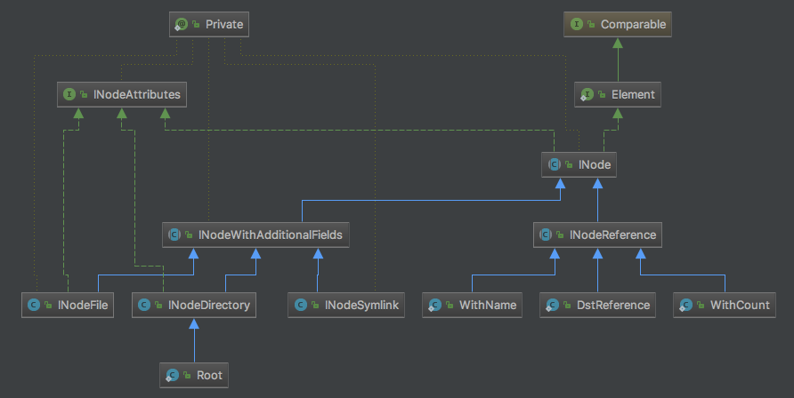

namenode主要负责文件元信息的管理和文件到数据块的映射。有了[源码|HDFS之NameNode：创建目录](/2018/02/06/源码|HDFS之NameNode：创建目录/)对创建目录过程中文件元信息操作的分析基础，就可以相对轻松的分析创建文件的流程了。

计划分三篇文章，分别分析创建文件节点（只涉及文件元信息）、添加数据块（涉及文件元信息、datanode交互）、完成文件（涉及文件元信息、datanode交互、容错性）三个子流程。仅“完成文件”子流程中涉及部分容错性的分析，即“文件创建成功后，部分数据块副本数低于最小副本系数”，其他容错性方案均需要客户端主导，统一放到对客户端的分析中讨论。

今天分析创建文件节点子流程。

<!--more-->

<!--[TOC]-->

>源码版本：Apache Hadoop 2.6.0
>
>可参考猴子追源码时的[速记](http://note.youdao.com/noteshare?id=01a40f482661c0a5ff9eb0be8b2e2e70)打断点，亲自debug一遍。
>
>[源码|HDFS之NameNode：创建目录](/2018/02/06/源码|HDFS之NameNode：创建目录/)中分析过的内容将不再重复。

# 开始之前

## 总览

根据[HDFS-1.x、2.x的RPC接口](/2018/01/09/HDFS-1.x、2.x的RPC接口/)与[源码|HDFS之NameNode：启动过程](/2018/02/01/源码|HDFS之NameNode：启动过程/)，我们得知，与创建文件节点过程联系最紧密的是ClientProtocol协议、RpcServer线程、FSNamesystem、FSDirectory（同创建目录过程）。

具体过程如下：

1. 客户端通过ClientProtocol协议向RpcServer发起创建文件的RPC请求。
2. FSNamesystem封装了各种HDFS操作的实现细节，RpcServer调用FSNamesystem中的相关方法以创建目录。
3. 进一步的，FSDirectory封装了各种目录树操作的实现细节，FSNamesystem调用FSDirectory中的相关方法在目录树中创建目标文件，并通过日志系统备份文件系统的修改。
5. 最后，RpcServer将RPC响应返回给客户端。

创建文件的RPC接口为ClientProtocol#create()：

```java
  public HdfsFileStatus create(String src, FsPermission masked,
      String clientName, EnumSetWritable<CreateFlag> flag,
      boolean createParent, short replication, long blockSize, 
      CryptoProtocolVersion[] supportedVersions)
      throws AccessControlException, AlreadyBeingCreatedException,
      DSQuotaExceededException, FileAlreadyExistsException,
      FileNotFoundException, NSQuotaExceededException,
      ParentNotDirectoryException, SafeModeException, UnresolvedLinkException,
      SnapshotAccessControlException, IOException;
```

对应的RPCServer实现为NameNodeRpcServer#create()。

后文将以NameNodeRpcServer#create()为主流程进行分析。

## 文章的组织结构

1. 如果只涉及单个分支的分析，则放在同一节。
2. 如果涉及多个分支的分析，则在下一级分多个节，每节讨论一个分支。
3. 多线程的分析同多分支。
4. 每一个分支和线程的组织结构遵循规则1-3。

# 发起RPC请求

上传一个文件`NOTICE.txt`至`/test/create_file`目录，触发提前设置好的断点：

```bash
./bin/hadoop fs -mkdir -p /test/create_file
./bin/hadoop fs -copyFromLocal NOTICE.txt /test/create_file
```

>上传文件的本质是“读本地文件+写HDFS文件”。

执行命令前，该文件不存在。

# 主流程：NameNodeRpcServer#create()

```java
  public HdfsFileStatus create(String src, FsPermission masked,
      String clientName, EnumSetWritable<CreateFlag> flag,
      boolean createParent, short replication, long blockSize, 
      CryptoProtocolVersion[] supportedVersions)
      throws IOException {
    // 获取clientMachine，如果配置了域名，则为域名，否则为ip。此处即"127.0.0.1"。
    String clientMachine = getClientMachine();
    if (stateChangeLog.isDebugEnabled()) {
      stateChangeLog.debug("*DIR* NameNode.create: file "
                         +src+" for "+clientName+" at "+clientMachine);
    }
    // 检查目标目录的字符串长度（不超过8000）和路径深度（不超过1000）（同创建目录）
    if (!checkPathLength(src)) {
      throw new IOException("create: Pathname too long.  Limit "
          + MAX_PATH_LENGTH + " characters, " + MAX_PATH_DEPTH + " levels.");
    }
    // 创建文件，见后
    HdfsFileStatus fileStatus = namesystem.startFile(src, new PermissionStatus(
        getRemoteUser().getShortUserName(), null, masked),
        clientName, clientMachine, flag.get(), createParent, replication,
        blockSize, supportedVersions);
    metrics.incrFilesCreated();
    metrics.incrCreateFileOps();
    return fileStatus;
  }
```

NameNodeRpcServer#create()涉及的参数较多，解释几个关键参数：

* src：要创建的文件路径。上传文件时，HDFS并不会直接创建目标文件名的文件，而是先创建一个"._CPOPYING_"后缀的文件。此处即`/test/create_file/NOTICE.txt._CPOPYING_`。
* flag：创建文件的选项。此处包含CREATE、OVERWRITE两个选项，详见FSNamesystem#startFileInt()方法。
* createParent：true表示“如果父目录不存在就创建”，false表示“如果父目录不存在就写失败”。此处为true。
* clientName：表征唯一客户端，同clientMachine一起用于租约管理。暂时忽略，以后分析客户端时讨论。

FSNamesystem#startFile()：

```java
  HdfsFileStatus startFile(String src, PermissionStatus permissions,
      String holder, String clientMachine, EnumSet<CreateFlag> flag,
      boolean createParent, short replication, long blockSize, 
      CryptoProtocolVersion[] supportedVersions)
      throws AccessControlException, SafeModeException,
      FileAlreadyExistsException, UnresolvedLinkException,
      FileNotFoundException, ParentNotDirectoryException, IOException {
    HdfsFileStatus status = null;
    ...// cache相关
    
    try {
      status = startFileInt(src, permissions, holder, clientMachine, flag,
          createParent, replication, blockSize, supportedVersions,
          cacheEntry != null);
    } catch (AccessControlException e) {
      logAuditEvent(false, "create", src);
      throw e;
    } finally {
      RetryCache.setState(cacheEntry, status != null, status);
    }
    return status;
  }
  
  ...
  
  private HdfsFileStatus startFileInt(final String srcArg,
      PermissionStatus permissions, String holder, String clientMachine,
      EnumSet<CreateFlag> flag, boolean createParent, short replication,
      long blockSize, CryptoProtocolVersion[] supportedVersions,
      boolean logRetryCache)
      throws AccessControlException, SafeModeException,
      FileAlreadyExistsException, UnresolvedLinkException,
      FileNotFoundException, ParentNotDirectoryException, IOException {
    String src = srcArg;
    ...// log
    if (!DFSUtil.isValidName(src)) {
      throw new InvalidPathException(src);
    }
    
    // 检查文件的副本系数是否合法：不大于最大副本数${dfs.replication.max}，默认512；不小于最小副本数${dfs.namenode.replication.min}，默认1
    blockManager.verifyReplication(src, replication, clientMachine);

    // skipSync初始化为false，后面用于判断文件是否创建成功
    boolean skipSync = false;
    HdfsFileStatus stat = null;
    FSPermissionChecker pc = getPermissionChecker();
    // 第一次检查不加锁减少资源浪费，第二次检查加锁保证正确性。详见创建目录过程中的FSNamesystem#mkdirsInt()
    checkOperation(OperationCategory.WRITE);
    
    // 检查数据块大小：不小于${dfs.namenode.fs-limits.min-block-size}，默认1024*1024B = 1MB
    if (blockSize < minBlockSize) {
      throw new IOException("Specified block size is less than configured" +
          " minimum value (" + DFSConfigKeys.DFS_NAMENODE_MIN_BLOCK_SIZE_KEY
          + "): " + blockSize + " < " + minBlockSize);
    }
    
    byte[][] pathComponents = FSDirectory.getPathComponentsForReservedPath(src);
    // flag包含CREATE选项，则create置true
    boolean create = flag.contains(CreateFlag.CREATE);
    // flag包含OVERWRITE选项，则overwrite置true
    boolean overwrite = flag.contains(CreateFlag.OVERWRITE);
    // flag不包含LAZY_PERSIST选项，则isLazyPersist置false
    boolean isLazyPersist = flag.contains(CreateFlag.LAZY_PERSIST);

    waitForLoadingFSImage();

    ...// 加密相关

    BlocksMapUpdateInfo toRemoveBlocks = null;
    writeLock();
    try {
      // 见前面的第一次检查
      checkOperation(OperationCategory.WRITE);
      checkNameNodeSafeMode("Cannot create file" + src);
      src = resolvePath(src, pathComponents);
      // 创建文件，返回待删除数据块。见后
      toRemoveBlocks = startFileInternal(pc, src, permissions, holder, 
          clientMachine, create, overwrite, createParent, replication, 
          blockSize, isLazyPersist, suite, protocolVersion, edek, logRetryCache);
      // 查询得到目标文件的FileStatus，最后会返回给客户端。见后
      stat = dir.getFileInfo(src, false,
          FSDirectory.isReservedRawName(srcArg), true);
    } catch (StandbyException se) {
      // 如果创建文件失败，则skipSync置true，表示不需要同步
      skipSync = true;
      throw se;
    } finally {
      writeUnlock();
      // 如果创建文件成功，则skipSync仍为false，表示需要同步
      if (!skipSync) {
        // 手动同步日志。详见创建目录过程中的FSNamesystem#mkdirsInt()
        getEditLog().logSync();
        // 如果存在待删除数据块，则移除。见后
        if (toRemoveBlocks != null) {
          removeBlocks(toRemoveBlocks);
          toRemoveBlocks.clear();
        }
      }
    }

    logAuditEvent(true, "create", srcArg, null, stat);
    return stat;
  }
```

整体思路很容易理解：

1. 检查
2. 创建文件（可能需要删除旧文件节点）
3. 查询FileStatus
4. 移除待删除数据块（如果有旧文件的话）

“1. 检查”部分需要关注的是58-63行。flag是一个EnumSet，保存了当前create操作的选项，如：

* CREATE：创建新文件，与APPEND区分
* OVERWRITE：重写文件，如果文件已存在，则先删除旧文件（创建文件时的默认选项）。
* APPEND：追加写旧文件，与CREATE
* SYNC_BLOCK：强制数据块即时落盘。暂不关心。
* LAZY_PERSIST：优先将数据块存储于瞬时存储（如内存中），加速读写，牺牲数据持久性。暂不关心。

>EnumSet可以简单理解为枚举类型的集合，源码实现不难，暂略。

此处的flag包含CREATE、OVERWRITE两个选项，则create置true，overwite置true，isLazyPersist置false。

2-4部分主要对应FSNamesystem#startFileInternal()、FSDirectory#getFileInfo()、FSNamesystem#removeBlocks()三个方法。

## 创建文件：FSNamesystem#startFileInternal()

FSNamesystem#startFileInternal()：

```java
  private BlocksMapUpdateInfo startFileInternal(FSPermissionChecker pc, 
      String src, PermissionStatus permissions, String holder, 
      String clientMachine, boolean create, boolean overwrite, 
      boolean createParent, short replication, long blockSize, 
      boolean isLazyPersist, CipherSuite suite, CryptoProtocolVersion version,
      EncryptedKeyVersion edek, boolean logRetryEntry)
      throws FileAlreadyExistsException, AccessControlException,
      UnresolvedLinkException, FileNotFoundException,
      ParentNotDirectoryException, RetryStartFileException, IOException {
    assert hasWriteLock();
    final INodesInPath iip = dir.getINodesInPath4Write(src);
    // 检查目标路径是否指向目录节点。目录无法被重写为文件（HDFS文件系统与Linux FS的行为比较相似）。
    final INode inode = iip.getLastINode();
    if (inode != null && inode.isDirectory()) {
      throw new FileAlreadyExistsException(src +
          " already exists as a directory");
    }

    ...// 加密相关

    // 根据路径名src在FSDirectory中查询同名旧文件节点myFile，null表示不存在旧文件。27-29行与42-70行使用
    // 此处不存在同名旧文件，myFile为null
    final INodeFile myFile = INodeFile.valueOf(inode, src, true);
    // 假设isPermissionEnabled为true
    if (isPermissionEnabled) {
      // 如果是OVERWRITE写且旧文件存在，需要检查是否对旧文件有写权限（删除旧文件需要文件的写权限）
      if (overwrite && myFile != null) {
        checkPathAccess(pc, src, FsAction.WRITE);
      }
      // 检查是否对最低一级实际存在的路径的祖先目录（父目录是最低的祖先目录）的权限有写权限（删除旧文件、创建新文件、创建目录需要父目录的写权限）
      checkAncestorAccess(pc, src, FsAction.WRITE);
    }

    // 如果createParent为false，则检查父目录是否存在。此处createParent为true，不需要检查
    if (!createParent) {
      verifyParentDir(src);
    }

    try {
      // 正式写文件之前的处理：对有无同名为文件、是否为OVERWRITE写有不同的处理
      BlocksMapUpdateInfo toRemoveBlocks = null;
      // 回顾21-22行，myFile为null表示旧文件不存在
      if (myFile == null) { // 旧文件不存在的情况。此处符合
        // 如果不是CREATE写，则要求文件存在，而文件不存在，所以抛出FileNotFoundException
        if (!create) {
          throw new FileNotFoundException("Can't overwrite non-existent " +
              src + " for client " + clientMachine);
        }
        // 否则什么都不做
      } else {  // 旧文件存在的情况。此处不符合
        if (overwrite) {    // 如果为OVERWITE写，需要删除旧文件
          toRemoveBlocks = new BlocksMapUpdateInfo();
          List<INode> toRemoveINodes = new ChunkedArrayList<INode>();
          // 在目录树中删除旧文件，并将待删除的数据块填充至toRemoveBlocks中，将待删除的文件节点填充至toRemoveINodes中。见后
          long ret = dir.delete(src, toRemoveBlocks, toRemoveINodes, now());
          // ret是已删除的节点数量，则`ret >= 0`表示删除成功
          if (ret >= 0) {
            incrDeletedFileCount(ret);
            // 根据toRemoveINodes从FSDirectory#inodeMap中移除待删除节点。见后
            // 该方法的参数blocks置null表示此处不处理待删除数据块
            removePathAndBlocks(src, null, toRemoveINodes, true);
          }
        } else {    // 否则，必然是客户端重试发起的CREATE写，处理异常
          // 文件已存在，说明上一次CREATE写至少已经在目录树中添加了文件节点
          // 进行租约恢复，然后抛出异常，中断重试。暂时不深入
          recoverLeaseInternal(myFile, src, holder, clientMachine, false);
          throw new FileAlreadyExistsException(src + " for client " +
              clientMachine + " already exists");
        }
      }

      // 检查inode + block总数，见创建目录流程
      checkFsObjectLimit();
      INodeFile newNode = null;

      // Always do an implicit mkdirs for parent directory tree.
      Path parent = new Path(src).getParent();
      // 如果是根目录或空目录，则前面的异常检查中已经发现并提前抛出相应异常
      // 因此，此时parent必然不为null，递归创建父目录。
      // FSNamesystem#mkdirsRecursively()见创建目录流程，除非发生异常，否则必然返回true，进入if语句块
      if (parent != null && mkdirsRecursively(parent.toString(),
              permissions, true, now())) {
        // 创建文件节点（创建文件节点 + 加入目录树中 + 加入FSDirectory#inodeMap）
        newNode = dir.addFile(src, permissions, replication, blockSize,
                              holder, clientMachine);
      }
      if (newNode == null) {
        throw new IOException("Unable to add " + src +  " to namespace");
      }
      
      // 添加租约。暂时不深入
      leaseManager.addLease(newNode.getFileUnderConstructionFeature()
          .getClientName(), src);

      ...// 加密相关

      // 设置存储策略
      setNewINodeStoragePolicy(newNode, iip, isLazyPersist);

      // 记录打开文件（此处为创建文件）的日志
      getEditLog().logOpenFile(src, newNode, overwrite, logRetryEntry);
      if (NameNode.stateChangeLog.isDebugEnabled()) {
        NameNode.stateChangeLog.debug("DIR* NameSystem.startFile: added " +
            src + " inode " + newNode.getId() + " " + holder);
      }
      // 返回待删除数据块，交给外层删除
      return toRemoveBlocks;
    } catch (IOException ie) {
      NameNode.stateChangeLog.warn("DIR* NameSystem.startFile: " + src + " " +
          ie.getMessage());
      throw ie;
    }
  }
```

>通过${dfs.permissions.enabled}参数配置isPermissionEnabled。该选项默认值是true，猴子没有设置，该值却被置为false，奇怪。。。

假设仅考虑`{CREATE, OVREWRITE}`写，且旧文件存在（尽管实际情况是旧文件不存在）。整体思路如下：

1. 检查
2. 从目录树中删除节点
3. 从FSDirectory#inodeMap中删除节点
4. 递归创建父目录
5. 创建文件节点
6. 添加租约
7. 记录打开文件（此处为创建文件）的日志
8. 返回待删除数据块

>55行从目录树中删除节点，61行从FSDirectory#inodeMap中删除节点。要区分“目录树”（或“节点树”）与FSDirectory#inodeMap：
>
>* 目录树是以INode为中间节点或叶子节点的树结构，以INode之间的引用关系相互维系。
>* FSDirectory#inodeMap是一个一维的线性结构，仅仅是INode的集合（正如BlockManager#blocksMap是Block的集合）。
>

1、4、6、7、8不展开，下面讨论2、3、5。

其中，“5. 创建文件节点”的FSDirectory#addFile()方法与创建目录过程中的FSDirectory#unprotectedMkdir()方法对标，可对照分析。

### 从目录树中删除节点：FSDirectory#delete()

FSDirectory#delete()：

```java
  long delete(String src, BlocksMapUpdateInfo collectedBlocks,
              List<INode> removedINodes, long mtime) throws IOException {
    if (NameNode.stateChangeLog.isDebugEnabled()) {
      NameNode.stateChangeLog.debug("DIR* FSDirectory.delete: " + src);
    }
    final long filesRemoved;
    writeLock();
    try {
      final INodesInPath inodesInPath = getINodesInPath4Write(
          normalizePath(src), false);
      // 检查当前路径是否允许被删除，主要是防止根目录"/"被删除
      if (!deleteAllowed(inodesInPath, src) ) { // 如果不允许删除，则filesRemoved置-1，最终返回-1，通知外层有异常
        filesRemoved = -1;
      } else {  // 否则，删除
        ...// 快照相关
        // 递归删除子目录树（或文件节点）
        filesRemoved = unprotectedDelete(inodesInPath, collectedBlocks,
            removedINodes, mtime);
        ...// 快照相关
      }
    } finally {
      writeUnlock();
    }
    // 返回已删除的节点数量，失败返回-1。因此，外层可以用"ret >= 0"判断是否删除成功
    return filesRemoved;
  }
```

* 尽管此处删除的只是一个文件，但FSDirectory#delete()方法支持子目录树的删除（如果src指向一个有孩子节点的目录节点）。
* 读者可参考创建目录过程中的FSDirectory#unprotectedMkdir()分析FSDirectory#unprotectedDelete()，重点是对目录树的操作。

### 从FSDirectory#inodeMap中删除节点：FSNamesystem#removePathAndBlocks()

FSNamesystem#removePathAndBlocks()：

```java
  void removePathAndBlocks(String src, BlocksMapUpdateInfo blocks,
      List<INode> removedINodes, final boolean acquireINodeMapLock) {
    assert hasWriteLock();
    // 移除所有前缀为src的租约。此处即移除客户端对旧文件的租约
    leaseManager.removeLeaseWithPrefixPath(src);
    // 如果待删除节点removedINodes不为null，即存在待删除节点
    if (removedINodes != null) {
      if (acquireINodeMapLock) {
        dir.writeLock();
      }
      try {
        // 从FSDirectory#inodeMap中移除待删除节点
        dir.removeFromInodeMap(removedINodes);
      } finally {
        if (acquireINodeMapLock) {
          dir.writeUnlock();
        }
      }
      removedINodes.clear();
    }
    // 如果待删除数据块blocks为null，即不存在待删除数据块，则直接返回
    // 此处传入的blocks为null，直接返回，不处理待删除数据块
    if (blocks == null) {
      return;
    }
    
    // 否则，相应触发各数据块的状态转换（在各缓冲区之间增删数据块），以移除待删除数据块
    removeBlocksAndUpdateSafemodeTotal(blocks);
  }
```

* 同FSDirectory#delete()，尽管此处删除的只是一个文件，但FSNamesystem#removePathAndBlocks()方法支持子目录树的删除（如果src指向一个有孩子节点的目录节点）。

由于FSNamesystem#startFileInternal()中将FSNamesystem#removePathAndBlocks()的参数blocks显示置为null，则此处仅从FSDirectory#inodeMap中删除节点，而不处理待删除数据块。正因此，外层的FSNamesystem#startFileInternal()才能返回待删除数据块，交给更外层的FSNamesystem#startFileInt()移除。后文的FSNamesystem#removeBlocks()方法将移除这些数据块。

>`租约`是一个`<holder, paths, lastUpdate>`形式的三元组，描述“_客户端holder拥有的对多个目录paths的写权限的租期，从lastUpdate开始_”。客户端移除、文件移除、租约过期，都需要相应移除租约。此处只删除一个文件，直接移除租约即可；如果src指向了一个子目录树，则需要移除所有前缀为src的租约。

### 创建文件节点：FSDirectory#addFile()

```java
  INodeFile addFile(String path, PermissionStatus permissions,
                    short replication, long preferredBlockSize,
                    String clientName, String clientMachine)
    throws FileAlreadyExistsException, QuotaExceededException,
      UnresolvedLinkException, SnapshotAccessControlException, AclException {

    long modTime = now();
    // 创建文件节点，见后
    INodeFile newNode = newINodeFile(namesystem.allocateNewInodeId(),
        permissions, modTime, modTime, replication, preferredBlockSize);
    // 转换为UnderConstruction状态
    newNode.toUnderConstruction(clientName, clientMachine);

    boolean added = false;
    writeLock();
    try {
      // 加入目录树与FSDirectory#inodeMap
      added = addINode(path, newNode);
    } finally {
      writeUnlock();
    }
    if (!added) {
      NameNode.stateChangeLog.info("DIR* addFile: failed to add " + path);
      return null;
    }

    if(NameNode.stateChangeLog.isDebugEnabled()) {
      NameNode.stateChangeLog.debug("DIR* addFile: " + path + " is added");
    }
    // 返回创建的文件节点
    return newNode;
  }
```

FSDirectory#addFile()方法与创建目录过程中的FSDirectory#unprotectedMkdir()方法对标，具体为：

1. 创建文件节点newNode
2. 将newNode转换为“正在写”UnderConstruction状态
3. 将newNode加入目录树与FSDirectory#inodeMap
4. 如果添加成功，则返回newNode；否则返回null，表示添加失败

主要有两点区别：未使用INodesInPath管理创建过程中的状态（也不太需要）；创建目录过程不需要第2步的状态转换。当然，1、3步骤的具体实现也不完全相同。

下面分别讨论1、2、3。

#### 创建文件节点：FSDirectory.newINodeFile()

FSDirectory.newINodeFile()创建了一个大小为0字节的文件节点：

```java
  private static INodeFile newINodeFile(long id, PermissionStatus permissions,
      long mtime, long atime, short replication, long preferredBlockSize) {
    return newINodeFile(id, permissions, mtime, atime, replication, preferredBlockSize,
        (byte)0);
  }
  
  ...
  
  private static INodeFile newINodeFile(long id, PermissionStatus permissions,
      long mtime, long atime, short replication, long preferredBlockSize,
      byte storagePolicyId) {
    return new INodeFile(id, null, permissions, mtime, atime,
        BlockInfo.EMPTY_ARRAY, replication, preferredBlockSize,
        storagePolicyId);
  }
```

其本身只是常见的静态工厂方法。唯一的知识点是INodeFile的继承关系。

##### INodeFile的继承关系

`INodeFile.<init>()`：

```java
public class INodeFile extends INodeWithAdditionalFields
    implements INodeFileAttributes, BlockCollection {
  ...
  INodeFile(long id, byte[] name, PermissionStatus permissions, long mtime,
      long atime, BlockInfo[] blklist, short replication,
      long preferredBlockSize, byte storagePolicyID) {
    super(id, name, permissions, mtime, atime);
    header = HeaderFormat.toLong(preferredBlockSize, replication,
        storagePolicyID);
    this.blocks = blklist;
  }
  ...
}
```

INodeFile继承自INodeWithAdditionalFields，增加了文件头（一个long型数，存储数据块大小、副本系数、存储策略三种属性）、数据块数组（BlockInfo[]）。

>与之相比，INodeDirectory也继承自INodeWithAdditionalFields，只增加了children属性记录孩子节点。

`INodeWithAdditionalFields.<init>()`：

```java
public abstract class INodeWithAdditionalFields extends INode
    implements LinkedElement {
  ...
  INodeWithAdditionalFields(long id, byte[] name, PermissionStatus permissions,
      long modificationTime, long accessTime) {
    this(null, id, name, PermissionStatusFormat.toLong(permissions),
        modificationTime, accessTime);
  }
  
  ...
  
  private INodeWithAdditionalFields(INode parent, long id, byte[] name,
      long permission, long modificationTime, long accessTime) {
    super(parent);
    this.id = id;
    this.name = name;
    this.permission = permission;
    this.modificationTime = modificationTime;
    this.accessTime = accessTime;
  }
  ...
}
```

INodeWithAdditionalFields继承自INode，增加了id、name、permission、modificationTime、accessTime等文件节点INodeFile、目录节点INodeDirectory、符号节点INodeSymlink（基本概念同Linux符号连接）的基本属性，都以long型数或byte[]的形式表示，序列化友好。

`INode.<init>`()：

```java
public abstract class INode implements INodeAttributes, Diff.Element<byte[]> {
  ...
  INode(INode parent) {
    this.parent = parent;
  }
  ...
}
```

INode是目录树中节点的基本抽象，只存储了parent属性。它有一些重要的子孙类：



#### 转换为UnderConstruction状态：INodeFile#toUnderConstruction()

INodeFile#toUnderConstruction()：

```java
  public boolean isUnderConstruction() {
    return getFileUnderConstructionFeature() != null;
  }

  INodeFile toUnderConstruction(String clientName, String clientMachine) {
    Preconditions.checkState(!isUnderConstruction(),
        "file is already under construction");
    // 创建Feature
    FileUnderConstructionFeature uc = new FileUnderConstructionFeature(
        clientName, clientMachine);
    // 添加Feature
    addFeature(uc);
    return this;
  }
```

与数据块不同，文件只有两个状态：“正在写”UnderConstruction、“已完成”Completed。

HDFS 1.x中，处于“正在写”状态的文件使用INodeFileUnderConstruction表示，带quota功能的目录使用INodeDirectoryWithQuota表示。这样每增加一个feature就扩展一个INode子类的设计方法so ugly，HDFS 2.x将这些feature抽象为Feature类及其子类，增加一个特性就add一个feature，简化了INode的继承结构，未来也更容易扩展出其他Feature。

对于处于UnderConstruction状态的文件而言，通常文件关联的最后一个数据块处于数据块的UnderConstruction状态。

>以上是官方对Feature抽象的解释。不过，猴子认为与快照、quota等功能特性相比，UnderConstruction不能算作一个feature，而应该作为INodeFile的一个状态，将对该状态的处理封装在INode内部。

#### 加入目录树与FSDirectory#inodeMap：FSDirectory#addINode()

FSDirectory#addINode()：

```java
  private boolean addINode(String src, INode child
      ) throws QuotaExceededException, UnresolvedLinkException {
    byte[][] components = INode.getPathComponents(src);
    child.setLocalName(components[components.length-1]);
    cacheName(child);
    writeLock();
    try {
      // 在INodesInPath#inodes的最后一个位置添加节点
      return addLastINode(getExistingPathINodes(components), child, true);
    } finally {
      writeUnlock();
    }
  }
  
  ...
  
  INodesInPath getExistingPathINodes(byte[][] components)
      throws UnresolvedLinkException {
    return INodesInPath.resolve(rootDir, components);
  }
  
  ...
  
  private boolean addLastINode(INodesInPath inodesInPath,
      INode inode, boolean checkQuota) throws QuotaExceededException {
    // pos即最后一个位置
    final int pos = inodesInPath.getINodes().length - 1;
    // 见创建目录过程中分析的FSDirectory#addChild()方法
    return addChild(inodesInPath, pos, inode, checkQuota);
  }
```

同创建目录过程中的FSDirectory#unprotectedMkdir()一样，最后也使用了INodesInPath，并走到了FSDirectory#addChild()方法。可对照创建目录过程复习。

## 查询FileStatus：FSDirectory#getFileInfo()

FSDirectory#getFileInfo()：

```java
  HdfsFileStatus getFileInfo(String src, boolean resolveLink,
      boolean isRawPath, boolean includeStoragePolicy)
    throws IOException {
    String srcs = normalizePath(src);
    readLock();
    try {
      ...// 快照相关
      final INodesInPath inodesInPath = getINodesInPath(srcs, resolveLink);
      final INode[] inodes = inodesInPath.getINodes();
      // INodesInPath#inodes[-1]为src路径指向的目标节点。此处即刚刚创建的文件节点
      final INode i = inodes[inodes.length - 1];
      byte policyId = includeStoragePolicy && i != null && !i.isSymlink() ?
          i.getStoragePolicyID() : BlockStoragePolicySuite.ID_UNSPECIFIED;
      // 根据相关信息创建FileStatus
      return i == null ? null : createFileStatus(HdfsFileStatus.EMPTY_NAME, i,
          policyId, inodesInPath.getPathSnapshotId(), isRawPath,
          inodesInPath);
    } finally {
      readUnlock();
    }
  }
  
  ...
  
  HdfsFileStatus createFileStatus(byte[] path, INode node, byte storagePolicy,
      int snapshot, boolean isRawPath, INodesInPath iip) throws IOException {
     long size = 0;     // length is zero for directories
     short replication = 0;
     long blocksize = 0;
     final boolean isEncrypted;

     final FileEncryptionInfo feInfo = isRawPath ? null :
         getFileEncryptionInfo(node, snapshot, iip);

     boolean isLazyPersist = false;
     // 如果是文件，则设置文件大小size、副本系数replication、数据块大小blocksize
     if (node.isFile()) {
       final INodeFile fileNode = node.asFile();
       size = fileNode.computeFileSize(snapshot);
       replication = fileNode.getFileReplication(snapshot);
       blocksize = fileNode.getPreferredBlockSize();
       isEncrypted = (feInfo != null) ||
           (isRawPath && isInAnEZ(INodesInPath.fromINode(node)));
     } else {
       isEncrypted = isInAnEZ(INodesInPath.fromINode(node));
     }

     // 如果是目录，则设置孩子节点的数量childrenNum
     int childrenNum = node.isDirectory() ? 
         node.asDirectory().getChildrenNum(snapshot) : 0;

     // 创建FileStatus
     return new HdfsFileStatus(
        size, 
        node.isDirectory(), 
        replication, 
        blocksize,
        node.getModificationTime(snapshot),
        node.getAccessTime(snapshot),
        getPermissionForFileStatus(node, snapshot, isEncrypted),
        node.getUserName(snapshot),
        node.getGroupName(snapshot),
        node.isSymlink() ? node.asSymlink().getSymlink() : null,
        path,
        node.getId(),
        childrenNum,
        feInfo,
        storagePolicy);
  }
```

在创建文件的流程中，执行该方法时，*节点已经成功创建并添加到目录树中*（理想）。因此，INodesInPath#inodes[-1]即刚刚创建的文件节点。然后根据相关信息创建FileStatus并返回。

FSDirectory#createFileStatus()的实现告诉了我们一个很重要的信息：_HDFS并没有存储FileStatus，而是在每次查询时创建_。这在某些时候与我们的直觉相悖，不过考虑到单集群上千节点元信息对namenode造成的内存压力，“**尽量减少单节点冗余信息**”的实现方式就合理了。

>FSDirectory#getFileInfo()方法还被RPC方法NameNodeRpcServer#getFileInfo()调用，而查询的目标路径可能不存在文件节点，对应INodesInPath#inodes[-1]为null（参考创建目录过程中对INodesInPath用法的分析）。因此15行需要判断null的逻辑。

## 移除待删除数据块：FSNamesystem#removeBlocks()

先回顾FSNamesystem#startFileInt()中的相关逻辑：

```java
  private HdfsFileStatus startFileInt(final String srcArg,
      PermissionStatus permissions, String holder, String clientMachine,
      EnumSet<CreateFlag> flag, boolean createParent, short replication,
      long blockSize, CryptoProtocolVersion[] supportedVersions,
      boolean logRetryCache)
      throws AccessControlException, SafeModeException,
      FileAlreadyExistsException, UnresolvedLinkException,
      FileNotFoundException, ParentNotDirectoryException, IOException {
    String src = srcArg;
    ...// log
    ...// 检查
    
    // skipSync初始化为false，后面用于判断文件是否创建成功
    boolean skipSync = false;
    HdfsFileStatus stat = null;

    ...// 加密相关

    BlocksMapUpdateInfo toRemoveBlocks = null;
    writeLock();
    try {
      ...// 检查
      src = resolvePath(src, pathComponents);
      // 创建文件，返回待删除数据块。见前
      toRemoveBlocks = startFileInternal(pc, src, permissions, holder, 
          clientMachine, create, overwrite, createParent, replication, 
          blockSize, isLazyPersist, suite, protocolVersion, edek, logRetryCache);
      // 查询得到目标文件的FileStatus，最后会返回给客户端。见前
      stat = dir.getFileInfo(src, false,
          FSDirectory.isReservedRawName(srcArg), true);
    } catch (StandbyException se) {
      // 如果创建文件失败，则skipSync置true，表示不需要同步
      skipSync = true;
      throw se;
    } finally {
      writeUnlock();
      // 如果创建文件成功，则skipSync仍为false，表示需要同步
      if (!skipSync) {
        // 手动同步日志。详见创建目录过程中的FSNamesystem#mkdirsInt()
        getEditLog().logSync();
        // 如果存在待删除数据块，则移除。见后
        if (toRemoveBlocks != null) {
          removeBlocks(toRemoveBlocks);
          toRemoveBlocks.clear();
        }
      }
    }

    logAuditEvent(true, "create", srcArg, null, stat);
    return stat;
  }
```

此处开启了OVERWRITE选项，如果存在同名旧文件，则FSNamesystem#startFileInternal()中已经删除了旧文件的INodeFile，并返回旧文件关联的待删除数据块toRemoveBlocks。

猴子上传`NOTICE.txt`时，目标路径不存在同名文件，toRemoveBlocks为null。现在假设存在同名文件，那么toRemoveBlocks不为null，将执行43行FSNamesystem#removeBlocks()删除这些数据块。

FSNamesystem#removeBlocks()：

```java
  void removeBlocks(BlocksMapUpdateInfo blocks) {
    List<Block> toDeleteList = blocks.getToDeleteList();
    Iterator<Block> iter = toDeleteList.iterator();
    while (iter.hasNext()) {
      writeLock();
      try {
        for (int i = 0; i < BLOCK_DELETION_INCREMENT && iter.hasNext(); i++) {
          blockManager.removeBlock(iter.next());
        }
      } finally {
        writeUnlock();
      }
    }
  }
```

遍历待删除数据块，依次调用BlockManager#removeBlock()。

BlockManager#removeBlock()：

```java
  public void removeBlock(Block block) {
    assert namesystem.hasWriteLock();
    // 没看懂block.setNumBytes的作用，可能与数据块汇报有关？？？暂时忽略
    block.setNumBytes(BlockCommand.NO_ACK);
    // part 1: 准备向datanode下发副本删除命令
    addToInvalidates(block);
    // part 2: 除副本删除外，不再需要对这些数据块作出任何处理
    corruptReplicas.removeFromCorruptReplicasMap(block);
    blocksMap.removeBlock(block);
    pendingReplications.remove(block);
    neededReplications.remove(block, UnderReplicatedBlocks.LEVEL);
    if (postponedMisreplicatedBlocks.remove(block)) {
      postponedMisreplicatedBlocksCount.decrementAndGet();
    }
  }
```

方法主要分为两部分：

1. 将待删除数据块加入`正在删除数据块缓冲区BlockManager#invalidateBlocks`，表示需要删除该数据块（根据[源码|HDFS之NameNode：启动过程](/2018/02/01/源码|HDFS之NameNode：启动过程/)，BlockManager#ReplicationMonitor线程定时扫描缓冲区，生成副本删除任务，随心跳下发到datanode）。
2. 将待删除数据块从`已损坏数据块缓冲区BlockManager#corruptReplicas`、`几乎全量数据块缓冲区BlockManager#blocksMap`、`需要复制数据块缓冲区BlockManager#neededReplications`、`正在复制数据块缓冲区BlockManager#pendingReplications`中移除，表示除删除外，不再需要对该数据块作出任何处理。

对其他缓冲区：租约已经删除，对于namenode来说，已不存在“正在写”状态的数据块；也不需要从`复制超时数据块缓冲区BlockManager#pendingReplications#timedOutItems`中移除数据块，因为有工作线程能定期扫描BlockManager#pendingReplications#timedOutItems，发现数据块已经不需要再复制，就直接删除了。

以上删除操作都是幂等的，如果存在就删除，不存在就什么都不做。

>猴子有两个疑问没解决：
>
>* 没看懂block.setNumBytes的作用，可能与数据块汇报有关？
>* 为什么不及时将数据块从`需要删除数据块缓冲区BlockManager#excessReplicateMap`中移除？尽管不删除也不会影响正确性，但可能导致多发出一个无效命令。
>

# 总结

创建文件节点的过程与创建目录节点大同小异，大部分时候只涉及文件元信息的操作，少量涉及数据块操作（移除待删除数据块）：

* 【复习】各关键组件的交互方式：
    * 最外层：NameNodeRpcServer#create()简单检查，主要逻辑交给FSNamesystem#startFile()。
    * 中间层：FSNamesystem中的`“startFile - startFileInt - startFileInternal”`三级结构。
    * 最内层：FSNamesystem最终封装`"FSDirectory#addFile() + FSEditLog#logOpenFile()"`组合（FSDirectory#addFile()违背了unprotected前缀命名习惯）。
* 【复习】INodesInPath的结构与用法，特别是INodesInPath#inodes的用法。
* 【新】创建文件时（包括后续整个写文件流程），文件处于UnderConstruction状态（同时，发起创建文件请求的客户端持有该文件的租约）。
* 【新】INode的继承关系。
* 【新】如何通过缓冲区移除待删除数据块。
