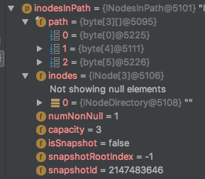

namenode主要负责文件元信息的管理和文件到数据块的映射。其中，创建目录只涉及文件元信息的操作。本文分析namenode创建目录过程的源码实现，为后面分析写文件过程打基础。

<!--more-->

<!--[TOC]-->

>源码版本：Apache Hadoop 2.6.0
>
>可参考猴子追源码时的[速记](http://note.youdao.com/noteshare?id=1e243ff433616390f286d7c9f5a4b293)打断点，亲自debug一遍。

# 开始之前

## 总览

根据[HDFS-1.x、2.x的RPC接口](/2018/01/09/HDFS-1.x、2.x的RPC接口/)与[源码|HDFS之NameNode：启动过程](/2018/02/01/源码|HDFS之NameNode：启动过程/)，我们得知，与创建目录过程联系最紧密的是ClientProtocol协议、RpcServer线程、FSNamesystem、FSDirectory。

具体过程如下：

1. 客户端通过ClientProtocol协议向RpcServer发起创建目录的RPC请求。
2. FSNamesystem封装了各种HDFS操作的实现细节，RpcServer调用FSNamesystem中的相关方法以创建目录。
3. 进一步的，FSDirectory封装了各种目录树操作的实现细节，FSNamesystem调用FSDirectory中的相关方法在目录树中创建目标目录，并通过日志系统备份文件系统的元信息。
4. 最后，RpcServer将RPC响应返回给客户端。

创建目录的RPC接口为ClientProtocol#mkdirs()：

```java
  public boolean mkdirs(String src, FsPermission masked, boolean createParent)
      throws AccessControlException, FileAlreadyExistsException,
      FileNotFoundException, NSQuotaExceededException,
      ParentNotDirectoryException, SafeModeException, UnresolvedLinkException,
      SnapshotAccessControlException, IOException;
```

对应的RPCServer实现为NameNodeRpcServer#mkdirs()。

后文将以NameNodeRpcServer#mkdirs()为主流程进行分析。

## 文章的组织结构

1. 如果只涉及单个分支的分析，则放在同一节。
2. 如果涉及多个分支的分析，则在下一级分多个节，每节讨论一个分支。
3. 多线程的分析同多分支。
4. 每一个分支和线程的组织结构遵循规则1-3。

# 发起RPC请求

创建一个目录`/test/mkdir`，触发提前设置好的断点：

```bash
./bin/hadoop fs -mkdir -p /test/mkdir
```

执行命令前，该目录不存在，同时`-p`选项会递归创建不存在的父目录。根目录是启动namenode时创建（或从备份中加载）的，则理想情况下，HDFS会先后创建`/test`、`/mkdir`两个目录，最后成功返回。

# 主流程：NameNodeRpcServer#mkdirs()

NameNodeRpcServer#mkdirs()：

```java
  public boolean mkdirs(String src, FsPermission masked, boolean createParent)
      throws IOException {
    if(stateChangeLog.isDebugEnabled()) {
      stateChangeLog.debug("*DIR* NameNode.mkdirs: " + src);
    }
    // 检查目标目录的字符串长度（不超过8000）和路径深度（不超过1000）
    if (!checkPathLength(src)) {
      throw new IOException("mkdirs: Pathname too long.  Limit " 
                            + MAX_PATH_LENGTH + " characters, " + MAX_PATH_DEPTH + " levels.");
    }
    // 通常NameNodeRpcServer中的RPC方法实现只有一些简单的检查，细节都交给FSNamesystem
    return namesystem.mkdirs(src,
        new PermissionStatus(getRemoteUser().getShortUserName(),
            null, masked), createParent);
  }
```

通常NameNodeRpcServer只做一些简单的检查，然后直接调用FSNamesystem中的同名方法。

FSNamesystem#mkdirs()：

```java
  boolean mkdirs(String src, PermissionStatus permissions,
      boolean createParent) throws IOException, UnresolvedLinkException {
    boolean ret = false;
    try {
      ret = mkdirsInt(src, permissions, createParent);
    } catch (AccessControlException e) {
      logAuditEvent(false, "mkdirs", src);
      throw e;
    }
    return ret;
  }
  
  ...

  private boolean mkdirsInt(final String srcArg, PermissionStatus permissions,
      boolean createParent) throws IOException, UnresolvedLinkException {
    String src = srcArg;
    if(NameNode.stateChangeLog.isDebugEnabled()) {
      NameNode.stateChangeLog.debug("DIR* NameSystem.mkdirs: " + src);
    }
    // 进一步检查路径
    if (!DFSUtil.isValidName(src)) {
      throw new InvalidPathException(src);
    }
    FSPermissionChecker pc = getPermissionChecker();
    // 不加锁检查HA状态下的权限
    checkOperation(OperationCategory.WRITE);
    // 将src中的每层目录转成一个byte[]，多个层级组成byte[][]
    byte[][] pathComponents = FSDirectory.getPathComponentsForReservedPath(src);
    HdfsFileStatus resultingStat = null;
    boolean status = false;
    writeLock();
    try {
      // 加锁 re-check HA状态下的权限
      checkOperation(OperationCategory.WRITE);
      checkNameNodeSafeMode("Cannot create directory " + src);
      src = resolvePath(src, pathComponents);
      // 见下
      status = mkdirsInternal(pc, src, permissions, createParent);
      if (status) {
        resultingStat = getAuditFileInfo(src, false);
      }
    } finally {
      writeUnlock();
    }
    // 手动将日志同步到磁盘
    getEditLog().logSync();
    if (status) {
      logAuditEvent(true, "mkdirs", srcArg, null, resultingStat);
    }
    return status;
  }
```

在继续分析FSNamesystem#mkdirsInternal()之前。需要注意几个要点，在以后的分析中会无数次重逢：

* 27行未加锁获取的HA状态可能是无效的，该次检查仅为了“在不降低并发的情况下减少资源浪费”，在获取锁后需要35行的re-check。
* namenode上的路径多以byte[]的形式存在，序列化友好。29行为了方便后面的比较和处理，将src分层级转成了byte[][]。
* 39行创建目录会修改命名空间，触发备份机制。而checkpoint备份机制对优化了磁盘写操作，不会主动将日志同步到磁盘中。因此，47行需要手动同步日志。
    * 不管成功失败都需要同步。这是因为，就算失败，也可能已经创建了部分父目录，需要同步。

FSNamesystem#mkdirsInternal()：

```java
  private boolean mkdirsInternal(FSPermissionChecker pc, String src,
      PermissionStatus permissions, boolean createParent) 
      throws IOException, UnresolvedLinkException {
    assert hasWriteLock();
    ...// 目录的权限检查等
    // 如果createParent为false，则需要检查父目录是否存在。此处createParent为true，不需要检查
    if (!createParent) {
      verifyParentDir(src);
    }

    // 检查inode和block的总数是否超过的namenode限制的对象最大数量${dfs.namenode.max.objects}，默认不限制
    checkFsObjectLimit();

    // 否则，递归创建所有目录
    if (!mkdirsRecursively(src, permissions, false, now())) {
      throw new IOException("Failed to create directory: " + src);
    }
    // 不管是否创建成功，都返回true
    return true;
  }
```

我们在`FS Shell`中使用了`-p`选项，对应createParent参数为true，则不需要检查父目录是否存在，调用FSNamesystem#mkdirsRecursively()递归创建所有目录。随着后面的分析，我们会知道，除非存在异常，否则不管是否创建成功，FSNamesystem#mkdirsRecursively()一定返回true。

>“递归”一词只是直译，实际的实现是循环。

此处`“mkdirs - mkdirsInt - mkdirsInternal”`三级结构，是**namenode处理客户端RPC请求时常用的编码风格**，以后分析其他RPC请求的处理流程时也会看到。

FSNamesystem#mkdirsRecursively()从第一级不存在的目录开始，逐级创建所有目录层级：

```java
  private boolean mkdirsRecursively(String src, PermissionStatus permissions,
                 boolean inheritPermission, long now)
          throws FileAlreadyExistsException, QuotaExceededException,
                 UnresolvedLinkException, SnapshotAccessControlException,
                 AclException {
    src = FSDirectory.normalizePath(src);
    // 按层级顺序划分的String[]
    String[] names = INode.getPathNames(src);
    // components是names数组的字节表示形式，参考FSNamesystem#mkdirs()
    byte[][] components = INode.getPathComponents(names);
    final int lastInodeIndex = components.length - 1;

    dir.writeLock();
    try {
      // INodesInPath封装了按照层级组织components与inodes
      INodesInPath iip = dir.getExistingPathINodes(components);
      ...// 快照相关
      INode[] inodes = iip.getINodes();

      // 将i移动到第一个目录不存在（inodes[i] == null）的层级
      StringBuilder pathbuilder = new StringBuilder();
      int i = 1;
      for(; i < inodes.length && inodes[i] != null; i++) {
        pathbuilder.append(Path.SEPARATOR).append(names[i]);
        // 目录的所有祖先目录一定要是目录，否则抛出IOE
        if (!inodes[i].isDirectory()) {
          throw new FileAlreadyExistsException(
                  "Parent path is not a directory: "
                  + pathbuilder + " "+inodes[i].getLocalName());
        }
      }
      
      ...// 权限检查

      // 从第一级不存在的目录开始，逐级创建所有目录层级
      for(; i < inodes.length; i++) {
        pathbuilder.append(Path.SEPARATOR).append(names[i]);
        // 在目录树中创建目录节点，见后
        dir.unprotectedMkdir(allocateNewInodeId(), iip, i, components[i],
                (i < lastInodeIndex) ? parentPermissions : permissions, null,
                now);
        // 如果发现inodes[i]为null表示有异常，返回false通知外层抛出IOE
        if (inodes[i] == null) {
          return false;
        }
        // 小知识点：目录创建也包含在 FilesCreated 的统计内
        NameNode.getNameNodeMetrics().incrFilesCreated();

        final String cur = pathbuilder.toString();
        // 记录创建目录的日志
        getEditLog().logMkDir(cur, inodes[i]);
        if(NameNode.stateChangeLog.isDebugEnabled()) {
          NameNode.stateChangeLog.debug(
                  "mkdirs: created directory " + cur);
        }
      }
    } finally {
      dir.writeUnlock();
    }
    // 除了异常情况，统一返回true
    return true;
  }
```

INodesInPath按照目录的层级组织目录名与INode节点，分别保存在INodesInPath#path（byte[][]）与INodesInPath#inodes（INode[]）中。在创建节点（目录节点/文件节点，对应创建目录/创建文件操作）期间，INodesInPath#inodes的后续位置可能为null，表示该层级的INode还未创建（见FSNamesystem#mkdirsRecursively()方法）；在节点创建后，将对应位置置为目标节点（见FSDirectory#unprotectedMkdir()方法）。

回顾发起RPC请求时的前提条件：当前命名空间中不存在`/test`目录。则INodesInPath#path（components）的三级应分别对应`""`（byte[0]）、`"test"`byte[4]、`"mkdir"`byte[5]，INodesInPath#inodes的三级分别对应`INodeDirectory "/"`、`null`、`null`。因此，这里要创建的第一级目录是`/test`，创建该目录时满足`i == 1`；然后依次创建`/mkdir`目录，满足`i == 2`。看IDE的变量提示验证：



>PS：此处偷懒用了后面FSDirectory#unprotectedMkdir()方法的inodesInPath参数的配图。不过截图时还没有修改inodesInPath，与此处iip的引用是相等的，没有影响。
>
>INodesInPath的结构在目录树操作中非常常用。

正常情况下，39行创建目录节点后，目录节点一定已经创建，inodes[i]一定不为null。因此，如果43行发现inodes[i]仍为null，就说明39行执行过程中发生了异常情况，返回false通知外层抛出IOE（回顾FSNamesystem#mkdirsInternal()方法）。

另外，39行FSDirectory#unprotectedMkdir()的“不受保护”指“不包含备份机制的相关逻辑”。因此，每创建一级目录后（修改目录树），都要执行52行FSNamesystem#getEditLog#logMkDir()在日志中记录创建的目录和inode。`"FSDirectory#unprotectedMkdir() + FSNamesystem#getEditLog#logMkDir()"`组合是**namenode备份机制的常用编码风格**，以后的分析中也很常见。

>注意39行、43行、52行三处逻辑的配合：如果39行目录创建异常，将提前通过43行`return false`，不会触发52行的备份。

最后，如果不考虑43行的影响，则不管FSDirectory#unprotectedMkdir()是否执行成功，FSNamesystem#mkdirsRecursively()都会返回true。从这个角度上看，**mkdir是一个幂等操作**；继续后面的分析可进一步得知，当且仅当目录已存在时，FSDirectory#unprotectedMkdir()会返回false，此时恰恰不需要创建目录，保证了幂等性。

FSDirectory#unprotectedMkdir()：

```java
  void unprotectedMkdir(long inodeId, INodesInPath inodesInPath,
      int pos, byte[] name, PermissionStatus permission,
      List<AclEntry> aclEntries, long timestamp)
      throws QuotaExceededException, AclException {
    assert hasWriteLock();
    // 创建目标的目录节点 dir。此处即"test"目录
    final INodeDirectory dir = new INodeDirectory(inodeId, name, permission,
        timestamp);
    // 将目录节点 dir 添加到目录树中，见后
    if (addChild(inodesInPath, pos, dir, true)) {
      if (aclEntries != null) {
        AclStorage.updateINodeAcl(dir, aclEntries, Snapshot.CURRENT_STATE_ID);
      }
      // 将第pos级（从0开始）INode 设置为 dir（之前是null），见后
      inodesInPath.setINode(pos, dir);
    }
  }
```

仍以创建"test"目录为例。根据FSNamesystem#mkdirsRecursively()方法的分析，此处传入的pos为1，name为"test"的byte[]形式，inodesInPath.inodes[0]指向“test”目录的父目录节点，inodesInPath.inodes[1]为null。

在10行成功添加节点后，15行将第pos级（从0开始）INode设置为dir之前是null）。也就是FSNamesystem#mkdirsRecursively()中介绍的InodesInPath用法。

现在看19行的FSDirectory#addChild()：

```java
  private boolean addChild(INodesInPath iip, int pos,
      INode child, boolean checkQuota) throws QuotaExceededException {
    final INode[] inodes = iip.getINodes();
    // 检查路径是否与保留路径"/.reserved"冲突
    if (pos == 1 && inodes[0] == rootDir && isReservedName(child)) {
      throw new HadoopIllegalArgumentException(
          "File name \"" + child.getLocalName() + "\" is reserved and cannot "
              + "be created. If this is during upgrade change the name of the "
              + "existing file or directory to another name before upgrading "
              + "to the new release.");
    }
    // 此处传入的checkQuota为true，需要检查quota
    if (checkQuota) {
      // 限制节点名最大长度${dfs.namenode.fs-limits.max-component-length}，默认255
      verifyMaxComponentLength(child.getLocalNameBytes(), inodes, pos);
      // 限制子节点最大数量${dfs.namenode.fs-limits.max-directory-items}，默认1024*1024
      verifyMaxDirItems(inodes, pos);
    }
    
    // 检查节点名是否与保留名".snapshot"冲突
    verifyINodeName(child.getLocalNameBytes());
    
    // 更新quota
    final Quota.Counts counts = child.computeQuotaUsage();
    updateCount(iip, pos,
        counts.get(Quota.NAMESPACE), counts.get(Quota.DISKSPACE), checkQuota);
    
    // 判断是否是rename操作。暂时忽略
    boolean isRename = (child.getParent() != null);
    // 根据对INodesInPath的分析，第pos - 1级节点即当前节点的父目录
    final INodeDirectory parent = inodes[pos-1].asDirectory();
    boolean added;
    try {
      // 将child添加到父目录节点parent下，返回是否添加成功的标志（存在同名节点返回false，否则返回true），见后
      added = parent.addChild(child, true, iip.getLatestSnapshotId());
    } catch (QuotaExceededException e) {
      // 发生异常，则之前的更新是多余的，回退quota
      updateCountNoQuotaCheck(iip, pos,
          -counts.get(Quota.NAMESPACE), -counts.get(Quota.DISKSPACE));
      throw e;
    }
    if (!added) {   // 如果节点已存在，则之前的更新是多余的，回退quota
      updateCountNoQuotaCheck(iip, pos,
          -counts.get(Quota.NAMESPACE), -counts.get(Quota.DISKSPACE));
    } else {    // 否则，表示已经成功添加的节点
      // 没明白这里设置父目录干嘛？？
      iip.setINode(pos - 1, child.getParent());
      if (!isRename) {
        AclStorage.copyINodeDefaultAcl(child);
      }
      // 将child节点添加至FSDirectory#inodeMap
      addToInodeMap(child);
    }
    return added;
  }
```

传入的pos为1，child为外层创建的dir，checkQuota为true。暂时不考虑rename操作，那么思路很简单：

1. 最后的检查
2. 将child添加到父目录节点parent下
3. 将child节点添加至FSDirectory#inodeMap

>补充下如何判断rename操作：
>
>29行，如果child的父目录不为null（FSDirectory#unprotectedMkdir()中创建该节点时父目录为null），则认为是rename操作。如果是添加节点的操作，则35行INodeDirectory#addChild()添加节点成功后会将child的父目录置为parent，因此，再次进入FSDirectory#addChild()时必然是rename操作。

INodeDirectory#addChild()：

```java
  public boolean addChild(INode node, final boolean setModTime,
      final int latestSnapshotId) throws QuotaExceededException {
    // 在孩子节点列表中查找同名节点
    final int low = searchChildren(node.getLocalNameBytes());
    // 如果目标节点已存在，则返回false
    if (low >= 0) {
      return false;
    }

    ...// 快照相关
    addChild(node, low);
    if (setModTime) {
      updateModificationTime(node.getModificationTime(), latestSnapshotId);
    }
    // 否则，添加目标节点后返回true
    return true;
  }
  
  ...
  
  private void addChild(final INode node, final int insertionPoint) {
    if (children == null) {
      children = new ArrayList<INode>(DEFAULT_FILES_PER_DIRECTORY);
    }
    // 设置节点node的父目录
    node.setParent(this);
    // 在孩子节点中检查是否存在同名节点
    children.add(-insertionPoint - 1, node);

    if (node.getGroupName() == null) {
      node.setGroup(getGroupName());
    }
  }
  
  ...
  
  int searchChildren(byte[] name) {
    return children == null? -1: Collections.binarySearch(children, name);
  }
```

当前节点即parent，传入的node即外层的child。重载的两个INodeDirectory#addChild()方法很简单，注意这里的一个性能优化点即可：

* INodeDirectory#children维护了孩子节点的有序列表。
* 4行INodeDirectory#searchChildren()的内部实现是一个`二分查找`：如果不存在同名节点，则返回 `-insertionIndex - 1`，表示在insertionIndex位置插入目标节点后不破坏有序性；否则，返回节点序号`low >= 0`，说明存在同名节点，插入失败，6-8行返回false。此处不存在任何孩子节点，因此`insertionIndex = 0`，则`low = -1`，继续执行。
* 28行insertionPoint即外层的low，满足`insertionPoint == -insertionIndex - 1`，则插入位置满足`insertionIndex == -insertionPoint - 1`。如上，在insertionIndex位置插入目标节点，不会破坏INodeDirectory#children的有序性。

>24行设置父目录，也就是FSDirectory#addChild()中介绍的rename操作判断方法。

至此，第一级目录"test"的创建已经分析完毕。接下来，程序将回到FSNamesystem#mkdirsRecursively()继续创建第二级目录"mkdir"。最后，将创建结果返回给客户端。

# 总结

namenode创建目录的过程只涉及文件元信息的操作，逻辑相对简单。概括起来，需掌握几个点：

* 各关键组件的交互方式：
    * FSNamesystem中的`“mkdirs - mkdirsInt - mkdirsInternal”`三级结构。延伸到最外层与NameNodeRpcServer交互的NameNodeRpcServer#mkdirs()，与最内层封装FSDirectory等组件的FSNamesystem#mkdirsRecursively()。
    * `"FSDirectory#unprotectedMkdir() + FSNamesystem#getEditLog#logMkDir()"`组合
* INodesInPath的结构与用法，特别是INodesInPath#inodes的用法
