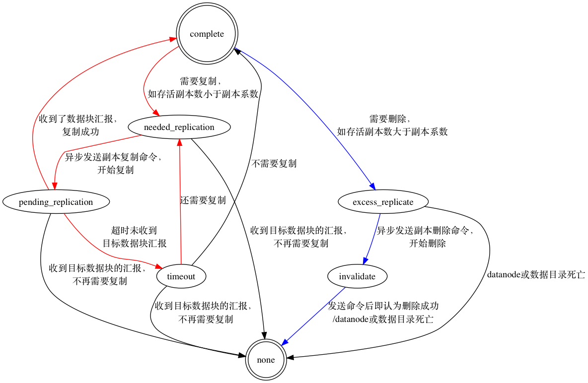

仿照[源码|HDFS之DataNode：启动过程](/2018/01/18/源码|HDFS之DataNode：启动过程/)，NameNode也从启动过程开始。

namenode的启动过程与HA紧紧绑定在一起，但本文暂不讨论HA相关内容，以后再填HA的坑。

<!--more-->

<!--[TOC]-->

>源码版本：Apache Hadoop 2.6.0
>
>可参考猴子追源码时的[速记](http://note.youdao.com/noteshare?id=9dd8fd7a0949688453cca58ba229685d)打断点，亲自debug一遍。

# 开始之前

## 总览

namenode的启动过程围绕着safemode、HA等展开，启动之后，各种工作线程开始发挥作用。主要包括：

* 加载fsimage与editlog
* 启动多种工作线程，主要包括：
    * 通信：RpcServer
    * 监控：JVMPauseMonitor、PendingReplicationMonitor、DecommissionManager#Monitor、HeartbeatManager#Monitor、ReplicationMonitor、LeaseManager#Monitor、NameNodeResourceMonitor
    * 其他：HttpServer (Web UI)、NameNodeEditLogRoller
* HA相关（暂不讨论）
* 关闭safemode

>CacheManager#CacheReplicationMonitor等暂不讨论。

### 文件管理机制

namenode通过FSNamesystem管理文件元数据。具体来讲：

* 通过FSDirectory管理文件系统的命名空间
* 通过BlockManager管理文件到数据块的映射和数据块到数据节点的映射

### namenode上的数据块状态

与yarn不同，hdfs并没有直接用状态机来管理block，而是将不同状态的block存储在不同的缓冲区中，状态迁移则对应数据块在不同缓冲区中的移动。包括BlockManager#blocksMap，namenode上的数据块状态共涉及以下几种缓冲区：

* `正在写入`的数据块：通过LeaseManager扫描INodeFile，BlockInfo#isComplete()返回false即为正在写入的数据块（不常用）
* 存储数据块的元信息，可以认为存储`已完成`等所有状态的数据块：BlockManager#blocksMap，BlockInfo#isComplete()返回true
* `需要复制`的数据块：BlockManager#neededReplications
* `正在复制`的数据块：BlockManager#pendingReplications
* `复制超时`的数据块：BlockManager#pendingReplications#timedOutItems
* 多余的数据块：BlockManager#excessReplicateMap（即`需要删除`的数据块）
* 无效数据块缓冲区BlockManager#invalidateBlocks（即`正在删除`的数据块） 

>BlockManager#excessReplicateMap与BlockManager#neededReplications对应，BlockManager#invalidateBlocks与BlockManager#pendingReplications对应，为了统一，本文相应称BlockManager#excessReplicateMap为“需要删除数据块缓冲区”，称BlockManager#invalidateBlocks为“正在删除数据块缓冲区”。

其中，与数据块（对应多个副本）写入密切相关的LeaseManager；与副本复制任务密切相关的是BlockManager#neededReplications、BlockManager#pendingReplications、BlockManager#pendingReplications#timedOutItems，与副本删除密切相关的是BlockManager#excessReplicateMap、BlockManager#invalidateBlocks。

详细的状态转换逻辑在分析完源码后，再来总结。

## 文章的组织结构

1. 如果只涉及单个分支的分析，则放在同一节。
2. 如果涉及多个分支的分析，则在下一级分多个节，每节讨论一个分支。
3. 多线程的分析同多分支。
4. 每一个分支和线程的组织结构遵循规则1-3。

# 主流程

namenode的Main Class是NameNode，先找NameNode.main()：

```java
  public static void main(String argv[]) throws Exception {
    if (DFSUtil.parseHelpArgument(argv, NameNode.USAGE, System.out, true)) {
      System.exit(0);
    }

    try {
      StringUtils.startupShutdownMessage(NameNode.class, argv, LOG);
      // 创建namenode
      NameNode namenode = createNameNode(argv, null);
      // 等待namenode关闭
      if (namenode != null) {
        namenode.join();
      }
    } catch (Throwable e) {
      LOG.fatal("Failed to start namenode.", e);
      terminate(1, e);
    }
  }
  
  ...
  
  public void join() {
    try {
      // 等待RPCServer关闭，其他守护进程会自动关闭
      rpcServer.join();
    } catch (InterruptedException ie) {
      LOG.info("Caught interrupted exception ", ie);
    }
  }
```

NameNode#join()等待namenode关闭，基本逻辑同datanode。

主要看NameNode.createNameNode()：

```java
  public static NameNode createNameNode(String argv[], Configuration conf)
      throws IOException {
    LOG.info("createNameNode " + Arrays.asList(argv));
    if (conf == null)
      conf = new HdfsConfiguration();
    // 解析启动选项
    StartupOption startOpt = parseArguments(argv);
    if (startOpt == null) {
      printUsage(System.err);
      return null;
    }
    setStartupOption(conf, startOpt);

    switch (startOpt) {
      ...// 其他分支
      default: {
        // 正常启动的话
        // 初始化metric系统
        DefaultMetricsSystem.initialize("NameNode");
        // 创建NameNode
        return new NameNode(conf);
      }
    }
  }
```

正常启动的话，满足`startOpt == StartupOption.REGULAR`，会走到default分支。

`NameNode.<init>()`：

```java
  public NameNode(Configuration conf) throws IOException {
    this(conf, NamenodeRole.NAMENODE);
  }
  
  ...

  protected NameNode(Configuration conf, NamenodeRole role) 
      throws IOException { 
    this.conf = conf;
    this.role = role;
    // 设置NameNode#clientNamenodeAddress为"hdfs://localhost:9000"
    setClientNamenodeAddress(conf);
    String nsId = getNameServiceId(conf);
    String namenodeId = HAUtil.getNameNodeId(conf, nsId);
    // HA相关
    this.haEnabled = HAUtil.isHAEnabled(conf, nsId);
    state = createHAState(getStartupOption(conf));
    this.allowStaleStandbyReads = HAUtil.shouldAllowStandbyReads(conf);
    this.haContext = createHAContext();
    try {
      initializeGenericKeys(conf, nsId, namenodeId);
      // 完成实际的初始化工作
      initialize(conf);
      // HA相关
      try {
        haContext.writeLock();
        state.prepareToEnterState(haContext);
        state.enterState(haContext);
      } finally {
        haContext.writeUnlock();
      }
    } catch (IOException e) {
      this.stop();
      throw e;
    } catch (HadoopIllegalArgumentException e) {
      this.stop();
      throw e;
    }
  }
```

这里要特别说明部分HA的内容：

尽管本地的伪分布式集群无法开启HA（对应**NameNode#haEnabled为false**），**namenode仍然拥有一个HAState**，此时，namenode会**被标记为active**（对应`HAState ACTIVE_STATE = new ActiveState()`），然后在ActiveState#enterState()中启动LeaseManager#Monitor、NameNodeEditLogRoller等。

>具体来讲，在NameNode#initialize()完成实际的初始化工作返回后，还要执行ActiveState#enterState()，完成一些只有active状态namenode才应该做的工作，如：
>
>* 打开FsDirectory的quota检查
>* 启动**LeaseManager#Monitor**
>* 启动NameNodeResourceMonitor
>* 启动NameNodeEditLogRoller
>* 启动CacheManager#CacheReplicationMonitor等
>
>后面会专门讨论HA机制，读者知道何时启动了这些工作线程即可。

下面继续看NameNode#initialize()：

```java
  protected void initialize(Configuration conf) throws IOException {
    if (conf.get(HADOOP_USER_GROUP_METRICS_PERCENTILES_INTERVALS) == null) {
      String intervals = conf.get(DFS_METRICS_PERCENTILES_INTERVALS_KEY);
      if (intervals != null) {
        conf.set(HADOOP_USER_GROUP_METRICS_PERCENTILES_INTERVALS,
          intervals);
      }
    }

    UserGroupInformation.setConfiguration(conf);
    loginAsNameNodeUser(conf);

    // 初始化metric
    NameNode.initMetrics(conf, this.getRole());
    StartupProgressMetrics.register(startupProgress);

    // 启动httpServer
    if (NamenodeRole.NAMENODE == role) {
      startHttpServer(conf);
    }

    this.spanReceiverHost = SpanReceiverHost.getInstance(conf);

    // 从`${dfs.namenode.name.dir}`目录加载fsimage与editlog，初始化FsNamesystem、FsDirectory、LeaseManager等
    loadNamesystem(conf);

    // 创建RpcServer，封装了NameNodeRpcServer#clientRpcServer，支持ClientNamenodeProtocol、DatanodeProtocolPB等协议
    rpcServer = createRpcServer(conf);
    if (clientNamenodeAddress == null) {
      // This is expected for MiniDFSCluster. Set it now using 
      // the RPC server's bind address.
      clientNamenodeAddress = 
          NetUtils.getHostPortString(rpcServer.getRpcAddress());
      LOG.info("Clients are to use " + clientNamenodeAddress + " to access"
          + " this namenode/service.");
    }
    if (NamenodeRole.NAMENODE == role) {
      httpServer.setNameNodeAddress(getNameNodeAddress());
      httpServer.setFSImage(getFSImage());
    }
    
    // 启动JvmPauseMonitor等，反向监控JVM
    pauseMonitor = new JvmPauseMonitor(conf);
    pauseMonitor.start();
    metrics.getJvmMetrics().setPauseMonitor(pauseMonitor);
    
    // 启动多项重要的工作线程
    startCommonServices(conf);
  }
```

>实际上，NameNode#loadNamesystem()非常重要，但限于篇幅和精力，猴子只是大概追踪了下流程，很多细节来不及分析，就不在此处展开了。

当前namenode的角色为`NamenodeRole.NAMENODE`，则此处启动HttpServer；JvmPauseMonitor也在此处启动。

重头戏是NameNode#startCommonServices()：

```java
  private void startCommonServices(Configuration conf) throws IOException {
    // 创建NameNodeResourceChecker、激活BlockManager等
    namesystem.startCommonServices(conf, haContext);
    registerNNSMXBean();
    // 角色非`NamenodeRole.NAMENODE`的在此处启动HttpServer
    if (NamenodeRole.NAMENODE != role) {
      startHttpServer(conf);
      httpServer.setNameNodeAddress(getNameNodeAddress());
      httpServer.setFSImage(getFSImage());
    }
    // 启动RPCServer
    rpcServer.start();
    ...// 启动各插件
    LOG.info(getRole() + " RPC up at: " + rpcServer.getRpcAddress());
    if (rpcServer.getServiceRpcAddress() != null) {
      LOG.info(getRole() + " service RPC up at: "
          + rpcServer.getServiceRpcAddress());
    }
  }
```

RPCServer的启动很简单，重点是FSNamesystem#startCommonServices()：

```java
  void startCommonServices(Configuration conf, HAContext haContext) throws IOException {
    this.registerMBean(); // register the MBean for the FSNamesystemState
    writeLock();
    this.haContext = haContext;
    try {
      // 创建NameNodeResourceChecker，并立即检查一次
      nnResourceChecker = new NameNodeResourceChecker(conf);
      checkAvailableResources();
      assert safeMode != null && !isPopulatingReplQueues();
      // 设置一些启动过程中的信息
      StartupProgress prog = NameNode.getStartupProgress();
      prog.beginPhase(Phase.SAFEMODE);
      prog.setTotal(Phase.SAFEMODE, STEP_AWAITING_REPORTED_BLOCKS,
        getCompleteBlocksTotal());
      // 设置已完成的数据块总量
      setBlockTotal();
      // 激活BlockManager
      blockManager.activate(conf);
    } finally {
      writeUnlock();
    }
    
    registerMXBean();
    DefaultMetricsSystem.instance().register(this);
    snapshotManager.registerMXBean();
  }
```

>提醒一下，此时的工作是任何角色的namenode（对于HA来说，即active与standby）都需要做的，“common”即此意。

NameNodeResourceChecker负责检查磁盘资源。active状态的namenod会启动一个监控线程NameNodeResourceMonitor，定期执行NameNodeResourceChecker#hasAvailableDiskSpace()检查可用的磁盘资源。

FSNamesystem#setBlockTotal()设置已完成的数据块总量`completeBlocksTotal = blocksTotal - numUCBlocks`。其中，blocksTotal来自BlockManager，numUCBlocks来自LeaseManager，均从备份中恢复而来。

>注意，**尽管此时BlockManager#blocksMap从备份中“恢复”了全部数据块，但这些数据块的BlockInfo#triplets是空的**，因为datanode还没有将数据块的信息汇报到namenode（猴子只启动了namenode）。

BlockManager#activate()所谓的激活BlockManager，主要完成了PendingReplicationMonitor、DecommissionManager#Monitor、HeartbeatManager#Monitor、ReplicationMonitor等工作线程的启动：

```java
  public void activate(Configuration conf) {
    // 启动PendingReplicationMonitor
    pendingReplications.start();
    // 激活DatanodeManager：启动DecommissionManager#Monitor、HeartbeatManager#Monitor
    datanodeManager.activate(conf);
    // 启动BlockManager#ReplicationMonitor
    this.replicationThread.start();
  }
```

## 启动PendingReplicationMonitor：PendingReplicationBlocks#start()

PendingReplicationBlocks#start()启动PendingReplicationMonitor：

```java
  void start() {
    timerThread = new Daemon(new PendingReplicationMonitor());
    timerThread.start();
  }
```

通过PendingReplicationBlocks#timerThread持有实际的PendingReplicationMonitor线程。

PendingReplicationMonitor线程后文单独用一个分支分析。

## 激活DatanodeManager：DatanodeManager#activate()

DatanodeManager#activate()启动DecommissionManager#Monitor、HeartbeatManager#Monitor：

```java
  void activate(final Configuration conf) {
    final DecommissionManager dm = new DecommissionManager(namesystem, blockManager);
    this.decommissionthread = new Daemon(dm.new Monitor(
        conf.getInt(DFSConfigKeys.DFS_NAMENODE_DECOMMISSION_INTERVAL_KEY, 
                    DFSConfigKeys.DFS_NAMENODE_DECOMMISSION_INTERVAL_DEFAULT),
        conf.getInt(DFSConfigKeys.DFS_NAMENODE_DECOMMISSION_NODES_PER_INTERVAL_KEY, 
                    DFSConfigKeys.DFS_NAMENODE_DECOMMISSION_NODES_PER_INTERVAL_DEFAULT)));
    // 启动DecommissionManager#Monitor
    decommissionthread.start();

    // 激活HeartbeatManager
    heartbeatManager.activate(conf);
  }
```

Decommission指datanode的下线操作，暂不关注。主要看HeartbeatManager相关。

HeartbeatManager#activate()：

```java
  void activate(Configuration conf) {
    heartbeatThread.start();
  }
```

HeartbeatManager#heartbeatThread是一个HeartbeatManager#Monitor线程。

HeartbeatManager#Monitor线程后文单独用一个分支分析。

## 启动ReplicationMonitor

BlockManager#replicationThread是一个BlockManager#ReplicationMonitor线程。

BlockManager#ReplicationMonitor线程后文单独用一个分支分析。

>下面分别分析PendingReplicationMonitor线程、HeartbeatManager#Monitor线程、BlockManager#ReplicationMonitor线程，三者与namenode上数据块的状态管理密切相关。理解了这三个线程的交互关系，有助于以后理解其他数据块状态转换逻辑。

# PendingReplicationMonitor线程

PendingReplicationMonitor#run()：

```java
    public void run() {
      while (fsRunning) {
        long period = Math.min(DEFAULT_RECHECK_INTERVAL, timeout);
        try {
          // 检查正在复制的数据块是否超时
          pendingReplicationCheck();
          Thread.sleep(period);
        } catch (InterruptedException ie) {
          if(LOG.isDebugEnabled()) {
            LOG.debug("PendingReplicationMonitor thread is interrupted.", ie);
          }
        }
      }
    }
```

定期执行PendingReplicationMonitor#pendingReplicationCheck()检查正在复制的数据块是否超时：

```java
    void pendingReplicationCheck() {
      synchronized (pendingReplications) {
        Iterator<Map.Entry<Block, PendingBlockInfo>> iter =
                                    pendingReplications.entrySet().iterator();
        long now = now();
        if(LOG.isDebugEnabled()) {
          LOG.debug("PendingReplicationMonitor checking Q");
        }
        // 遍历`正在复制数据块缓冲区`
        while (iter.hasNext()) {
          Map.Entry<Block, PendingBlockInfo> entry = iter.next();
          PendingBlockInfo pendingBlock = entry.getValue();
          // 如果数据块超时，则将其添加到`复制超时数据块缓冲区`
          if (now > pendingBlock.getTimeStamp() + timeout) {
            Block block = entry.getKey();
            synchronized (timedOutItems) {
              timedOutItems.add(block);
            }
            LOG.warn("PendingReplicationMonitor timed out " + block);
            iter.remove();
          }
        }
      }
    }
```

遍历`正在复制数据块缓冲区BlockManager#pendingReplications`，_如果发现有数据块超时，则将数据块添加到`复制超时数据块缓冲区BlockManager#pendingReplications#timedOutItems`_。

>超时指超过`${dfs.namenode.replication.pending.timeout-sec}`毫秒（尽管后缀是“sec”，但代码逻辑是毫秒）仍没有收到副本复制成功的响应。

# HeartbeatManager#Monitor线程

HeartbeatManager#Monitor#run()：

```java
    public void run() {
      while(namesystem.isRunning()) {
        try {
          final long now = Time.now();
          if (lastHeartbeatCheck + heartbeatRecheckInterval < now) {
            // 根据心跳信息检查节点与数据目录
            heartbeatCheck();
            lastHeartbeatCheck = now;
          }
          ...// 安全认证相关，暂时忽略
        } catch (Exception e) {
          LOG.error("Exception while checking heartbeat", e);
        }
        try {
          Thread.sleep(5000);  // 5 seconds
        } catch (InterruptedException ie) {
        }
      }
    }
```

定期执行HeartbeatManager#heartbeatCheck()根据心跳信息检查节点与数据目录：

```java
  void heartbeatCheck() {
    final DatanodeManager dm = blockManager.getDatanodeManager();
    // 如果处于启动过程中的safemode状态，则不进行检查（空检查）
    if (namesystem.isInStartupSafeMode()) {
      return;
    }
    // 下述逻辑保证每次只移除一个datanode或数据目录
    boolean allAlive = false;
    while (!allAlive) {
      // 记录第一个死亡的datanode
      DatanodeID dead = null;
      // 记录非死亡datanode上的第一个失败数据目录
      DatanodeStorageInfo failedStorage = null;

      // 检查节点与数据目录
      int numOfStaleNodes = 0;
      int numOfStaleStorages = 0;
      synchronized(this) {
        for (DatanodeDescriptor d : datanodes) {
          // 检查节点是否死亡或不新鲜
          if (dead == null && dm.isDatanodeDead(d)) {
            stats.incrExpiredHeartbeats();
            dead = d;
          }
          if (d.isStale(dm.getStaleInterval())) {
            numOfStaleNodes++;
          }
          // 如果节点存储且新鲜，则检查节点上的所有数据目录是否不新鲜或失败
          DatanodeStorageInfo[] storageInfos = d.getStorageInfos();
          for(DatanodeStorageInfo storageInfo : storageInfos) {
            if (storageInfo.areBlockContentsStale()) {
              numOfStaleStorages++;
            }

            if (failedStorage == null &&
                storageInfo.areBlocksOnFailedStorage() &&
                d != dead) {
              failedStorage = storageInfo;
            }
          }

        }
        
        dm.setNumStaleNodes(numOfStaleNodes);
        dm.setNumStaleStorages(numOfStaleStorages);
      }

      // 更新allAlive，如果全部通过了检查，则退出循环
      allAlive = dead == null && failedStorage == null;
      if (dead != null) {
        ...// 移除第一个死亡数据节点及与其关联的副本
      }
      if (failedStorage != null) {
        ...// 移除第一个失败数据目录关联的副本
      }
    }
  }
```

在datanode、数据目录两个粒度进行检查，以确定其是否死亡或不新鲜。如果datanode死亡，则移除该datanode，且不再需要删除该datanode上的副本，从`需要删除数据块缓冲区BlockManager#excessReplicateMap`、`正在删除数据块缓冲区BlockManager#invalidateBlocks`中移除相关副本。如果有数据目录失败，则只需要移除与其关联的副本。

>* 不新鲜是介于存活与死亡之间的一个状态。不新鲜与死亡状态都通过心跳间隔判断，阈值不同。
>* 猴子有时候说“副本”，有时候说“数据块”，可能会让读者感到糊涂。与数据块相比，副本与具体的某个datanode绑定。可以理解为，**数据块一个抽象概念，对应多个副本，每个副本与一个datanode绑定**。

# BlockManager#ReplicationMonitor线程

BlockManager#ReplicationMonitor#run()：

```java
    public void run() {
      while (namesystem.isRunning()) {
        try {
          // Process replication work only when active NN is out of safe mode.
          if (namesystem.isPopulatingReplQueues()) {
            // 计算副本复制与副本删除任务
            computeDatanodeWork();
            // 处理过期的副本复制任务
            processPendingReplications();
          }
          Thread.sleep(replicationRecheckInterval);
        } catch (Throwable t) {
          ...// 异常处理
        }
      }
    }
```

如果开启了HA，则_当且仅当当前namenode处于active状态，且safemode关闭的状态下，FsNamesystem#isPopulatingReplQueues()才会返回true_；否则返回false。

根据前文对`NameNode.<init>()`方法的分析，_如果未开启HA，namenode将被标记为active状态_；启动过程中，将打开safemode。那么，何时才会关闭safemode呢？_等到汇报的数据块的比例超过设置的阈值，就会关闭safemode_，标志着namenode启动过程的完成。

现在启动一个datenode（猴子之前向集群上传过几个文件），等待第一次数据块汇报完成后，继续来分析BlockManager#computeDatanodeWork()与BlockManager#processPendingReplications()。

## BlockManager#computeDatanodeWork()

BlockManager#computeDatanodeWork()：

```java
  int computeDatanodeWork() {
    if (namesystem.isInSafeMode()) {
      return 0;
    }

    // 流控相关
    final int numlive = heartbeatManager.getLiveDatanodeCount();
    final int blocksToProcess = numlive
        * this.blocksReplWorkMultiplier;
    final int nodesToProcess = (int) Math.ceil(numlive
        * this.blocksInvalidateWorkPct);

    // 计算可进行副本复制的任务，最后返回任务数
    int workFound = this.computeReplicationWork(blocksToProcess);

    // 更新状态等
    namesystem.writeLock();
    try {
      this.updateState();
      this.scheduledReplicationBlocksCount = workFound;
    } finally {
      namesystem.writeUnlock();
    }
    // 计算可进行副本删除的任务，最后返回任务数
    workFound += this.computeInvalidateWork(nodesToProcess);
    // 返回总任务数
    return workFound;
  }
```

BlockManager#computeReplicationWork()遍历`需要复制数据块缓冲区BlockManager#neededReplications`，计算可进行副本复制的任务，放入`正在复制数据块缓冲区BlockManager#pendingReplications`，最后返回任务数。

BlockManager#computeInvalidateWork()遍历`需要删除数据块缓冲区BlockManager#excessReplicateMap`，计算可进行副本删除的任务，放入`正在删除数据块缓冲区BlockManager#invalidateBlocks`，最后返回任务数。

namenode对副本复制和副本删除做了一些简单的“流控”（将工作理解为网络流量，对工作数的控制）：

* 对副本复制：**限制每批次进行副本复制的数据块总数**，最多为集群存活datanode总数的`${dfs.namenode.replication.work.multiplier.per.iteration}`倍，默认为2。
* 对副本删除：**限制每批次进行副本删除涉及的datanode总数**，最多为集群存活datanode总数的`${dfs.namenode.invalidate.work.pct.per.iteration}`倍，默认为32%；**限制每批次涉及的每个datanode上删除的副本总数**，最多为`${dfs.block.invalidate.limit}`，默认为1000。

例如集群有1000个存活节点，使用默认参数，则每批次最多创建`1000 * 2 = 2000`个数据块的副本复制工作，最多创建`1000 * 32% * 1000 = 32w`个副本。

可以看到，副本复制的任务数上限远大于副本删除。这是因为，副本复制需要在datanode之间复制数据块，占用大量网络资源，如果不限制同时进行的副本复制任务数，很容易造成网络拥塞，影响整个集群的性能；而副本删除只涉及datanode内部的操作，甚至，对于大部分操作系统而言，文件remove操作只需要操作类似文件分配表（File Allocation table，FAT）的结构，成本非常小。

## BlockManager#processPendingReplications()

BlockManager#processPendingReplications()：

```java
  private void processPendingReplications() {
    // 获取全部的复制超时数据块，并清空复制超时数据块缓冲区
    Block[] timedOutItems = pendingReplications.getTimedOutBlocks();
    if (timedOutItems != null) {
      namesystem.writeLock();
      try {
        for (int i = 0; i < timedOutItems.length; i++) {
          // 计算各状态的副本数
          NumberReplicas num = countNodes(timedOutItems[i]);
          // 如果过期的待复制数据块仍然需要被复制，则将其添加回需要复制数据块缓冲区
          if (isNeededReplication(timedOutItems[i], getReplication(timedOutItems[i]),
                                 num.liveReplicas())) {
            neededReplications.add(timedOutItems[i],
                                   num.liveReplicas(),
                                   num.decommissionedReplicas(),
                                   getReplication(timedOutItems[i]));
          }
        }
      } finally {
        namesystem.writeUnlock();
      }
    }
  }
  
  ...
  
  private boolean isNeededReplication(Block b, int expected, int current) {
    // 如果当前的存活副本数小于副本系数，或数据块没有足够的机架分布，就需要继续复制
    return current < expected || !blockHasEnoughRacks(b);
  }
```

BlockManager#processPendingReplications()每次都_从`复制超时数据块缓冲区BlockManager#pendingReplications#timedOutItems`中取出全部的复制超时数据块，如果这些数据块还需要被复制，则将其重新加入`需要复制数据块缓冲区BlockManager#neededReplications`_。等待BlockManager#ReplicationMonitor线程在下一批次计算这些副本复制任务。

至此，namenode启动流程的源码已经走完。

# 总结

datanode的主要责任是数据块（文件内容）的读写，因此，datanode的启动流程主要关注的是与客户端、namenode通信的工作线程，底层的存储管理机制等。

而**namenode的主要责任是文件元信息与数据块映射的管理**。相应的，namenode的启动流程需要关注与客户端、datanode通信的工作线程，文件元信息的管理机制，数据块的管理机制等。其中，RpcServer主要负责与客户端、datanode通信，FSDirectory主要负责管理文件元信息，二者中的难点分别为RPC机制和命名空间备份机制，本文简单提及，没有深入。重点笔墨放在了namenode对数据块的管理上，即*namenode上数据块的关键状态转换*：



>上图使用dot语言 + graphiz + sublime text 3 + graphiz-prefiew制作，简洁灵活逼格高，从此爱上状态机。

解释一下上图：

* 开始状态为`complete`（因为我们还没有分析namenode上的写数据块流程），结束状态为`complete`或`none`。
* `none`表示删除后的状态。
* 除`none状态`外，各状态对应着总览中的各缓冲区。

红线组成了副本复制的关键流程；蓝线组成了副本删除的关键流程。与副本复制流程相比，副本删除流程不需要区分`timeout状态`的数据块（类似`复制超时数据块缓冲区BlockManager#pendingReplications#timedOutItems`），更不需要区分删除失败等状态。这是因为，**副本删除命令被发出后，namenode即认为副本删除成功**；_如果实际上删除失败（超时等原因），datanode必然会再次汇报目标数据块，namenode发现已经有足够的存活副本，则将目标数据块再次加入`需要删除数据块缓冲区BlockManager#excessReplicateMap`，即数据块再次转为`excess_replicate状态`_。

>此处并不是完整的`NNBlock状态机`（仿照Yarn中RMApp的命名），随着以后的分析，还要引入“数据块正在写”、“数据块损坏”等状态。

# 吐槽

最近状态不好，近一周看不下去源码。看源码太缺少成就感，时间长了实在熬人，，，有没有建议？
