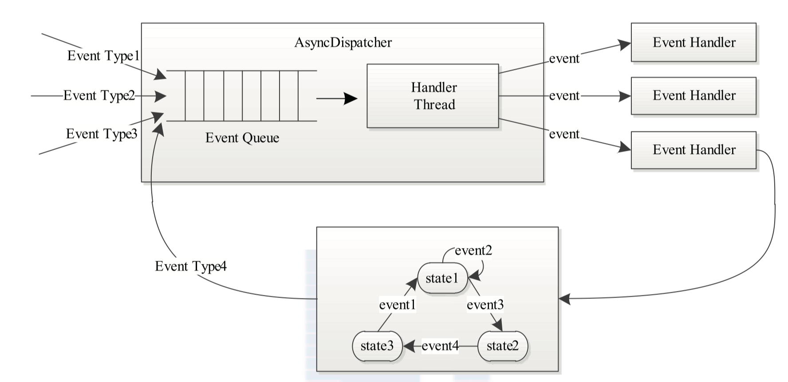
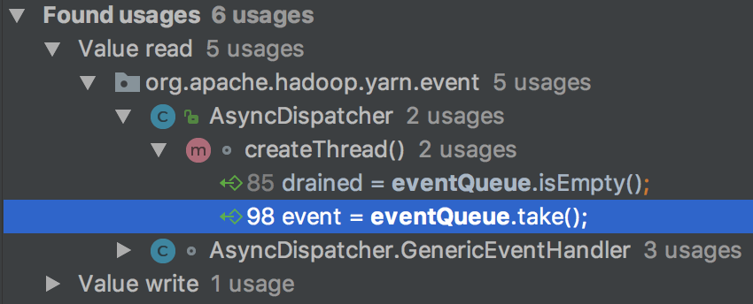
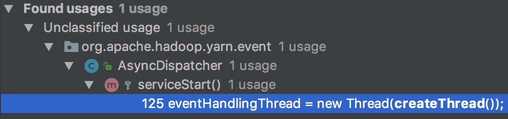
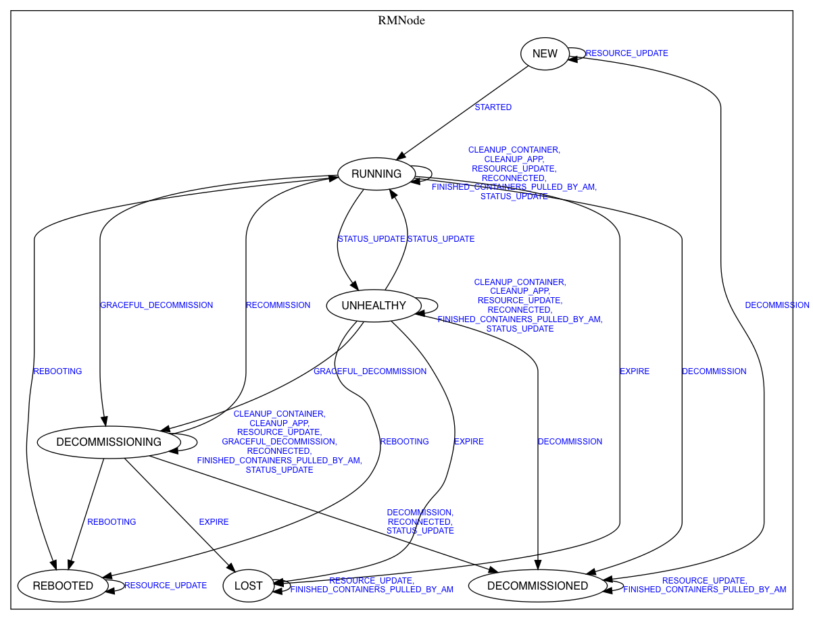

读HDFS的源码几乎可以直接上，但想读Yarn的源码，需要先了解Yarn的`事件驱动模型`与`状态机`。

<!--more-->

>源码版本：Apache Hadoop 2.6.0

# 总览

Yarn采用了基于事件驱动的并发模型：

* 所有状态机都实现了EventHandler接口，很多`服务`（类名通常带有Service后缀）也实现了该接口，它们都是`事件处理器`。
* 需要异步处理的`事件`由`中央异步调度器`（类名通常带有Dispatcher后缀）统一`接收`/`派发`，需要同步处理的事件直接交给相应的事件处理器。

示意图（简化为只有事件处理器）：



某些事件处理器不仅处理事件，也会向中央异步调度器发送事件。

# 事件处理器EventHandler

事件处理器就像一个简单的函数，只有一个handle()方法，传入的是一个封装好的事件Event：

```java
/**
 * Interface for handling events of type T
 *
 * @param <T> parameterized event of type T
 */
@SuppressWarnings("rawtypes")
@Public
@Evolving
public interface EventHandler<T extends Event> {

  void handle(T event);

}
```

这里仅给出一个例子：

**ApplicationMasterLauncher实现了EventHandler接口，用于处理AM的启动、清理事件**：

```java
public class ApplicationMasterLauncher extends AbstractService implements
    EventHandler<AMLauncherEvent> {
  ...
  @Override
  public synchronized void  handle(AMLauncherEvent appEvent) {
    AMLauncherEventType event = appEvent.getType();
    RMAppAttempt application = appEvent.getAppAttempt();
    switch (event) {
    case LAUNCH:
      launch(application);
      break;
    case CLEANUP:
      cleanup(application);
    default:
      break;
    }
  }
  ...
}
```

# 中央异步调度器AsyncDispatcher

Dispatcher接口定义了基本的事件派发行为：

```java
/**
 * Event Dispatcher interface. It dispatches events to registered 
 * event handlers based on event types.
 * 
 */
@SuppressWarnings("rawtypes")
@Public
@Evolving
public interface Dispatcher {

  // Configuration to make sure dispatcher crashes but doesn't do system-exit in
  // case of errors. By default, it should be false, so that tests are not
  // affected. For all daemons it should be explicitly set to true so that
  // daemons can crash instead of hanging around.
  public static final String DISPATCHER_EXIT_ON_ERROR_KEY =
      "yarn.dispatcher.exit-on-error";

  public static final boolean DEFAULT_DISPATCHER_EXIT_ON_ERROR = false;

  EventHandler getEventHandler();

  void register(Class<? extends Enum> eventType, EventHandler handler);

}
```

register()方法负责注册事件处理器，getEventHandler()方法获得事件处理器以派发事件。

**AsyncDispatcher实现了Dispatcher接口，通过队列扩展出了异步派发事件的行为（同时，它也是一个服务），通常被称为“中央异步调度器”**，是一个典型的`生产者-消费者模型`：

```java
public class AsyncDispatcher extends AbstractService implements Dispatcher {
  ...
}
```

## 注册事件处理器

AsyncDispatcher#register()方法将二元组`<eventType, eventHandler>`注册到AsyncDispatcher#eventDispatchers中：

```java
  @SuppressWarnings("unchecked")
  @Override
  public void register(Class<? extends Enum> eventType,
      EventHandler handler) {
    /* check to see if we have a listener registered */
    EventHandler<Event> registeredHandler = (EventHandler<Event>)
    eventDispatchers.get(eventType);
    LOG.info("Registering " + eventType + " for " + handler.getClass());
    if (registeredHandler == null) {
      eventDispatchers.put(eventType, handler);
    } else if (!(registeredHandler instanceof MultiListenerHandler)){
      /* for multiple listeners of an event add the multiple listener handler */
      MultiListenerHandler multiHandler = new MultiListenerHandler();
      multiHandler.addHandler(registeredHandler);
      multiHandler.addHandler(handler);
      eventDispatchers.put(eventType, multiHandler);
    } else {
      /* already a multilistener, just add to it */
      MultiListenerHandler multiHandler
      = (MultiListenerHandler) registeredHandler;
      multiHandler.addHandler(handler);
    }
  }
```

Yarn的事件类型EventType都是枚举类型，而eventDispatchers是一个“`事件类型->事件处理器`”的Map：

```java
  protected final Map<Class<? extends Enum>, EventHandler> eventDispatchers;
```

注册方法支持注册事件类型到事件处理器的映射，比较简单，不表。

如前面提到的**ApplicationMasterLauncher，其注册的事件类型是AMLauncherEventType**：

```java
      applicationMasterLauncher = createAMLauncher();
      rmDispatcher.register(AMLauncherEventType.class,
          applicationMasterLauncher);
```

## 处理事件

AsyncDispatcher#getEventHandler()是异步派发的关键：

```java
  @Override
  public EventHandler getEventHandler() {
    if (handlerInstance == null) {
      handlerInstance = new GenericEventHandler();
    }
    return handlerInstance;
  }
```

它看起来很简单，直接返回事件处理器AsyncDispatcher#handlerInstance，外界将所有类型的事件都交给它。例如：

```java
      rmNode.context.getDispatcher().getEventHandler().handle(
        new NodesListManagerEvent(
            NodesListManagerEventType.NODE_USABLE, rmNode));
```

显然，**AsyncDispatcher#handlerInstance对事件的处理就是“接收事件，放入中央异步调度器”**。

那么，AsyncDispatcher#handlerInstance.handle()如何接收各种类型的事件呢？

AsyncDispatcher#handlerInstance被延迟初始化为一个GenericEventHandler实例。GenericEventHandler是一个特别的事件处理器，它只负责接收事件：

```java
  class GenericEventHandler implements EventHandler<Event> {
    public void handle(Event event) {
      if (blockNewEvents) {
        return;
      }
      drained = false;

      /* all this method does is enqueue all the events onto the queue */
      int qSize = eventQueue.size();
      if (qSize !=0 && qSize %1000 == 0) {
        LOG.info("Size of event-queue is " + qSize);
      }
      int remCapacity = eventQueue.remainingCapacity();
      if (remCapacity < 1000) {
        LOG.warn("Very low remaining capacity in the event-queue: "
            + remCapacity);
      }
      try {
        eventQueue.put(event);
      } catch (InterruptedException e) {
        if (!stopped) {
          LOG.warn("AsyncDispatcher thread interrupted", e);
        }
        throw new YarnRuntimeException(e);
      }
    };
  }
```

非重点：

* blockNewEvents是一个开关，在AsyncDispatcher关闭过程中被置为true，新来的事件会被GenericEventHandler丢弃。
* drained指示队列是否排空，队列空时被置为true。
* 9-17行用于打印队列的状态。

整个GenericEventHandler#handle()的核心在19行：将事件放入事件队列AsyncDispatcher#eventQueue中。

AsyncDispatcher#eventQueue是一个BlockingQueue：

```java
  private final BlockingQueue<Event> eventQueue;
```

>BlockingQueue是一个线程安全的阻塞队列，常用于生产者-消费者模型中。

因此，调用AsyncDispatcher#getEventHandler()#handle()方法的线程相当于生产者，生产一个事件后能够立即返回。

那么，AsyncDispatcher#eventQueue中的事件何时处理呢？

AsyncDispatcher#eventQueue.take()方法从队列中获得一个事件，其仅在AsyncDispatcher#createThread()方法中被调用：



AsyncDispatcher#createThread()创建一个线程，来异步的处理事件：

```java
  Runnable createThread() {
    return new Runnable() {
      @Override
      public void run() {
        while (!stopped && !Thread.currentThread().isInterrupted()) {
          drained = eventQueue.isEmpty();
          // blockNewEvents is only set when dispatcher is draining to stop,
          // adding this check is to avoid the overhead of acquiring the lock
          // and calling notify every time in the normal run of the loop.
          if (blockNewEvents) {
            synchronized (waitForDrained) {
              if (drained) {
                waitForDrained.notify();
              }
            }
          }
          Event event;
          try {
            event = eventQueue.take();
          } catch(InterruptedException ie) {
            if (!stopped) {
              LOG.warn("AsyncDispatcher thread interrupted", ie);
            }
            return;
          }
          if (event != null) {
            dispatch(event);
          }
        }
      }
    };
  }
```

该线程是典型的`长服务线程`：主体是一个循环，持续提供服务。19行从AsyncDispatcher#eventQueue中取出一个事件。27行调用AsyncDispatcher#dispatch()，将事件event派发给对应的事件处理器EventHandler处理：

```java
  @SuppressWarnings("unchecked")
  protected void dispatch(Event event) {
    //all events go thru this loop
    if (LOG.isDebugEnabled()) {
      LOG.debug("Dispatching the event " + event.getClass().getName() + "."
          + event.toString());
    }

    Class<? extends Enum> type = event.getType().getDeclaringClass();

    try{
      EventHandler handler = eventDispatchers.get(type);
      if(handler != null) {
        handler.handle(event);
      } else {
        throw new Exception("No handler for registered for " + type);
      }
    } catch (Throwable t) {
      //TODO Maybe log the state of the queue
      LOG.fatal("Error in dispatcher thread", t);
      // If serviceStop is called, we should exit this thread gracefully.
      if (exitOnDispatchException
          && (ShutdownHookManager.get().isShutdownInProgress()) == false
          && stopped == false) {
        LOG.info("Exiting, bbye..");
        System.exit(-1);
      }
    }
  }
```

12行根据事件类型，从AsyncDispatcher#eventDispatchers中取得对应的事件处理器handler。14行执行handler.handle()处理事件。

我们已经知道，AsyncDispatcher#createThread()创建的线程（启动后）相当于消费者，多线程各自同步处理事件。那么，这个长服务线程什么时候启动的呢？

AsyncDispatcher#createThread()仅在AsyncDispatcher#serviceStart()中被调用：



AsyncDispatcher#serviceStart()在服务启动时调用，通过AsyncDispatcher#createThread()方法创建事件处理器线程eventHandlingThread，并启动：

```java
  @Override
  protected void serviceStart() throws Exception {
    //start all the components
    super.serviceStart();
    eventHandlingThread = new Thread(createThread());
    eventHandlingThread.setName("AsyncDispatcher event handler");
    eventHandlingThread.start();
  }
```

## 小问题

结合AsyncDispatcher#createThread()方法可知，AsyncDispatcher中仅有一个消费者线程，且该消费者线程在循环中同步处理事件。

我不太理解这样的设计：如果实际观测得知短时间内产生的事件不多，没必要并发消费，那么确实不需要多消费者；但**如果事件过多，或某事件的处理十分耗时，同步处理会让系统的吞吐量瞬间掉下去**。

>20180307：
>
>现在理解了一部分设计考虑：在**设计事件处理器时，不应该在事件处理逻辑中包含耗时操作，而应该让事件处理器仅完成基本的事件处理逻辑**。如果需要耗时的操作，则交给其他线程异步完成，有必要的话，在完成后再发送事件进行下一步转换。例如kill app的过程，对应下述状态转换：
>
>`RUNNING -> KILLING -> FINISHED`
>
>要kill一个app，并不会让RMApp由RUNNING状态直接转到FINISHED状态，而要在中间保持一个KILLING状态——保持KILLING状态的期间，由其他线程完成耗时的kill逻辑，完成后发送相关事件，让RMApp转换到最终的FINISHED状态。
>
>**但如果事件过多，那么单纯的事件处理逻辑也能够把一个cpu打满，此处的同步处理依旧是一个重要的性能瓶颈**。具体多大才能打满呢？得好好估计一回了，暂且放下。

# 状态机

关于Yarn中状态机的内容不多讲，App、AppAttempt、Container、Node等许多实体的使用和管理都依赖于状态机，状态机也是事件处理器。事件会触发状态机的状态转换，即，**状态机对事件的处理是“执行状态转换”**（隐含了“根据开始状态和事件选择状态转换”的过程）。事件可以交由中央一步调度器异步处理，也可以直接交由事件处理器处理。

以RMNodeImpl为例讲解。

RMNodeImpl被RM用来追踪NodeManager的状态。
实现了EventHandler接口，是个事件处理器：

```java
public class RMNodeImpl implements RMNode, EventHandler<RMNodeEvent> {
  ...
}
```

## 注册状态转换

状态转换由成员变量stateMachine管理，成员变量stateMachineFactory用来注册状态转换（addTransition()）并生成状态机：

```java
  ...
  private static final StateMachineFactory<RMNodeImpl,
                                           NodeState,
                                           RMNodeEventType,
                                           RMNodeEvent> stateMachineFactory 
                 = new StateMachineFactory<RMNodeImpl,
                                           NodeState,
                                           RMNodeEventType,
                                           RMNodeEvent>(NodeState.NEW)
  
     //Transitions from NEW state
     .addTransition(NodeState.NEW, NodeState.RUNNING, 
         RMNodeEventType.STARTED, new AddNodeTransition())
     .addTransition(NodeState.NEW, NodeState.NEW,
         RMNodeEventType.RESOURCE_UPDATE, 
         new UpdateNodeResourceWhenUnusableTransition())

     //Transitions from RUNNING state
     .addTransition(NodeState.RUNNING,
         EnumSet.of(NodeState.RUNNING, NodeState.UNHEALTHY),
         RMNodeEventType.STATUS_UPDATE, new StatusUpdateWhenHealthyTransition())
     .addTransition(NodeState.RUNNING, NodeState.DECOMMISSIONED,
         RMNodeEventType.DECOMMISSION,
         new DeactivateNodeTransition(NodeState.DECOMMISSIONED))
     .addTransition(NodeState.RUNNING, NodeState.LOST,
         RMNodeEventType.EXPIRE,
         new DeactivateNodeTransition(NodeState.LOST))
     .addTransition(NodeState.RUNNING, NodeState.REBOOTED,
         RMNodeEventType.REBOOTING,
         new DeactivateNodeTransition(NodeState.REBOOTED))
     ...
  
  ...
  private final StateMachine<NodeState, RMNodeEventType,
                             RMNodeEvent> stateMachine;
  ...
```

>以下将持有stateMachine的事件处理器直接称为“状态机”。

Transition定义了“从一个状态转换到另一个状态”的行为，由转换操作、开始状态、事件类型、事件组成：

```java
  private interface Transition<OPERAND, STATE extends Enum<STATE>,
          EVENTTYPE extends Enum<EVENTTYPE>, EVENT> {
    STATE doTransition(OPERAND operand, STATE oldState,
                       EVENT event, EVENTTYPE eventType);
  }
```

同时，**该状态机涉及的事件类型在ResourceManager#serviceInit()方法中完成注册**。

### 可视化

为方便可视化，Yarn源码中实现了一个状态机可视化工具，可参照[Generate state graph from the State Machine Definition](https://issues.apache.org/jira/browse/MAPREDUCE-2930)快速得到所需的状态机图片，或参照[yarn状态机可视化](https://blog.csdn.net/bigdatahappy/article/details/39932175)一次性得到所有状态机图片。RMNode状态机如下：



## 执行状态转换

一个状态机涉及的状态转换非常多，但往往只涉及一种事件类型（两种及以上的比较少）。RMNodeImpl是一个事件处理器，其处理工作就是执行状态转换。但该如何根据一种事件类型，决定要采用哪个状态转换呢？
最简单的思路是写一堆if语句，或者switch大法好。实际上，对于单纯的事件处理器（各事件之前是独立、平行的），一般也是swtich简单了事，如前面提过的ApplicationMasterLauncher：

```java
public class ApplicationMasterLauncher extends AbstractService implements
    EventHandler<AMLauncherEvent> {
  ...
  @Override
  public synchronized void  handle(AMLauncherEvent appEvent) {
    AMLauncherEventType event = appEvent.getType();
    RMAppAttempt application = appEvent.getAppAttempt();
    switch (event) {
    case LAUNCH:
      launch(application);
      break;
    case CLEANUP:
      cleanup(application);
    default:
      break;
    }
  }
  ...
}
```

但**对于状态机，由于我们已经在状态机中保存了全部的状态转换，stateMachineFactory创建的stateMachine就可以自动根据当前状态、事件类型选择合适的事件处理器**，于是RMNodeImpl等状态机的事件处理器变得异常简单：

```java
  public void handle(RMNodeEvent event) {
    LOG.debug("Processing " + event.getNodeId() + " of type " + event.getType());
    try {
      writeLock.lock();
      NodeState oldState = getState();
      try {
         stateMachine.doTransition(event.getType(), event);
      } catch (InvalidStateTransitonException e) {
        LOG.error("Can't handle this event at current state", e);
        LOG.error("Invalid event " + event.getType() + 
            " on Node  " + this.nodeId);
      }
      if (oldState != getState()) {
        LOG.info(nodeId + " Node Transitioned from " + oldState + " to "
                 + getState());
      }
    }
    
    finally {
      writeLock.unlock();
    }
  }
```

状态转换需要修改状态机的状态，为避免竞态条件，首先要获得写锁；7行让stateMachine自行选择Transition并进行状态转换。

# 总结

要阅读Yarn的源码，必须了解这种基于事件驱动的并发模型（事件处理器+中央异步调度器）和状态机。Yarn中，状态机被实现为事件处理器是很自然的，部分服务也被实现为事件处理器，如ApplicationMasterLauncher等。通常，事件处理器的行为类似于消息队列的消费者，而中央异步调度器类似于消息队列。

>还有几点需要注意：
>
>* RM上不只有一个中央异步调度器，要注意区分。NM同理。
>* 对于状态机，并不是直接将`<事件类型, 状态机>`注册到中央异步调度器，而是注册`<事件类型, 事件派发器>`。事件派发器负责将事件派发给一个状态机实例。
>* 对于状态机的状态转换事件，大部分场景下是交由中央异步调度器派发的，但某些场景下也会直接交由状态机实例。
>* Yarn中的源码并不是由一个人，在短时间内完成的。其中有各种引用中央异步调度器的方式，有些是将其作为成员变量，有些从rmContext中获得，有些甚至直接将handlerInstance作为成员变量。这给阅读源码带来了很大麻烦，需要查证各dispatcher分别引用了哪一个中央异步调度器。猴子研究源码时整理过一部分，后面找机会分享出来。
>
