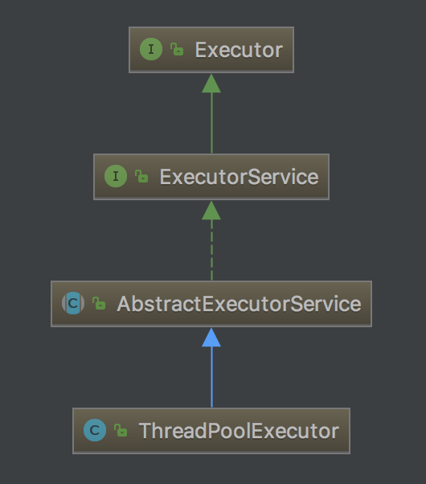
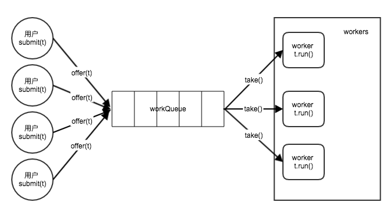

今天讲一个牛逼而实用的概念，`串行线程封闭`。`对象池`是串行线程封闭的典型应用场景；`线程池`糅合了对象池技术，但核心实现不依赖于对象池，很容易产生误会。本文从串行线程封闭和对象池入手，最后通过源码分析线程池的核心原理，厘清对象池与线程池之间的误会。

<!--more-->

>JDK版本：oracle java 1.8.0_102

# 线程封闭与串行线程封闭

## 线程封闭

线程封闭是一种常见的线程安全设计策略：*仅在固定的一个线程内访问对象，不对其他线程共享*。

使用线程封闭技术，对象O始终只对一个线程T1可见，“单线程”中自然不存在线程安全的问题。

ThreadLocal是常用的线程安全工具，见[源码|ThreadLocal的实现原理](/2016/11/27/源码%7CThreadLocal的实现原理/)。线程封闭在Servlet及高层的web框架Spring等中应用不少。

## 串行线程封闭

线程封闭虽然好用，却限制了对象的共享。串行线程封闭改进了这一点：*对象O只能由单个线程T1拥有，但可以通过安全的发布对象O来转移O的所有权；在转移所有权后，也只有另一个线程T2能获得这个O的所有权，并且发布O的T1不会再访问O*。

>所谓“所有权”，指修改对象的权利。

相对于线程封闭，串行线程封闭使得任意时刻，最多仅有一个线程拥有对象的所有权。当然，这不是绝对的，只要线程T1事实不会再修改对象O，那么就相当于仅有T2拥有对象的所有权。串行线层封闭让对象变得可以共享（虽然只能串行的拥有所有权），灵活性得到大大提高；相对的，要共享对象就涉及安全发布的问题，依靠BlockingQueue等同步工具很容易实现这一点。

对象池是串行线程封闭的经典应用场景，如数据库连接池等。

# 对象池

对象池利用了串行封闭：*将对象O“借给”一个请求线程T1，T1使用完再交还给对象池，并保证“未擅自发布该对象”且“以后不再使用”；对象池收回O后，等T2来借的时候再把它借给T2，完成对象所有权的传递*。

猴子撸了一个简化版的线程池，用户只需要覆写newObject()方法：

```java
public abstract class AbstractObjectPool<T> {
  protected final int min;
  protected final int max;
  protected final List<T> usings = new LinkedList<>();
  protected final List<T> buffer = new LinkedList<>();
  private volatile boolean inited = false;

  public AbstractObjectPool(int min, int max) {
    this.min = min;
    this.max = max;
    if (this.min < 0 || this.min > this.max) {
      throw new IllegalArgumentException(String.format(
          "need 0 <= min <= max <= Integer.MAX_VALUE, given min: %s, max: %s", this.min, this.max));
    }
  }

  public void init() {
    for (int i = 0; i < min; i++) {
      buffer.add(newObject());
    }
    inited = true;
  }

  protected void checkInited() {
    if (!inited) {
      throw new IllegalStateException("not inited");
    }
  }

  abstract protected T newObject();

  public synchronized T getObject() {
    checkInited();

    if (usings.size() == max) {
      return null;
    }
    if (buffer.size() == 0) {
      T newObj = newObject();
      usings.add(newObj);
      return newObj;
    }
    T oldObj = buffer.remove(0);
    usings.add(oldObj);
    return oldObj;
  }

  public synchronized void freeObject(T obj) {
    checkInited();
    if (!usings.contains(obj)) {
      throw new IllegalArgumentException(String.format("obj not in using queue: %s", obj));
    }

    usings.remove(usings.indexOf(obj));
    buffer.add(obj);
  }
}
```

AbstractObjectPool具有以下特性：

* 支持设置最小、最大容量
* 对象一旦申请就不再释放，避免了GC

虽然很简单，但大可以用于一些时间敏感、资源充裕的场景。如果时间进一步敏感，可将getObject()、freeObject()改写为并发程度更高的版本，但记得保证安全发布安全回收；如果资源不那么充裕，可以适当增加对象回收策略。

可以看到，一个对象池的基本行为包括：

* 创建对象newObject()
* 借取对象getObject()
* 归还对象freeObject()

典型的对象池有各种连接池、常量池等，应用非常多，模型也大同小异，不做解析。令人迷惑的是线程池，很容易让人误以为线程池的核心原理也是对象池，下面来追一遍源码。

# 线程池

首先摆出结论：**线程池糅合了对象池模型，但核心原理是生产者-消费者模型**。

继承结构如下：



用户可以将Runnable（或Callables）实例提交给线程池，线程池会异步执行该任务，返回响应的结果（完成/返回值）。

猴子最喜欢的是`submit(Callable<T> task)`方法。我们从该方法入手，逐步深入函数栈，探究线程池的实现原理。

## submit()

submit()方法在ExecutorService接口中定义，AbstractExecutorService实现，ThreadPoolExecutor直接继承。

```java
public abstract class AbstractExecutorService implements ExecutorService {
...
    public <T> Future<T> submit(Callable<T> task) {
        if (task == null) throw new NullPointerException();
        RunnableFuture<T> ftask = newTaskFor(task);
        execute(ftask);
        return ftask;
    }
...
}
```

AbstractExecutorService#newTaskFor()创建一个RunnableFuture类型的FutureTask。

核心是execute()方法。

## execute()

execute()方法在Executor接口中定义，ThreadPoolExecutor实现。

```java
public class ThreadPoolExecutor extends AbstractExecutorService {
...
    public void execute(Runnable command) {
        if (command == null)
            throw new NullPointerException();
        int c = ctl.get();
        if (workerCountOf(c) < corePoolSize) {
            if (addWorker(command, true))
                return;
            c = ctl.get();
        }
        if (isRunning(c) && workQueue.offer(command)) {
            int recheck = ctl.get();
            if (! isRunning(recheck) && remove(command))
                reject(command);
            else if (workerCountOf(recheck) == 0)
                addWorker(null, false);
        }
        else if (!addWorker(command, false))
            reject(command);
    }
...
}
```

我们暂且忽略线程池的池化策略。关注一个最简单的场景，看能不能先回答一个问题：线程池中的任务如何执行？

核心是addWorker()方法。以8行的参数为例，此时，线程池中的线程数未达到最小线程池大小corePoolSize，通常可以直接在9行返回。

## addWorker()

简化如下：

```java
public class ThreadPoolExecutor extends AbstractExecutorService {
...
    private boolean addWorker(Runnable firstTask, boolean core) {
        boolean workerStarted = false;
        boolean workerAdded = false;
        Worker w = null;
        try {
            w = new Worker(firstTask);
            final Thread t = w.thread;
            if (t != null) {
                final ReentrantLock mainLock = this.mainLock;
                mainLock.lock();
                try {
                    int rs = runStateOf(ctl.get());
                    if (rs < SHUTDOWN) {
                        workers.add(w);
                        workerAdded = true;
                    }
                } finally {
                    mainLock.unlock();
                }
                if (workerAdded) {
                    t.start();
                    workerStarted = true;
                }
            }
        } finally {
            if (! workerStarted)
                addWorkerFailed(w);
        }
        return workerStarted;
    }
...
}
```

我去掉了很多用于管理线程池、维护线程安全的代码。假设线程池未关闭，worker（即w，下同）添加成功，则必然能够将worker添加至workers中。workers是一个HashSet：

```java
private final HashSet<Worker> workers = new HashSet<Worker>();
```

### 哪里是对象池？

**如果说与对象池有关，那么workers即相当于示例代码中的using，应用了对象池模型**;只不过这里的using是一直增长的，直到达到最大线程池大小maximumPoolSize。

但是很明显，线程池并没有将线程发布出去，workers也仅仅完成using“保存线程”的功能。那么，线程池中的任务如何执行呢？跟线程池有没有关系？

### 哪里又不是？

注意9、17、24行：

* 9行将我们提交到线程池的firstTask封装入一个worker。
* 17行将worker加入workers，维护起来
* 24行则启动了worker中的线程t

核心在与这三行，但线程池并没有直接在addWorker()中启动任务firstTask，代之以启动一个worker。最终任务必然被启动，那么我们继续看Worker如何启动这个任务。

## Worker

Worker实现了Runnable接口：

```java
private final class Worker
    extends AbstractQueuedSynchronizer
    implements Runnable
{
...
    Worker(Runnable firstTask) {
        setState(-1); // inhibit interrupts until runWorker
        this.firstTask = firstTask;
        this.thread = getThreadFactory().newThread(this);
    }

    /** Delegates main run loop to outer runWorker  */
    public void run() {
        runWorker(this);
    }
...
}
```

>为什么要将构造Worker时的参数命名为firstTask？因为当且仅当需要建立新的Worker以执行任务task时，才会调用构造函数。因此，任务task对于新Worker而言，是第一个任务firstTask。

Worker的实现非常简单：将自己作为Runable实例，构造时在内部创建并持有一个线程thread。Thread和Runable的使用大家很熟悉了，核心是Worker的run方法，它直接调用了runWorker()方法。

## runWorker()

**敲黑板！！！**

重头戏来了。简化如下：

```java
public class ThreadPoolExecutor extends AbstractExecutorService {
...
    final void runWorker(Worker w) {
        Thread wt = Thread.currentThread();
        Runnable task = w.firstTask;
        w.firstTask = null;
        w.unlock(); // allow interrupts
        boolean completedAbruptly = true;
        try {
            while (task != null || (task = getTask()) != null) {
                w.lock();
                try {
                    beforeExecute(wt, task);
                    Throwable thrown = null;
                    try {
                        task.run();
                    } catch (RuntimeException x) {
                        thrown = x; throw x;
                    } catch (Error x) {
                        thrown = x; throw x;
                    } catch (Throwable x) {
                        thrown = x; throw new Error(x);
                    } finally {
                        afterExecute(task, thrown);
                    }
                } finally {
                    task = null;
                    w.completedTasks++;
                    w.unlock();
                }
            }
            completedAbruptly = false;
        } finally {
            processWorkerExit(w, completedAbruptly);
        }
    }
...
}
```

我们在前面将要执行的任务赋值给firstTask，5-6行首先取出任务task，并将firstTask置为null。因为接下来要执行task，firstTask字段就没有用了。

重点是10-31行的while循环。下面分情况讨论。

### case1：第一次进入循环，task不为null

case1对应前面作出的诸多假设。

第一次进入循环时，task==firstTask，不为null，使10行布尔短路直接进入循环；从而16行执行的是firstTask的run()方法；异常处理不表；最后，finally代码块中，task会被置为null，导致下一轮循环会进入case2。

### case2：非第一次进入循环，task为null

case2是更普遍的情况，也就是线程池的核心。

case1中，task被置为了null，使10行布尔表达式执行第二部分`(task = getTask()) != null`(getTask()稍后再讲，它返回一个用户已提交的任务)。假设task得到了一个已提交的任务，从而16行执行的是新获得的任务task的run()方法。后同case1，最后task仍然会被置为null，以后循环都将进入case2。

#### getTask()

任务从哪来呢？简化如下：

```java
public class ThreadPoolExecutor extends AbstractExecutorService {
...
    private Runnable getTask() {
        boolean timedOut = false;

        for (;;) {
            try {
                Runnable r = timed ?
                    workQueue.poll(keepAliveTime, TimeUnit.NANOSECONDS) :
                    workQueue.take();
                if (r != null)
                    return r;
                timedOut = true;
            } catch (InterruptedException retry) {
                timedOut = false;
            }
        }
    }
...
}
```

我们先看最简单的，19-28行。

首先，workQueue是一个线程安全的BlockingQueue，大部分时候使用的实现类是LinkedBlockingQueue，见[源码|并发一枝花之BlockingQueue](/2017/10/18/源码%7C并发一枝花之BlockingQueue/)： 

```java
private final BlockingQueue<Runnable> workQueue;
```

假设timed为false，则调用阻塞的take()方法，返回的r一定不是null，从而12行退出，将任务交给了某个worker线程。

>一个小细节有点意思：前面每个worker线程runWorker()方法时，在循环中加锁粒度在worker级别，直接使用的lock同步；但因为每一个woker都会调用getTask()，考虑到性能因素，源码中getTask()中使用乐观的CAS+SPIN实现无锁同步。关于乐观锁和CAS，可以参考我的另一篇文章[源码|并发一枝花之ConcurrentLinkedQueue【伪】](/2017/10/22/源码%7C并发一枝花之ConcurrentLinkedQueue【伪】/)。

workQueue中的元素从哪来呢？这就要回顾execute()方法了。

#### execute()

```java
public class ThreadPoolExecutor extends AbstractExecutorService {
...
    public void execute(Runnable command) {
        if (command == null)
            throw new NullPointerException();
        int c = ctl.get();
        if (workerCountOf(c) < corePoolSize) {
            if (addWorker(command, true))
                return;
            c = ctl.get();
        }
        if (isRunning(c) && workQueue.offer(command)) {
            int recheck = ctl.get();
            if (! isRunning(recheck) && remove(command))
                reject(command);
            else if (workerCountOf(recheck) == 0)
                addWorker(null, false);
        }
        else if (!addWorker(command, false))
            reject(command);
    }
...
}
```

<!--TODO 分析12-20行，入队-->
前面以8行的参数为例，此时，线程池中的线程数未达到最小线程池大小corePoolSize，通常可以直接在9行返回。进入8行的条件是`“当前worker数小于最小线程池大小corePoolSize”`。

如果不满足，会继续执行到12行。`isRunning(c)`判断线程池是否未关闭，我们关注未关闭的情况；则会继续执行布尔表达式的第二部分`workQueue.offer(command)`，尝试将任务command放入队列workQueue。

workQueue.offer()的行为取决于线程池持有的BlockingQueue实例。Executors.newFixedThreadPool()、Executors.newSingleThreadExecutor()创建的线程池使用LinkedBlockingQueue，而Executors.newCachedThreadPool()创建的线程池则使用SynchronousQueue。以LinkedBlockingQueue为例，创建时不配置容量，即创建为无界队列，则LinkedBlockingQueue#offer()永远返回true，从而进入12-18行。

更细节的内容不必关心了，当workQueue.offer()返回true时，已经将任务command放入了队列workQueue。当未来的某个时刻，**某worker执行完某一个任务之后，会从workQueue中再取出一个任务继续执行**，直到线程池关闭，直到海枯石烂。

>CachedThreadPool是一种无界线程池，使用SynchronousQueue能进一步提升性能，简化代码结构。留给读者分析。

#### case2小结

可以看到，实际上，**线程池的核心原理与对象池模型无关，而是生产者-消费者模型**：



* 生产者（调用submit()或execute()方法）将任务task放入队列
* 消费者（worker线程）循环从队列中取出任务处理任务（执行task.run()）。

### 钩子方法

回到runWorker()方法，在执行任务的过程中，线程池保留了一些钩子方法，如beforeExecute()、afterExecute()。用户可以在实现自己的线程池时，可以通过覆写钩子方法为线程池添加功能。

>但**猴子不认为钩子方法是一种好的设计**。因为钩子方法大多依赖于源码实现，那么除非了解源码或API声明绝对的严谨正确，否则很难正确使用钩子方法。等发生错误时再去了解实现，可能就太晚了。说到底，还是**不要使用类似extends这种表达“扩展”语义的语法来实现继承**，详见[Java中如何恰当的表达“继承”与“扩展”的语义？](/2017/09/20/Java中如何恰当的表达“继承”与“扩展”的语义？/)。
>
>当然，钩子方法也是极其方便的。权衡看待。

# 总结

相对于线程封闭，**串行线程封闭离用户的距离更近一些，简单灵活，实用性强，很容易掌握**。而线程封闭更多沦为单纯的设计策略，单纯使用线程封闭的场景不多。

线程池与串行线程封闭、对象池的关系不大，但经常被混为一谈；没看过源码的很难想到其实现方案，面试时也能立分高下。

>线程池的实现很有意思。在追源码之前，猴子一直以为线程池就是把线程存起来，用的时候取出来执行任务；看了源码才知道实现如此之妙，简洁优雅效率高。源码才是最好的老师。
