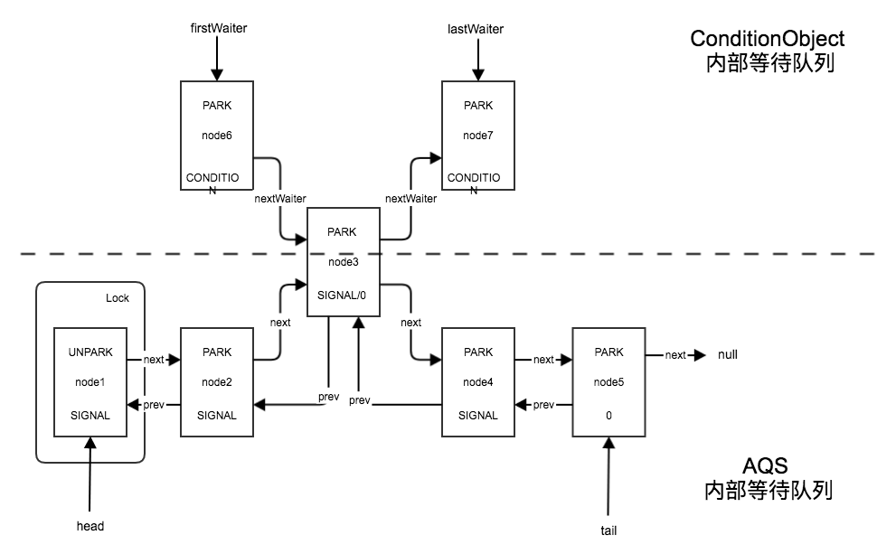

ReentrantLock#lock()、ReentrantLock#unlock()、ReentrantLock#lockInterruptibly()的分析见前文：

* [源码|并发一枝花之ReentrantLock与AQS（1）：lock、unlock](/2017/12/05/源码|并发一枝花之ReentrantLock与AQS（1）：lock、unlock/)（这篇非常重要，解释了很多本文省略的问题）
* [源码|并发一枝花之ReentrantLock与AQS（2）：lockInterruptibly](/2017/12/05/源码|并发一枝花之ReentrantLock与AQS（2）：lockInterruptibly/)

本文是《源码|并发一枝花之ReentrantLock与AQS》系列的最后一篇，分析与显式锁ReentrantLock配套的显式条件队列AQS#ConditionObject，以完善对AQS的使用和理解。

<!--more-->

>JDK版本：oracle java 1.8.0_102

# 接口声明

```java
public interface Lock {
    ...
    Condition newCondition();
    ...
}
public interface Condition {
    ...
    void await() throws InterruptedException;

    boolean await(long time, TimeUnit unit) throws InterruptedException;

    void signal();

    void signalAll();
    ...
}
```

Lock接口对标内置锁，而Condition接口对标内置条件队列。Condition主要提供了await、signal两种语义，和两种语义的衍生品。

## 语义、用法

对内置条件队列语义、用法的分析可参考以下两篇文章，其同时适用于本文的显式条件队列：

* [条件队列大法好：wait和notify的基本语义](/2017/11/15/条件队列大法好：wait和notify的基本语义/)
* [条件队列大法好：使用wait、notify和notifyAll的正确姿势](/2017/11/29/条件队列大法好：使用wait、notify和notifyAll的正确姿势/)

# 实现原理

直接使用了AQS的内部类ConditionObject。

ReentrantLock中提供的条件队列不能单独设置公平策略，只能在创建锁时指定。因此，我们仍旧以默认的非公平策略为例进行分析。

## newCondition

```java
    public Condition newCondition() {
        return sync.newCondition();
    }
    
    abstract static class Sync extends AbstractQueuedSynchronizer {
        ...
        final ConditionObject newCondition() {
            return new ConditionObject();
        }
        ...
    }
```

## ConditionObject

```java
public abstract class AbstractQueuedSynchronizer
    extends AbstractOwnableSynchronizer
    implements java.io.Serializable {
    ...
    public class ConditionObject implements Condition, java.io.Serializable {
        ...
        public ConditionObject() { }
        ...
    }
    ...
}
```

ConditionObject实现了Condition接口，提供了一个空构造器。

接下来，我们依次分析ConditionObject的await()方法和signal()方法，最后送一个signalAll()。

### await

```java
public abstract class AbstractQueuedSynchronizer
    extends AbstractOwnableSynchronizer
    implements java.io.Serializable {
    ...
    public class ConditionObject implements Condition, java.io.Serializable {
        ...
        public final void await() throws InterruptedException {
            // 主动检查中断，及时抛出InterruptedException。
            if (Thread.interrupted())
                throw new InterruptedException();
            // 创建等待节点并放入队尾
            Node node = addConditionWaiter();
            // 释放锁，并保存释放前的锁状态（ownerThread的重入次数）
            int savedState = fullyRelease(node);
            // 阻塞，直到收到信号或被中断
            while (!isOnSyncQueue(node)) {
                LockSupport.park(this);
                if ((interruptMode = checkInterruptWhileWaiting(node)) != 0)
                    break;
            }
            // 申请恢复锁状态，并更新中断模式
            int interruptMode = 0; // 调整了一下位置，不影响
            if (acquireQueued(node, savedState) && interruptMode != THROW_IE)
                interruptMode = REINTERRUPT;
            // 移除已被取消的节点
            if (node.nextWaiter != null)
                unlinkCancelledWaiters();
            // 如果之前发生了中断，则根据中断模式重放中断
            if (interruptMode != 0)
                reportInterruptAfterWait(interruptMode);
        }
        ...
    }
    ...
}
```

ConditionObject#await()同ReentrantLock#lockInterruptibly()一样，都是可中断的：调用ConditionObject#await()后，当前线程将保持阻塞，直到收到信号或被中断。

1. 主动检查中断，及时抛出InterruptedException。
*  创建等待节点并放入队尾
*  释放锁，并保存释放前的锁状态（ownerThread的重入次数）
*  阻塞，直到收到信号或被中断
*  重新申请锁，并更新中断模式
*  移除已被取消的节点
*  如果之前发生了中断，则根据中断模式重放中断

下面详细分析。

#### addConditionWaiter

检查中断后，创建等待节点并放入队尾：

```java
            Node node = addConditionWaiter();
```

```java
public abstract class AbstractQueuedSynchronizer
    extends AbstractOwnableSynchronizer
    implements java.io.Serializable {
    ...
    public class ConditionObject implements Condition, java.io.Serializable {
        ...
        private Node addConditionWaiter() {
            Node t = lastWaiter;
            // If lastWaiter is cancelled, clean out.
            if (t != null && t.waitStatus != Node.CONDITION) {
                unlinkCancelledWaiters();
                t = lastWaiter;
            }
            Node node = new Node(Thread.currentThread(), Node.CONDITION);
            if (t == null)
                firstWaiter = node;
            else
                t.nextWaiter = node;
            lastWaiter = node;
            return node;
        }
        ...
    }
    ...
}
```

`lastWaiter`初始化为null，至此，我们还未修改过`lastWaiter`，则`lastWaiter`仍为null。

从而，执行8行后t为null。跳到14行，创建`CONDITION==-2`状态的节点。然后15-19行，将`firstWaiter `与`lastWaiter `都指向新节点node，初始化条件队列自己的等待队列。这在性能上是必要的：如此，我们可以在一个显式锁上创建多个显式条件队列，更容易减少无效竞争，在保证正确性的前提下设计高性能的并发程序。

需要提醒一下，尽管此处没有任何线程安全的保护，但实际使用时不会出现任何线程安全问题——因为**条件队列的使用要求我们在调用await或signal时持有与该条件队列唯一相关的锁**。

>到这里，得到两个ReentrantLock与ConditionObject在实现上的重要区别：
>
>* ReentrantLock创建的节点，初始状态为0；而ConditionObject创建的节点，初始状态为`CONDITION==-2`。
>* ReentrantLock使用AQS内置的等待队列，由AQS维护；而每个ConditionObject都维护自己的等待队列。

#### fullyRelease

释放锁，并保存释放前的锁状态（ownerThread的重入次数）：

```java
            int savedState = fullyRelease(node);
```

```java
public abstract class AbstractQueuedSynchronizer
    extends AbstractOwnableSynchronizer
    implements java.io.Serializable {
    ...
    final int fullyRelease(Node node) {
        boolean failed = true;
        try {
            int savedState = getState();
            if (release(savedState)) {
                failed = false;
                return savedState;
            } else {
                throw new IllegalMonitorStateException();
            }
        } finally {
            if (failed)
                node.waitStatus = Node.CANCELLED;
        }
    }
    ...
}
```

8行保存锁状态。9-14行尝试状态转换`savedState->0`完全释放锁，并返回锁状态。只要状态正常，AQS#release()在此处一定会返回true，因此，如果返回false可直接抛出IllegalMonitorStateException。

>回忆：
>
>* ReentrantLock#unlock()中分析了AQS#release()。
>* ReentrantLock#lock()中分析了try-finally的取消框架。
>

AQS#fullyRelease()返回后，调用ConditionObject#await()的线程就放弃了锁，后面截止到重新获取锁前，只能使用开放调用。

>开放调用：Open Call，调用某个方法时不需要持有锁（可能方法内部实现需要锁，但外部调用不需要）。

#### isOnSyncQueue

接下来，几个方法配套完成“阻塞，直到收到信号或被中断”：

```java
            while (!isOnSyncQueue(node)) {
                LockSupport.park(this);
                if ((interruptMode = checkInterruptWhileWaiting(node)) != 0)
                    break;
            }
```

首先是AQS#isOnSyncQueue()：

```java
public abstract class AbstractQueuedSynchronizer
    extends AbstractOwnableSynchronizer
    implements java.io.Serializable {
    ...
    final boolean isOnSyncQueue(Node node) {
        if (node.waitStatus == Node.CONDITION || node.prev == null)
            return false;
        if (node.next != null) // If has successor, it must be on queue
            return true;

        return findNodeFromTail(node);
    }
    private boolean findNodeFromTail(Node node) {
        Node t = tail;
        for (;;) {
            if (t == node)
                return true;
            if (t == null)
                return false;
            t = t.prev;
        }
    }
    ...
}
```

在创建节点node后未修改`node.waitStatus`，因此，仍满足`node.waitStatus == Node.CONDITION`，直接返回false，表示当前节点未阻塞。

>当然，此时也满足`node.prev == null`，`node.next == null`。

回到ConditionObject#await()，会进入while循环，然后当前线程陷入阻塞。

至此，调用ConditionObject#await()的线程已陷入阻塞，对ConditionObject#await()的分析告一段落。要暂时先跳至ConditionObject#signal()。

---

ConditionObject#signal()返回之后，node已经被放入了AQS内部的等待队列。此时，调用ConditionObject#await()的线程可能因前继节点被取消而提前唤醒，也可能等待调用ConditionObject#signal()的线程unlock之后才能被唤醒，还有可能因被中断而被唤醒。最容易被忽略的是，还*可能在收到信号后未唤醒，而在等待解锁唤醒的时候被中断*。

前两种唤醒都可被认为是“信号唤醒”，第三种是“信号前中断唤醒”，第四种是“信号后中断唤醒”。因此，在回到ConditionObject#await()后，需要进入_18-19行判断是否发生了中断和发生中断的时机_。

##### 插播分析完isOnSyncQueue

在继续走逻辑前，先插播分析完AQS#isOnSyncQueue()，后面要多次用到这个方法。

AQS#isOnSyncQueue()判断节点node是否已经被放入了AQS内部的等待队列，是的话返回true，否则返回false。主要分几种情况：

* 如果`node.waitStatus == CONDITION`，则一定未放入。因为AQS#transferForSignal()6行还没来得及执行。
* 如果`node.prev == null`，则一定未放入。因为AQS#transferForSignal()6行执行完但9行未执行完。
* 如果`node.next != null`，则一定已放入。因为已经有了后继节点，则node本身肯定已经完成入队（ConditionObject内部的等待使用的后继指针为`nextWaiter`）。
* 否则，说明满足`node.waitStatus != CONDITION && node.prev != null && node.next == null`，该状态无法确定node处于“未放入”还是“已放入”的状态。回忆AQS#enq()可知，`node.prev != null`时，可能正在尝试CAS插入node，无法确定是在插入前还是插入后，也无法确定是否插入成功。AQS#findNodeFromTail()从尾节点开始遍历，如果能够遍历到node，则一定已放入（当然，next方向不一定满足一致性）；否则，当前时刻还未插入或未插入成功，即一定未放入。

>回忆：
>
>* AQS#enq()插入新节点的过程。
>* AQS.shouldParkAfterFailedAcquire()移除CACELLED节点的过程。
>
>从两个过程可知，AQS内部的等待队列是一个弱一致性双向链表，其插入节点和移除取消节点的过程不保证next方向的一致性。

#### checkInterruptWhileWaiting

```java
public abstract class AbstractQueuedSynchronizer
    extends AbstractOwnableSynchronizer
    implements java.io.Serializable {
    ...
    public class ConditionObject implements Condition, java.io.Serializable {
        ...
        private int checkInterruptWhileWaiting(Node node) {
            return Thread.interrupted() ?
                (transferAfterCancelledWait(node) ? THROW_IE : REINTERRUPT) :
                0;
        }
        ...
    }
    ...
    final boolean transferAfterCancelledWait(Node node) {
        if (compareAndSetWaitStatus(node, Node.CONDITION, 0)) {
            enq(node);
            return true;
        }
        
        while (!isOnSyncQueue(node))
            Thread.yield();
        return false;
    }
    ...
}
```

首先，根据`Thread.interrupted()`判断是否发生了中断。*如果未发生中断*，则`Thread.interrupted()`返回false，*ConditionObject#checkInterruptWhileWaiting()最终返回0*。

否则，继续调用AQS#transferAfterCancelledWait()判断发生中断的时机。*如果是在收到信号前发生了中断*，AQS#transferForSignal()6行还没来得及执行，必然满足`node.waitStatus == CONDITION`，则CAS设置node.waitStatus并将node入队（等待后面调用AQS#acquireQueued()竞争锁），然后返回true，*ConditionObject#checkInterruptWhileWaiting()最终返回`THROW_IE == -1`*。

否则，一定是*在收到信号后发生了中断*，但可能AQS#transferForSignal()6行执行完但9行未执行完，即node未完成入队，因此，21-22行空等待至node完成入队，然后返回false，*ConditionObject#checkInterruptWhileWaiting()最终返回`REINTERRUPT == 1`*。

回到ConditionObject#await()后：

* 如果ConditionObject#checkInterruptWhileWaiting()返回0，表示未发生中断，属于信号唤醒，且已放入AQS内部等待队列，则退出循环。
* 如果ConditionObject#checkInterruptWhileWaiting()返回非0，表示发生了中断，则记录中断模式`interruptMode`，以区分信号前中断唤醒与信号后中断唤醒，然后break跳出循环。

>猴子没想明白一点：
>
>使用while是为了防止“信号唤醒后node未放入AQS内部等待队列”的情况，但什么时候会出现该情况呢？看起来只有发生中断的时候，但是如果发生中断，则一定会break退出循环，也不需要回到while判断。

现在终于跳出了循环，要重新申请锁了。

##### 信号前中断的特殊情况

**信号前中断会导致node同时处于AQS与ConditionObject两方的等待队列中**（使用不同的指针连接节点）：



而另外两种情况下，节点都被迁入了AQS内部等待队列。

因此，只要ConditionObject内部等待队列中的节点满足`node.waitStatus == SIGNAL`或`node.waitStatus == 0`，就可以判断其同时位于于AQS与ConditionObject两方的等待队列中，也就能断定该节点属于信号前中断唤醒。

>信号前中断唤醒的节点是无效的，需要被清理，可以用该条件找出这部分节点。该结论将在分析ConditionObject#unlinkCancelledWaiters()时派上用场。

#### acquireQueued

申请恢复锁状态，并更新中断模式：

```java
            int interruptMode = 0; // 调整了一下位置，不影响
            if (acquireQueued(node, savedState) && interruptMode != THROW_IE)
                interruptMode = REINTERRUPT;
```

>lock过程分析了AQS#acquireQueued()，该方法会阻塞，直到申请到锁，并返回中断标志。

如果申请锁的过程被中断，且之前等待时并不是信号前中断唤醒（即，信号唤醒或信号后中断唤醒），就将interruptMode置为REINTERRUPT。

AQS#acquireQueued()返回后，调用ConditionObject#await()的线程就重新获得了锁，以后就可以使用非开放调用了。

#### unlinkCancelledWaiters

移除已被取消的节点：

```java
            if (node.nextWaiter != null)
                unlinkCancelledWaiters();
```

实际上，ConditionObject#unlinkCancelledWaiters()用于清理ConditionObject内部等待队列中的非CONDITION节点。具体来说：

* 如果ConditionObject#await()时（更确切的说，AQS#fullyRelease()完全释放锁时）失败，节点转为CANCELLED状态，需要被清理。
* 分析AQS#transferAfterCancelledWait()有一个结论，**信号前中断会导致node同时处于AQS与ConditionObject两方的等待队列中（使用不同的指针连接节点）**。这些节点将随着AQS#acquireQueued()的执行转为SIGNAL或0状态。但由于ConditionObject#await()在收到信号前（更确切的说，在AQS#fullyRelease()完全释放锁后、收到信号前）被中断，因此上述节点也是无效的，需要被清理。

而被信号唤醒或信号后中断唤醒的节点，将首先移出ConditionObject内部等待队列，再进行状态转换。

综上，只需要清理ConditionObject内部等待队列中的非CONDITION节点。

```java
public abstract class AbstractQueuedSynchronizer
    extends AbstractOwnableSynchronizer
    implements java.io.Serializable {
    ...
    public class ConditionObject implements Condition, java.io.Serializable {
        ...
        private void unlinkCancelledWaiters() {
            Node t = firstWaiter;
            Node trail = null;
            while (t != null) {
                Node next = t.nextWaiter;
                if (t.waitStatus != Node.CONDITION) {
                    t.nextWaiter = null;
                    if (trail == null)
                        firstWaiter = next;
                    else
                        trail.nextWaiter = next;
                    if (next == null)
                        lastWaiter = trail;
                }
                else
                    trail = t;
                t = next;
            }
        }
        ...
    }
    ...
}
```

>我发现大神们都喜欢写这种功能简单性能高，但乍一看肯定看不懂的代码。。。

从firstWaiter开始，trail记录上一个CONDITION节点，t为当前节点；如果当前节点t满足`t.waitStatus != Node.CONDITION`，就移除；遍历到队尾的时候，如果队尾也是非CONDITION节点，则更新lastWaiter。

>注意，ConditionObject#unlinkCancelledWaiters()不是线程安全的，所以调用时必须持有锁。下面分析的两个清理时机都是持有锁的。

##### 触发清理的时机

>猴子分析的第二种时机可能有问题。以下分析仅供参考，欢迎指正。

对应的，需要在两种情况下触发清理：

* 如果ConditionObject#await()时失败，则该节点必为队尾节点，因此，在下一次插入节点前，检查队尾节点的状态即可。

```java
public abstract class AbstractQueuedSynchronizer
    extends AbstractOwnableSynchronizer
    implements java.io.Serializable {
    ...
    public class ConditionObject implements Condition, java.io.Serializable {
        ...
        private Node addConditionWaiter() {
            Node t = lastWaiter;
            // If lastWaiter is cancelled, clean out.
            if (t != null && t.waitStatus != Node.CONDITION) {
                unlinkCancelledWaiters();
                t = lastWaiter;
            }
            ...
        }
        ...
    }
    ...
}
```

* 如果是信号前中断，则该节点可能位于队列的任意位置。因此，如果发生了中断就需要清理。

```java
public abstract class AbstractQueuedSynchronizer
    extends AbstractOwnableSynchronizer
    implements java.io.Serializable {
    ...
    public class ConditionObject implements Condition, java.io.Serializable {
        ...
        public final void await() throws InterruptedException {
            ...
            // 阻塞，直到收到信号或被中断
            while (!isOnSyncQueue(node)) {
                LockSupport.park(this);
                if ((interruptMode = checkInterruptWhileWaiting(node)) != 0)
                    break;
            }
            // 申请恢复锁状态，并更新中断模式
            int interruptMode = 0; // 调整了一下位置，不影响
            if (acquireQueued(node, savedState) && interruptMode != THROW_IE)
                interruptMode = REINTERRUPT;
            // 移除已被取消的节点
            if (node.nextWaiter != null)
                unlinkCancelledWaiters();
            ...
        }
        ...
    }
    ...
}
```

>`node.nextWaiter != null`与中断的判断是没有关系的。顶多可以认为这里没有判断中断，至于条件`node.nextWaiter != null`仅为了将尾节点判断并入对第一种时机的处理。

#### reportInterruptAfterWait

最后，如果之前发生了中断，则根据中断模式重放中断：

```java
            if (interruptMode != 0)
                reportInterruptAfterWait(interruptMode);
```

只有确实发生了中断时，才会调用ConditionObject#reportInterruptAfterWait()。

```java
public abstract class AbstractQueuedSynchronizer
    extends AbstractOwnableSynchronizer
    implements java.io.Serializable {
    ...
    public class ConditionObject implements Condition, java.io.Serializable {
        ...
        private void reportInterruptAfterWait(int interruptMode)
            throws InterruptedException {
            if (interruptMode == THROW_IE)
                throw new InterruptedException();
            else if (interruptMode == REINTERRUPT)
                selfInterrupt();
        }
        ...
    }
    static void selfInterrupt() {
        Thread.currentThread().interrupt();
    }
    ...
}
```

简单根据中断模式interruptMode决定如何重放：

* 如果满足`interruptMode == THROW_IE`，则抛出InterruptedException
* 如果满足`interruptMode == REINTERRUPT `，则重置中断标志。
* 否则，什么都不做（尽管目前的分析不会触发该分支）。

##### InterruptedException 和 Thread#interrupt() 的区别

* 如果抛出InterruptedException，则外界必须处理（捕获或继续外抛）。
* 如果调用Thread#interrupt()，则仅设置中断标志。JDK提供的某些阻塞方法会处理该标志，详见Javadoc；但用户自己实现的方法，是否会处理该标志，处理是否及时，都无法做出保证。

>更详细的区别暂时还不清楚，因此，也不明白这里要区分中断模式。
>
>不过，关于JVM的中断机制，猴子终有一天会整明白的！！！

#### await小结

由于await与signal配合时才能发挥作用，分析二者时也要一起分析。本节从await切入，在await线程阻塞后转而分析signal线程，最后在再回到await线程继续分析。这部分源码的条件和结论非常多，代码耦合也比较大，虽然大大牺牲了可读性，不过作为JDK，换来的性能提高是居功至伟的。

本文也留下了几个问题，猴子暂时还没有解决。如果有朋友能指点一二，猴子感激不尽。

### signal

signal与await也是对偶的。

```java
public abstract class AbstractQueuedSynchronizer
    extends AbstractOwnableSynchronizer
    implements java.io.Serializable {
    ...
    public class ConditionObject implements Condition, java.io.Serializable {
        ...
        public final void signal() {
            if (!isHeldExclusively())
                throw new IllegalMonitorStateException();
            Node first = firstWaiter;
            if (first != null)
                doSignal(first);
        }
        ...
    }
    ...
}
```

8-9行的判断有两个意义：

* 确定目前持有锁，因为**条件队列的使用要求我们在调用await或signal时持有与该条件队列唯一相关的锁**。
* 确定目前AQS的状态是独占的，否则不能配套使用锁和条件队列。

ReentrantLock是独占的，假设目前持有锁，则跳至10-12行。如果firstWaiter不为null，则表示有节点进入了条件队列内部的等待队列，需要被唤醒。按照FIFO的顺序进行唤醒，所以每次唤醒的都是头节点。

刚才我们调用ConditionObject#await()加入了一个节点，接下来要唤醒该节点。

#### doSignal

```java
public abstract class AbstractQueuedSynchronizer
    extends AbstractOwnableSynchronizer
    implements java.io.Serializable {
    ...
    public class ConditionObject implements Condition, java.io.Serializable {
        ...
        private void doSignal(Node first) {
            do {
                if ( (firstWaiter = first.nextWaiter) == null)
                    lastWaiter = null;
                first.nextWaiter = null;
            } while (!transferForSignal(first) &&
                     (first = firstWaiter) != null);
        }
        ...
    }
    ...
}
```

9-11行使`firstWaiter `后移一位，也就是移除需要被唤醒的`fisrt`节点。12-13行调用AQS#transferForSignal()，尝试将条件队列内部的等待节点转换为AQS内部的等待节点，如果当前节点转换失败，就继续尝试下一节点，直至成功或遍历到队尾。

##### transferForSignal

```java
public abstract class AbstractQueuedSynchronizer
    extends AbstractOwnableSynchronizer
    implements java.io.Serializable {
    ...
    final boolean transferForSignal(Node node) {
        if (!compareAndSetWaitStatus(node, Node.CONDITION, 0))
            return false;

        Node p = enq(node);
        int ws = p.waitStatus;
        if (ws > 0 || !compareAndSetWaitStatus(p, ws, Node.SIGNAL))
            LockSupport.unpark(node.thread);
        return true;
    }
    ...
}
```

6-7行尝试CAS修改`node.waitStatus`。与ReentrantLock#look()类似，如果ConditionObject#await()阻塞获取的过程失败，失败的当时只会将新节点的状态标记为`CACELLED==1`。因此，如果19行CAS设置失败的，此时一定满足`node.waitStatus==CACELLED`，则可直接返回false，表示转换失败。否则，表示可以转换，继续执行。

9行调用AQS#enq()入队，返回旧的队尾节点，也就是新节点node的前继节点。

首先要再次敲黑板：**条件队列的使用要求我们在调用await或signal时持有与该条件队列唯一相关的锁**。同时，ReentrantLock#unlock()的执行也要求先持有锁。因此，只有正在执行ReentrantLock#lock()的线程能够与正在执行ConditionObject#signal()的线程发生竞争。更确切的说，**只有正在执行AQS#acquireQueued()的线程T1能够与正在执行AQS#transferForSignal()10-12行的线程T2发生竞争**。

10-12行的迷惑性就来源于此。实际上，*就算去掉10-12行也是满足正确性要求的*。因为线程T2释放锁后，依然会将从队头开始的第一个非取消节点唤醒，该节点会继续ConditionObject#await()中的工作（稍后回去分析）。*10-12行是为了进一步提升性能*，针对两种情况：

* 如果插入node前，AQS内部等待队列的队尾节点就已经被取消，则满足`wc > 0`
* 如果插入node后，AQS内部等待队列的队尾节点已经稳定，满足`tail.waitStatus == 0`，但在执行`ws > 0`之后`!compareAndSetWaitStatus(p, ws, Node.SIGNAL)`之前被取消，则CAS也会失败，满足`compareAndSetWaitStatus(p, ws, Node.SIGNAL) == false`

这两种情况下，**提前唤醒node能够在等待锁的同时，预先完成一部分ConditionObject#await()中无需同步的工作**。这部分成本不能被轻易忽视，因为条件队列被应用最多的场景是高并发，大量线程累加起来的成本是很可观的。

最后，AQS#transferForSignal()一定会返回true，表示node已经插入AQS内部的等待队列，而不关心其此时是否被唤醒。

回到ConditionObject#doSignal()与ConditionObject#signal()，成功结束。对于用户而言，线程此时已经被唤醒，尽管其大概率还在AQS内部阻塞排队，等待**重新**获得锁。

现在，可以跳回ConditionObject#await()继续分析了。之前分析到了16行的AQS#isOnSyncQueue()方法。

---

#### signal没有小结

### signalAll

最后送一个signalAll()：

```java
public abstract class AbstractQueuedSynchronizer
    extends AbstractOwnableSynchronizer
    implements java.io.Serializable {
    ...
    public class ConditionObject implements Condition, java.io.Serializable {
        ...
        public final void signalAll() {
            if (!isHeldExclusively())
                throw new IllegalMonitorStateException();
            Node first = firstWaiter;
            if (first != null)
                doSignalAll(first);
        }
        ...
    }
    ...
}
```

12行前的逻辑与ConditionObject#signal()相同。

#### doSignalAll

```java
public abstract class AbstractQueuedSynchronizer
    extends AbstractOwnableSynchronizer
    implements java.io.Serializable {
    ...
    public class ConditionObject implements Condition, java.io.Serializable {
        ...
        private void doSignalAll(Node first) {
            lastWaiter = firstWaiter = null;
            do {
                Node next = first.nextWaiter;
                first.nextWaiter = null;
                transferForSignal(first);
                first = next;
            } while (first != null);
        }
        ...
    }
    ...
}
```

8行一次性移除所有节点。9-14行，利用first仍持有的队首节点，遍历队列依次转换所有节点。后同ConditionObject#signal()。

# 总结

本文分析了显式条件队列Condition。AQS的内部类ConditionObject实现了Condition接口，内部维护自己的等待队列，加上与AQS的交互，实现了条件队列的基本语义。

与Lock#lock()相似，ConditionObject#await()也有诸多衍生品，如ConditionObject#awaitUninterruptibly()、ConditionObject#awaitNanos()等，感兴趣的朋友可以仿照Lock#lockInterruptibly()的思路进行分析。
