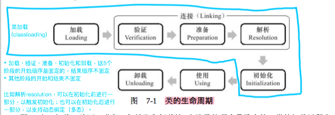

面试中常考的“类加载时机”严格来说指“类的初始化时机”。

<!--more-->

# 解释类加载与初始化

首先，区分类加载classloading与类生命周期中的加载loading阶段：

类加载classloading通常不单单指类的加载loading阶段，而指类从加载loading到初始化initialization阶段的这一段时间内的行为。

那么，什么情况下需要开始加载loading呢？JVM规范中并没有强制约束，取决于虚拟机的具体实现。但是对于初始化initialization阶段，JVM规范则严格规定了有且只有5种情况必须立即对类进行“初始化”（因此，加载、验证、准备、解析自然需要在此之前开始）。

因此，面试中常考的“类加载时机”严格来说指“类的初始化时机”。用于演示类加载顺序的静态语句块、静态变量赋值等操作也是在初始化时机完成的。

类的完整生命周期如下：

# 什么时候初始化

4种常见场景：

1. 当虚拟机启动时，用户需要指定一个要执行的主类`MainClass`（即包含psvm方法的那个类），虚拟机会先初始化这个主类。
2. 遇到`new`、`getstatic`、`putstatic`或`invokestatic`这4条字节码指令时。生成这4条指令的典型Java代码场景是：
    1. 使用`new`关键字实例化对象。
    2. 读取或设置一个类的静态字段——被`final`修饰、已在编译期把结果放入常量池的静态字段除外。
    3. 调用一个类的静态方法。
3. 当初始化一个类的时候，如果发现其父类还没有初始化，则需要先触发其父类的初始化。
4. 使用`java.lang.reflect`包的方法对类进行反射调用时。

>除此之外，比较常用的另一个场景是调用`Class.forName()`方法时，可指定`initialize`参数为true，最后通过JNI加载类并初始化。

1种不常见场景：

1. 当使用JDK 1.7的动态语言支持时，如果一个`java.lang.invoke.MethodHandle`实例最后的解析结果`REF_getStatic`、`REF_putStatic`、`REF_invokeStatic`的方法句柄，并且这个方法句柄所对应的类没有进行过初始化，则需要先触发其初始化。

>对于这5种场景，虚拟机规范中使用了一个很强烈的限定语：“**有且只有**”。

这5种场景中的行为称为对一个类进行`主动引用`。除此之外，所有引用类的方式都不会触发初始化，称为`被动引用`。

>我们不需要去关注被动引用。被动引用仅仅指那些看上去向主动引用，实际上却不是的情况，如：
>
>* 通过子类引用父类的静态字段，不会导致子类初始化（如何实现？）
>* 通过数组定义类引用类，不会触发此类的初始化（JVM为每个数组生成专有的类型，比如数组`A[]`的类型是`[A`）
>* 引用常量，不会触发此类的初始化（常量在编译阶段会存入调用类的常量池中（`常量传播`），运行期也就没有直接引用到定义常量的类）
>

---

>参考:
>
>* [Java 中对类的主动引用和被动引用](https://blog.csdn.net/anialy/article/details/8175213)
>
