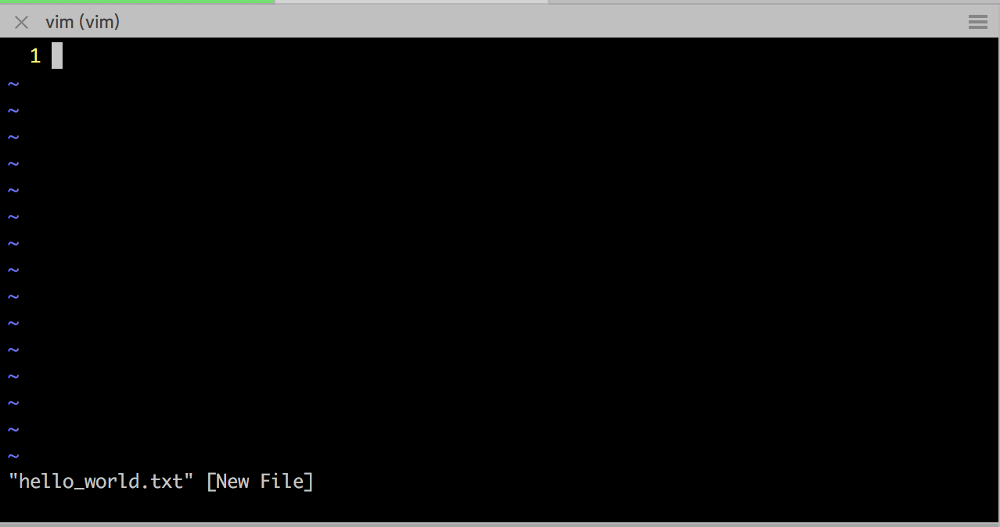
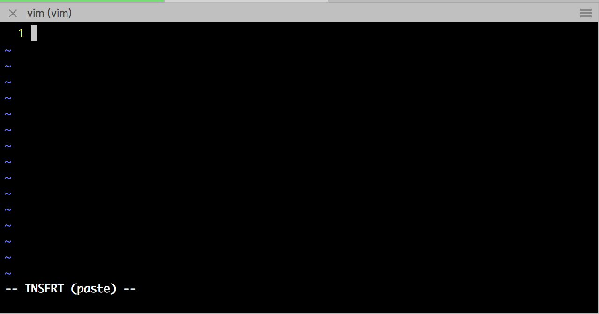
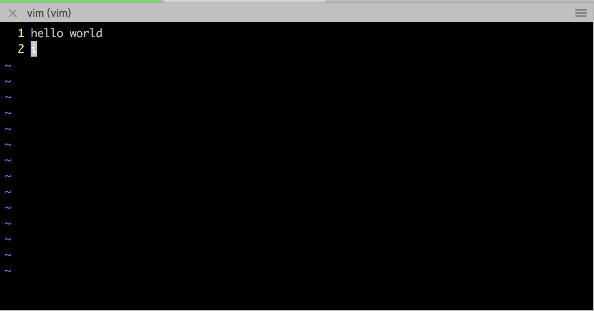
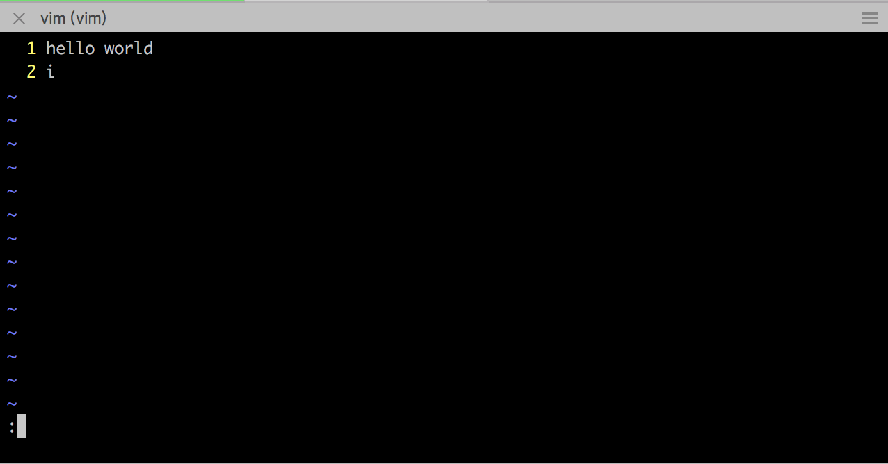

实习组的代码保密级别高，要求代码不能拉到本地（当然也不能远程连接服务器上的git仓库），一律在服务器上进行开发、测试。CLion白学了，投奔vim。

<!--more-->

>对于大部分人而言，如果综合学习成本和开发效率，能用IDE还是用IDE吧。

# vim还是emacs

**不要纠结，抓起一个就是干。**

# 基本概念

对于我等vim小白而言，在使用vim之前，务必要清楚`“命令模式”`（Command mode）、`“底线命令模式”`（Last line mode）、`“输入模式”`（Insert mode，也叫做“编辑模式”）三个概念，和两三个常用的`“命令”`。

首先，保证你处于unix-style的系统（如各种linux发行版，macOS等。windows未实验），输入法处于英文的输入模式。然后，用vim命令打开一个文件：

```bash
$ vim hello_world.txt
```

>如果文件不存在，vim会帮我们创建文件。

什么都不做。现在我们处于“命令模式”：



命令模式可以直接敲击键盘进行操作，但不能编辑。没内容没法操作，因此，我们先敲击字母`“i”`，进入“输入模式”：



输入模式的特点是，窗口最下方有“INSERT”字样。输入模式就可以输入内容了，输入“hello world”。字母`“i”`在命令模式下是一个“命令”，在输入模式下就是个单纯的字母了——敲击`“<Enter>”`键换到下一行，敲击字母“i”就输入了一个“i”：


接下来，敲击`"<Esc>"`键（键盘左上角）退出输入模式。退出后，将回到命令模式，就不能编辑了：



>看，回到命令模式后，窗口最下方就没有有“INSERT”字样了。

最后，敲击符号`“:”`（切记，**英文符号**）进入底线命令模式：



底线命令模式的特点是，窗口最下方有一个“:”。在“:”之后，我们可以输入命令；然而这里的命令与命令模式下的命令有所不同，比如刚才的字母“i”，在这里输入是无效的。我们先敲击`“<Esc>”`键退出输入模式或底线命令模式，以回到命令模式。然后，再次敲击符号`“:”`，重新进入底线命令模式。这次，我们输入`“wq”`，敲击`“<Enter>”`键——“wq”的意思是“保存并退出”，在这之后，我们保存内容并退出了vim。

>实际上，“wq”是连续的两个命令：“w”是保存“write”的缩写，“q”是退出“quit”的缩写，unix-style鼓励我们使用缩写。

让我们验证文件内容：

```bash
$ cat hello_world.txt
hello world
i
```

good job！

# 快捷键速成手册

vim的简单在于，掌握了三个模式后，剩下的就是查阅各种牛逼的快捷键，然后熟练操作。不过，与其他长篇累牍介绍vim快捷键的文章不同，猴子崇尚“less is more”。

下面列出了猴子最常用的快捷键，可以像猴子一样，把它当做极简版的快捷键手册，直接配置在`“.vimrc”`（vim的配置文件，在用户目录`"~"`下）中：

>* `"`开头的行是注释，其他是vim脚本，vim启动时执行`“.vimrc”`中的全部vim脚本
>* 绝大部分是命令模式的命令
>* 以“:”开头的是底线命令模式的命令

```vimrc
" 一些特殊的vim脚本，可以在底线命令模式执行，暂时忽略它们
syntax on	" 根据语法渲染
set nu	" 显示行号
" set nu!	" 不显示行号
set colorcolumn=100
set tabstop=4
set expandtab
set autoindent
set paste!

" 极简版速成手册

" 各种移动光标
" vim建议光标移动使用"hjkl"，让手保持在键盘中心。但猴子暂时还是习惯使用方向键
" h 向左移动一次光标
" j 向下移动一次光标
" k 向上移动一次光标
" l 向右移动一次光标
" b 移动光标到上一词首
" 未定义移动光标到下一词尾
" w 移动光标到下一词首
" e 移动光标到下一词尾
" <ctrl> + u 向上滚动10行（行数可配置）
" <ctrl> + d 向下滚动10行
" <ctrl> + f 向下滚动一屏
" <ctrl> + b 向上滚动一屏
" gg 移动光标到文件首
" G 移动光标到文件尾
" 将数字和方向命令组合在一起，vim大法好
" 10k 移动光标到向上10行，10可以是任意正数。自然10j就是光标向下移动10行
" 10h 移动光标到向左10个字符，10l同理
" <ctrl> + o 移动光标到上一位置

" 进入输入模式
" i 在当前位置后插入字符
" I 在当前位置前插入字符
" o 在当前行后插入行
" O 在当前行前插入行

" 复制
" y 复制选中范围（配合后面的可视模式操作）
" yy 复制行
" y10 从当前行开始向下数，共复制11行
" ye 复制到词尾（含词尾），其他组合同理

" 粘贴
" p 在当前位置后插入
" P 在当前位置前插入

" 剪切（复制 + 删除）
" d 剪切选中范围
" dd 剪切行
" d10 从当前行开始向下数，共剪切11行
" de 删除到词尾（含词尾），其他组合同理
" x 剪切选中范围。命令模式至少选中一个字符，因此x更常用于剪切单个的字符，其他范围类操作建议使用d
" 剪切 = 复制 + 删除, 意味着接下来可以进行粘贴

" v 字符可视模式（一种特殊的命令模式）
" V 行可视模式
" <ctrl> + v 列可视模式。进入列可视模式后，可配合I指令进行列编辑
" 可视模式选择“块”后，方便进行可视化的剪切和复制，执行指令或敲击<Esc>键退出可视模式
" 选择“块”时，命令模式下各种光标移动方式仍然有效，使得用户能够高效选择从光标起点（进入可视模式的位置）到光标终点（光标移动后的位置）的块

" r 覆盖，可以简化“先删除再输入”的操作顺序

" u undo
" <ctrl> + r redo

" :w 写入
" :q 退出
" :wq 写入+退出，命令的灵活组合是vim效率所在
" :10 光标移动到第10行（行号从1开始）
```

just do it!
