然而**题目和本文无关**——本文乃**XX-Net翻墙教程**。

出于各种可描述和不可描述的理由，很多朋友需要翻墙。众多梯子（翻墙工具）中，XX-Net是至今最让我满意的，**简单、免费、流量足**。特整理一篇XX-Net翻墙教程，以我当年作为小白的标准，详细到几乎每一步都有截图，希望能够帮到朋友们。

<!--more-->

# 从Shadowsocks，Lantern到XX-Net

## Shadowsocks

简单来说，Shadowsocks相当于一个VPN——不懂VPN的话，只需要知道得花钱买账号密码。免费的账号密码速度慢，而且经常变化；花钱买的比较稳定且跨平台，便宜的十几元一个月，不算贵，但既然有免费的XX-Net……

## Lantern

Lantern是Google开发的梯子。下载即用，简单到极致——但无奈目前开始收费，免费版一个月只有800M流量，而且限速（之前是250k/s，现在不清楚了）；收费版一年180元，网速远不如XX-Net。

Lantern目前有Windows、macOS、Linux、Android等版本，iOS已经`“即将发布”`了很久。大家可以到官网（[Lantern官网](https://getlantern.org/)）或免翻墙的Github（[Lantern最新版本下载](https://github.com/getlantern/forum#蓝灯lantern最新版本下载)）下载。

## XX-Net

如果对梯子使用较少，不怎么看视频图片，不下载`不可描述的小电影`，免费的Lantern还是足够的；如果追求稳定，不在乎一个月那么点钱，买个VPN是更好的选择。

XX-Net兼具了Lantern的简单和Shadowsocks的稳定大流量，是免费梯子中最优秀的产品。如果你已经拥有一个Gmail账号（没有也无所谓），那么**只需要两步**，你就能够拥有一个*每天12G流量*，高速稳定的梯子，供你尽情的查（kan）阅（xiao）资（dian）料（ying）。

>阅读到此处还没有关闭文章的，不是真爱，就是像我一样，既不想花钱又想网速快流量足的穷逼。追求越高要求越高，接下来你需要**耐心阅读，尽量不要跳**，否则写的再小白跳着看也看不懂。  

# XX-Net的部署

我也是从小白的路上走来的，**小白最喜欢简单暴力了对不对？**

但是，作为小白，我仍然建议大家先了解下XX-Net的代理原理，这将极大的减轻部署XX-Net的难度。下面会先介绍XX-Net的代理原理，**觉得自己厉害可以跳过这部分**，直接看如何部署，有问题再回来查阅。

## XX-Net的代理原理

一张图说明XX-Net的代理原理：

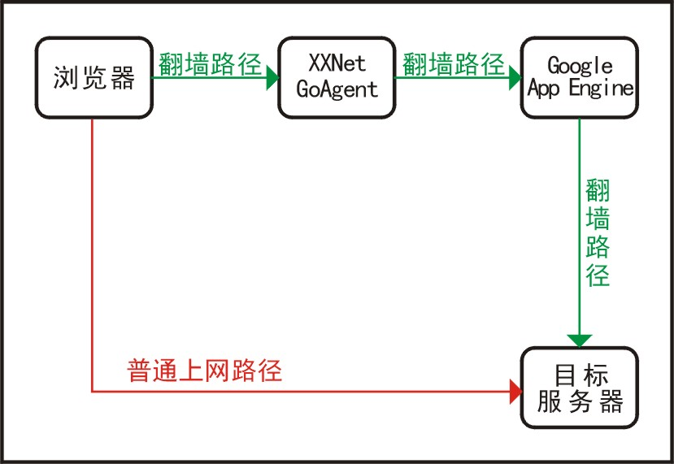

### 红色路径是没有代理时的上网路径

GFW（The Great Fire Wall，长城防火墙）发现你要访问Tumblr，于是拦腰截断，也就是平常所说的“被墙”。

### 绿色路径是代理下的上网路径

虽然我们不能直接访问Google（目标服务器），但我们能访问Google App Engine等**位于国外但没被墙的服务器**（在这里称为“中转服务器”）。XX-Net代理的思路很简单，**通过中转服务器间接访问目标服务器**，可分解为两部分：

* 代理客户端（图中的XX-Net GoAgent）：当你访问`目标服务器`google.com时（发送了一个“请求”），`代理客户端`将请求转发至没被墙的`中转服务器`。
* 中转服务器(图中的Google App Engine)：`中转服务器`位于国外，可以直接访问`目标服务器`google.com，于是将你的请求转发至`目标服务器`，翻墙成功。

需要重点理解的是`中转服务器`的概念——再不理解就直接看后面的教程吧。

## 两步部署XX-Net

前面说XX-Net的使用需要Gmail账号。那么问题来了：

>不翻墙怎么申请Google的Gmail账号？

这很容易解决——让我们在XX-Net的部署过程中“顺便”解决这个问题。

### 步骤1. 获取XX-Net

建议到Github上下载最新版本的XX-Net（[XX-Net下载](https://github.com/XX-net/XX-Net/blob/master/code/default/download.md)），选择稳定版即可：

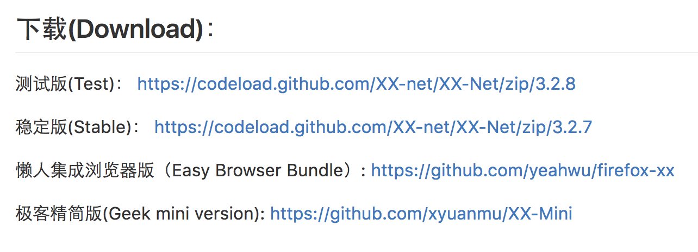

下载后是一个zip压缩包，解压后的根目录如下：

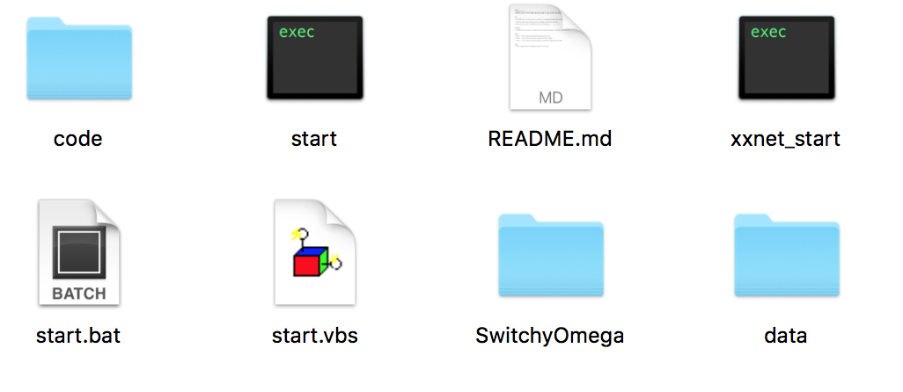

Windows用户点击**“start.bat”**，弹出命令行的黑窗。可以最小化，但**不要关闭黑窗**。Windows电脑没在身边，就不截图了。mac和Linux用户点击**“start”**，进程会在后台运行 ，窗口可以关闭。*“xxnet_start”*是我自己的文件请忽略。

接下来，浏览器会自动弹出一个页面，每次打开XX-Net也会自动弹出该页面：

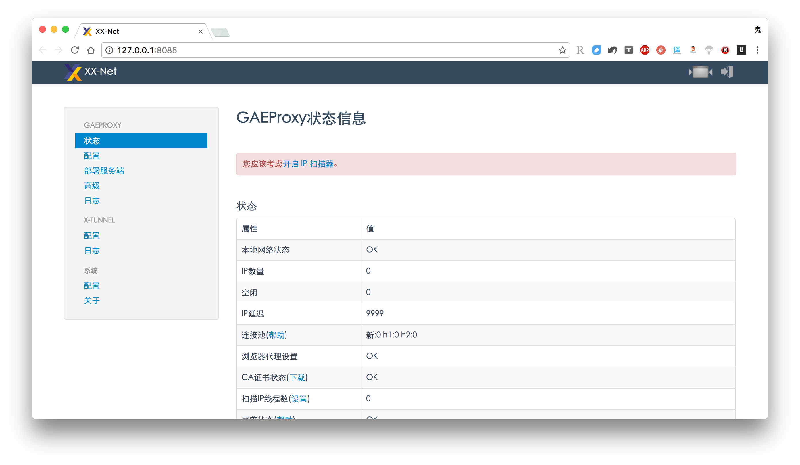

界面刚弹出，会提示“您应该考虑开启 IP 扫描器。”，或类似“初始化IP扫描需要数分钟到数小时”。不需要关心扫描IP的作用，总之*高速稳定上网需要一个IP数据库*，一般几分钟就可以完成，提示信息会变成舒服的淡蓝色：

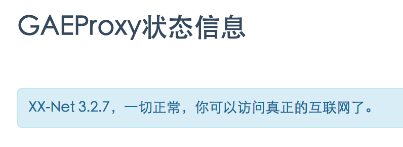

至此，打开Tumblr，呸，，，打开Google，你已经越墙而出：

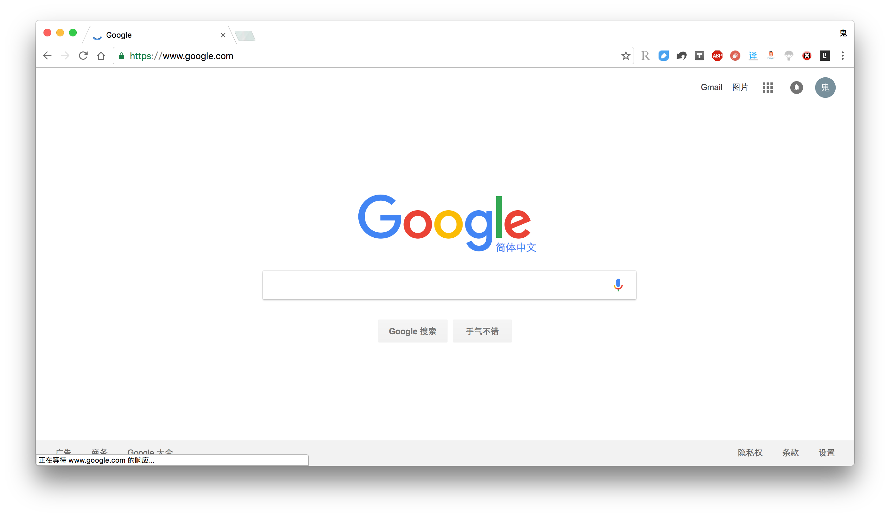

### 步骤2. [强烈建议]部署自己的中转服务器

完成前面的步骤1，我们已经可以翻墙了。然而这时使用的是*公共的中转服务器*（使用AppID来标识一个中转服务器，相当于多个人填写了相同的AppID），虽然目前可以翻墙，但共享带宽自然速度受限。想要真正拥有每天12G高速稳定的流量，我们需要申请Gmail账号，创建并配置属于自己的AppID。

>使用公共的中转服务器速度较慢，如果大家希望快点搞完步骤2，可以暂时打开Lantern，正好完成步骤2之后体验下二者的差别。  

#### 申请Gmail账号

刚才打开XX-Net后，已经能够打开Google主页，为免侮辱大家的智商，请大家自行注册。注册后登录Google帐户。

#### 创建和配置自己的AppID

##### 创建自己的AppID

打开[Google开发者控制台](https://console.developers.google.com)，点击左上角的“Project-创建项目”：

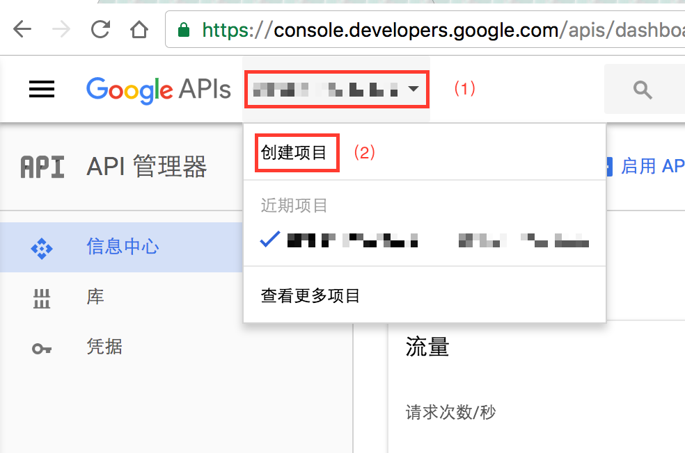

因为我已经创建了项目，所以这里默认显示了最近使用的项目，涉及隐私我打码了。点击后弹出对话框：

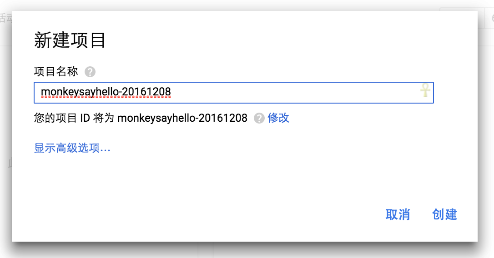

填写你的项目名称。**要求每个AppID都是不同的**，你跟别人的也不能相同。建议格式如上**“可读英文字符串-数字串”**：*可读英文字符串为全小写*，填写大写也会没用；*如果没有数字串，Google会为你随机分配一个数字串*，所以还是我们自己指定的好。Google检测AppID确实唯一后，右下角的“创建”按钮变蓝。确认无误后，**记住你的AppID**，点击“创建”，你就拥有了自己的AppID（注意，*AppID一旦创建就不能修改或删除*，但是同一个AppID可以被任何项目使用，所以这一点也无所谓）。

##### 部署中转服务器

>`中转服务器`负责接收`代理客户端`发来的请求，并转发至你想访问的`目标服务器`。

回到XX-Net的[设置页面](http://127.0.0.1:8085)，点击左侧的“部署服务端”，在“GAE AppID”处填写刚才创建的AppID，点击“开始部署”：

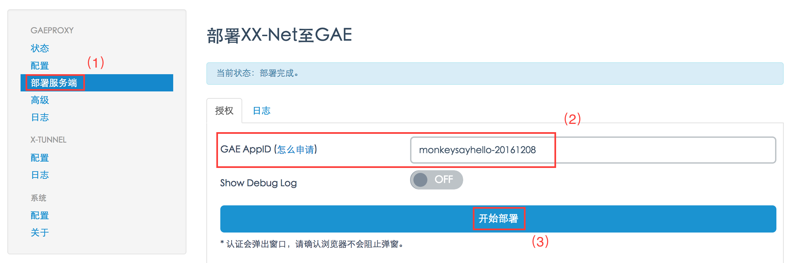

点击后，稍作等待，会弹出Google App Engine的“授权页面”：

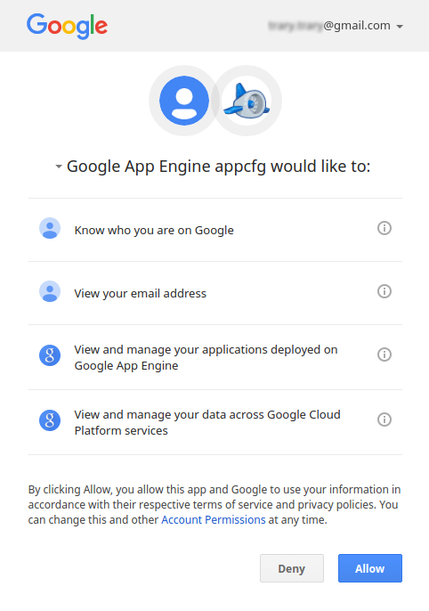

点击右下角的“Allow”，回到页面，等待部署完成。

##### 配置自己或别人的AppID

部署完成后，点击左侧的“配置”，填写刚才部署好的AppID，点击“保存”：

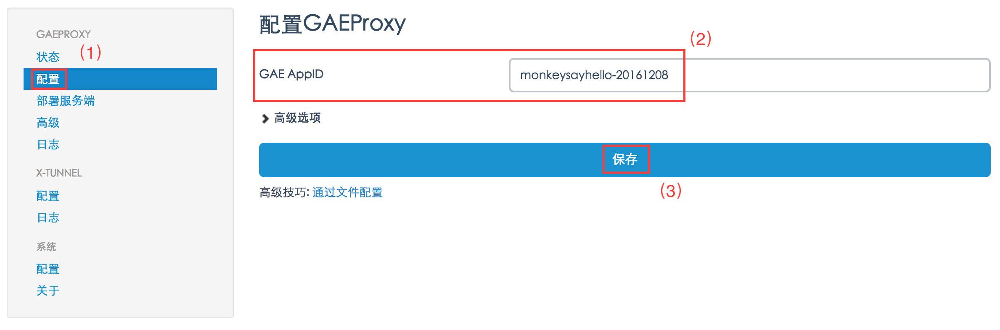

这时，点击左侧的“状态”，再次看到这条淡蓝色的提示信息，说明XX-Net的部署彻底完成：

一个Gmail账号最多创建12个AppID，而一个AppID每天拥有1G流量，所以**部署12个AppID每天就拥有了12G流量**。根据你的具体需求，部署适量的AppID，开始探索墙外的世界。

>AppID是全局唯一的，所以**你可以配置别人部署好的AppID**——因此，如果你使用我刚才填写的AppID “monkeysayhello-20161208”，你会发现，*我并没有真的创建这个AppID哈哈哈*！

### 使用

#### 全局代理和智能代理

* 全局代理：所有请求都转发到国外的中转服务器，包括送往国内的请求（比如访问baidu.com）。这种情况下不需要翻墙的请求也去国外转了一圈，既消耗了多余的流量（本可以不经过代理直连国内网站），又增加了多跑一遭的时间。通常很少使用全局代理。
* 智能代理：自动识别是否需要翻墙，只将需要翻墙的请求转发到中转服务器，不需要翻墙的请求不使用代理。**智能代理是默认选择，也是我们最常使用的选择。**

更多选项如下：

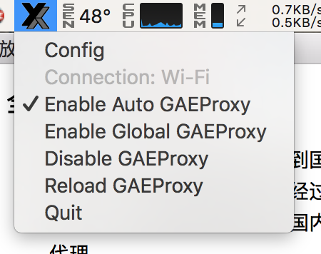

Windows中，这个“XX”的图标位于桌面右下角，跟QQ等软件的位置一样。点击config选项可再次进入该页面。

#### 老司机的小建议

可以一次性部署多个AppID，但建议少配置几个，流量用完了再加。不然流量一不小心用光就尴尬了，毕竟Tumblr，呸，，，毕竟Facebook的视频和图片还是挺费流量的。

#### XX-Net的缺点

嗯嘛……作为梯子真的棒极了。不过一个严重缺点是**至今没有Android和iOS版**。我在移动端凑合使用Lantern，有需要的朋友可以买个按流量计费的VPN。

最后，再次向开源世界致敬。

---

>参考:
>
>* [GFW翻墙小结](https://wsgzao.github.io/post/翻墙/#免费方案)
>* [XX-Net官方文档](https://github.com/XX-net/XX-Net/wiki/How-to-use)  
>
